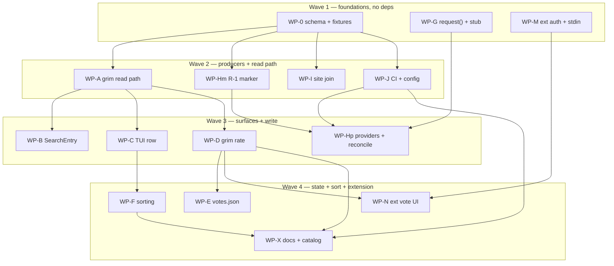

# Plan: Forge-Backed Artifact Ratings

## Status

- **Plan:** plan_artifact_ratings
- **Active phase:** 1 — Execution (waves 1–4)
- **Step:** finalized
- **Last update:** 2026-08-19 (16 work packages merged across three repos,
  branches flattened and pushed, one PR each: grimoire#99, indexer#5,
  grimoire-vscode#18. Execution amended C-003, C-006a, C-007, C-009, C-010,
  C-014 and S-016, and added C-021/C-022/C-023 — every one a builder or
  reviewer finding against the accepted design. Review round 1: 3 opus panels
  plus a cross-model pass; 4 Blocks and 1 Warn fixed on the branch with
  regression tests.)
- **Tier:** high (`architect=on research=3 adversary=on`)
- State:   done
- Updated: 2026-08-19
- Next:    awaiting merge — grimoire#99, indexer#5, grimoire-vscode#18
- Repos:   <!-- frozen at execution start; bases are never re-resolved -->
  - `grim`    `/home/mherwig/dev/grimoire`                        trunk `main` base `006753a28a759fec6fb822fc045bec814a36a86f`  landed: no
  - `indexer` `.agents/worktrees/grimoire-index` (grimoire-rs/indexer) trunk `main` base `fe0fdade1b2e6c91a33c819f2eb0f08551f7e0f9`  landed: no
  - `ext`     `/home/mherwig/dev/grimoire-vscode`                 trunk `main` base `c8f6e6b58f5734641f76bdc4e698ac6bf417e9d3`  landed: no

  One branch `feat/artifact-ratings` and one PR per repository.

## Header

- **Scope:** large (3 repos, 15 work packages, 4 waves)
- **Reversibility:** one-way (high) — a published locator freezes at 1.0
- **Related issue:** [grimoire-rs/grimoire#82](https://github.com/grimoire-rs/grimoire/issues/82)
- **Decision record:** [`adr_artifact_ratings.md`](../adr/adr_artifact_ratings.md) (**Accepted** 2026-08-18)
- **System design:** [`design_artifact_ratings.md`](../specs/design_artifact_ratings.md)
- **Research:** `.agents/research/research_rating_{backends,architecture_map,schema_compat,security,operability}.md`
- **Follow-up:** [#89](https://github.com/grimoire-rs/grimoire/issues/89) (download counts — out of scope here)
- **Overlays:** architect=on (satisfied by the accepted ADR), research=3 (satisfied by 5 artifacts), adversary=on

### Principle 9 gate (constitutional)

`hex.md › Preferences` makes stability a review perspective in its own right:
any diff touching a schema, an install layout, or a renderer is checked
against Principle 9 first. Every WP below carrying a schema or report change
(**WP-0, A, B, I, J**) is gated on the per-artifact compatibility table in the
ADR. **No Constitution Deviations rows** — the feature is additive throughout.

---

## Component Contracts

Testable without reading code. `/hex-execute` writes failing tests from these.

### Wire + storage

- **C-001 — `stats.json` wire schema.** `<base>/stats.json`, sibling of
  `all.json`. Keys: `schema_version` (monotonic int, 1), `generated_at`
  (RFC3339 UTC), `providers` (per-stat map; `providers.rating` ∈
  `"github" | "gitlab"`), `entries` (map keyed by artifact ref exactly as in
  `all.json`). `entries[ref].rating = {up: u32, target: string, url: string}`;
  `target`/`url` opaque, never parsed or constructed by any client.
  **Absent is first-class at five levels**: file absent (404) · `entries` key
  absent · ref absent · `rating` key absent on a present ref (other stats
  unaffected) · `rating` absent on a `CatalogEntry`. None is an error, a
  warning above `debug`, or a failed build. Zero-vote refs omitted.
  Consumer rule (OSV formulation): a client understanding version *N* accepts
  any document declaring ≤ *N*, ignoring unknown fields; > *N* may degrade to
  "no rating", never a parse error.
- **C-002 — cache vs wire structs are separate.** `RatingSummary` (cache,
  `#[serde(deny_unknown_fields)]`, fields `up`/`target`/`url`) and a **distinct
  lenient wire struct** with no `deny_unknown_fields`. Collapsing them
  reintroduces the serde forward-compat trap and is a test failure, not a
  style choice.
- **C-008 — `votes.json`.** `$GRIM_HOME/state/votes.json`, sibling of
  `global.json`. `{schema_version: 1, votes: {"<provider>:<account-id>\0<ref>":
  {voted: bool, observed_at: RFC3339}}}`. Key uses the provider's **immutable
  numeric account id**, never a login. Rules: (1) written **only** after a
  successful mutation, from that response's `viewerHasUpvoted`/`toggledOn` — a
  timeout leaves the entry untouched; (2) `viewerHasUpvoted` always overwrites;
  (3) an entry whose `observed_at` age exceeds **`CATALOG_TTL_SECONDS`
  (3600s)**, measured against an **injectable clock**, reads as **unknown**
  rather than its last value — boundary exclusive: age `< 3600` keeps its
  value, age `>= 3600` reads unknown; (4) `stats.json`'s aggregate `up` may
  never overwrite it.
  Corrupt or unparseable file ⇒ discarded, treated as unknown, never raises.

### grim read path

- **C-003 — sidecar fetch.** Fetched in the same pass as `all.json` through
  `fetch_index_entries` (`src/catalog/index_source.rs:135`), joined by ref
  **after** `into_entry` produces the entries — never inside `into_entry`,
  which sees only `all.json`. Lands in the existing `CatalogFile` envelope
  under the existing `CATALOG_TTL_SECONDS` (3600). **HTTP index sources only**
  (`SourceKind::IndexHttp`); git-transport and OCI `_catalog` sources read
  unrated. A 404, transport error, or parse failure degrades to *no ratings* at
  `debug`; only the `all.json` fetch decides build success. `GRIM_OFFLINE`
  inherits catalog behaviour verbatim, zero new code.
  **Amendment (WP-D, execution): the provider must survive the parse.**
  `providers.rating` is the only place the provider name exists, and the first
  read-path implementation discarded the whole `providers` block at parse time
  — leaving the ADR's pinned dispatch `match provider.as_str()` with nothing to
  match on. `RatingSummary` therefore carries `provider: Option<String>`,
  populated at the existing join site from a **lenient** `providers` read. The
  three alternatives are each worse: re-fetching `stats.json` inside `rate`
  breaks C-022's "`--dry-run` makes no request and works offline"; parsing the
  provider out of `RatingSummary.url` is forbidden by ADR D3, and the moment
  grim learns to read a forge URL "opaque" stops being true; blocking costs a
  wave. Two states must be distinguished and separately tested: an
  **unrecognised** provider (C-001 says this is not a parse error — the row is
  readable, not writable, exit `65` `UnsupportedProvider`) and **`None`, no
  provider stated** (an older cache, or a sidecar with no `providers` block).
  Neither may fall through to a `"github"` default.
- **C-004 — `SearchEntry.rating`.** Always-present-null
  (`skip_serializing_if` **banned** in `src/api/`). The hand-written
  `Serialize` goes `serialize_struct("SearchEntry", 13)` → `14`
  (`src/api/search_report.rs:104`), and
  `json_carries_replaced_by_plain_table_does_not` — which asserts `.len() == 13`
  at `:521` — is updated in the same commit.
- **C-017 — sort semantics.** `grim search --sort <name|updated|rating>`; site
  `Sort` union and TUI gain the same option. **Browse order:** rating desc →
  updated desc → name. **Unrated sorts last, never as zero.**
  **`--sort` overrides relevance ranking** when a query is present; absent
  `--sort`, relevance is unchanged (`rank_by_relevance`, no regression).
  **All three modes are specified, not just rating:** `name` ascending,
  case-insensitive, ties broken by full ref; `updated` descending on `created`,
  with a **null/absent `created` sorting last** (never as epoch 0), ties broken
  by name; `rating` as above. Every mode is **total and deterministic** — no
  two distinct rows may compare equal, because the final tiebreak is always the
  full ref, which is unique.
  Rationale: composing would let relevance dominate so `--sort rating` would
  appear not to sort; rejecting the combination would refuse a reasonable ask.

### grim write path

- **C-005 — `grim rate` surface.**
  `grim rate <ref> [--up|--remove] [--yes] [--dry-run] [--token-stdin] [--token-host <host>] [--registry <ref>] [--format json]`.
  `--dry-run` and `--token-host` are specified in C-022.
  **Voting is confirmed by default.** A vote posts publicly under the user's
  forge account, so an interactive run prompts —
  `This posts publicly to your <provider> account as <login>. Continue? [y/N]`
  — declining exits `0` with no mutation and no `votes.json` write.
  `--yes` skips the prompt.
  **Non-interactive runs must pass `--yes`.** When stdin is not a TTY and
  `--yes` is absent, exit `64` naming the flag rather than hanging on a prompt
  nobody can answer or, worse, voting unconfirmed.
  **`--token-stdin` implies non-interactive** and therefore requires `--yes`:
  stdin is carrying the credential, so it cannot also carry a `y`. The prompt
  is never read from `/dev/tty` as a workaround — a credential-piping caller is
  a program, and programs confirm with a flag. The VS Code extension always
  passes `--yes`, since it carries its own disclosure (C-018).
  `--up` default; `--remove` retracts **this user's own** upvote (not a
  downvote — both forge primitives are toggles). Report: single-object,
  `release_report.rs` shape, always-present-null `{ref, action, up, url, provider, host}`.
  Exit codes: `0` registered/retracted · `64` `--up` with `--remove`, malformed
  ref · `65` no `rating` on the row, unrecognised provider
  (`UnsupportedProvider`, raw value in the message), GraphQL `errors` populated
  · `69` unreachable/5xx/secondary limit · `79` ref resolves to no row, or
  `target` no longer exists · `80` 401/403 or no credential · `81` `--offline`.
- **C-006 — `--token-stdin`.** Mirrors `login.rs:156-185` (`Zeroizing<String>`
  → `SecretString`, `expose_secret()` once at the `Authorization` header).
  **No `--token VALUE` flag** — argv is world-readable (CWE-214).
  stdin is a TTY ⇒ refuse, `64`. Empty/whitespace-only ⇒ refuse, `80`, and
  **never fall through to the standalone ladder**. More than one line ⇒ `64`
  (trailing newline stripped). Mutation fails after the token was read ⇒ token
  dropped, `votes.json` **not** written, exit per the forge's failure class.
  The token never appears in output, errors, `--format json`, or a panic.
- **C-022 — the resolved host is grim's to state, and grim's to enforce
  (added at execution start; WP-M found the gap).** C-018 tells the extension
  to select its auth provider from "the same host handed to grim" — but
  nothing in the extension's inputs carries that host. C-007 lets a GHES or
  self-managed host come from the **user's own grim config**, `stats.json`
  carries only `providers.rating`/`target`/`url`, and index-supplied host data
  is forbidden outright. An extension that defaults to `api.github.com` while
  grim's config points at `ghes.corp.example` pipes a **github.com token to
  GHES** — precisely the leak C-007 and C-018 exist to prevent. Two additive
  flags close it, and the second one is the guarantee:
  - **`grim rate <ref> --dry-run`** — resolves the row, the provider, the host
    override and the action, prints the report, and **mutates nothing**. Needs
    **no credential** and makes **no forge request**, so it works offline and
    cannot itself leak. The report gains an always-present-null **`host`**
    field in both modes. This is how the extension learns the host *before*
    auth, which a field on the post-vote report is too late to do.
  - **`grim rate <ref> --token-host <host>`** — the caller **declares** which
    host the piped credential belongs to. grim compares it to the host it is
    about to contact using C-007's exact rules (ports included, ASCII-
    lowercased, IDNA-normalised, **no suffix matching**) and on a mismatch
    exits **`80`** naming both hosts, **before the token reaches any header**.
    Valid only with `--token-stdin`; alone ⇒ `64`.
  Why both: `--dry-run` lets a correct client get it right, `--token-host`
  makes the guarantee **independent of the client being correct** — grim knows
  the truth and fails closed. A client that pipes a credential without
  declaring its host still works and still gets C-007's host-matched
  resolution; it simply does not get the second check.
  Principle 9: both flags are optional and absent-by-default, `host` is
  always-present-null like every other report field, and no existing exit code
  changes meaning.

- **C-006a — the credential ladder ends at the refusal (WP-D, execution).**
  The ADR listed a **device flow** rung between the `gh`/`glab` stored
  credential and the read-only refusal. It cannot exist: a device flow needs a
  registered OAuth client id, and the ADR's own Security section rules out
  registering an OAuth app. The ladder is host-matched env var → `gh`/`glab`
  stored credential → refuse with exit `80`, naming the ladder and never a
  token — which is what the exit-code table already described.

- **C-023 — the viewer-state read (added at execution close; WP-N found the
  gap).** S-008 specifies *unknown until a detail view fetches
  `viewerHasUpvoted`* — but nothing in the landed surface can perform that
  fetch. `--dry-run` returns before the credential is read
  (`src/command/rate.rs:158`), so a token piped alongside it is never consumed
  and no viewer state comes back; `votes.json` is grim-internal with no read
  verb; and the extension is forbidden from making forge requests of its own.
  The refinement half of C-018/C-019 was therefore unbuildable, leaving the
  affordance **permanently** unknown rather than unknown-until-fetched. R-3 is
  not violated by that — unknown renders neutral, which is never a wrong claim
  — but a named scenario would ship unimplemented.
  **`--dry-run` combined with `--token-stdin` consumes the credential and
  issues exactly one read-only query**, reporting the viewer's own state as a
  new always-present-null report field **`viewer_up`** (`true` / `false` /
  `null` for *not asked, or not knowable*). Constraints, each a test:
  - It **mutates nothing**, so it does **not** require `--yes` — the
    confirmation exists because a vote posts publicly, and this posts nothing.
    `--token-stdin` still requires `--yes` on the *voting* path (C-005),
    unchanged.
  - `--dry-run` **without** `--token-stdin` keeps its existing contract exactly:
    no credential, no forge request, works offline, `viewer_up` is `null`.
    That path is what a client uses to learn the host *before* auth (C-022), so
    it must not start needing one.
  - `--token-host` applies here too: a declared host that does not match the
    resolved one exits `80` **before the token reaches a header**, exactly as on
    the voting path.
  - A failed or unauthorised query leaves `viewer_up` **null**, never `false`.
    Reporting "you have not voted" because a query failed is the precise lie
    R-3 exists to prevent.

- **C-007 — endpoint resolution.**
  **Amendment (WP-X, execution): the override is `GRIM_RATING_HOST`, an
  environment variable — there is no config key.** This contract, the ADR and
  the execution briefs all said "the user's own **config**", three times over,
  and no `grimoire.toml` key exists: no `config get`/`set` path, nothing in
  `config_keys.rs`. The choice is defensible and the code argues it in place
  (per-machine not per-project; `[[registries]]` already owns project-shaped
  registry config) — and the property C-007 turns on is **stronger** this way,
  because a config file can be committed to a repository while an environment
  variable cannot arrive over HTTP. But an operator told to set it "in your
  config" finds no key. Two further behaviours no document stated, both
  verified: an empty or whitespace-only value counts as **unset**, and the
  override **names a host, not a forge** — it applies to whichever provider the
  catalog row declared, so a machine browsing both a public and a private index
  must scope it per shell rather than set it globally.
 Default host per provider (`github` ⇒
  `api.github.com`, `gitlab` ⇒ `gitlab.com`), overridable **only** from the
  user's own config (GHES/self-managed) and **never** from index-fetched
  content. Host comparison **exact**: ports included, ASCII-lowercased,
  IDNA-normalised, **no suffix matching** — `evil-github.com` and
  `github.com.evil.tld` must not match `github.com`. Client built through
  `build_client()` (`forge.rs:263-278`), inheriting hard-disabled redirects
  (`Policy::none()`, `:274`).

### Indexer

- **C-009 — R-1 marker authority.** A `<!-- grim-ref: <ref> -->` marker binds
  `ref → target` **iff** all four hold: (1) it is in the **body of a top-level
  thread object**, never a comment/reply/note; (2) the author's **account id**
  is in `index-policy.json` `trustedBots[].id`; (3) it is the **first** match
  of an anchored pattern in that body; (4) the thread **still lives in the
  configured container** — repository/project id **and** category/work-item
  type equal the configured values, compared by **immutable id, never name**.
  A ref resolving to more than one authorized thread is a **conflict**:
  contributes **zero** votes, logs both URLs.
  **Anchored grammar, pinned so clause 3 is testable:** the marker matches
  `^<!-- grim-ref: (?<ref>\S+) -->$` — start of line, single spaces exactly
  as shown, nothing else on the line. A marker indented, mid-line, inside a
  fenced code block, or inside a `>` quote does **not** match. "First" means
  lowest byte offset among matches in that body.
  **Two corrections to this grammar, found by WP-Hm at implementation time and
  amended here rather than left to diverge.** The pattern is applied **per
  line**, not as a single `/m` regex over the whole body:
  1. **`/m` does not exclude code fences.** With `/m`, `^` and `$` match at a
     fence's *interior* line boundaries, so a marker at column 0 inside a
     ``` block **does** match the pinned regex — directly contradicting this
     clause's own "inside a fenced code block does not match" and the test that
     asserts it. A line scan that tracks fence state (``` and `~~~` toggles) is
     identical to the regex everywhere except the fence, where it is
     **stricter**. An unterminated fence swallows the remainder of the body,
     which also fails closed.
  2. **CRLF, and this one would have shipped the feature dead.** GitHub
     normalises stored discussion and issue bodies to CRLF. Under `/m`, `$`
     sits *after* the `\r`, so `-->$` never matches and **every marker in a
     CRLF body binds nothing** — R-1 would reject the bot's own threads on the
     primary provider, and ratings would read unrated forever with no error
     anywhere. The body is therefore split on `/\r?\n/`; `\r` is consumed
     **only** as a line terminator, so a stray `\r` inside a line still breaks
     the match and nothing else is loosened. Tightening this back to `\n`-only
     requires first verifying that `create()` produces, and GitHub returns,
     `\n` bodies — tightening it blindly is the failure mode, not the fix.
  Clause 4 is **two independent equalities**, tested separately: the container
  **id** (GitHub `repository.id` / GitLab `project.id`) and the **category or
  work-item type**. A right-repo/wrong-category thread and a
  right-category/wrong-repo thread each contribute zero.
  **Implementation note (explorer finding):** `findTrustedBot`
  (`src/validate/core/ownership.ts:35-47`) is **login-keyed** and cannot serve
  clause 2, which needs an id-keyed scan with no login in hand. This is new
  code in `src/ratings/marker.ts` importing only the `TrustedBot` type;
  `ownership.ts` is expected to be **zero-edit**. A `TrustedBot` in its bare
  **string** form yields `id: undefined` and **must be skipped** by the scan —
  never treated as a wildcard match.
  Tests (no network, via the in-memory fake): marker in a stranger's reply ⇒ 0
  · stranger's top-level post ⇒ 0 · bot top-level post ⇒ counted · two bot
  posts, same marker ⇒ 0 + warning · thread transferred out of the configured
  repo ⇒ 0 · login-only `trustedBots` entry ⇒ 0.
- **C-010 — R-2 no silent emptying.** The deploy carries forward **each stat
  key** the run did not successfully produce; a key is emptied, or a ref
  dropped, **only** when a *completed* producer observed nothing. Carry-forward
  is a **per-key merge over the seed**, never whole-file replacement — and
  **`providers` is carried forward per key too** (WP-J finding; the design's
  §6.2 pseudocode merged `entries` only). A `rating` run that rewrote
  `providers` wholesale would drop `providers.downloads` while keeping the
  `downloads` entries — the same silent emptying, one map over.
  **Seed-fetch status branching is mandatory** — `|| true` is forbidden:
  404 ⇒ empty seed · 2xx that parses ⇒ merge base · 2xx unparseable ⇒ **fail
  the job** · transport/TLS/5xx/timeout ⇒ **fail the job**. A ratings producer
  treats `request()`'s `{status: 0}` as a hard error, since that value covers
  both the transport catch and the over-cap path
  (`src/validate/adapters/http.ts:50-73`).
- **C-011 — `RatingProvider`.** Interface plus two live implementations and an
  in-memory fake, mirroring `Forge`/`createForge(kind, config)`
  (`src/validate/adapters/forge.ts:20-28,146-151`). Methods cover
  reconcile (list existing, create missing) and tally (read counters).
  Naming note: GitLab renamed this feature **Award Emoji → Emoji Reactions** in
  16.0. The GraphQL surface (`awardEmojiToggle`, the `AwardEmoji` widget) is
  unchanged, so there is no code impact, but new comments and docs should use
  the current product term rather than the legacy one.
  Deliberate asymmetry with grim, which uses a `match` on a string and **no
  trait** — recorded in ADR D10, not an oversight.
- **C-012 — `request()` additive param.** Gains optional `{method?, body?}`.
  All **8** existing call sites (`forge.ts:68,85,102,117,136`;
  `registry.ts:81,100,107`) compile and behave unchanged. Redirects stay
  `manual`.
  **A GraphQL 200 carrying a populated top-level `errors` array is a hard
  error, not a success.** `request()`'s `{status: 0}` covers only the transport
  catch and the over-cap path, so a 200 with `errors` and null/partial `data`
  passes both checks and would be read as "genuinely fewer votes observed" —
  which is silent emptying arriving through the one door R-2 does not watch.
  Every ratings GraphQL call — on **both** sides, grim's Rust `graphql()` and
  the indexer's `provider_github.ts`/`provider_gitlab.ts` — checks `errors`
  **independently of HTTP status** before touching `data`. The design mitigates
  this for grim only; the indexer inherits the same requirement.
- **C-013 — `index.config.json` `ratings` block.** New optional top-level:
  `{provider, container, createBudget, lockThreads}`. `lockThreads` defaults
  **true** — votes count, replies refused; this is both the low-moderation
  default and an independent hardening of R-1 clause 1. **No `botIds` key** —
  ids come from `index-policy.json` `trustedBots[].id`.
  Read by a **third independent reader** (`src/ratings/config.ts`), matching
  the existing idiom: `config.ts` and `ci.ts` already parse this file
  separately. **Do not refactor toward one loader** — out of scope.
- **C-014 — reconcile + tally.** Stateless, level-triggered:
  list → diff → budgeted create (`createBudget`, default 400) → tally → merge →
  publish. Idempotent; a partial run creates *fewer threads*, never corrupt
  state.
  **Secondary-limit backoff covers the list and tally passes, not just create.**
  GitHub's secondary limits are not content-creation-only — they also cover
  concurrent-request count and GraphQL points per minute
  ([rate-limit docs](https://docs.github.com/en/rest/using-the-rest-api/rate-limits-for-the-rest-api)),
  so a large-catalog pagination pass can trip them legitimately. A
  secondary-limit hit while listing or tallying is **distinguished from a
  transport error** and handled the same graceful way the create loop already
  is: honour `retry-after`, stop early, publish what was observed, set
  `secondary_limit_hit=true`, exit `0`. Hard-failing every scheduled run until
  backfill drains is worse than a partial pass, and R-2's per-key carry-forward
  already makes a partial tally safe.
  **Two amendments from WP-Hp, both design defects rather than implementation
  choices.**
  1. **A truncated *listing* pass must carry the published `rating` forward.**
     The two clauses above are incompatible as written: `mergeStats`'s per-key
     carry-forward preserves *foreign* stat keys, but it **drops the `rating`
     key of every ref absent from `fresh`** — correct only "because this
     producer completed" (design §6.2 step 5, "Only a FAILED producer carries
     forward"). A truncated listing pass did **not** complete, and refs on
     pages it never read are indistinguishable from refs whose votes went to
     zero. Publishing on that basis is the exact silent emptying R-2 forbids,
     arriving through a door labelled "graceful degradation". `reconcile`
     therefore re-emits the seed's published `rating` for every ref a truncated
     pass did not observe: what was observed is published, the exit is 0,
     nothing is wiped, and the carried value is stale rather than lost. A
     truncated **create** pass gets no carry-forward — listing completed there,
     so the tally is authoritative for every thread that exists.
  2. **A conflicted ref counts as present, not missing.** §6.2 computes
     `missing = desired - observed.keys()` with `observed` excluding conflicts.
     Followed literally, a ref already bound by two threads is "missing", so
     the run creates a **third** — then a fourth next run — deepening every run
     the ambiguity `conflictWarning` asks the operator to resolve by deleting.
     Subtract `bound ∪ conflicted` instead.
  `concurrency`/`resource_group` with `cancel-in-progress: false` is a
  **correctness requirement**, not tuning. One structured log line:
  `refs=N created=X/Y tallied=Z conflicts=C secondary_limit_hit=<bool>`.
- **C-015 — site join.** `CatalogPackage.rating?` (`src/renderer/types.ts:19-31`);
  `resolveInputs()` (`src/renderer/index.ts:243-254`) reads `.stats.json` and
  merges by ref before the `vite.define` of `__GRIMOIRE_DATA__` — **new code,
  no existing sidecar machinery**. `Catalog.tsx`'s `compare()` (`:23-29`) needs
  a genuine **three-key chained** comparator, not a second flat branch.
  Publishing may piggyback `stage()`'s existing outDir-as-last-layer copy
  (`:227-232`) if `.stats.json` is written into `outDir` before `buildSite`.
- **C-016 — `all.json` byte-identical.** `compileIndex`
  (`src/data/index.ts:121-167`) is **not modified**. Proven by a golden
  fixture asserting byte equality before and after the feature.

### Extension

- **C-018 — auth + stdin subsystem (all new).** No `authentication.getSession`,
  no `SecretStorage`, and no `child.stdin` write exists in the extension today.
  Provider selected from the **same host** handed to grim; **pipes nothing**
  when that host is not one it authenticated against. The mapping is a table,
  not a heuristic:

  | Resolved host | Provider id | Notes |
  |---|---|---|
  | `api.github.com`, `github.com` | `github` | — |
  | any other host with provider `github` (GHES) | `github-enterprise` | host passed through to the session request |
  | `gitlab.com` | `gitlab` | GitLab Workflow's provider; absent ⇒ PAT fallback |
  | any other host with provider `gitlab` | `gitlab` | self-managed; PAT fallback if the provider refuses |
  | anything else | **none** | pipe nothing, surface "no credential for `<host>`" |

  Host normalisation matches C-007 exactly — ports included, ASCII-lowercased,
  IDNA-normalised, **no suffix matching**. When `getSession` returns multiple
  accounts, the extension **prompts rather than guessing**; `SecretStorage` PAT
  is consulted **only** after the matching provider yields no session. `SecretStorage` PAT as
  fallback.
  **The stdin write needs an `error` listener.** grim can refuse fast and exit
  before consuming stdin (C-006: `64` on TTY or multi-line input, `80` on empty),
  and writing to a child whose stdin has closed throws an **uncaught EPIPE**
  without `child.stdin.on('error', …)`
  ([nodejs/node#40085](https://github.com/nodejs/node/issues/40085), open).
  Cross-platform, not Windows-specific — and WP-M has no in-repo pattern to
  copy, since the Rust side mirrors `login.rs` and the extension side mirrors
  nothing. An EPIPE here surfaces as a failed vote, never an extension crash.
  **The lazy `viewerHasUpvoted` refinement calls `getSession` silently** — no
  `createIfNone`, no `forceNewSession`, returning `undefined` rather than
  prompting. `createIfNone: true` for consistency with the explicit vote action
  would force a sign-in prompt merely from opening a detail view, contradicting
  S-008's own "unknown until a detail view fetches" framing. Interactive modes
  belong to the vote action alone.
  Gate via a **new `RATING_GRIM_VERSION = '0.14.0'` constant** (next minor
  after the current `v0.13.0`), following the existing
  `REGISTRY_EDIT_GRIM_VERSION`/`supportsRegistryEditing()` pattern — **not** a
  bump of `MINIMUM_GRIM_VERSION`, so an older-grim user keeps the rest of the
  extension. Preserves the `execFile`-only, no-shell, `--format json` contract
  and constructs **no** forge URLs. Always passes **`--yes`** to `grim rate`:
  the extension carries its own disclosure, and it is a non-interactive caller
  that would otherwise take a `64` (C-005).
- **C-019 — tri-state display (R-3).** Renders **voted / not-voted / unknown**,
  never a boolean. Absent or unreadable record ⇒ **unknown** ⇒ neutral, never
  "not voted". The static site is **always** neutral: prerendered, no identity
  at build time, no runtime fetch.

### Docs and catalog

- **C-020 — documentation and first-party catalog drift.** `AGENTS.md` makes
  this **unconditional** for any `src/command/**` change, and
  `task catalog:verify` gates it in CI — so it is an owned work package, not a
  closing chore. Required: `commands.md` (`grim rate`, all seven exit codes) ·
  `json-interface.md` (`rating`, and the always-present-null rule that governs
  it) · `package-index.md` (the `stats.json` spec + the OSV consumer sentence)
  · **`hosting-an-index.md`** (the `ratings` block added to the existing
  `index.config.json` key table, plus the generated ratings job) — **not
  `configuration.md`, which documents grim's own `grimoire.toml`** ·
  `stability.md` (whether `stats.json` joins the "Package index transport" row
  or gets its own, the `CatalogEntry` `deny_unknown_fields` downgrade note, and
  a `SearchEntry.rating` entry in the Additive-fields worked examples) ·
  `authentication.md` (a pointer to `grim rate`'s separate credential ladder) ·
  `.claude/rules/subsystem-cli-commands.md` (a `grim rate` row — **no
  structural test catches its absence**, so it drifts silently) ·
  `catalog/skills/grim-usage` (`rate` in both the `description` frontmatter,
  which is the discovery trigger, and the Command Map table) ·
  `catalog/skills/grim-authoring` (an explicit reviewed-no-change disposition).
  Gate: `task catalog:verify` passes.
- **C-021 — the operator guide (added at execution start, owner-directed).**
  C-020 keeps each existing doc page internally correct, but nothing in it
  explains the feature *as a system* or tells an operator how to turn it on
  against a forge that is not `github.com`. A new page —
  `docs/src/ratings.md`, linked from the docs navigation and cross-linked from
  `hosting-an-index.md`, `commands.md` and `authentication.md` — carries:
  (1) **the workflow and design explanation** — who writes a vote, who counts
  it, why the forge is the database and there is no Grimoire service, the
  static read path versus the live write path, and what R-1/R-2/R-3 guarantee
  in operator-facing words (a forged marker cannot inflate a count; a failed
  tally never empties a published one; the UI never claims you have not voted
  when it does not know);
  (2) **setup for GitHub.com** — the `ratings` block, the Discussions category,
  the trusted bot identity, the generated CI job;
  (3) **setup for GitHub Enterprise Server** — the host override, that it comes
  from the operator's own config and **never** from index-fetched content, the
  token scopes, and what an air-gapped GHES omits;
  (4) **setup for GitLab (SaaS and self-managed)** — work items instead of
  discussions, emoji reactions instead of upvotes (the feature was renamed
  Award Emoji → Emoji Reactions in 16.0; use the current term), and the
  self-managed host override;
  (5) **a rollback section** matching S-016 — removing the `ratings` block is
  not enough, the published `stats.json` must be deleted or the last tally is
  served forever.
  A worked `index.config.json` per forge, and the exact `grim rate` invocation
  a user runs against each. Gate: the page exists, the docs navigation links
  it, and every host-override claim in it matches C-007's implementation.

---

## User-Experience Scenarios

| ID | Action | Expected | Error / edge |
|---|---|---|---|
| **S-001** | Browse an index publishing ratings | Counts shown in `search`, TUI, site, extension | — |
| **S-002** | Browse an index with no `stats.json` | Everything unrated, no warning above `debug` | 404 is never an error |
| **S-003** | `grim rate <ref> --up`, credential resolvable | Vote registered; report carries new `up` + thread `url`; exit `0` | — |
| **S-004** | `grim rate` with no credential | Exit `80`; message names the ladder, never a token | — |
| **S-005** | `grim rate` on a ref with no `rating` | Exit `65` (row has no rating) | Ref not in catalog at all ⇒ `79` |
| **S-006** | `grim rate --offline` | Exit `81`, no network attempted | — |
| **S-007** | Vote from the extension | Affordance becomes **voted** from the mutation response | Failure leaves state **unknown**, not not-voted |
| **S-008** | Fresh machine, previously voted elsewhere | **unknown** ⇒ neutral until a detail view fetches `viewerHasUpvoted` | Never displays "not voted" |
| **S-009** | `grim rate <ref> --remove` | Own upvote retracted; not a downvote | `--up` + `--remove` ⇒ `64` |
| **S-010** | Sort browse by rating | rating desc → updated desc → name; **unrated last** | Never sorts unrated as 0 |
| **S-011** | `grim search <query> --sort rating` | `--sort` **overrides** relevance | Absent `--sort` ⇒ relevance unchanged |
| **S-012** | Tally job fails; deploy proceeds | Previous ratings **preserved** per stat key (R-2) | Unparseable/transport seed ⇒ job **fails** |
| **S-013** | Attacker replies with a forged `grim-ref` marker | Contributes **zero** votes | Two authorized threads ⇒ 0 + both URLs logged |
| **S-014** | Bot thread transferred out of the index repo | Ref reads **unrated** (R-1 c4) | Also covers discussion→issue conversion |
| **S-015** | Run 0.14, downgrade to 0.13 | Older grim rejects the newer cache and **rebuilds** | One network refresh, no data loss |
| **S-017** | `grim rate <ref>` in a terminal | Prompt names provider + account; `y` votes, anything else exits `0` with no mutation and no `votes.json` write | — |
| **S-018** | `grim rate` piped/in CI without `--yes` | Exit `64`, message names `--yes` | Never hangs; never votes unconfirmed |
| **S-019** | `grim rate --token-stdin` without `--yes` | Exit `64` — stdin carries the token, so it cannot carry a confirmation | Prompt is never routed to `/dev/tty` |
| **S-022** | Fresh machine, detail view opened, credential available | `grim rate <ref> --dry-run --token-stdin` reports `viewer_up`; the affordance resolves to voted or not-voted | One read-only query, no mutation, no `--yes` |
| **S-023** | Same, but the query fails or is unauthorised | `viewer_up` is `null`; the affordance stays **unknown** | Never renders "not voted" on a failed read |
| **S-020** | Extension asks grim which host a ref votes against | `grim rate <ref> --dry-run --format json` reports `host`; no mutation, no credential, no forge request | Works offline |
| **S-021** | Extension pipes a github.com token for a GHES ref | Exit `80` naming both hosts; the token never reaches a header | Fails closed, independent of client correctness |
| **S-016** | Operator rolls ratings back | `ratings` block removed **and CI re-rendered** (`npm run ci`) ⇒ the seed step, the tally job and the schedule all disappear, `buildSite` writes no `stats.json`, and the next deploy 404s it — **no manual delete**, because both deploys replace the served tree wholesale | Removing the block **without** re-rendering is the real trap: the committed seed step keeps fetching and republishing the frozen tally forever (`verify-ci` failing on the drift is the signal). A manual delete is needed only for a hand-rolled deploy that merges rather than replaces |

---

## Parallelization

| WP | Scope (C-/S- IDs) | Expected files | Size | Wave | Depends on | Review | Status |
|---|---|---|---|---|---|---|---|
| **WP-0** | C-001, C-002 — schema + 4 fixtures, no producer | indexer: `test/ratings/fixtures/*.json`, schema doc | S | 1 | — | light | pending |
| **WP-G** | C-012 — `request()` additive param; stub `body` capture | indexer: `src/validate/adapters/http.ts`, `test/validate/helpers.ts` | S | 1 | — | light | pending |
| **WP-M** | C-018 — auth + stdin subsystem, version gate | ext: new `src/auth.ts`, `src/grim.ts` (stdin path), `src/installer.ts`, test stub stdin capture | L | 1 | — | **panel** | pending |
| **WP-A** | C-002, C-003, S-001, S-002, S-015 — read path + cache | grim: `src/catalog/index_source.rs`, `src/catalog/registry_catalog.rs`, `src/catalog/catalog_service.rs` | M | 2 | WP-0 | **panel** | pending |
| **WP-Hm** | C-009, S-013, S-014 — **R-1 marker authority alone** | indexer: new `src/ratings/marker.ts` (+ its `TrustedBot` type import) | M | 2 | WP-0 | **panel** | pending |
| **WP-Hp** | C-011, C-014 — providers, reconcile, budget, `grim-indexer ratings` verb | indexer: new `src/ratings/{provider,provider_github,provider_gitlab,provider_memory,budget,reconcile}.ts`, new `src/cli/ratings.ts`, `src/cli/main.ts` | L | 3 | WP-Hm, WP-G, WP-J | **panel** | pending |
| **WP-I** | C-015, C-016, S-010 — site join + byte-identity fixture | indexer: `src/renderer/{types,index}.ts`, `astro/components/Catalog.tsx`, `src/cli/build.ts`, golden fixture | M | 2 | WP-0 | light | pending |
| **WP-J** | C-010, C-013, S-012, S-016 — ratings config + CI generation | indexer: `src/ci.ts`, new `src/ratings/config.ts`, new `templates/ci/*-ratings.*` | M | 2 | WP-0 | light | pending |
| **WP-B** | C-004 — `SearchEntry.rating`, 13→14 | grim: `src/api/search_report.rs` | S | 3 | WP-A | **panel** | pending |
| **WP-C** | C-003 — TUI display row | grim: `src/tui/state.rs`, `src/tui/app.rs`, `src/tui/detail.rs` | S | 3 | WP-A | self | pending |
| **WP-D** | C-005, C-006, C-007, C-022, S-003, S-004, S-005, S-006, S-009, S-017, S-018, S-019, S-020, S-021 — `grim rate` | grim: new `src/command/rate.rs`, `src/api/rate_report.rs`, `src/catalog/rating_provider.rs`; `src/catalog/forge.rs`, `src/main.rs`, `src/app.rs` | L | 3 | WP-A | **panel** | pending |
| **WP-E** | C-008, S-007, S-008 — `votes.json`, tri-state store | grim: new votes store module | M | 4 | WP-D | light | pending |
| **WP-F** | C-017, S-010, S-011 — sorting | grim: `src/command/search.rs`, `src/tui/state.rs`, `src/tui/app.rs` | M | 4 | WP-C | light | pending |
| **WP-N** | C-019, S-007, S-008 — rating display + vote wiring | ext: `src/grim.ts`, `src/webview/{protocol,model,render}.ts`, `src/views/{details,sidebar}.ts` | L | 4 | WP-M, WP-D | light | pending |
| **WP-X** | C-020, C-021 — docs, the operator guide, AI-config index, first-party catalog drift | grim: `docs/src/{commands,json-interface,package-index,hosting-an-index,stability,authentication}.md`, new `docs/src/ratings.md` + its nav entry, `.claude/rules/subsystem-cli-commands.md`, `catalog/skills/grim-usage/**`, `catalog/skills/grim-authoring/**` | L | 4 | WP-D, WP-F, WP-J | **panel** | pending |



**Critical path:** WP-0 → WP-A → WP-D → WP-E (4 waves). WP-M runs in wave 1
despite being extension work precisely to keep it off the critical path — it is
large, entirely new, and depends on nothing.

**Shippable after wave: 3** — the index publishes `stats.json`; **grim and the
catalog site** display ratings; `grim rate` votes from the CLI. **The extension
is explicitly not part of this line** — WP-M lands only auth and stdin
plumbing, and the vote UI is WP-N in wave 4. An earlier draft claimed the
extension shipped in wave 3; it does not.

**Wave 2 is deliberately not the shippable line, and two earlier drafts got
this wrong.** The first put the `grim-indexer ratings` verb in its own wave-3
package, leaving wave 2 with a reconciler nothing could invoke and a generated
CI job calling a verb that did not exist. The second fixed that but still
claimed wave 2 shipped: WP-A only *fetches and caches* ratings, while grim's
display surfaces (WP-B's JSON report, WP-C's TUI row) are wave 3 — so grim
would have cached ratings and shown them nowhere. A third claimed the
*extension* shipped in wave 3, when WP-M lands only plumbing and the vote UI is
WP-N in wave 4. Wave 2 now ends with the marker invariant proven, the read path
cached, and the ratings config and CI generated; wave 3 is where a user first
sees anything.

**WP-J generates CI that calls `grim-indexer ratings`, so WP-Hp depends on
WP-J** — the config shape and the generated job must exist before the verb they
invoke is wired, and `src/ratings/config.ts` is owned by **WP-J alone**. WP-Hp
consumes its exported reader rather than defining a second one. An earlier
draft assigned that file to both packages, which is a same-file collision, not
a disjoint split.

**Why the verb rides with WP-Hp, not its own package.** It is a thin
`import()`-and-map-exit-codes caller (the `src/cli/enrich.ts` shape) —
sub-overhead alone, so it folds into the package whose logic it exposes.

**Why R-1 is its own package (WP-Hm).** It is the plan's single Block-tier
security invariant, it is independently testable with **zero network** (six
named cases against the in-memory fake), and it lives in its own file,
file-disjoint from every provider. Sharing one panel review with three provider
implementations, a reconcile algorithm, and a CLI verb would give the highest-
severity item in the plan a fraction of one reviewer's attention. Splitting it
costs no extra wave — WP-Hp simply moves to wave 3 alongside work that was
already there — and the critical path is unchanged.

**Why WP-D stays whole** despite carrying `graphql()`, host resolution,
`--token-stdin`, the credential ladder, the report, and CLI registration.
`forge.rs` is file-disjoint from `command/rate.rs`, so a split is mechanically
possible — but those pieces *are* the credential attack surface, and splitting
them hands a reviewer half the surface twice instead of all of it once. The
ladder is also untestable without a caller. One reviewer seeing the whole path
is the stronger position.

**Merge plan (serialized topological order):**
`WP-0 → WP-G → WP-M → WP-A → WP-Hm → WP-I → WP-J → WP-B → WP-C → WP-D → WP-Hp → WP-E → WP-F → WP-N → WP-X`

**File-collision notes (from Discover, not guessed):**
- **WP-C before WP-F** — both touch `src/tui/state.rs` and `src/tui/app.rs`
  (field add vs. sort logic). Serialized, not parallel. This is the only
  same-file collision inside grim.
- **WP-D alone touches `src/main.rs` + `src/app.rs`** (CLI registration). No
  collision in this feature; noted because it is where two *unrelated* future
  commands would collide.
- **`ownership.ts` and `config.ts` are expected zero-edit** (C-009, C-013). No
  WP is sized around editing them — WP-Hm imports only the `TrustedBot` *type*
  from `ownership.ts`, since `findTrustedBot` is login-keyed and cannot serve
  R-1 clause 2's id lookup.
- **WP-Hm and WP-Hp are file-disjoint** — `marker.ts` versus the provider and
  reconcile files — but sequenced anyway, because `reconcile.ts` consumes the
  marker's export.
- **`compileIndex` is zero-edit by contract** (C-016) — WP-I verifies rather
  than modifies.
- Extension shared-first files (`grim.ts`, `webview/protocol.ts`,
  `installer.ts`) are split across WP-M (stdin/version) and WP-N (types/UI);
  WP-M lands first, so WP-N never races it.
- **`webview/render.ts` stays whole inside WP-N** — card and detail rating
  rendering both touch it, so splitting them would collide.

**Why not wider:** wave 3 could split WP-D's GraphQL layer from its CLI
surface, but they share `forge.rs` and the credential ladder is meaningless
without a caller — sub-overhead, folded. Same reasoning folded the indexer's
CLI verb into WP-Hp. Waves 1–3 are already at the width file-disjointness
permits.

---

## Executable Phases (per WP)

Each WP runs the standard cycle; `/hex-execute` needs no further decomposition.

1. **Stub** — types, signatures, struct fields, function shells with
   `unimplemented!()` / `throw new Error("unimplemented")`. Gate:
   `cargo check` / `tsc --noEmit` passes.
2. **Specify** — unit + acceptance tests written **from the contracts above**,
   never from the stubs. Gate: tests compile and fail as unimplemented.

   **Per-WP test coverage — every C- and S- ID has a named test.** This table
   is the traceability join; an ID with no row is an execution blocker, not a
   documentation gap.

   | WP | Named tests its Specify phase must produce |
   |---|---|
   | **WP-0** | C-001: four fixtures — minimal valid v1 · unknown top-level keys ignored · unknown `providers.rating` value · ref absent from `entries`. C-002: wire struct accepts an unknown field, cache struct rejects it |
   | **WP-G** | C-012: `request()` with `{method:"POST", body}` sends both; all 8 existing call sites unchanged; over-cap body ⇒ `{status:0}`; transport throw ⇒ `{status:0}` |
   | **WP-M** | C-018: provider chosen from the target host · **pipes nothing** on host mismatch · `RATING_GRIM_VERSION` gate hides the affordance below it, hard floor untouched · token reaches child stdin and stdin closes · **child exits before reading stdin ⇒ EPIPE surfaces as a failed vote, not an unhandled throw** · token absent from all logs |
   | **WP-A** | C-003: sidecar 404 ⇒ unrated, catalog still builds · transport error ⇒ unrated at `debug` · git-transport and OCI `_catalog` sources read unrated · join is by ref · `GRIM_OFFLINE` unchanged. C-002: cache round-trip. S-001, S-002, S-015: newer cache read by an older `deny_unknown_fields` struct ⇒ rebuild, no error |
   | **WP-Hm** | C-009 (**six named cases**): marker in a stranger's reply ⇒ 0 · stranger top-level ⇒ 0 · bot top-level ⇒ counted · two bot posts same marker ⇒ 0 + both URLs logged · thread in the **wrong repository/project id** ⇒ 0 (S-014) · thread in the right repo but the **wrong category/work-item type** ⇒ 0 · login-only `trustedBots` entry (`id: undefined`) ⇒ 0 · **clause 3**: a body carrying two markers binds only the **first anchored match**, and a marker not at an anchored position (mid-line, inside a code fence, inside a quoted block) binds nothing. The anchored grammar is pinned in C-009 and is testable without a forge. S-013, S-014 |
   | **WP-Hp** | C-011: memory fake satisfies the interface. **200-with-`errors`**: a 200 carrying a populated top-level `errors` array is a hard error, never an empty tally (C-012). Secondary-limit hit **during listing** ⇒ partial publish + `secondary_limit_hit=true` + exit `0`, not a job failure. C-014: partial run creates fewer threads, never corrupt; rerun idempotent; verb exits `65` on config error, `69` on rate-limit; any new error class appears in `classify()`'s name list |
   | **WP-I** | C-015: `resolveInputs` merges `.stats.json` by ref · three-key comparator orders rating desc → updated desc → name · unrated last (S-010). C-016: golden fixture asserts `all.json` **byte-identical** before/after |
   | **WP-J** | C-010 (**four named seed outcomes**): 404 ⇒ empty seed · 2xx parses ⇒ merge base · 2xx unparseable ⇒ **job fails** · transport/5xx ⇒ **job fails**. Per-stat-key merge, **both directions**: a completed `rating` run does not drop a foreign stat key, **and a failed/absent `rating` producer leaves every previously published `rating` entry and ref intact** — the carry-forward case, which the seed-outcome tests alone do not cover. C-013: absent block ⇒ ratings off; `lockThreads` defaults true; unknown keys ignored. S-012, S-016 |
   | **WP-B** | C-004: `SearchEntry` serializes **14** fields; `rating` present as explicit `null` when absent; the `.len()` assertion updated from 13 |
   | **WP-C** | C-003: `Rating:` row renders beside `Revision:`/`Created:`; absent rating renders nothing, not `0` |
   | **WP-D** | C-005: each exit code — `0` · `64` (`--up`+`--remove`, malformed ref) · `65` (no rating, unknown provider, GraphQL `errors` on a 200) · `69` · `79` · `80` · `81`. C-006: TTY stdin ⇒ `64` · empty stdin ⇒ `80` and **no ladder fallthrough** · multi-line ⇒ `64` · token never in output or panic. C-007: default host per provider · user-config override honored · index-supplied host **never** used · exact host comparison rejects `evil-github.com` and `github.com.evil.tld` · redirects disabled. **Confirmation**: TTY prompt names provider and account, `n` exits `0` with no mutation and no `votes.json` write (S-017) · non-TTY without `--yes` ⇒ `64` naming the flag, never a hang (S-018) · `--token-stdin` without `--yes` ⇒ `64` (S-019) · `--yes` skips the prompt in both modes. **C-022**: `--dry-run` mutates nothing, needs no credential, makes no forge request, and reports the resolved `host` (S-020) · `--dry-run` works under `--offline` · `--token-host` matching the resolved host proceeds · `--token-host` mismatching ⇒ `80` naming both hosts **and the token never reaches a header** (S-021) · `--token-host evil-github.com` against `github.com` ⇒ `80` (no suffix matching) · `--token-host` without `--token-stdin` ⇒ `64` · `host` is present as null where unresolved. S-003, S-004, S-005, S-006, S-009 |
   | **WP-E** | C-008: written only after a successful mutation · timeout leaves the entry untouched · `viewerHasUpvoted` overwrites · entry older than the TTL window reads **unknown** · corrupt file discarded as unknown, never raises · aggregate `up` never overwrites. S-007, S-008 |
   | **WP-F** | C-017: browse order rating desc → updated desc → name · unrated last, never as 0 (S-010) · `--sort` **overrides** relevance on a non-empty query (S-011) · absent `--sort` leaves relevance ranking unchanged |
   | **WP-X** | C-021: `docs/src/ratings.md` exists and the docs navigation links it · it carries a worked `index.config.json` for github.com, GHES, gitlab.com and self-managed GitLab · its host-override text matches C-007 (operator config only, never index-supplied) · it carries the R-1/R-2/R-3 guarantees in operator words and the S-016 rollback section. C-020: `task catalog:verify` passes · `grim-usage`'s `description` frontmatter contains `rate` (the discovery trigger) and its Command Map has a `rate` row · `subsystem-cli-commands.md` has a `grim rate` row · every exit code in C-005 appears in `commands.md` · `docs/src/configuration.md` carries **no `ratings` block** — that belongs in `hosting-an-index.md`, and it documents grim's own `grimoire.toml`. **Amended:** the rule was written as "not modified" and WP-X correctly refused to override a test-backed constraint on its own reading — but the rule was broader than its reason. `GRIM_RATE_TOKEN` and `GRIM_RATING_HOST` **must** appear in that page's canonical env-var table and in `AGENTS.md`'s, which is what `quality-rust.md` requires of any resolution-affecting variable · **`upgrading.md` carries the 0.13-downgrade note** WP-A surfaced: a user who runs 0.14 against a rating-publishing index and then downgrades to 0.13 must delete `$GRIM_HOME/catalog/`, because 0.13's already-released code wedges that source to empty rather than rebuilding |
   | **WP-N** | C-019: renders voted / not-voted / **unknown**; absent record ⇒ neutral, never "not voted" (S-008); mutation failure leaves state unknown (S-007); **the detail-view `viewerHasUpvoted` fetch never prompts for sign-in** (silent `getSession`) |
3. **Implement** — fill stub bodies until tests pass. Gate: the **subsystem**
   verify for the changed area (`task rust:verify` for grim, the indexer's own
   `npm test`/`vitest`, the extension's mocha tiers) — not full `task verify`.
4. **Review** — per the WP's Review budget. Always-on perspectives from
   `hex.md › Preferences` fire automatically: **doc-reviewer** on
   `src/command/**` (WP-D) and **reviewer:security** on `catalog/**` (the
   first-party catalog drift in the docs WP).
5. **Commit** — Conventional Commit on the feature branch. Never push.

**Final gate before landing:** full `task verify`, plus `task catalog:verify`
for the first-party catalog drift the ADR's docs step requires
(`grim-usage` `description` frontmatter + Command Map row for `rate`;
`grim-authoring` reviewed-no-change disposition).

**Local test setup (no publishing, no live forge):** two worktrees, with the
index's `devDependencies["@grimoire-rs/indexer"]` pointed at a local `file:`
path to the indexer worktree, hard-resettable. **Naming trap:**
`.agents/worktrees/grimoire-index` is the *indexer*; `~/dev/grimoire-index` is
the *index* and is dirty.

---

## Open Questions

Both resolved by the owner on 2026-08-18; kept with their resolutions.

- [x] **RESOLVED — `grim rate` confirms by default, `--yes` skips it.** The
      opposite of the drafting recommendation, and correct: a vote posts
      publicly under the user's own account, which is exactly the class of
      action that should not happen from a single un-flagged command. Scripting
      stays safe because non-interactive callers get an explicit `64` naming
      `--yes` rather than a hang or an unconfirmed vote. Specified in C-005;
      exercised by S-017, S-018, S-019.
- [x] **RESOLVED — `RATING_GRIM_VERSION = '0.14.0'`.** The extension's new
      capability gate, next minor after the current `v0.13.0`. No longer a
      blocking TODO in WP-N. Note the constant lives in **`grimoire-vscode`**
      (`src/installer.ts`, beside `MINIMUM_GRIM_VERSION` and
      `REGISTRY_EDIT_GRIM_VERSION`), not in grim itself — it records the grim
      version the extension requires before showing the vote affordance.

## Deferred findings (carried from review, for human judgement)

Populated by the Review phase below.
