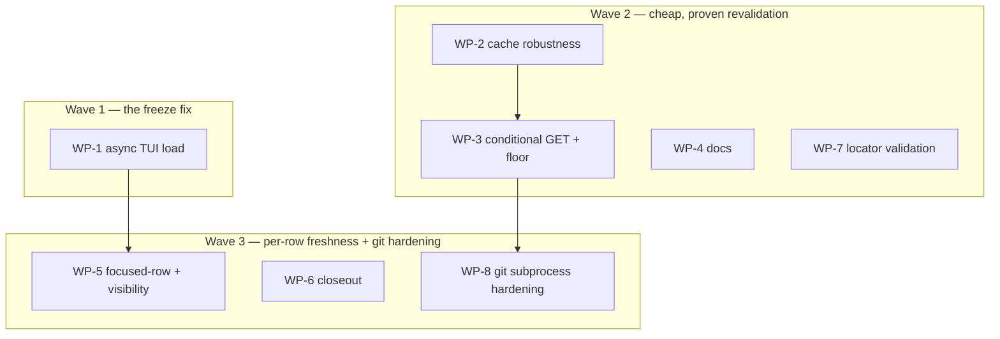

# Plan: Catalog freshness — async TUI load, proven conditional revalidation, focused-row refresh

## Status

- **Plan:** plan_catalog_freshness_revalidation
- **Parent plan:** meta-plan_promotion_1_0 (suspended; resume after this plan)
- **Active phase:** 0 — Planned, not started
- **Step:** /hex-execute .agents/plans/plan_catalog_freshness_revalidation.md
- **Last update:** 2026-08-12 — planned at tier high
  (`architect=on research=3 adversary=on`). Design record
  `.agents/adr/adr_catalog_freshness_revalidation.md` is **Status: Proposed —
  the owner has not accepted it**, and execution should not begin until they do.
  A 5-perspective review panel returned 15 Block / 21 Warn / 13 Suggest, all
  folded in; the architect Block reversed the ADR's central decision. Scope was
  then cut twice and widened once under owner rulings, so **the plan is
  authoritative wherever it and the ADR disagree**. The cross-model adversary
  gate **did not run** — it produced no output — so this plan carries one fewer
  review layer than tier high specifies.

## Classification

- **Scope:** medium — 3 waves, 6 work packages
- **Reversibility:** two-way except one field addition to the cache format
- **Tier:** high (planning tier; the surviving scope is smaller than the tier implies)
- **Design record:** [`adr_catalog_freshness_revalidation.md`](../adr/adr_catalog_freshness_revalidation.md)
  (**Status: Proposed — owner has not accepted.** Read its *Revision 2026-08-12*
  block first; sections marked superseded are a reasoning trail, not live decisions.)
- **Prior decision honoured:** one whole-catalog timestamp; no `built_at`/`fetched_at`
  split; the focused-row refresh is an in-memory overlay that never writes through.

### Problem in one line

A user publishes, waits three minutes, opens the TUI, and does not see their
change — because the browse catalog has a 1-hour TTL and the only way past it is
a full blocking rebuild on the event-loop thread.

### Scope cuts (owner ruling, 2026-08-12)

The plan reached 10 work packages because one decision pulled a chain behind it:
making the OCI `_catalog` walk cheap needs a persisted per-entry digest → changes
the on-disk schema → makes the cache-wedge bug reachable → makes the wedge fix a
precondition. Separately, a `git ls-remote` probe pulled in a whole git-hardening
block. Neither chain serves the stated problem, and the OCI browse path is the
minority case — `_catalog` is gated on GHCR, Docker Hub and GitLab SaaS by the
crate's own `CATALOG_GATED_REGISTRIES`.

**Dropped from this plan:**

| Dropped | Consequence |
|---|---|
| OCI HEAD digest gate + `CatalogEntry.digest` | The OCI `_catalog` rebuild is unchanged. Contracts C-011, C-016 retired. Open question "GitLab token amortization" disappears rather than being answered — it existed only because of the 16-wide HEAD fan-out. |
| `git ls-remote` probe | The git index transport is **unchanged and stays supported** — not disabled, not refactored. Its revalidation remains a full `--depth 1` clone. Contracts C-010, C-015 retired. |

**Git subprocess hardening is IN this plan** (owner ruling, 2026-08-12 — reversing
an earlier decision to split it onto its own branch). It lands as WP-7 and WP-8 in
waves 2 and 3, and it covers the shipped announce path as well as the index
transport, because the `GIT_ALLOW_PROTOCOL` gap there is live today. Note that
`ls-remote` staying out does **not** reduce the hardening surface: the existing
`fetch_git` clone is the invocation that needs it, and it needs it now.
| `Freshness` enum, staleness ceiling, pinning tests, `CatalogRequest` collapse | Withdrawn earlier by the O1+O5 ruling. Contracts C-001, C-004, C-006, C-022 retired. |

Retired IDs are **not reused**, so the review panel's coverage table stays
comparable against this revision.

## Component Contracts

### Async TUI load — the actual fix

- **C-036** The TUI's catalog load is asynchronous for **every** trigger: startup,
  `r`, and a scope toggle. The frame paints first, the load is spawned, rows merge
  on arrival. The event loop never awaits a catalog load.
- **C-028** `load_versions` likewise moves off the event loop, conforming to the
  shipped checker contract: bounded mpsc (256), `try_send`-drops-on-full,
  semaphore bound, generation-stamped message, RAII in-flight guard freed in
  `Drop`, `reap_finished` per tick, `abort_all` on drop.
- **C-023** One projection, two producers. `drain_catalog_ready`'s second
  projection through `rows_from_catalog` — which produces `RowSource::Unattributed`
  rows in locator space — is **deleted**, not retyped. Foreground and background
  loads feed the same root-key-space projection. *Without this, re-arming the
  background seam double-renders every registry.*
- **C-035** `registry_order` and `registry_locators` are rewritten in the **same
  call** that installs new rows, so the index-aligned vectors can never disagree
  with the row set.
- **C-024** The background load takes `offline` from context, never a literal.
  Pinned by a zero-network test. *The dead seam hardcodes `offline = false` at
  `update_check.rs:268`; re-arming it as written is a live `--offline` bypass.*

### Proven conditional revalidation

- **C-009** `CatalogFile.validator: Option<IndexValidator>` where
  `IndexValidator { etag: Option<String>, last_modified: Option<String>, proven: bool }`.
  One nested struct so the two validators cannot be replaced independently. Field
  doc records that a stored `ETag` is valid only for the same URL and
  `Accept-Encoding`.
- **C-002** `freshness_window(kind, proven) -> i64`:

  | Source | Floor |
  |---|---|
  | Index, conditional requests not yet proven | `INDEX_TTL_SECONDS = 300` |
  | Index, `proven` (a conditional request returned `304`) | `INDEX_TTL_PROVEN_SECONDS = 60` |
  | OCI `_catalog` | `CATALOG_TTL_SECONDS = 3600`, unchanged |

  Pure, unit-tested across all three rows. **OCI keeps the hour** — this plan
  dropped the HEAD digest gate, so an OCI revalidation is still a full N-repo
  three-round-trip walk. It is the one source kind where a revalidation is
  genuinely expensive, and it is also the minority browse path
  (`CATALOG_GATED_REGISTRIES`).
- **C-038** `proven` records that a conditional request has actually returned
  `304` for that source. It exists because a host may emit an `ETag` and then
  ignore `If-None-Match`, answering every conditional request with a full `200` —
  so a received header is not evidence the optimization works, and only an
  observed `304` is. Reaching the 60 s floor requires that evidence; if
  conditional requests stop returning `304`, `proven` clears and the floor
  returns to 300.

  *Owner ruling, 2026-08-12: the 300 s baseline applies whether or not
  conditional requests work. The review had flagged 3600→300 as a 12×
  revalidation-rate increase against every index host including self-hosted ones,
  affordable only if a revalidation is cheap. The owner's position is that these
  checks are not expensive enough for that to matter. **Residual, accepted:** on
  a host that emits no usable validator, the 300 s floor means an unconditional
  full-body `all.json` GET at 12× today's cadence. Bounded by human
  browse frequency — nothing here polls on a timer — and capped by C-018.*
- **C-003** `is_fresh_at(built_at, window, now)` takes the window explicitly. A
  future timestamp is stale; an unparseable timestamp is stale. Both unchanged.
- **C-014** HTTP index: send `If-None-Match` when an `etag` is stored, else
  `If-Modified-Since`. `304` ⇒ keep entries, restamp per C-013, set `proven`,
  rewrite. A `200` where a conditional request was sent ⇒ clear `proven`.
  Response carrying neither validator ⇒ today's unconditional GET, no regression.
- **C-013** `built_at` means "last confirmed current", not "last fully rebuilt".
  On a 304 the rewrite restamps `built_at` **and every entry's `fetched_at` in the
  same map iteration**, so the two never diverge on disk. *Without this, the
  restamp is the split the prior decision forbade.*
- **C-031** `force` (`--refresh`, TUI `r`) suppresses conditional revalidation
  entirely and performs a full rebuild. A validator is never trusted under `force`.
- **C-005** `--offline` serves cache at any age, never locks, never reaches the
  network — the frozen contract at `docs/src/package-index.md:52-54`.
- **C-017** `fetch_http` sets `redirect::Policy::limited(5)` and rejects a
  redirect that downgrades https→http. Comment states why this differs from
  `forge.rs::build_client`'s `Policy::none()`.
- **C-018** `fetch_http` bounds the body at `INDEX_BODY_LIMIT = 32 MiB` via the
  `CappedSink` idiom, surfacing `CatalogError::index_fetch`.

### Git subprocess hardening

- **C-019** A **new validation arm** rejects an index locator whose first
  character is `-`, or which begins `ext::`. **This is not a change to
  `classify_index`** — that function already returns `Some(IndexGit)` for
  `--upload-pack=x.git` on the `.git` suffix alone, so a guard written against its
  existing `is_none()` check would never fire on the malicious shape.
  `RegistryInvalid` → 78 at config load, 65 at `config set` / `registry add|set`.
  Bare local `.git` paths stay accepted (owner ruling).
- **C-020** Every git invocation against a configured index URL uses: `--` before
  the URL; a pinned `current_dir` that is not the caller's cwd; `-c
  protocol.ext.allow=never`; `-c http.followRedirects=false`; an explicit
  `GIT_ALLOW_PROTOCOL=file:http:https:ssh:git` env var; `GIT_TERMINAL_PROMPT=0`;
  `GIT_ASKPASS=echo`; `SSH_ASKPASS` removed; empty `credential.helper=`.
  *`file` is present because C-019 keeps bare local paths working. The env var is
  not redundant with the `-c` flag: an inherited `GIT_ALLOW_PROTOCOL` silently
  overrides `-c protocol.ext.allow=never`, verified against git 2.54.0 — which is
  why the shipped announce path's hardening is weaker than its comment claims.*
- **C-043** The same clause set is applied to the **shipped announce path**
  (`src/catalog/index_announce.rs:626-627`), which today sets
  `-c protocol.ext.allow=never` without the env var and is therefore defeatable by
  an inherited environment. This is a live gap, not a new one.
- **C-021** Every git invocation is wrapped in `tokio::time::timeout` **and** built
  with `.kill_on_drop(true)` — a dropped tokio `Child` is not killed by default, so
  a timed-out git otherwise survives orphaned.
- **C-033** Git subprocess failures are surfaced without echoing stderr verbatim:
  the URL is redacted to scheme+host and credential-bearing forms are stripped
  (CWE-532). *Today `index_source.rs:211-217` interpolates raw stderr, which can
  carry a credential embedded in the remote URL.*
- **C-034** The `Command` construction for every hardened git invocation is
  extracted into a **pure function** returning argv + env, so C-020/C-021/C-043 are
  assertable by unit test against the final argv rather than by inspection.
  *Reviewing "we added `--` somewhere" is how incomplete fixes ship.*

### Cache robustness

- **C-007** `coordinate` treats a parse/version failure as a cold cache for the
  rebuild decision: warn once naming the path, then proceed as for an absent file
  (offline ⇒ empty, online ⇒ rebuild over it). `Catalog::load` still returns `Err`,
  so `unknown_version_rejected` stays valid.
  *Today an unparseable cache wedges that source to an empty browse on every run,
  `--refresh` included, with no in-product recovery.*
- **C-008** `deny_unknown_fields` removed from `CatalogFile` and `CatalogEntry`
  **only**. A test asserts `grimoire.toml`, `grimoire.lock`, `publish.toml` and the
  MCP descriptor still reject an unknown field — that negative is the scoping
  argument.
- **C-012** The new field is `#[serde(default, skip_serializing_if = "Option::is_none")]`.
  `CatalogVersion` stays `V1`; an existing cache file parses unchanged.
- **C-032** A failed rebuild falls back to the cache `coordinate` already read and
  proved parseable, instead of returning `Err`. *Today `registry_catalog.rs:471-478`
  drops it and `catalog_service.rs:311-315` degrades the source to an empty group —
  a populated cache plus a transient blip yields an empty browse.*

### Focused-row refresh and freshness visibility

- **C-025** 250 ms selection-settled debounce, then one bounded background fetch
  for the selected row, merged into `TuiState` **in memory only**. Cancel-on-move:
  a selection change aborts the in-flight fetch and frees its semaphore permit and
  in-flight dedup slot.
- **C-042** A focused-row refresh updates the row's **catalog-derived metadata in
  full, not just its version** — everything the detail pane renders comes from the
  representative tag's manifest, so refreshing the row refreshes the text:
  `description`, `summary`, `keywords`, `latest_tag`, `version`, `deprecated`,
  `replaced_by`, `repository_url`, `revision`, `created`, and the curated `oci`
  block. If the detail pane is open on that row it re-renders in place.
  *Selecting a row is what makes its whole record current — not only the number
  in the version column.*
- **C-026** Any per-row merge iterates **every** row sharing a `repo`, never
  `.find()`/early-return. *Invariant established by
  [1a6fd68](https://github.com/grimoire-rs/grimoire/commit/1a6fd68)
  (`state.rs:832-841`) — a regression to protect, not an open defect.* The
  locally-derived fields `pinned_version`, `state` and `source` are never
  overwritten from a fetch; they come from the lock and install state, not the
  registry, and C-042's field set is deliberately disjoint from them.
- **C-027** On a redraw triggered by a landed background result, selection is
  restored by row key, not index.
- **C-039** The TUI surfaces catalog freshness in the status line: that rows came
  from cache, and that a refresh is in flight. Rendered in the same style as the
  existing `offline:` / `truncated:` / `filtered:` clauses
  (`docs/src/commands.md:1035-1048`) so it reads as consistent, not novel.
- **C-040** Rows update **in place, without a keypress**, when a background load
  or a focused-row refresh lands. A row that changes under the cursor stays
  selected (C-027) and the change is visible.
- **C-041** `grim search` and `grim status` keep today's *semantics* exactly:
  one-shot, no overlay, no auto-update, no new output, JSON byte-identical. *A
  background refresh has no owner in a process about to exit — the TUI gets that
  and the CLI deliberately does not.* Latency is governed separately by C-044.
- **C-044** **`grim search` revalidation is deadline-bounded.**
  `SEARCH_REVALIDATE_BUDGET = 1s`: search attempts the conditional revalidation,
  and if it has not completed within the budget, serves the cache `coordinate`
  already read (the C-032 path) and exits. It never waits longer than the budget
  on the network, at any cache age, on any host.

  *Rationale — this is a named first-party consumer, not a hypothetical.
  `grimoire-vscode` drives `grim search --format json` as its catalog browse
  (`product-context.md` › Related Repositories), so search latency is interactive
  latency in an editor. Two facts make the deadline necessary rather than nice:
  the 300 s floor makes a revalidation attempt ~12× more frequent than today, and
  on a host where `proven` is false that attempt is a full-body GET.*

  *This makes search **faster than today in the worst case**, not merely no
  slower: today a stale cache means an unbounded blocking rebuild — a full
  `_catalog` walk on an OCI source — with no ceiling at all. The budget replaces
  an unbounded wait with a bounded one.*

  Under `--refresh` the budget does not apply: an explicit refresh is the user
  asking to wait. Offline never reaches this path.
- **C-045** `grim status --check` keeps the unbounded blocking rebuild. It is an
  explicitly opted-into network command whose correctness (deprecation warnings)
  outranks its latency, and nothing interactive shells out to it per keystroke.
  *Stated so the asymmetry with C-044 is a decision, not an oversight.*

### Invariants that must not regress

- **C-029** `grim search --format json` and `grim status --check --format json`
  byte-identical before and after on identical inputs. Owned by WP-3; gated by a
  named fixture + command pair recorded in that WP.
- **C-046** `grim search` wall-clock time does not regress against today at any
  cache age, on any source kind, reachable host or not. This is a **named
  first-party consumer contract** (`grimoire-vscode`), not a general aspiration —
  it is gated by a test that pins the worst case against an unreachable host,
  which today is unbounded and after C-044 is the budget.
- **C-030** No new dependency. No new config key. No new CLI flag. No cache format
  version bump.

## User-Experience Scenarios

- **S-001** User publishes, waits ~3 min, opens `grim tui`, arrows onto the row →
  within ~1 s the row shows the new version, in place, no keypress. *Error:* fetch
  fails → row keeps prior data, status line notes it, no crash.
- **S-002** User opens `grim tui` with a stale index cache → the frame paints
  immediately and stays interactive; rows arrive after one conditional round trip
  and merge without losing selection; the status line says a refresh is in flight.
  *Error:* revalidation fails → the already-read cache is served (C-032), status
  line notes it.
- **S-003** Fresh cache → rows appear in ~1 ms, no network call.
- **S-004** User presses `r` → the UI stays responsive throughout; `--refresh`
  performs a full rebuild, ignoring validators.
- **S-005** Version picker opens → the UI stays responsive while tags load.
  *Error:* no tags / offline → status message, picker closes.
- **S-006** User scrolls rapidly through 50 rows → at most a handful of fetches
  issue; superseded ones are cancelled, not queued.
- **S-007** `grim search` / `grim status --check` behave exactly as today; JSON
  byte-identical.
- **S-018** The VS Code extension calls `grim search --format json` against a
  stale cache on a slow or unreachable index host → results return within the
  1 s budget, served from cache. *Today the same call blocks unbounded on a full
  rebuild.*
- **S-019** The extension calls `grim search --format json` repeatedly while the
  user types → each call either serves a fresh-enough cache with no network, or
  pays at most one bounded revalidation. No call is unbounded.
- **S-008** `grim --offline tui` makes zero network calls at any cache age,
  including from the background load.
- **S-009** A corrupt `catalog/<hash>.json` → a warning names the file and the
  source rebuilds. *Today it browses empty forever.*
- **S-013** A self-hosted index whose CDN emits an `ETag` but ignores
  `If-None-Match` → the first conditional request returns `200`, `proven` stays
  false, the floor stays 300 (never 60).
- **S-014** A host that genuinely supports conditional requests → the first
  conditional request returns `304`, `proven` is set, and subsequent revalidation
  runs at the 60 s floor at a cost of one validator round trip.
- **S-015** User selects a row whose published description changed since the cache
  was built → the detail pane text updates in place within ~1 s of the selection
  settling, along with the version. *Error:* fetch fails → the pane keeps the
  cached text, status line notes it.
- **S-010** `index = "--upload-pack=x.git"` → rejected at config load (78) and at
  `config set` / `registry add` (65), with a message naming the accepted forms. No
  subprocess runs.
- **S-011** An index URL whose host hangs → the git invocation is killed at the
  timeout, no orphan process survives, the source degrades with a warning.
- **S-012** `index = "/srv/mirror/index.git"` (bare local path) → still works.
- **S-016** A user runs grim with `GIT_ALLOW_PROTOCOL=ext` inherited from their
  shell or CI job → the `ext::` transport is still refused, on both the index and
  announce paths.
- **S-017** A git clone of an index fails against a URL carrying an embedded
  credential → the surfaced error names scheme+host only; the credential appears in
  no log line and no error string.

## Execution Cadence (owner-specified)

1. **One `/hex-review` → `/hex-execute` loop after each wave** — not per work
   package. At most one loop per wave; a finding that survives it defers to the
   final round.
2. **After wave 3, an extended round of at most three loops** over the whole
   branch diff.
3. The cross-model adversary (`codex:rescue`, `code-diff` scope) runs once in the
   extended round. **Verify its output file exists on disk before recording the
   leg as run** — it silently produced nothing during planning.

## Parallelization

| WP | Scope | Expected files | Size | Wave | Depends on | Review | Tests |
|---|---|---|---|---|---|---|---|
| WP-1 | Move both blocking awaits off the event loop: catalog load (C-036) and `load_versions` (C-028); seam migration + delete the second projection (C-023); index-aligned vectors (C-035); offline from context (C-024) | `src/tui/app.rs`, `src/tui/update_check.rs`, `src/tui/version_fetch.rs` (new) | L | 1 | — | panel | C-023, C-024 zero-network, C-028 (6 invariants), C-035, C-036; S-002…S-005, S-008 |
| WP-2 | Cache robustness: wedge fix (C-007), drop `deny_unknown_fields` + retained-four assertion (C-008), failed-rebuild fallback (C-032), correct the false downgrade comment, dispose dead `load_or_refresh`, fix stale module doc `catalog_service.rs:14-17` | `src/catalog/registry_catalog.rs`, `src/catalog/catalog_service.rs` | M | 2 | — | panel | C-007, C-008, C-032 unit; S-009 acceptance |
| WP-3 | Conditional GET (C-014), observed-304 gate (C-038), validator field (C-009, C-012), floors (C-002, C-003), `force` suppression (C-031), restamp (C-013), redirect policy (C-017), body cap (C-018), search deadline (C-044, C-045), byte-identity gate (C-029), search-latency gate (C-046) | `src/catalog/index_source.rs`, `src/catalog/registry_catalog.rs`, `src/command/search.rs` | L | 2 | WP-2 | panel | C-002 all three floor rows + the `proven` clear-on-200 transition, C-003, C-009, C-013, C-014, C-017, C-018, C-031, C-038, C-044 budget expiry serves cache, C-045 asymmetry; S-013, S-014, S-018, S-019; C-029 named fixture+command; C-046 unreachable-host worst case |
| WP-4 | Docs: `package-index.md`, `hosting-an-index.md`, `commands.md` (`#tui` status-line clause), `upgrading.md` | `docs/src/**` | S | 2 | — | light | doc build |
| WP-5 | Focused-row refresh (C-025…C-027) + freshness visibility (C-039, C-040, C-041) | `src/tui/update_check.rs`, `src/tui/state.rs`, `src/tui/app.rs` | L | 3 | WP-1 | panel | C-025 debounce + cancel + permit release, C-026 two-rows-one-repo, C-027, C-039, C-040; S-001, S-006 |
| WP-6 | Closeout: ADR index row, `adr_multi_registry_mcp.md` amendment, catalog drift (`grim-usage` incl. `references/registries.md:176-177`, `grim-authoring`) | `.claude/rules/arch-principles.md`, `.agents/adr/**`, `catalog/skills/**` | S | 3 | — | light | `task catalog:verify` |
| WP-7 | Locator validation arm (C-019) + both message families | `src/config/registry_resolve.rs`, `src/config/project_config.rs`, `src/command/config.rs` | S | 2 | — | **panel (security)** | C-019 unit per rejected shape (`-` leading, `ext::`, and the `.git`-suffixed dash form the old check missed); S-010, S-012 acceptance at both exit codes |
| WP-8 | Git subprocess hardening on both call sites: index clone + announce path (C-020, C-021, C-033, C-034, C-043) | `src/catalog/index_source.rs`, `src/catalog/index_announce.rs` | M | 3 | WP-3 | **panel (security)** | C-034 pure-argv assertions covering every C-020 clause on both call sites; C-021 timeout + no-orphan; C-033 redaction; S-011, S-016, S-017 |

**Critical path:** WP-2 → WP-3 → WP-8 (wave 2 → wave 3), tied with WP-1 → WP-5.
Both are two-hop; neither dominates.

**Why the git hardening is two work packages:** WP-7 is config-layer validation
(`src/config/**`, `src/command/config.rs`) and is file-disjoint from everything, so
it runs in wave 2. WP-8 is the subprocess layer and owns `index_source.rs`, which
WP-3 also owns — so it follows WP-3 into wave 3 rather than colliding with it in
wave 2. Splitting them also gives the argv work its own security review against the
final argv, which is the review that matters.

**Shippable after wave 1:** the reported defect is fixed. The TUI no longer
freezes on startup or `r`, and the version picker no longer blocks. Nothing about
the cache format or the network has changed yet — this wave is pure TUI and
carries no Principle 9 exposure.

**Shippable after wave 2:** index revalidation costs one conditional round trip on
hosts that support it, the cache-wedge class is retired, and a transient network
failure no longer empties a browse.

**Merge plan** (serialized topological order onto `feat/catalog-freshness`):
WP-1, WP-2, WP-4, WP-7, WP-3, WP-8, WP-5, WP-6.

**Why WP-1 and WP-5 are separate waves:** both own `src/tui/app.rs` and
`src/tui/update_check.rs` — file-identical, so parallel worktrees would conflict
on every merge.

## Executable phases (per WP)

**Stub** (signatures + `unimplemented!()`, gate `cargo check`) → **Specify** (tests
from the contracts above, gate: compile and fail) → **Implement** (gate:
`task rust:verify` for the changed area) → **Review** (per the wave cadence).

Every builder brief must additionally require:
- a **mutation check** run empirically against real source and reverted — "what
  single-token mutation would make this wrong, and does a test fail on it?";
- `git -C <worktree>` for every commit, gate and merge;
- `git submodule update --init --recursive` after `git worktree add`;
- `task --force verify` as the only trustworthy full gate.

## Open questions

1. `[NEEDS CLARIFICATION: focused-row tag-cache churn]` — the focused refresh
   writes one `TagCache` file per repo dwelt on ≥250 ms. Unmeasured. Cheap fix if
   noisy: gate the write-through with `eligible_for_recheck` while still serving
   the in-memory overlay.

The other two are resolved: the ETag/CDN question is answered by C-038 (gate on an
observed `304`, so an unknown host is never assumed capable), and the GitLab token
question disappeared with the OCI HEAD fan-out.

## Constitution Deviations

- **CD-2** (Principle 9) — a pre-fix released binary sharing `$GRIM_HOME` with a
  post-change binary wedges that source to an empty browse. Pre-existing property
  of the shipped format; this change makes it reachable, so it is owned.
  *Mitigation:* one-line recovery (`rm -rf "$GRIM_HOME/catalog"`) in
  `docs/src/upgrading.md`; never recurs after this release.
- **CD-3** (Principle 9, informational) — the documented index TTL changes from
  1 hour to 300 s, dropping to 60 s once conditional requests are proven against
  that host. OCI keeps the hour. Not in `stability.md`'s frozen list.
  *Mitigation:* all four doc pages reworded in the same change, stating both
  index floors and why OCI differs.

- **CD-1** (Principle 9) — index-locator validation narrows: a leading `-` and an
  `ext::` prefix are rejected. Neither shape can fetch a real index; an `ext::`
  locator functions only as a command-execution primitive and a `-`-leading one
  only as argv injection, so rejecting them removes no working configuration.
  Bare local `.git` paths stay accepted. *Mitigation:* regression test per
  rejected shape; the reason string names the accepted forms; release notes call
  it out.

## Out of scope — filed, not fixed here

- OCI HEAD digest gate and `CatalogEntry.digest`.
- The `git ls-remote` revalidation probe. Its absence does not weaken WP-8 — the
  invocation being hardened is the clone that ships today.
- Manifest caching in `cached_access.rs`.
- `grim search --format json` source attribution (separate request, parked).
