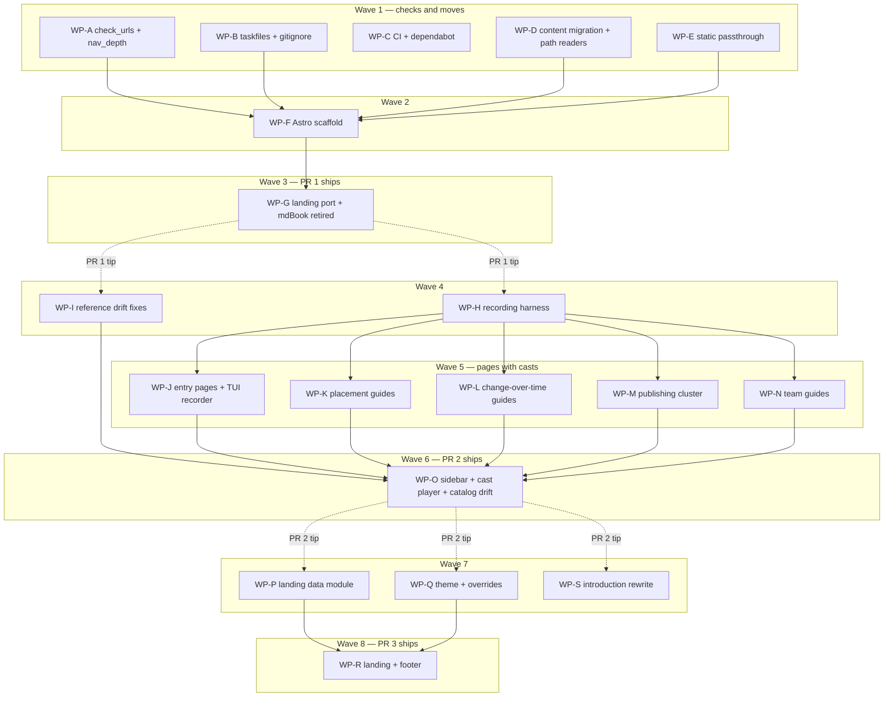

# Plan: Docs site redesign — Starlight migration, use-case pages, landing

## Status

- **Plan:** plan_docs_site_redesign
- **Active phase:** 3 — Landing and theme (PR 3, wave 7) — complete
- **Step:** awaiting /finalize
- **Last update:** 2026-09-07 (review round 1 applied across 6 perspectives and 5 unplanned fix packages; PR 1, PR 2 and PR 3 each green on task --force verify and task docs:check)
- State:   review
- Tier:    xhigh
- Tier-grammar: 5
- Effective-tier: derived
- Updated: 2026-09-07
- Next:    /hex-finalize
- Branch:  `docs/use-case-discovery` (worktree `.agents/worktrees/docs-plan`);
  WPs land on three stacked PR branches cut from it — see § Branch model.

## Classification

- **Scope:** large — 19 work packages, 8 waves, three PRs, ~95 files.
- **Reversibility:** one-way (medium). The generator swap reverts in git; the
  one-way door is the URL contract — 59 anchored deep links, 289 heading ids
  and four schema `$id` values are printed by shipped `grim` binaries and can
  never be un-printed (Principle 9).
- **Tier:** xhigh, explicit at the gate.
- **Overlays:** architect=on, research=on (two new axes plus the reused
  pain-point axis), adversary=on (`nox-review`, plan-artifact scope).
- **Required artifacts:** this plan; the ADR
  [`adr_docs_site_starlight.md`](../adr/adr_docs_site_starlight.md); the
  design record [`design_docs_site_redesign.md`](../specs/design_docs_site_redesign.md)
  (contracts C-001…C-030, scenarios S-001…S-014); the discovery artifact
  [`use-cases.yaml`](../discovery/use-cases.yaml) and the design draft
  [`design/`](../discovery/design/) (`Main.dc.html`, `Guide.dc.html`); research
  `research_docs_{starlight_migration,pain_points,astro_starlight_stack,landing_screencast_patterns,migration_architecture_map,migration_content_survey,migration_url_contract,screencast_harness}.md`.

## Objective

Replace the mdBook site at grimoire.rs with Astro Starlight without moving a
single URL, then ship the twelve use-case pages the discovery ranked with the
eleven screencasts it assigned (one per entry path and router guide;
`guides/mcp-everywhere.md` and `guides/catalog-best-practices.md` carry none
by discovery decision), then rebuild the landing around the three entry paths
and the eight-card pain router. The design record owns every contract; this
plan owns the cut into work packages, the order, and the gates.

## Decisions taken at decomposition

These are not in the design record. Each is recorded in the spec under § 8
"Decomposition amendments"; D-1 and D-2 amend the Accepted ADR and carry a
row in its changelog. "PR 2" below is the pages-and-casts PR (the spec's
original "W3" grouping); wave numbers are this plan's own.

| ID | Decision | Why |
|---|---|---|
| D-1 | **PR order is migration → pages and casts → landing and theme.** | The landing's eight router cards link to the eight guide pages; `starlight-links-validator` makes a card pointing at a missing page a build failure, and conditional cards would ship a half-empty router. Pages before landing makes every PR's links resolve. |
| D-2 | **C-024 (cast embedding) lands with the pages PR**, and the player loads on every page through Starlight's `head` array. | It is cast plumbing; the casts are recorded in the pages PR and must play there. Amends the ADR's "loaded only by the landing" sub-decision. |
| D-3 | **C-030 records the TUI as a raw PTY stream with timed keystrokes**; assertions run on the escape-stripped stream; the fallback still is an `agg` PNG. The raw-stream extension lives in WP-J, not the harness WP. | asciicast v2 stores the raw stream and the player's `avt` emulator handles the alternate screen. `pyte` (last release 2023) has no alternate-screen buffer, so nothing asserts on an emulated screen. The fallback (CLI-half cast plus the PNG) stays the accepted PR 2 gate. Keeping the PTY work out of WP-H removes the single risky WP that gated all twelve pages. |
| D-4 | **The cast sits in the content column** under a "See it run" heading; no `PageFrame` override. | A `.md` page cannot place raw HTML in Starlight's aside. The spec's own conditional ("override `PageFrame` only if…") resolves to "do not". |
| D-5 | **Documented verification is `task verify` followed by `task docs:check`.** `full` in the WP table means both. `task verify` keeps a Node-free source-level docs check (`test/tests/test_docs.py`, retargeted by D-13); `docs:check` runs `python3 docs/check_urls.py --root .` (repo root; built tree defaults to `docs/dist`, exit 2 if either derived root is absent). | `task verify` runs after every implementation change and must not need Node or an Astro build; `docs:check` (C-012) is the docs subsystem gate and the Principle 9 tripwire. Recorded in `hex.md › Pointers` at upkeep. |
| D-6 | **The interim stylesheet is `docs/src/styles/theme.css` from PR 1** (the moved `clients-matrix.css` rules), registered in `customCss`; WP-Q adds the token map to it. | C-018 deletes `docs/theme/` in PR 1; the matrix must stay styled through PR 1 and PR 2. Naming it `theme.css` at once saves one delete and one edit of `astro.config.mjs`, the busiest shared file. |
| D-7 | **The status vocabulary lives at `commands.md` › `## Artifact states {#artifact-states}`** under `grim status`. `json-interface.md` links `./commands.md#artifact-states`; pages under `guides/` and `tutorials/` link root pages as `../<page>.md`, so `guides/lifecycle.md` links `../commands.md#artifact-states`. | C-027 says "stated once"; the anchor and the link form have to be fixed before WPs in different waves link to it. |
| D-8 | **Cast scripts are one YAML per cast** under `test/recordings/casts/<name>.yaml`, consumed by one parametrized pytest, run by `task test:demo`. A yaml with no `expect` is a usage error. | C-029's "declarative script"; a page author proves the page's commands by recording them inside an assertion, and a cast that asserts nothing cannot ship. |
| D-9 | **`nav_depth.py` gains a Starlight branch** (reads `sidebar:` in `docs/astro.config.mjs`). | The check today finds only mkdocs, VitePress and mdBook; after PR 1 it would silently return clean. |
| D-10 | **`/sitemap.xml` is produced by `task docs:build` copying `sitemap-0.xml`** after `npm run build`. | `@astrojs/sitemap` has no filename option and emits `sitemap-index.xml` + `sitemap-0.xml`; `/sitemap.xml` is a shipped path (`seo.py` writes it, `robots.txt` names it). One chunk always exists below 50 000 URLs. |
| D-11 | **No `lastUpdated`, no `fetch-depth: 0`.** | The mdBook site shows no date; a full-history clone on every docs build is cost for a feature nobody asked for. A later one-line PR if wanted. |
| D-12 | **`npm audit --audit-level=high` runs in `task docs:check`.** | The lockfile pins several hundred transitive packages and nothing else reads it; dependabot alone is not a gate. |
| D-13 | **Everything that names a moved page's path moves with it, in WP-D**: the `docs/src/` mentions under `src/` (eight files read pages at `cargo test` time, fourteen more cite them in comments), `test/tests/test_docs.py`, `catalog/README.md`'s trigger list, `.claude/hooks/post_tool_use_tracker.py`. | Fifteen `#[cfg(test)]` reads panic after the move and `task verify` goes red at WP-D's own gate; `test_docs.py`'s link resolver would collect zero pages and pass forever; the catalog drift duty would be silently disarmed. Test fixtures and comments are not a released surface, so Principle 9 is intact. |

## Amendments taken during execution

Findings the review seats raised against the contracts themselves, applied as the
plan ran. Each is folded into the design record's § 8.

| ID | Amends | Change | Why |
|---|---|---|---|
| E-1 | C-010 item 4 | The catalog link lint reads the link form wherever it appears under `catalog/`, not only in `*.md`. | The contract contradicted itself — its glob said `catalog/**/*.md`, its own sentence said "twenty files under `catalog/`", and the measured 20-file set includes `catalog/publish.toml`, whose `documentation = "https://grimoire.rs/introduction.html"` ships to the registry as package metadata. As written the check scanned 122 of 123 links and a dead link there exited 0. |
| E-2 | C-010 item 1 | Existence is not enough for the binary static assets: `og-card.png` and the favicons are content-checked, and a Git-LFS pointer is named as such. | C-007's acceptance already names the failure ("Pages ships a pointer file"), and `check_urls.py` is the only automated gate inside `docs:check`. A ~130-byte ASCII pointer passed `is_file()`. |
| E-3 | C-010 output | Findings render `path:line: [rule] message`, and a fragment finding carries its real source line. | Every sibling check emits both, and § 4's error taxonomy quotes the shape verbatim. The first implementation hard-coded `line` to 1 and dropped `rule` from the text renderer. |
| E-4 | C-003 | The sidebar must cover the page set: every page under `docs/src/content/docs/` appears in exactly one `astro.config.mjs` sidebar group, asserted by `check_urls.py` and re-asserted at WP-O. | Deleting `SUMMARY.md` (WP-D) removed the only disk→nav check. Without a replacement a page can ship reachable by URL and absent from every group — an orphan no gate sees. C-003 asserted nav→disk only. |
| E-11 | C-010 / C-011 | `check_urls.py` gains a cross-page **fragment-target** assertion: an internal href `/x.html#frag` must find `id="frag"` in `dist/x.html`. | E-10's suffix stage blinds `starlight-links-validator`'s `errorOnInvalidHashes`: appending `.html` makes the path match no key in the validator's heading map, so its hash branch never runs. Proven by toggling the stage on one dead link. That left 290 source `./page.md#frag` links unguarded, on the exact plugin C-011 was the safety net for. The guarantee moves into the gate that already owns the URL contract. |
| E-9 | C-001 | The manifest pins **eight** packages, not seven: `@astrojs/markdown-remark 7.3.0` joins the list. | Astro 7.3.1 makes Sätteri the default Markdown processor and no longer installs it, so setting `markdown.remarkPlugins` throws at `astro/dist/core/config/validate.js:54`. It was already Starlight 0.42.0's own peer (`^7.3.0`); pinning it exactly makes an implicit transitive peer explicit. |
| E-10 | C-002 / C-004 | A ninth rehype stage appends `.html` to internal links, **after** `astroRehypeRelativeMarkdownLinks`. | `astro-rehype-relative-markdown-links` resolves against Astro's **route** manifest, and a route carries no extension. Its whole option surface is `srcDir`/`collectionBase`/`collections`/`base`/`trailingSlash` — there is no `build.format` option and its source never mentions `.html`. The design record assumed it tracked `build.format`. Without the stage, 526 body links shipped extensionless while the sidebar, every `rel="canonical"` and every shipped deep link said `.html`: one page served under two URL shapes. No shipped URL was ever broken (Pages maps `/page` to `page.html`), so Principle 9 held. |
| E-8 | C-029 | `demo.yaml` keeps `registry: public`. C-029's "only `own-index.cast` reaches the public registry" governs the **eleven new casts** under `docs/public/casts/`, not the pre-existing `docs/public/demo.cast`. | The design record reads both ways (§ 2 C-029 says every cast but one records locally; the § 4 risk row prescribes moving a networked cast to the fixture). `demo.cast` is the landing hero and its story *is* the real public registry; re-recording it against `localhost:5000` would change what a first-time visitor sees. Recording is explicit (`task test:demo`, never CI), so a network flake blocks no gate. |
| E-7 | D-13 | D-13's reader sweep must include `.claude/rules/**`, not only `src/`, `catalog/README.md`, the hooks and the link test. | The `paths:` glob in `vendor-capability-watchlist.md` named `docs/src/ratings.md` and went dead at the move, turning `task claude:tests` red; eighteen prose pointers across eight other rule files named paths that no longer resolve. Caught by WP-F, fixed on the feature branch. |
| E-6 | WP-I Specify | The anchor assertion is token-set preservation, not per-file count equality. | C-027/D-7 *requires* a new `{#artifact-states}` anchor, so the count must rise from 289 to 290. Counting would have failed a correct implementation and passed a rename-plus-add. |
| E-5 | C-015 / D-13 | The `src/` property is reverse-substitution identity, not "every changed line contains `docs/src/`". | `max_width=120` forces rustfmt to rewrap four call sites; the continuation lines carry no such substring. The literal grep fails on a correct migration. |

## Design guarantees

1. **Backwards compatibility.** No diff to any shipped string under `src/`
   — the only `src/` edits are the `docs/src/` path literals in test reads
   and comments (D-13). Every URL, fragment, static path and schema `$id` in
   the ADR's contract list is asserted by `docs/check_urls.py` against the
   built tree, and the build job fails before the deploy job runs (spec § 7,
   Principle 9 table). The one additive change is `grim-mcp.schema.json`
   starting to resolve at a URL the binary already advertises (C-008). The
   five footer links `seo.py` injects today survive as an asserted set (WP-R).
2. **TDD.** Red first, per work package: the URL check's own pytest (WP-A)
   precedes the scaffold that satisfies it (WP-F); each new page's recording
   is an assertion that fails until the page's commands succeed (WP-H, then
   WP-J…N); the landing data module's test precedes the components that
   consume it (WP-P before WP-R). Migration is characterization-only:
   byte-identical bodies, idempotent script (C-015), `task rust:test:unit` and
   `test_docs.py` green after the move.
3. **JSON interface.** No JSON surface changes. `json-interface.md` gains the
   definition of `stale` the binary already emits (C-028 row 4) — a doc fix.
4. **Exit codes.** Zero new `grim` exit codes. `commands.md` documents the
   existing stale-lock exit 65 (C-027). `docs/check_urls.py` follows the
   docs-quality check contract: 0 clean, 1 finding, 2 usage.

## Contracts and scenarios

The design record is the single statement of every contract and scenario; the
plan does not restate them. Coverage — every C-/S- ID maps to at least one WP:

| Contract | WP | Contract | WP | Scenario | WP |
|---|---|---|---|---|---|
| C-001 | F | C-016 | G | S-001 | J |
| C-002 | F | C-017 | G (W1), S (W2) | S-002 | J |
| C-003 | F (21 pages), O (12 new) | C-018 | E (theme assets), G | S-003 | J |
| C-004 | F | C-019 | Q | S-004 | K |
| C-005 | F | C-020 | Q (theme, header), R (footer) | S-005 | K |
| C-006 | D | C-021 | E (move), Q (fold) | S-006 | L |
| C-007 | E | C-022 | P | S-007 | N |
| C-008 | B | C-023 | R | S-008 | L |
| C-009 | F, B (copy) | C-024 | O (script, head), J, K, L, M, N (embeds) | S-009 | L |
| C-010 | A | C-025 | J, K, L, M, N; O (gate) | S-010 | N |
| C-011 | F | C-026 | J (quickstart), M (publishing) | S-011 | M |
| C-012 | B, F (first green run) | C-027 | I | S-012 | A, F |
| C-013 | C | C-028 | I (rows 1, 3, 4, 5), J (row 2) | S-013 | A, B, F |
| C-014 | C | C-029 | H | S-014 | A, C |
| C-015 | D | C-030 | J (recorder extension, browse cast, fallback) | | |

## Branch model

Three stacked branches, one PR each, the owner opens and merges them:

| PR | Branch | Cut from | Waves | Ships |
|---|---|---|---|---|
| 1 | `docs/starlight-migration` | `docs/use-case-discovery` tip | 1–3 | Starlight site, content byte-identical, URL contract asserted in CI |
| 2 | `docs/use-case-pages` | PR 1 tip | 4–6 | twelve pages, two expands, five drift fixes, the casts, the cast player |
| 3 | `docs/landing-redesign` | PR 2 tip | 7–8 | landing rebuilt, dark theme on every page, `introduction.md` findings closed |

`/hex-execute` cuts each branch when its first wave starts and merges that
PR's WPs onto it in the order below. **`Depends on` lists intra-PR edges only;
every WP of PR n is based on the PR n−1 tip and so implicitly depends on every
earlier WP** (WP-I on WP-D's moved pages, WP-O/P/Q on WP-F's config and
manifest, WP-Q on WP-E's moved stylesheet). If a PR merges to `main` before
the next branch is cut, the owner may re-base the next branch onto `main` — an
owner call, not an executor default. The planning branch itself
(`docs/use-case-discovery`, discovery + ADR + spec + plan) rides into PR 1.

## Parallelization

### Work-package table

Paths under `docs/src/content/docs/` are written as `content/<page>` for
width. `Verify`: `scoped` runs the WP's own acceptance commands; `full` runs
the documented verification (D-5).

| ID | Scope | Expected files | Size | Wave | Depends on | Review | Verify | Status |
|---|---|---|---|---|---|---|---|---|
| WP-Z | prerequisite — none (added at execution) | `.claude/rules.md`, `.claude/rules/meta-ai-config.md`, `.claude/tests/test_ai_config.py`, `.claude/taskfile.yml`, `.claude/rules/docs-quality/checks/fixtures/doc_examples/harness-*/*.sh` | M | 1 | — | risk | full | merged |
| WP-T | prerequisite — none (added at execution) | `docs/src/content/docs/{agents,clients,hosting-an-index,json-interface,mcp-servers,package-index}.md` | S | 5 | — | — | scoped | merged |
| WP-A | C-010, D-9; S-012, S-013, S-014 | `docs/check_urls.py`, `test/tests/test_check_urls.py`, `.claude/rules/docs-quality/checks/nav_depth.py`, `.claude/rules/docs-quality/checks/fixtures/nav_depth/` | M | 1 | — | | scoped | merged |
| WP-B | C-008, C-009 (copy), C-012, D-5, D-10, D-12; S-013 | `taskfiles/docs.taskfile.yml`, `taskfiles/schema.taskfile.yml`, `.gitignore` | M | 1 | — | | scoped | merged |
| WP-C | C-013, C-014; S-014 | `.github/workflows/docs.yml`, `.github/dependabot.yml` | S | 1 | — | | scoped | merged |
| WP-D | C-006, C-015, D-13 | `docs/migrate_frontmatter.py`, 21 × `docs/src/<page>.md` → `content/<page>.md`, `docs/src/SUMMARY.md` (delete), `test/tests/test_docs.py`, `catalog/README.md`, `.claude/hooks/post_tool_use_tracker.py`, and the 22 `src/**` files naming `docs/src/` (`src/install/client_target.rs`, `src/install/vendor_{claude,codex,copilot,cursor,gemini,opencode}.rs`, `src/catalog/catalog_service.rs` read pages at test time; `src/api/rate_report.rs`, `src/catalog/rating_provider.rs`, `src/cli/exit_code.rs`, `src/command/{fetch,init,rate}.rs`, `src/error.rs`, `src/fetch.rs`, `src/install/{installer,path_anchor,render}.rs`, `src/main.rs`, `src/mcp/render.rs`, `src/tui/detail.rs` cite them in comments) | L | 1 | — | | scoped | merged |
| WP-E | C-007, C-018 (theme assets), C-021 (move), D-6 | `docs/src/{install.sh,install.ps1,robots.txt,og-card.png,start.html,privacy.html,demo.cast,asciinema-player.css,asciinema-player.min.js}` → `docs/public/`, `docs/theme/{favicon.png,favicon.svg}` → `docs/public/`, `docs/theme/clients-matrix.css` → `docs/src/styles/theme.css`, `test/recordings/test_record_demo.py` (output path) | M | 1 | — | | scoped | merged |
| WP-F | C-001, C-002, C-003 (21 pages), C-004, C-005, C-009, C-011, C-012 (first green run), E-4; S-012, S-013 | `docs/package.json`, `docs/package-lock.json`, `docs/astro.config.mjs`, `docs/src/content.config.ts`, `docs/check_urls.py`, `test/tests/test_check_urls.py` | M | 2 | A, B, D, E | risk | full | merged |
| WP-G | C-016, C-017 (W1), C-018 | `docs/src/pages/index.astro`, `docs/theme/index.hbs` (delete), `docs/seo.py` (delete), `docs/book.toml` (delete), `docs/README.md`, `docs/docs.toml`, `AGENTS.md`, `.claude/rules/docs-style.md`, `.claude/rules/subsystem-taskfiles.md` | L | 3 | F | | full | merged |
| WP-H | C-029, D-8 | `test/recordings/cast_recorder.py`, `test/recordings/test_record_casts.py`, `test/recordings/test_record_demo.py` (delete), `test/recordings/casts/demo.yaml`, `test/taskfile.yml`, `docs/public/demo.cast` | M | 4 | — | | scoped | merged |
| WP-I | C-027, C-028 rows 1 3 4 5, D-7 | `content/commands.md`, `content/json-interface.md`, `content/configuration.md` | M | 4 | — | | scoped | merged |
| WP-J | C-024 (embeds), C-025 (browse, first-skill), C-026 (quickstart), C-028 row 2, C-030 (recorder extension, browse cast, fallback), D-3; S-001, S-002, S-003 | `content/quickstart.md`, `content/browse.md`, `content/first-skill.md`, `test/recordings/cast_recorder.py` (raw-stream mode, `send_keys`), `test/recordings/test_record_casts.py` (`keys:` support), `test/recordings/casts/{quickstart,browse-tui,first-skill}.yaml`, `docs/public/casts/{quickstart,browse-tui,first-skill}.cast`, `docs/public/img/browse-tui.png` (fallback only) | L | 5 | H | risk | scoped | merged |
| WP-K | C-024 (embeds), C-025 (scopes-and-clients, shared-skills, mcp-everywhere); S-004, S-005 | `content/guides/{scopes-and-clients,shared-skills,mcp-everywhere}.md`, `test/recordings/casts/{scopes,shared-skills}.yaml`, `docs/public/casts/{scopes,shared-skills}.cast` | L | 5 | H | | scoped | merged |
| WP-L | C-024 (embeds), C-025 (lifecycle, inspect, versioning); S-006, S-008, S-009 | `content/guides/{lifecycle,inspect,versioning}.md`, `test/recordings/casts/{lifecycle,inspect,versioning}.yaml`, `docs/public/casts/{lifecycle,inspect,versioning}.cast` | L | 5 | H | | scoped | merged |
| WP-M | C-024 (embeds), C-025 (own-index, catalog-best-practices), C-026 (publishing); S-011 | `content/tutorials/own-index.md`, `content/guides/catalog-best-practices.md`, `content/publishing.md`, `test/recordings/casts/own-index.yaml`, `docs/public/casts/own-index.cast` | L | 5 | H | | scoped | merged |
| WP-N | C-024 (embeds), C-025 (team-ci, registries); S-007, S-010 | `content/guides/{team-ci,registries}.md`, `test/recordings/casts/{team-ci,registries}.yaml`, `docs/public/casts/{team-ci,registries}.cast` | L | 5 | H | | scoped | merged |
| WP-O | C-003 (12 new entries), C-024 (script, head), C-025 (gate), catalog drift | `docs/astro.config.mjs`, `docs/public/casts.js`, `catalog/**` (drift edits, if any) | M | 6 | I, J, K, L, M, N | | full | merged |
| WP-P | C-022 | `docs/src/data/landing.ts`, `docs/src/data/landing.test.ts`, `docs/package.json` (`test` script) | M | 7 | — | | scoped | merged |
| WP-Q | C-019, C-020 (theme, header), C-021 (fold) | `docs/src/styles/theme.css`, `docs/src/components/{ThemeProvider,ThemeSelect,Header}.astro`, `docs/astro.config.mjs`, `docs/public/privacy.html` | M | 7 | — | | scoped | merged |
| WP-S | C-017 (W2) | `content/introduction.md` | S | 7 | — | | scoped | merged |
| WP-R | C-020 (footer), C-023, D-4 | `docs/src/pages/index.astro`, `docs/src/components/{WaysIn,PainRouter,FooterNav,Footer}.astro` | L | 8 | P, Q | | full | merged |

**WP-T is unplanned.** `page_type.py --root docs/src/content/docs` exited 1
at the wave-5 base with seven findings, all predating this plan and none on a page
any planned work package touches. Six are closed here: five DOC-TYPE-07 preambles
gain a heading of their own (additive anchors only, nothing renamed or dropped) and
one DOC-TYPE-04 passage on `json-interface.md` loses its first person. The seventh,
DOC-TYPE-08 on `upgrading.md`, is left unfixed and deferred to the owner: the fix
trades it for a DOC-TYPE-09 finding the rule's own type table says should not fire
on a troubleshooting page (`page-types.md:75` against `page_type.py:240`), and the
checker is vendored from `ocx-sh/grimoire-lore` where a local edit is reverted on
the next sync.

**WP-Z is unplanned.** `task verify` was red on `main` from `069bfe3`, which
vendored ten skills and eight rules into `.claude/` without updating this repo's
AI-config contract (10 failures in `task claude:tests`, 3 in `task shell:verify`,
12 lychee findings). CI runs none of those gates, so nothing caught it. Every
`full` gate in this plan was unreachable until it was fixed, so it is a
prerequisite rather than scope creep — and it is reviewed and committed
separately from the docs work so the owner can judge it on its own.
One finding from it outlives this plan: `test_all_markdown_refs_resolve` skipped
any target whose *absolute* path held a `worktrees` segment, so **every hex
worktree ran that suite blind**. Any earlier run that claimed a green
`claude:tests` from `.agents/worktrees/**` proved less than it reported.

**Justifications.** WP-C stays an isolated `S` because its two files are CI
workflow files: the `sec` flag runs it at the ceiling, and folding it into
WP-B would drag the taskfile edit to the ceiling with it. WP-S stays an
isolated `S` because a prose rewrite reviewed against `page-types.md` and a
visual rebuild reviewed against the design draft need different reviewers,
and `introduction.md` depends on neither WP-P nor WP-Q. WP-J…N sit one wave
behind WP-H although their pages could be authored in parallel with it: the
recorder is their test fixture, and a page whose cast was recorded in the same
WP is a page whose commands were proven — the reason the pytest harness beat
VHS (spec § 6). WP-H is a parametrization of the existing recorder with no
PTY work (D-3), so it no longer gates PR 2 on a risky WP. WP-F is `risk`: it
is the URL-contract door and the first real build. WP-J is `risk`: it carries
the raw-stream recorder extension and the TUI cast attempt. WP-D and WP-E stay
two WPs although both are moves: WP-D carries the `src/` and test edits and
is reviewed as one atomic rename, WP-E is asset moves only.

**Effective-tier histogram** (snapshot at the Decompose gate; recomputed at
each WP's spawn): `effective tier: medium 1 · high 6 · xhigh 12 (ceiling
xhigh)`. `sec` fires on WP-C (workflow files), WP-F (manifest and lock), WP-O
(`catalog/**`), WP-P (`docs/package.json`) and, by the `catalog/**` clause,
WP-D (`catalog/README.md` — a path list, not a published package; the
security seat reads that one hunk and stops); `door` on WP-F, WP-G, WP-O,
WP-R; `hub` floors WP-E and WP-H (`demo.cast`, `test_record_demo.py`,
`cast_recorder.py` with WP-J) and WP-Q (`astro.config.mjs`, `theme.css`) at
`high`; the `L` rows resolve to the ceiling. `medium`: S. `high`: A, B, E, H,
I, Q. `xhigh`: C, D, F, G, J, K, L, M, N, O, P, R. The `hub` predicate is
read over the paths as spelled in the cells: WP-D's "21 × `docs/src/<page>.md`
→ `content/<page>.md`" denotes the move, not a later edit of
`content/introduction.md`, so WP-S does not share a file with WP-D.

### Wave graph

The table is canonical; the graph is its index. Dotted edges are PR
boundaries, not file dependencies.

**Critical path:** WP-D → WP-F → WP-G ‖ WP-H → WP-J → WP-O ‖ WP-Q → WP-R
(eight waves; the three PRs are serialized by the branch model).

**Shippable after wave: 3** — PR 1, the Starlight site with byte-identical
content, `task verify` and `task docs:check` green, CI deploying from
`docs/dist`.
**Shippable after wave: 6** — PR 2, twelve new pages, two expands, five drift
fixes, the casts playing, catalog links linted with a CI trigger.
**Shippable after wave: 8** — PR 3, the landing rebuilt, dark theme, every
`introduction.md` finding closed.

### Merge plan (serialized, topological)

1. Wave 1 onto `docs/starlight-migration`: WP-A, WP-B, WP-C, WP-D, WP-E
   (any order; file sets disjoint). At this gate `docs/src/` holds only
   `content/` and `styles/`, and `task verify` is green (WP-D's `src/` and
   `test_docs.py` edits land with the move).
2. WP-F. First `task docs:build`; first `task docs:check`. The canonical-tag
   and Pagefind confirmations happen here, before any new page is written.
3. WP-G. `full`. **PR 1 opens.**
4. Cut `docs/use-case-pages`. Wave 4: WP-H, WP-I.
5. Wave 5: WP-J, WP-K, WP-L, WP-M, WP-N (any order). **One release build of
   `grim` is made once before the wave fans out and every WP records with
   `GRIM_COMMAND` pointed at it** (the `grim_binary` fixture honours it,
   `test/conftest.py:299-308`); five concurrent `cargo build --release` runs
   in five worktrees are not budgeted — cargo target dirs on the tmpfs `/tmp`
   have caused out-of-memory aborts in this repo before.
6. WP-O. `full`. **PR 2 opens.**
7. Cut `docs/landing-redesign`. Wave 7: WP-P, WP-Q, WP-S.
8. WP-R. `full`. **PR 3 opens.**

## Executable phases

Every WP runs Stub → Specify → Implement → Review. "Checks" below means the
docs-quality scripts under `.claude/rules/docs-quality/checks/`. Commands run
from the repository root of the WP worktree. Machine-checked docs-quality
rules are DOC-TYPE-22, DOC-TYPE-25, DOC-DISC-16, DOC-DISC-17 (`page_type.py`)
and DOC-TYPE-10/11 (`landing_check.py`); DOC-TYPE-23, DOC-TYPE-24,
DOC-DISC-18 and DOC-DISC-19 are reviewer duties with the rule text in
`page-types.md` as the checklist — a green exit code never certifies them.
Pages under `guides/` and `tutorials/` link root pages as `../<page>.md`
(D-7); a source-level link check that needs no build is available to every
page WP: `uv run --directory test pytest tests/test_docs.py`.

### WP-A — URL-contract check and nav-depth Starlight branch

- **Stub.** `docs/check_urls.py` with `main(argv) -> int`, the five assertion
  functions from C-010 as `raise NotImplementedError`, the docs-quality
  argument shape: `--root DIR` = repository root, `--dist DIR` (default
  `<root>/docs/dist`), `--format text|json`, exit 0/1/2; exit 2 with a
  message when `<root>/docs/src/content/docs`, `<root>/catalog` or the dist
  tree is absent — never 0 on partial coverage. A `starlight` branch in
  `nav_depth.py::find_generator` returning
  `("starlight", <root>/docs/astro.config.mjs)` and a `starlight_nav` stub.
- **Specify.** `test/tests/test_check_urls.py` builds a **repo-shaped**
  `tmp_path` tree (`docs/dist/` with three pages and one schema,
  `docs/src/content/docs/` with a page carrying `{#registry-compatibility}`,
  `catalog/skills/x/SKILL.md` with one `https://grimoire.rs/page.html#frag`
  link, `README.md`) and asserts: clean tree → 0; a deleted
  `docs/dist/quickstart.html` → 1 naming that path; the source fragment with
  no matching `id=` in dist → 1 naming the fragment; a `.mdx` under the source
  tree → 1; a schema `$id` mismatch → 1; a catalog link to a missing page → 1
  naming the catalog file; a missing `docs/dist` → 2. One test for
  `nav_depth.py` on a fixture `astro.config.mjs` under
  `checks/fixtures/nav_depth/` with a four-group sidebar → depth 2, zero
  findings.
- **Implement.** Standard library only. The 289-fragment sweep reads
  `{#id}` from every `content/**/*.md`; catalog lint reads
  `https://grimoire.rs/<page>.html[#frag]` from `catalog/**/*.md`,
  `catalog/README.md`, `README.md` (20 files, 74 fragment links today).
  `starlight_nav` walks the balanced `sidebar: [` block the VitePress branch
  already knows how to walk.
- **Review.** `python3 docs/check_urls.py --help` exits 0;
  `uv run --directory test pytest tests/test_check_urls.py` green;
  `python3 .claude/rules/docs-quality/checks/nav_depth.py --self-test` green.

### WP-B — build plumbing

- **Stub.** `taskfiles/docs.taskfile.yml` declares `build`, `serve`, `check`
  with the C-012 descriptions and `deps: [:schema:generate]`. `docs:build`
  exports `GRIM_VERSION` read from `Cargo.toml` (`grep -m1 '^version' | cut
  -d'"' -f2`) for C-016, runs `npm ci && npm run build` in `docs/`, then
  `cp -f docs/dist/sitemap-0.xml docs/dist/sitemap.xml` (D-10). `docs:check`
  runs `python3 docs/check_urls.py --root .`, `doc_declaration.py --root
  docs/src/content/docs`, `npm audit --audit-level=high` in `docs/` (D-12),
  then `npm test --if-present` in `docs/`, so WP-P's test joins without a
  second taskfile edit.
- **Specify.** `task --list` shows `docs:build`, `docs:serve`, `docs:check`;
  `task schema:generate` writes four files under `docs/public/schemas/` and
  `grep -l '"$id"' docs/public/schemas/*.json | wc -l` prints 4; `.gitignore`
  lists `docs/dist/`, `docs/public/schemas/`, `docs/node_modules/`,
  `docs/.astro/` and no longer `docs/book/` or `docs/src/schemas/`, and its
  "mdBook build output" comment is rewritten with the entry. "`task
  docs:check` exits 0" is asserted at WP-F, the first WP with a build.
- **Implement.** `schema.taskfile.yml` gains `grim schema --kind mcp >
  docs/public/schemas/grim-mcp.schema.json` and moves the output dir;
  `sources`/`generates` updated so caching stays correct (subsystem-taskfiles
  rule); its summary's "mdBook copies those files verbatim" sentence
  rewritten for the Astro `public/` passthrough (WP-G's mdBook grep covers
  `taskfiles/`). Keep the raw-`npm`-never-in-CI wording in the task summary.
- **Review.** `task schema:generate && python3 -c "import json,glob;
  [json.load(open(p)) for p in glob.glob('docs/public/schemas/*.json')]"`;
  each `$id` equals `https://grimoire.rs/schemas/<filename>`.

### WP-C — CI and dependabot

- **Stub.** The C-013 edits in `.github/workflows/docs.yml` (as amended:
  no `fetch-depth: 0`, D-11; `catalog/**` and `README.md` added to `paths:`);
  the npm block of C-014 in `.github/dependabot.yml`.
- **Specify.** `grep -c 'uses:' .github/workflows/docs.yml` equals the count
  of lines matching `uses: .*@[0-9a-f]{40}`; exactly one `concurrency:` with
  `group: pages`; the deploy job keeps `needs: build` (S-014's "deploy never
  runs"); `paths:` contains `catalog/**` and `README.md`; no `fetch-depth`
  key; `python3 -c "import yaml; d=yaml.safe_load(open('.github/dependabot.yml')); assert len(d['updates'])==3"`;
  `submodules: recursive`, `lfs: true` present; `actionlint` clean if
  installed.
- **Implement.** `actions/setup-node` pinned by 40-hex SHA with a `# vN`
  comment, `node-version: 24`, `cache: npm`,
  `cache-dependency-path: docs/package-lock.json`. `task docs:check` after
  `task docs:build` (so `npm audit` runs in CI too); artifact path `docs/dist`.
- **Review.** `reviewer:security` fires (`.github/workflows/**`). The
  permission set is byte-identical to today's. Owner check after the first
  push: the second run's `setup-node` step reports `cache-hit: true`
  (subdirectory `cache-dependency-path` misses silently,
  actions/setup-node#624).

### WP-D — content migration and the readers of the moved paths

- **Stub.** `docs/migrate_frontmatter.py` with the 21-row title/description
  table from `research_docs_migration_content_survey.md` § 2 and a
  `migrate(path) -> bool` shell; `git mv docs/src/<page>.md
  docs/src/content/docs/<page>.md` for the 21 pages; `git rm docs/src/SUMMARY.md`;
  every `docs/src/` string under `src/` rewritten to `docs/src/content/docs/`
  (eight files read pages in `#[cfg(test)]`, fourteen cite them in comments —
  the file list is in the WP table); `test/tests/test_docs.py` retargeted
  (`_DOCS_DIR` → `docs/src/content/docs`, `test_summary_matches_pages_on_disk`
  deleted and the deletion recorded in the WP report, `_pages()` → `rglob`,
  `_INTERNAL_LINK` accepting `../page.md` as well as `./page.md`, `_slugify`
  re-pointed from mdBook's rule to github-slugger's (the rule Astro's
  slugger and `rehype-autolink-headings` use) so a generated anchor cannot
  pass here and fail in the build, `assert
  _pages()` so it can never collect zero cases, an allowlist of the twelve
  planned slugs from spec C-025 so a link to a not-yet-written sibling passes
  while a typo fails); `catalog/README.md:115` and
  `.claude/hooks/post_tool_use_tracker.py:77-110` path lists repointed.
- **Specify.** Idempotence: run, `git add -A`, run again, `git diff --quiet`
  exits 0. Byte-identity: for every page, `tail -n +N` of the migrated file
  (N = frontmatter lines + declaration lines + 1) equals the original body;
  `git diff --stat -M` on the WP commit shows zero deletions in page bodies.
  `doc_declaration.py --root docs/src/content/docs` exits 0.
  `grep -L '^description:' docs/src/content/docs/*.md` prints nothing.
  `grep -rn 'docs/src/[a-z]' src/ catalog/README.md .claude/hooks/
  test/tests/test_docs.py | grep -v 'docs/src/content/docs/'` prints nothing
  (nine comment mentions in other `test/tests/*.py` files and
  `test/taskfile.yml` are out of WP-D's set and stay; WP-H owns the
  taskfile). `task rust:test:unit` green (the crate is binary-only, so
  `cargo test --lib` has no target; unit tests run through nextest);
  `uv run --directory test pytest tests/test_docs.py` green and collects 21
  cases of `test_internal_links_resolve`.
- **Implement.** Prepend `---\ntitle: …\ndescription: …\n---\n`, re-emit the
  declaration comment lines directly below, touch nothing else in the pages.
  The `src/` edits change path literals and comments only. The property is
  **not** "every changed line contains `docs/src/`" — `max_width=120` forces
  rustfmt to rewrap four call sites, adding continuation lines that carry no
  such substring. The property that holds, and the one to assert: reverse-
  substituting `docs/src/content/docs/` → `docs/src/` in each tip blob and
  stripping whitespace reproduces the base blob byte for byte, 22/22. Verify the `clients.md`
  `
` is balanced (spec § 5) and record the answer
  in the WP report.
- **Review.** `doc_declaration.py`, `page_type.py --root docs/src/content/docs`
  (declared types unchanged, so no new findings beyond today's baseline in
  `quality-audit.md`); `reviewer:spec` confirms `git diff src/` is
  path-literal-only. The alternative — keeping the pages at `docs/src/` and
  pointing the collection at them with a `glob()` loader — was weighed and
  rejected: it spends an unknown on Starlight's collection-base assumptions,
  the axis the ADR exists to de-risk.

### WP-E — static passthrough

- **Stub.** `git mv` for the eleven `docs/src/` assets and two favicons into
  `docs/public/`; `git mv docs/theme/clients-matrix.css docs/src/styles/theme.css`
  (D-6); `test/recordings/test_record_demo.py:44` `CAST_OUTPUT` repointed at
  `docs/public/demo.cast` so `task test:demo` cannot resurrect the old path
  during PR 1.
- **Specify.** `ls docs/public/` lists exactly the C-007 set (schemas excluded,
  generated); `file docs/public/og-card.png` reports PNG image data;
  `git check-attr filter docs/public/og-card.png` reports `lfs`;
  `grep -c 'docs" / "public" / "demo.cast"' test/recordings/test_record_demo.py`
  is 1; `docs/src/styles/theme.css` exists and `docs/theme/clients-matrix.css`
  does not.
- **Implement.** Moves plus that one path constant. No content edits.
- **Review.** `git diff --stat -M` shows renames at 100 % similarity for
  every moved file.

### WP-F — Astro scaffold

- **Stub.** `docs/package.json` with the seven exact pins (C-001), `engines`,
  the three scripts; `docs/astro.config.mjs` with C-002 routing (no
  `lastUpdated`, D-11), the C-003 four-group sidebar for the 21 existing pages
  (labels from `nav_labels`), the C-004 plugin chain verbatim, the C-009
  `serialize` hook, the C-011 validator plugin, `customCss:
  ['./src/styles/theme.css']` (D-6); `docs/src/content.config.ts` extending
  `docsSchema()` with `description` required, using `docsLoader()` per
  Starlight's current content-layer example.
- **Specify.** `cd docs && npm ci && npm run build` exits 0.
  `python3 -c "import json,re; d=json.load(open('docs/package.json')); assert not [v for m in ('dependencies','devDependencies') for v in d.get(m,{}).values() if re.search(r'[\^~*x><]', v)]"`
  (C-001's exact-pin half). `task docs:build && task docs:check` exits 0
  (C-012's first green run; `check_urls.py` covers C-002's `.html` paths,
  C-009's `sitemap.xml`, the four schemas and all 289 fragments; `npm audit`
  is clean at `high`). Then, one shell assertion each in the WP report:
  `docs/dist/commands/index.html` absent; `og:image` and `/edit/main/docs/`
  on `commands.html` (C-002); the four group labels in order and `Artifact
  formats` in the sidebar markup (C-003); `id="registry-compatibility"` on
  `configuration.html` and no `href` ending in `.md` on `concepts.html`
  (C-004); a page without `description:` fails the build (C-005);
  `[x](./nope.md)` fails the build (C-011); `rel="canonical"` present on
  `commands.html` (spec open question 1, closed); under `npm run preview`,
  one Pagefind result click lands on a `.html` URL (spec open question 2,
  closed) and one rewritten `./page.md#frag` link lands on its heading.
  Plus **E-4**: `check_urls.py` gains a sixth assertion — every page under
  `docs/src/content/docs/` appears in exactly one sidebar group in
  `docs/astro.config.mjs`, and every sidebar `slug` resolves to a page on disk.
  It replaces the disk→nav half of the deleted `SUMMARY.md` test, so an orphan
  page (reachable by URL, in no group) fails the gate. Its own pytest case goes
  in `test/tests/test_check_urls.py` and must be red before the assertion lands.

- **Implement.** Resolve the seven versions to the latest exact releases at
  build time (Starlight 0.42.x, Astro per its peer range,
  `starlight-links-validator` 0.26.x — a 0.41.x Starlight pin fails `npm ci`)
  and commit the lockfile. `remark-heading-id` in `remarkPlugins`,
  `rehypeHeadingIds` first in `rehypePlugins`. Sidebar entries explicit,
  never `autogenerate`.
- **Review.** `reviewer:security` on the manifest and lockfile
  (`sec`); `reviewer:spec` on the acceptance lines; `full` verify (D-5).
  The `risk` hint raises review one join level.

### WP-G — landing port and mdBook retirement

- **Stub.** `docs/src/pages/index.astro` importing `StarlightPage`, the
  `index.hbs` `is_index` branch markup and inline styles pasted verbatim,
  `data-grim-version` filled from `import.meta.env.GRIM_VERSION`. `git rm
  docs/theme/index.hbs docs/seo.py docs/book.toml`.
- **Specify.** `docs/dist/index.html` exists, contains
  `AsciinemaPlayer.create` and `/demo.cast`, and the version span holds the
  `Cargo.toml` version, not `dev`. `test ! -e docs/book.toml -a ! -e
  docs/seo.py -a ! -e docs/theme -a ! -e docs/src/SUMMARY.md`;
  `grep -rli mdbook docs/docs.toml docs/README.md .github/workflows/docs.yml
  taskfiles/ AGENTS.md .claude/rules/docs-style.md
  .claude/rules/subsystem-taskfiles.md` prints nothing (C-018 as amended;
  `start.html`, `privacy.html`, `theme.css` keep inert mentions;
  `arch-principles.md`'s ADR row describes the ADR and stays).
  `docs/dist/introduction.html` exists (C-017 W1). `grep -c 'schemas/' .claude/rules/subsystem-taskfiles.md`
  finds `docs/public/schemas/`, not `docs/src/schemas/`.
- **Implement.** `docs/README.md` rewritten for the npm/Astro build
  (`task docs:serve`, `task docs:check`, where casts and schemas live);
  `AGENTS.md` › Build & Development Commands gains one row: Node 24 is
  required for `docs:*` tasks only, `task verify` does not need it;
  `docs/docs.toml:2` comment no longer explains a `book.toml` constraint;
  `.claude/rules/docs-style.md:11` and `.claude/rules/subsystem-taskfiles.md:22-23`
  updated to the Starlight layout and the new schema path; `task claude:tests`
  green afterwards.
- **Review.** `full` — `task verify && task docs:check`. Body identity is
  WP-D's proven property (C-015); no mdBook baseline build is attempted.

### WP-H — recording harness

- **Stub.** `test/recordings/test_record_casts.py`, parametrized over
  `test/recordings/casts/*.yaml` (keys: `output`, `registry: local|public`,
  `columns`, `rows`, `steps: [{type, expect}]`; a step without `expect` is a
  usage error, D-8); `CastRecorder` gains `stripped()` (the escape-strip regex
  from spec C-030) for assertions. `demo.yaml` restates today's
  `test_record_demo.py` sequence; `test_record_demo.py` is deleted;
  `test/taskfile.yml`'s `demo` task runs the parametrized test. No PTY or
  raw-stream work here (D-3; that is WP-J's).
- **Specify.** `task test:demo` writes `docs/public/demo.cast`; its first
  line parses as JSON with `"version": 2`; `assert_tables_column_aligned`
  still runs; a yaml whose `expect` regex never matches fails the test (red
  fixture); a yaml step with no `expect` fails collection with a usage
  message; a yaml with `registry: local` records against the session-scoped
  `registry:2` fixture and the cast contains no `ghcr.io` reference.
  Recordings stay outside `testpaths`; `task test` collects nothing under
  `recordings/`.
- **Implement.** Reuse `GrimRunner` and the `registry:2` fixture unchanged.
  No new Python dependency.
- **Review.** `reviewer:spec` on the yaml contract; the `hub` floor puts it
  at `high`.

### WP-I — reference drift fixes

- **Stub.** In `commands.md`: `## Artifact states {#artifact-states}` under
  `grim status` (D-7), the stale-lock refusal paragraph under `grim install`,
  the `grim search` source-column claim deleted. In `json-interface.md`: the
  `stale` definition and the dropped-client outputs note, linking
  `./commands.md#artifact-states`. In `configuration.md`: the `alias/repo`
  note for index-type aliases.
- **Specify.** `grep -c declaration_hash content/commands.md` ≥ 1 (row 3);
  `grep -ci 'source column' content/commands.md` is 0 (row 1);
  `grep -c 'alias/repo' content/configuration.md` ≥ 1 and the paragraph names
  the index-type parse error (row 5); `grep -c '^- .*stale' content/json-interface.md`
  ≥ 1 (row 4); the six state words defined in exactly one page
  (`grep -l 'integrity-missing' content/*.md` prints `commands.md` and, as a
  link only, `json-interface.md`); every pre-existing `{#custom-id}` in the three
  pages still present and unrenamed (E-6: a per-file **count** equality is
  unsatisfiable, because C-027/D-7 requires adding `{#artifact-states}`; assert
  the token set instead — sorted anchors before, `comm -23` against after, empty.
  `check_urls.py` re-asserts at WP-O); `uv run --directory test pytest tests/test_docs.py`
  green.
- **Implement.** One commit per drift row citing its `use-cases.yaml`
  `drift:` entry (C-028 acceptance). Behaviour claims verified against
  `src/command/command_error.rs:24` and the status renderer before writing.
- **Review.** `doc-reviewer` perspective: the drift review duty in
  `catalog/README.md` — the list of `catalog/skills/grim-usage` and
  `grim-authoring/references` files that restate the changed claims is
  **appended to this plan's Schedule log as "Catalog drift (WP-I)"**; WP-O
  reads it there.

### WP-J — entry pages and the TUI recorder extension

- **Stub.** `CastRecorder` gains `raw_stream=True` (frames from
  `read_nonblocking` with timestamps; the alternate-screen sequences stay in
  the cast) and `send_keys(seq, wait)`; the yaml schema gains `keys: [{send,
  wait}]`. `quickstart.md` (expand), `browse.md`, `first-skill.md` with
  frontmatter, declaration, goal sentence, numbered steps with one fenced
  command each, "Next steps", and a `
.cast"
  data-cast-poster="npt:0:03">
` plus `<noscript>` link per C-024 under
  "See it run" (D-4). Three cast yamls.
- **Specify.** `page_type.py` and `doc_declaration.py` on the three pages
  exit 0; `tests/test_docs.py` green. `task test:demo` produces the three
  casts under `docs/public/casts/`. `browse-tui.yaml` sends the key sequence
  (open the TUI, filter, select, install, quit) and asserts the stripped
  stream contains the installed artifact name and the filter prompt; if the
  recording cannot be made to pass, the C-030 fallback ships: a CLI-half
  `browse-tui.cast` (`grim search`, `grim describe`, `grim add`) plus
  `docs/public/img/browse-tui.png` rendered by `agg` from the captured
  stream, and the recorder is raised as an issue. Content assertions:
  `quickstart.md` contains the sentence naming the no-client-marker outcome
  and the `agents` pool (S-001, C-028 row 2) and a sentence naming which
  files to commit (C-026); `browse.md` names the extension's
  checksum-verified download offer for a missing `grim` (S-002) and has an
  "Index filters" heading; `first-skill.md` names exit `65` next to a
  malformed-frontmatter `grim build` (S-003) and links `./publishing.md`.
- **Implement.** `quickstart.md` states what happens in a project with no
  client marker and how to get the vendor directory
  ([#113](https://github.com/grimoire-rs/grimoire/issues/113)). `browse.md`
  is one page, TUI first, then website, then VS Code, one key-map table.
  `first-skill.md` never touches a registry.
- **Review.** `risk` (PTY code, TUI cast). Content review per page against
  `page-types.md` how-to rules (DOC-TYPE-23/24 by reading) and
  `plain-english.md`, findings aggregated at the WP gate.

### WP-K — placement guides

- **Stub.** `guides/scopes-and-clients.md`, `guides/shared-skills.md`,
  `guides/mcp-everywhere.md`, same shape as WP-J including the cast embed on
  the two pages with a cast; two cast yamls.
- **Specify.** Checks exit 0; `tests/test_docs.py` green; two casts produced;
  `shared-skills.md` links `../clients.md` and contains no matrix cell text
  (S-004); `scopes-and-clients.md` shows one artifact moved between scopes
  and a client added then dropped, and the dropped client's on-disk output is
  named in a sentence (S-005; `scopes.yaml` asserts the `grim status` line
  set after the drop).
- **Implement.** Against the local `registry:2` fixture.
- **Review.** One reviewer per page, findings aggregated at the WP gate;
  `check_urls.py` after WP-O.

### WP-L — change-over-time guides

- **Stub.** `guides/lifecycle.md`, `guides/inspect.md`,
  `guides/versioning.md`, same shape as WP-J including the cast embed on each
  page; three cast yamls.
- **Specify.** Checks exit 0; `tests/test_docs.py` green; three casts.
  `lifecycle.md` links `../commands.md#artifact-states` and defines no state
  itself (D-7); `lifecycle.yaml` edits an installed file, runs `grim
  install`, and asserts the refusal line and its exit code in the stripped
  stream (S-008). `inspect.md` has a heading naming what grim does not check
  (S-006). `versioning.md` names the five rungs floating, major-rolling,
  minor-rolling, exact, digest and what `grim update` moves at each (S-009);
  `versioning.yaml` pushes two tags of one artifact to the local fixture and
  asserts the rolling tag moved.
- **Implement.** Against the local fixture.
- **Review.** One reviewer per page, findings aggregated at the WP gate.

### WP-M — publishing cluster

- **Stub.** `tutorials/own-index.md` (doc_type tutorial),
  `guides/catalog-best-practices.md`, `publishing.md` (expand); the cast embed
  on the tutorial; `own-index.yaml`.
- **Specify.** `page_type.py` exits 0 including DOC-DISC-17 (no branching
  prose) on the tutorial — its first real run, so a false positive is a
  finding against the check, filed not worked around; DOC-DISC-18 and
  DOC-DISC-19 are read by the reviewer. `tests/test_docs.py` green.
  `publishing.md` keeps all 44 of its `{#custom-id}`s (`grep -c '{#'
  content/publishing.md` unchanged) and gains a heading for the
  on-disk-to-published path (C-026). `own-index.yaml` is the only yaml with
  `registry: public`; its recorded half stops before the push (discovery
  `screencasts` note); the tutorial's inline rule about the manifest registry
  versus `repository_prefix` sits in the step that runs `grim publish`
  (S-011).
- **Implement.** `catalog-best-practices.md`: flat layout, no
  `skills/skills/`, how the index picks a repository up.
- **Review.** One reviewer per page; the tutorial read once end-to-end by a
  reviewer with no repo context (the friction-log persona rule).

### WP-N — team guides

- **Stub.** `guides/team-ci.md`, `guides/registries.md`, same shape as WP-J
  including the cast embed on each page; two cast yamls.
- **Specify.** Checks exit 0; `tests/test_docs.py` green; two casts.
  `team-ci.md` shows a job that fails on the stale-lock exit 65 and states in
  a sentence that `grim status --check` is not the gate (S-010);
  `team-ci.yaml` runs `grim lock`, edits the declaration, runs `grim install`
  and asserts exit `65` in the stripped stream. `registries.md` shows a
  company index beside the public one, filtered, short-id expansion, and the
  `alias/repo` parse error against an index-type alias (S-007;
  `registries.yaml` asserts the error line).
- **Implement.** Against the local fixture plus a second local index served
  from a temp directory.
- **Review.** One reviewer per page, findings aggregated at the WP gate.

### WP-O — sidebar, cast player, catalog drift, PR 2 gate

- **Stub.** Twelve sidebar entries added to the four groups in
  `docs/astro.config.mjs` at their `ia_plan` positions with `nav_labels`;
  `head` entries for the vendored player CSS/JS and `/casts.js`;
  `docs/public/casts.js` per C-024 (IntersectionObserver, never autoplay).
- **Specify.** `task docs:check` exits 0 (every new page at its `.html`,
  every fragment, catalog links); each of the twelve new slugs appears in the
  sidebar markup of `docs/dist/commands.html` (C-003); `docs/dist/quickstart.html`
  has one `[data-cast]` and one `<noscript>` link to the same cast;
  `grep -rl 'data-cast=' docs/dist --include='*.html' | wc -l` equals the
  number of `.cast` files under `docs/public/casts/` and is at least 10 (the
  C-030 fallback path has 10, the full path 11); `casts.js` constructs no
  player before intersection (`grep -c 'IntersectionObserver'` ≥ 1 and no
  top-level `AsciinemaPlayer.create` call); `nav_depth.py --root .` exits 0 on
  the Starlight branch.
- **Implement.** Apply the catalog drift edits listed under "Catalog drift
  (WP-I)" in this plan's Schedule log; run `task catalog:verify`.
- **Review.** `full`. `reviewer:security` fires if `catalog/**` changed.
  **PR 2 opens.**

### WP-P — landing data module

- **Stub.** `docs/src/data/landing.ts` exporting typed `entryPaths` (3) and
  `routerCards` (8) mirroring `use-cases.yaml`; `docs/package.json` gains
  `"test": "node --test \"src/data/*.test.ts\""` (Node 24 strips types;
  the quoted glob is expanded by Node).
- **Specify.** `landing.test.ts`: lengths 3 and 8; every `href` ends in
  `.html`; every `href` exists under `docs/dist/` when the test runs after a
  build (skip with a message otherwise — `starlight-links-validator` does not
  read `.astro` pages, so this is the only check on the landing's own links);
  pain strings non-empty and unique.
- **Implement.** Data only.
- **Review.** `npm test` green under `task docs:check`; `sec` fires on the
  manifest edit.

### WP-Q — theme and overrides

- **Stub.** The C-019 token map added, unlayered, to
  `docs/src/styles/theme.css` above the matrix rules it already holds (D-6);
  `ThemeProvider.astro`, `ThemeSelect.astro`, `Header.astro`; `components`
  updated in `astro.config.mjs`; `docs/public/privacy.html`'s localStorage
  paragraph restated for the keys the dark-only theme actually writes
  (`mdbook-theme` / `mdbook-sidebar` are gone).
- **Specify.** `grep -c -- '--sl-color-bg: *#161826' docs/src/styles/theme.css`
  ≥ 1 and the stylesheet `docs/dist/commands.html` links contains that rule
  (C-019, static); `docs/dist/commands.html` has no theme-toggle markup,
  carries `data-theme="dark"`, and its inline scripts contain no
  `localStorage` read (C-020); `docs/dist/clients.html` contains
  `class="matrix-table"` (C-021); in `docs/dist/commands.html` the header's
  brand anchor precedes the search element, which precedes the nav list, in
  DOM order (C-020 header); `grep -c mdbook docs/public/privacy.html` is 0;
  `theme.css` scopes `text-align: left` under `.matrix-table table` (C-021's
  left-aligned cells, static) and the three-column layout above 1200px is a
  reviewer check against `Guide.dc.html`, not a gate.
- **Implement.** Header: brand left, search centred, nav right.
- **Review.** Visual review against `.agents/discovery/design/Guide.dc.html`
  (computed `--sl-color-bg` read in a browser is a reviewer note, not the
  gate); the `hub` floor puts it at `high`.

### WP-S — introduction rewrite

- **Stub.** `content/introduction.md`: lead-in cut to one sentence, first
  action within 150 words, one runnable command block, "Where to next"
  rerouted to the four groups; `doc_type: landing`, `doc_tier: first-steps`
  unchanged.
- **Specify.** `landing_check.py` **and** `page_type.py` on
  `docs/src/content/docs/introduction.md` exit 0 (DOC-TYPE-10/11 and
  DOC-DISC-16 closed); `tests/test_docs.py` green; every existing
  `{#custom-id}` in the page unchanged.
- **Implement.** Prose only.
- **Review.** Content review against `page-types.md` landing rules.

### WP-R — landing and footer; PR 3 gate

- **Stub.** Confirm `Footer` is in Starlight's overrides reference at the
  pinned version. `WaysIn.astro`, `PainRouter.astro`, `FooterNav.astro`
  reading `landing.ts`; `Footer.astro` override composing `FooterNav` plus the
  five links `seo.py` used to inject (home, documentation, stability,
  privacy, license); `index.astro` rebuilt from
  `.agents/discovery/design/Main.dc.html`.
- **Specify.** `docs/dist/index.html` has eight anchors whose `href` set
  equals `routerCards`' hrefs and three matching `entryPaths`; each card's
  bounding element is inside its anchor (the card markup is `<a class="card"
  …>` wrapping the content, no `<a>` inside a card); `docs/dist/commands.html`
  and `docs/dist/index.html` each contain all five footer hrefs (C-020
  footer, Principle 9); `grep -c` of each pain string in
  `docs/src/components/*.astro` is 0.
- **Implement.** Cards equal height, arrow bottom-right, whole card a link
  — the canvas decisions.
- **Review.** `full`. Visual review against `Main.dc.html`. **PR 3
  opens.**

## Testing strategy

| Check | Command | Runs in | Owner WP |
|---|---|---|---|
| URL contract, fragments, schemas, catalog links, no `.mdx` | `python3 docs/check_urls.py --root .` | `task docs:check`, CI build job (now triggered by `catalog/**` and `README.md` too) | A, C |
| Check's own behaviour | `uv run --directory test pytest tests/test_check_urls.py` | `task verify` | A |
| Source-level internal links and anchors, no build | `uv run --directory test pytest tests/test_docs.py` | `task verify`; every page WP's Review | D, I…N, S |
| Rust test reads of the moved pages | `task rust:test:unit` | `task verify` | D |
| Declaration placement | `doc_declaration.py --root docs/src/content/docs` | `task docs:check` | D |
| Page shape by type | `page_type.py --root docs/src/content/docs` | per page WP, WP-O | J…N, S |
| Landing page rules | `landing_check.py` + `page_type.py` on `content/introduction.md` | WP-S | S |
| Nav depth | `nav_depth.py --root .` | WP-O | A, O |
| Internal links in `.md` pages, post-rewrite | `starlight-links-validator` inside `npm run build` | `task docs:build` | F |
| Landing's own links | `landing.test.ts` href-exists check | `task docs:check` (`npm test`) | P |
| npm transitive tree | `npm audit --audit-level=high` | `task docs:check` | B |
| Casts valid and reproducible | `task test:demo` | explicit, never CI | H, J…N |
| Landing data | `npm test` in `docs/` | `task docs:check` | P |
| Catalog schemas | `task catalog:verify` | `task verify` | O |
| AI-config structure (this plan's Status block, rule edits) | `task claude:tests` | `task verify` | G |

## Rollback

Per PR: revert the merge commit on `main`; the next `docs.yml` run rebuilds
and Pages serves the previous build. No data, no state, no schema moves —
the only `src/` edits are path literals in tests and comments. Within a PR,
a WP that fails its merge gate is left on its worktree branch and the merge
plan continues with the next file-disjoint WP.

## Risks

| Risk | Mitigation |
|---|---|
| A rehype/remark ordering regression drops all 289 ids at once | C-004 order is the contract; `check_urls.py` sweeps all 289, CI fails before deploy |
| The pinned versions drift between plan and WP-F (Starlight 0.42 landed during planning) | WP-F resolves the latest exact releases at build time; the peer ranges set the floor; the spec records today's values as a snapshot, not a pin |
| `astro-rehype-relative-markdown-links` is experimental and its README claims Astro `<6` | `starlight-links-validator` turns a plugin regression into a build failure (C-011); WP-F clicks one rewritten fragment link; `test_docs.py` checks the same links at source level with no build |
| TUI cast cannot be made deterministic | C-030 fallback accepted as the PR 2 gate (CLI-half cast plus `agg` PNG); recorder raised as an issue; WP-H no longer carries the PTY work, so the other ten casts do not wait on it |
| Casts against a network registry flake | Every cast but `own-index` records against the local `registry:2` fixture (C-029) |
| Page WPs cross-link headings other WPs create | Anchors and link forms fixed in this plan (D-7); `test_docs.py` with the planned-slug allowlist runs in every page WP; the build validator re-checks at WP-O |
| DOC-DISC-17 has never run on a real tutorial | A false positive is a finding against the check, filed as an issue, not worked around |
| `setup-node` cache misses silently on a subdirectory lockfile | Owner checks `cache-hit` on the second CI run after the first push (WP-C) |
| asciicast v3 (asciinema 3.0) is not backward-compatible with v2 | The recorder emits v2 and the vendored 3.17.0 player reads it; note as future drift on the player pin, nothing to do now |
| Five wave-5 worktrees each building `grim` | One prebuilt binary shared through `GRIM_COMMAND` (merge plan step 5) |

## Open questions

Spec questions 1 and 2 were closed at plan review from upstream source
(canonical emitted; Pagefind strips the slash). One remains, with a
recommendation the executor adopts unless the owner says otherwise; it does
not block.

1. `browse-tui.cast` — attempt in WP-J with the raw-stream recorder (D-3);
   ship the fallback if it does not pass; file the recorder as its own issue.

## Constitution deviations

None. The build-job-fails-before-deploy split is stricter than
`subsystem-ci.md`'s "never let lint block test results" and is justified in
spec § 4: a dead shipped URL is a Principle 9 breach, not a lint finding.

## Schedule log

<!-- /hex-execute appends one line per wave gate: date, wave, WPs merged, verify result. WP-I appends "Catalog drift (WP-I)": the catalog files that restate the changed claims. -->

- 2026-09-07T02:20Z · merged WP-R @ a4556a6 · verify full(PR 3 gate) · ready: — · blocked: —

- 2026-09-07T01:58Z · merged WP-Q @ 067c73f · verify scoped · ready: WP-R · blocked: —

- 2026-09-07T01:38Z · merged WP-O @ 83f12a1 · verify full(PR 2 gate) · ready: WP-Q · blocked: WP-R(WP-Q)

- 2026-09-07T01:33Z · merged WP-J @ dc9052a · verify scoped · ready: WP-O · blocked: —

- 2026-09-07T01:26Z · merged WP-N @ 71288e7 · verify scoped · ready: — · blocked: WP-O(J)

- 2026-09-07T01:22Z · merged WP-K @ cd5d421 · verify scoped · ready: — · blocked: WP-O(J,N)

- 2026-09-07T01:18Z · merged WP-M @ 23c72f2 · verify scoped · ready: — · blocked: WP-O(J,K,N)

- 2026-09-07T01:14Z · merged WP-L @ 2479c71 · verify scoped · ready: — · blocked: WP-O(J,K,M,N)

- 2026-09-07T01:08Z · merged WP-T @ 1561482 · verify scoped · ready: — · blocked: WP-O(J,K,L,M,N)

- 2026-09-07T00:58Z · merged WP-P @ 6848a59 · verify scoped · ready: — · blocked: WP-Q(WP-O), WP-R(WP-Q)

- 2026-09-07T00:52Z · merged WP-S @ 22862d1 · verify scoped · ready: WP-P · blocked: WP-Q(WP-O), WP-R(WP-P,WP-Q,WP-S)

- 2026-09-07T00:44:13Z · merged WP-I @ 3478e5e · verify scoped · ready: J, K, L, M, N · blocked: O

- 2026-09-07T00:44:13Z · merged WP-H @ ffabd98 · verify scoped · ready: J, K, L, M, N · blocked: O (all of wave 5)

- 2026-09-07T00:44:13Z · merged WP-G @ c643c1146d60c7e65bc62b188021edc47ddb9b6d · verify full(column) · ready: — · blocked: — · **PR 1 complete** (wave 3): task verify 0 (1117 tests), task docs:check 0

- 2026-09-07T00:12:39Z · merged WP-F @ 5b00637ac6a84a7651a566d9385d198e0f6f3261 · verify full(column) [~4m] · ready: G · blocked: — (H, I done, held for PR 2)

- 2026-09-06T23:14:56Z · merged WP-D @ ab4a094559fc1fa9a5860e5833ee3fad3e359273 · verify scoped · ready: F · blocked: G (F) — wave 1 complete

- 2026-09-06T23:11:48Z · merged WP-Z @ f5a6eba4396bab15417f614045718232051bce55 · verify full(column) · ready: D · blocked: F (D), G (F)

- 2026-09-06T23:00:07Z · merged WP-A @ 19a52768bc855436ccc9cac77da8d5f8476d8111 · verify scoped · ready: D, Z · blocked: F (D), G (F)

- 2026-09-06T22:45:41Z · merged WP-C @ 10c2e8fe19de5c75b3637ab14edc79ecc1fd8726 · verify scoped · ready: A, D, Z · blocked: F (A, D), G (F)

- 2026-09-06T22:40:34Z · merged WP-B @ 8731730ce94968ba2feabf884984bfab3a8ba1dd · verify scoped · ready: A, C, D, Z · blocked: F (A, D), G (F)

- 2026-09-06T22:37:22Z · merged WP-E @ 87e97e7584ddddfe20c3c67dce109d08ca0ab4dc · verify scoped · ready: A, B, C, D, Z · blocked: F (A, B, D, E), G (F)

### Catalog drift (WP-I)

WP-I changed four documented claims; these are the `catalog/**` files that restate
one. **WP-O applies the edits** (WP-I owns no `catalog/` file). Verified against a
running `grim` 0.14.1, not inferred.

**Needs an edit**

- `catalog/skills/grim-usage/references/consume.md:231-232` — restates *verbatim* the
  artifact-state sentence C-027 replaced. Three of its five words are not values the
  binary prints (`ArtifactStatus` is `installed` / `outdated` / `modified` /
  `missing` / `stale`). Replace with the real values plus a pointer to
  `commands.md#artifact-states`.
- `catalog/skills/grim-usage/references/consume.md:236-239` — describes `outputs` as
  "the per-client paths an artifact was materialized to" without saying it is filtered
  to the clients grim detects **at report time**, so a dropped client's still-on-disk
  output silently vanishes from the array (C-028 row 4, second claim).
- `catalog/skills/grim-usage/references/consume.md` › `## Installing` (~:88) — the
  stale-lock refusal (exit 65) is absent, although the page documents the
  local-modification and untracked-destination gates. Anchor it next to :268-269,
  which already says "status reports, it never gates" — the install refusal is the
  other half of that sentence.
- `catalog/skills/grim-usage/references/registries.md:523-540`
  (`## Qualified References {#qualified-references}`) — shows `alias/repo` for
  oci-type aliases only, the exact gap C-028 row 5 closed. Add the index-type caveat:
  exit 65, `invalid identifier '…': repository must match the OCI name grammar`,
  intended, use the fully-qualified reference.
- `catalog/skills/grim-usage/SKILL.md:131-135` — same `alias/repo` claim in the body,
  same missing caveat.
- `catalog/skills/grim-usage/SKILL.md:3` — `description:` uses "qualified `alias/repo`
  references" as a trigger phrase. Correct as a trigger; keep it consistent if the
  body narrows. Low priority.
- `catalog/skills/grim-usage/references/troubleshooting.md:43` — correct as written
  (the `reason: stale-lock` row is scoped to a partial `grim update <name>`), but a
  reader hitting `grim install`'s exit 65 looks here first and that refusal carries
  **no** `reason` field. Add a sibling row so the two exit-65s are distinguishable.

**Checked, no edit needed** — listed so WP-O does not "fix" them

- `registries.md:745` — the TUI rollup precedence
  `integrity-missing > modified > outdated > pending > installed` is still correct
  against `src/tui/tree.rs`. It is a different vocabulary from `grim status`, on
  purpose.
- `consume.md:268-269, :271-292` — the `grim status --check` description is correct
  and already says "status reports, it never gates". **No catalog file anywhere
  recommends `grim status --check` as a CI gate**; all three occurrences concern
  filter behaviour or `--check` fields.
- `catalog/README.md:87` — grep false positive ("builds grim if stale", a Taskfile
  comment).
- `catalog/skills/grim-authoring/SKILL.md:148-166` — dev-install loop, unaffected.
- `catalog/skills/grim-authoring/references/{skill-spec.md:57, rule-spec.md:31,47,
  release-checklist.md:23,24,48, bootstrap-existing-repo.md:50}` — every `grim search`
  mention concerns summary or metadata, never the table's columns.

**C-028 row 1 has no catalog restatement.** The `grim search` source column appears
nowhere under `catalog/`; "source column", "five columns", "JSON-only", "source
object" and the literal header sequence all return zero hits. Nothing for WP-O.

## Progress Log

| Date | Update |
|------|--------|
| 2026-09-06 | Plan written from the design record; Status initialized at plan-approved. |
| 2026-09-06 | Round-1 review applied: spec 6 Block / 14 Warn / 5 Suggest, architect 3 Block / 12 Warn / 6 Suggest, research 3 refuted claims, nox-review (codex) 3 high / 1 warn. |
