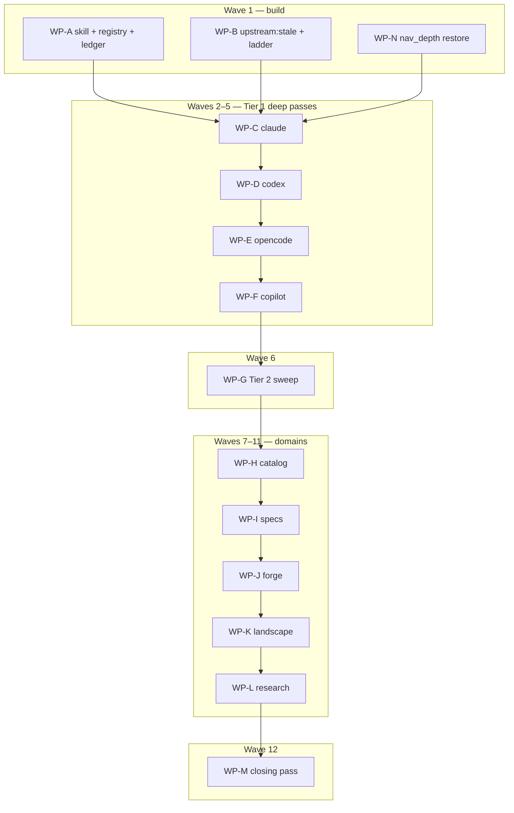

# Plan: Recurring harness-capability freshness loop

## Status

- **Plan:** plan_harness_capability_freshness
- **Active phase:** done — WP-J…WP-M deferred by owner directive (scope cut)
- **Step:** reviewed — hex-review round 1 Approve (Block/Warn fixed in ef3b9087, bec100b3, 62e9baa6)
- **Last update:** 2026-09-27 (initialized)
- State:   done
- Tier:    high
- Tier-grammar: 5
- Effective-tier: derived
- Updated: 2026-09-27
- Next:    (none — approved; /hex-finalize when landing)
- Reviewed: 62e9baa6
- Branch:  `hex/harness-capability-freshness` (every WP lands here; no pushes)

## Classification

- **Scope:** medium — 13 work packages. Build is small (one skill, one
  stdlib script, one task, one ledger); the passes are research-heavy and
  open-ended in what they land.
- **Reversibility:** two-way. The skill, the task and the ledgers are repo
  AI config. Any renderer change a pass lands is additive-only under
  Principle 9, and anything else goes to an issue draft (C-009).
- **Tier:** high (auto, confident): new skill, new task namespace, two areas
  (`.claude/`, `.agents/`), with conditional `src/install/` edits during the
  passes.
- **Overlays:** architect=inline (the discussion already ratified every
  design decision), research=1 (live-CLI sandbox feasibility), adversary=off
  (two-way door).
- **Artifacts:** this plan; research
  [`research_live_cli_sandbox_checks.md`](../research/research_live_cli_sandbox_checks.md)
  (new, this run) plus the five discussion artifacts named in the source.
  No ADR, because no boundary decision is made that the discussion did not
  already record.

## Objective

Build `/upstream-refresh`, `task upstream:stale` and the check ledger
`.agents/upstream-checks.md`. Then run the skill across every freshness
domain in the order the goal's § Emphasis sets. Refine the skill after every
pass, until every domain has been swept once, `task upstream:stale` reports
nothing past threshold, and a final pass needs no skill change. Source:
[`harness-capability-freshness.md`](../discussions/harness-capability-freshness.md);
definition of done: [`.agents/goals/harness-capability-freshness.md`](../goals/harness-capability-freshness.md).

## Decisions taken at planning (question → research → decision)

| # | Question | Research | Decision |
|---|---|---|---|
| D-1 | Can the live CLI check run without vendor credentials, and in what sandbox? (discussion open question 1) | `research_live_cli_sandbox_checks.md`: headless no-auth list commands exist for all four Tier 1 CLIs (`codex mcp list`, `copilot skill/instruction/mcp list`, `opencode agent/mcp list`, `claude mcp list`). Codex and Copilot were probed live. OpenCode is backed by docs only. Claude cannot list skills or rules from its CLI, and `claude mcp list` still dialled five remote connectors under a fresh `HOME`. | Adopt the recommendation, with one hardening step. The CLI runs under `env -i` with only `PATH`, a throwaway `HOME=$(mktemp -d)` nested one level below the scratch dir, and the vendor's config-root variable, so no inherited token (`ANTHROPIC_API_KEY`, `CLAUDE_CODE_OAUTH_TOKEN`, `GH_TOKEN`, `GITHUB_TOKEN`, `OPENAI_API_KEY`, …) reaches it. The CLI is installed into a sandbox npm prefix, never globally. If a check needs login, it is skipped and the reason recorded. The owner's credentials are never used. Claude's check covers MCP only and says so. |
| D-2 | Does a sweep commit straight to a branch, or open a PR per domain? (open question 2) | AGENTS.md Principle 6; goal § Autonomy grants no push or PR acts. | One branch per loop, with Conventional Commits and `--signoff`. The loop never pushes. The owner (here the meta-orchestrator) lands the work. |
| D-3 | The goal wants the skill refined after every run, but `hex-state.md` says "never edit skills or rules for friction — /hex-retro proposes". Which wins? | `hex-state.md` governs friction with harness skills and rules. The goal and the ratified discussion name refining *this* skill as a deliverable. | Friction with `upstream-refresh` is fixed in the same pass, as a separate `chore(skills)` commit, and logged in the discussion's `## Hand-off record`. Friction with any other skill or rule still goes to `.agents/retro/inbox/` only. |
| D-4 | Issues: the discussion routes compatibility, security and new-vendor findings to GitHub issues, but this loop holds no issue-creation grant. | Goal § Autonomy: "Granted acts: none"; § Issue resolution 6–7. | The skill files an issue with `gh issue create` only when the invoking session holds that grant. Otherwise it writes an **issue draft** (title, body, labels) into the pass's run artifact under `## Issue drafts`, and the loop's report lists every draft for the meta-orchestrator. Security findings are never drafted as issues. The run artifact records them by location and class only (goal § Issue resolution 7). |
| D-5 | How is the pre-existing `test_check_urls.py` failure resolved? | Commit 502d3f16 (a vendored sync) removed the local Starlight branch of `nav_depth.py`. Upstream `ocx-sh/grimoire-lore` never had it: the file has one commit, 3b544c08, and no Starlight PR or issue exists. CI runs the tests (`verify-basic.yml:172`, `verify-deep.yml:106` → `task test`). No task runs `nav_depth.py` against the live tree. The fix already exists as 5ec874d4 on `hex/harness-native-marketplaces`, which is not yet on `main`. | Cherry-pick 5ec874d4 (WP-N). This reuses a reviewed fix and turns the suite green. Its shebang hunks match what 60529b43 already applied, so they merge clean or empty. The durable fix is upstream: ask the meta-orchestrator for an issue or PR on `ocx-sh/grimoire-lore`, since that is an other-repo act. `.claude/rules.md` records the Starlight branch as a second local edit that must be re-applied after every sync. Skipping the tests with xfail was rejected: it hides a broken checker. |
| D-6 | Where do the undated env-var claims in AGENTS.md get dated? | The explorer found them undated (the `CLAUDE_CONFIG_DIR, …` vendor-override row). AGENTS.md has a 280-line budget and loads on every session. | They are dated in the watchlist, in a new `## Config roots and env vars` table (one dated row per vendor variable), which the first pass that dates one creates (WP-C). The AGENTS.md table keeps its prose and gains a single pointer to that table. Each fact lives in one ledger. |
| D-7 | What does the research domain do with the 31 of 47 artifacts that carry no `Expires:` line? None of the 16 that do carry one has expired yet. | The explorer: format is `**Expires:** YYYY-MM[-DD]` in the Metadata block. | The first sweep dates every undated artifact. Vendor, ecosystem or other fact research gets `**Expires:** <Date + 6 months>`. Research that only informed a decision that has since landed gets `**Expires:** n/a (historical — <ADR or plan>)`, which the stale report skips. If a computed date is already past, the artifact is re-verified or marked historical in the same pass. |
| D-8 | Does the stale report or the ladder need a machine-readable domain registry? | The explorer: no existing parser; three date formats (watchlist `verified`, research `Expires`, product-context `re-verify after`). | `upstream_stale.py` owns the list of scanned ledgers as a single `LEDGERS` constant. `references/domains.md` points at that constant instead of copying it. The depth ladder is computed by the script (`ladder` subcommand), not by model date arithmetic, so it is deterministic and tested. |
| D-9 | Where does a pass record its work? | The discussion's Verification section asks for a research artifact per iteration carrying quotes and the opus sign-off. | Each pass writes `.agents/research/research_upstream_<target>_<YYYYMMDD>.md` (C-011) with `**Expires:**` set 6 months out. |

## Contracts

### Skill (`.claude/skills/upstream-refresh/`)

- **C-001 — Skill file.** `SKILL.md` with frontmatter `name: upstream-refresh`,
  `user-invocable: true`, and `disable-model-invocation: false`. The loop's pass WPs
  invoke the skill through the Skill tool, and `finalize` was flipped to `False` for
  the same reason (`test_ai_config.py:1032-1036`). The intent-table entry carries
  the same kind of comment: an action skill left model-invocable on purpose, for
  autonomous loops. It has a quoted
  `argument-hint: "[<harness>] [--domain <domain>] [--force] [--focus \"<text>\"]"`,
  3–7 `triggers:` of two or more words each and unique across skills, and a single-line
  CSO-compliant `description` of at most 300 characters. Forbidden description verbs are listed in
  `test_skill_descriptions_are_cso_compliant`. The authored description budget is
  2337/4000 chars today. The body is at most 200 lines. The skill name is added to
  `_EXPECTED_DISABLE_MODEL_INVOCATION` in `.claude/tests/test_ai_config.py`
  as `False`, with that comment. No `license:` or `repository:` lines, because the skill is first-party.
  References to `scripts/upstream_stale.py` are code spans, never Markdown
  links. WP-A merges before WP-B, and `lint:links` (offline lychee) would
  flag a link to a file that does not exist yet.
- **C-002 — Invocation and target selection.** The grammar is
  `/upstream-refresh [<harness>] [--domain <domain>] [--force] [--focus "<text>"]`.
  - With no positional argument, it runs a normal sweep across all check-ledger
    rows, stale-first (the ladder's output order).
  - A positional argument must be a harness name. It forces a deep pass on that
    harness, whatever the ladder says.
  - `--domain <domain>` limits the targets to one domain: `vendors` is the 18
    harness rows, and any other domain is its one row. The ladder still applies.
  - `--force` turns a `noop` into a `sweep`.
  - `--focus` narrows the research to one surface ("hooks") and overrides the
    ladder for that focus. On its own it applies to every harness row. With a harness, it applies only to that harness.
  - An unknown harness or domain stops the run before any edit and lists the
    valid names. An unknown token is never taken as a focus, because focus is
    only given by flag.
- **C-003 — Depth ladder** (implemented by `upstream_stale.py ladder`, C-015).
  The inputs are the target's check-ledger row and today's date.
  `age = today − Last check`:
  - `age == 0` → `noop` (unless `--force` → `sweep`).
  - `age ∈ {1, 2}` → `feed`: read the change feed from the cursor forward and
    act on relevant entries only. If the cursor entry is absent from the
    fetched window (the feed was paginated past, rewritten or re-tagged), the
    target escalates to `sweep` and the event is recorded as friction.
  - `age ≥ 3` or never checked → `sweep`, upgraded to `deep` when the
    target is Tier 1 and `Last deep` is 30 or more days old or absent.
  - A harness named explicitly → `deep`, whatever its age.
- **C-004 — Domain registry** `references/domains.md`. There is one entry per domain.
  Each entry names its ledger file(s), code and doc sources, change feed, and
  what "stale" means for it:
  1. `vendors`: ledger `.claude/rules/vendor-capability-watchlist.md`,
     code `src/install/vendor_*.rs`, docs `clients.md`,
     `vendor-metadata.md`, `mcp-servers.md`, and the AGENTS.md env table
     (D-6). This domain's check rows are the per-harness rows. A harness
     sub-table gives, for every harness, its client name, tier, docs URL,
     change feed and config-root variable, plus the live-check command
     for Tier 1 (seeded from `research_harness_change_feeds.md` and
     `research_live_cli_sandbox_checks.md`).
  2. `catalog`: `catalog/skills/*/references/updating.md`. The check is
     confirm-only: each catalog `SKILL.md` `compatibility: grim>=X.Y` minor
     must equal the latest real release tag's minor. The `v99.0.0` trial tag is
     excluded. A skill with no `compatibility:` line (today
     `ai-config-authoring`) is skipped, and the artifact notes the skip. The catalog is never re-researched.
  3. `specs`: MCP spec claims (`mcp-servers.md`, `src/oci/mcp.rs`) and
     agentskills.io (the `agents` client target).
  4. `forge`: the ratings-forge rows (`ratings.md`,
     `src/catalog/rating_provider.rs`, the watchlist's ratings table).
  5. `landscape`: the `.claude/rules/product-context.md` comparable tools.
  6. `research`: `.agents/research/*.md` past `Expires:` (D-7).
  The registry states that the stale report's scanned files are `LEDGERS`
  in `scripts/upstream_stale.py` (D-8).
- **C-005 — Check ledger** `.agents/upstream-checks.md`. It holds a short header
  that points at the skill, then one table:
  `| Target | Kind | Tier | Last check | Depth | Feed cursor | Last deep | Notes |`.
  It has 18 `harness` rows, one per `ClientTarget::ALL` entry except `agents`
  (which belongs to `specs`), and 5 `domain` rows: `catalog`, `specs`, `forge`, `landscape`,
  `research`. Dates are `YYYY-MM-DD`, and a never-checked cell is `—`. `Depth` is one of
  `feed | sweep | deep`. `Tier` is `1 | 2 | —`. It is initialised with every date
  `—`. **Feed cursor** is the last-seen release tag, or the changelog
  heading or version, never a date or a position. When the feed is a GitHub repo, it is read
  through the paginated Releases API (`gh api --paginate
  repos/<o>/<r>/releases`), never the unpaginated `releases.atom`. A row's `Last check` advances only when that target's pass
  completed. A failed feed or a researcher that did not report leaves the
  row unchanged and notes why.
- **C-006 — Evidence per claim.** Every changed or newly dated ledger row
  carries `verified YYYY-MM-DD`, a primary-source URL, and the vendor version
  when one is known. An undated claim met in a domain gets dated in that
  pass.
- **C-007 — Researcher brief** `references/researcher-brief.md` is the sonnet
  prompt template, one researcher per target. Its output contract: a
  per-claim table (claim, ledger location, old value, new value, source URL,
  verbatim quote, vendor version). A claim with no primary source and quote
  is **dropped**, never guessed, and the drop is listed as friction.
- **C-008 — Verifier gate.** Before any claim that drives a renderer,
  metadata or validation change lands, an opus verifier re-fetches the
  source and signs off or refutes it in the run artifact
  (`## Verifier sign-off`: claim, verdict, evidence URL). A refuted claim does
  not land.
- **C-009 — Routing by risk.**
  - (a) Ledger dates, docs text and matrix rows are fixed directly.
  - (b) Additive renderer or metadata support lands with tests in one commit:
    renderer, docs page, parity test, and the watchlist row, under Principle 9.
    It must also prove self-heal: a test re-materializes an artifact
    installed before the change and asserts `status` reports it not-modified
    (`docs/src/content/docs/stability.md`, `adr_render_layout_stability.md`; the plan first cited `docs/src/stability.md`, which does not exist — corrected during WP-A). Once the change
    is in, `src/install/client_target.rs` parity tests must pass. AGENTS.md's
    catalog drift duty applies whenever a docs page changes.
  - (c) Anything touching compatibility or security becomes an issue (D-4),
    never code. This includes every config-path or install-layout move: a
    layout move needs a migration, a reaper and an upgrade fixture, which is
    beyond a sweep. Any new-vendor candidate and any class-3 request go the
    same way.
- **C-010 — Deep pass** `references/deep-pass.md`:
  - (i) A full surface inventory: artifact kinds, frontmatter keys, hooks, MCP options, config
    paths and env vars, diffed against the vendor's renderer and the
    watchlist, not only against stale rows.
  - (ii) A live CLI check per D-1. grim renders a fixture skill, rule, agent and MCP server
    into the sandbox (`GRIM_HOME` in the sandbox too), then runs the vendor's
    no-auth list command. The result goes in the run artifact as the command and a
    pass/fail/skip verdict with its reason. Raw CLI output is never pasted.
    - **Install:** `npm install --ignore-scripts --prefix <sandbox>`. A CLI that
      cannot run without its install scripts is `skip` with the reason. Install
      is the only step that needs registry network access.
    - **Environment:** the check run gets `DO_NOT_TRACK=1` plus the vendor's
      own telemetry opt-out variable, listed in `deep-pass.md` per harness.
    - **Network:** it is not denied at check time. Claude's `mcp list` dials its
      bundled connectors, and this is recorded as expected noise.
  - (iii) The PR [#98](https://github.com/grimoire-rs/grimoire/pull/98)
    (hooks artifact kind, unmerged) is out of scope for the renderer. A hooks
    gap found here is recorded as a finding, not implemented.
- **C-011 — Run artifact.** `.agents/research/research_upstream_<target>_<YYYYMMDD>.md`
  follows the research template, with `**Expires:**` set to today + 6 months. It has these sections:
  `## Claims` (C-007 table), `## Verifier sign-off` (C-008),
  `## Routing` (each claim → a/b/c with the commit or draft), `## Issue drafts`,
  `## Friction`, `## Skill changes` (or "none").
- **C-012 — Refinement.** Each pass ends with these steps:
  - Record friction in the run artifact.
  - Apply the fixes to `.claude/skills/upstream-refresh/**` as a separate `chore(skills):` commit (D-3).
  - Append one line to the discussion's `## Hand-off record`, created on
    first use: `- <date> · <target> · <depth> · skill: <change summary | no change> · artifact: <path>`.
- **C-013 — Commits.** Every commit uses Conventional Commits with `--signoff`, on the current
  branch, never on `main`, with no push. `chore:` covers ledger, research and skill
  commits. `feat:`, `fix:` and `docs:` cover user-visible renderer and docs changes. Run `cargo fmt`
  before any commit that touches `src/`.

### Staleness tooling

- **C-014 — `upstream_stale.py report`** (the default subcommand) is stdlib only, run with `python3`.
  - **Flags:**
    - `--root DIR`: default is the nearest ancestor of cwd holding both
      `taskfile.yml` and `AGENTS.md`. It works in a worktree, where `.git` is a file.
    - `--today YYYY-MM-DD`: default is today's **UTC** date. Both subcommands take both flags.
  - **Scans `LEDGERS`:**
    - (1) **Watchlist tables** are the tables whose header row starts
      `| Capability |` or `| Variable |` (C-018). Every other table, such as
      Compensation classes, is ignored.
      - A row's effective date is the newest inline `verified YYYY-MM-DD` in the row.
      - If the row has none, it takes the nearest preceding section default line in the
        same section, matched by ``All rows `verified (\d{4}-\d{2}-\d{2})(/\d{1,2})?` ``
        with any trailing text. A day range such as `2026-07-19/20` takes the later day.
        All five present forms are covered: `:85`, `:106` range, `:159`, `:183`, `:208`.
      - A row with neither an inline date nor a section default is reported `STALE` with date `—`.
      - Other dates in a row (event citations) are ignored.
      - A row is stale when its date is more than 183 days old.
    - (2) `src/install/vendor_*.rs` `//!` comment stamps: `(live-)?verified`
      followed by `YYYY-MM-DD` on the same `//!` line or the next one, never further.
      Stale when more than 183 days old.
    - (3) `re-verify after YYYY-MM-DD` anywhere in `product-context.md` and
      the watchlist. Stale when today is past that date.
    - (4) `.agents/research/*.md` `**Expires:** <value>`:
      - `YYYY-MM-DD`, or `YYYY-MM` read as the last day of that month, followed by
        any trailing text: expired when today is past it.
      - A value starting `n/a`: skipped.
      - Any other value: reported `EXPIRED` with date `?`.
      - A missing line: not reported, since D-7 dates those.
    - (5) `.agents/upstream-checks.md` rows whose `Last check` is `—`
      (reported `UNCHECKED`) or more than 183 days old (`STALE`).
  - **Output:** one line per finding,
    `<KIND> <path>:<line> <date|—|?> <N>d <≤80-char snippet>`.
    - `KIND` is `STALE | EXPIRED | UNCHECKED | MISSING`.
    - `<N>d` counts days past the threshold, or `-` when the date is `—` or `?`.
    - Sort order: MISSING, then UNCHECKED (in file order), then everything else by
      `N` descending, with ties broken by path then line.
  - **Summary line:** `upstream:stale: <a> stale, <b> expired, <c> unchecked,
    <d> missing`. The exact line `upstream:stale: nothing past threshold` is
    printed only when all four counts are zero.
  - **Rationale:** the 183-day threshold bounds how old a *check* may get. It
    does not detect a capability that ships and reverts between sweeps; that is
    the `feed` rung's job (C-003).
  - **Exit codes:** 0 whenever the scan completes, findings included, because the report is
    warn-only. 2 on a usage error: bad `--today`, or no repository root found.
- **C-015 — `upstream_stale.py ladder [--root DIR] [--today D] [--force] [--name TARGET]… [--domain D]`.**
  - It reads the check ledger and prints `<target> <noop|feed|sweep|deep>
    <reason>` per selected target, stale-first. Never-checked targets come
    first, then targets by `Last check` ascending. Ties keep ledger order.
  - With no selector, every row is selected. `--domain vendors` selects the 18
    `harness` rows, and any other domain selects its one `domain` row.
  - C-003 is implemented exactly. A `--name` naming a harness row gives `deep`,
    and one naming a domain row gives `sweep`, whatever the age.
  - Exit 2, with the valid names on stderr, for an unknown `--name` or
    `--domain`, a missing or unparseable ledger, or a bad `--today`.
- **C-016 — Task wiring.**
  - `taskfiles/upstream.taskfile.yml` defines `stale` (`desc:`,
    `python3 .claude/skills/upstream-refresh/scripts/upstream_stale.py report`).
    It is included from the root `taskfile.yml` as `upstream:`, without a `dir:` override.
  - The task is **not** referenced from `.verify:lint` or `.verify:build-test`.
  - `.claude/taskfile.yml` `claude:tests` also runs
    `test_upstream_stale.py`.
  - Rows are added to `subsystem-taskfiles.md` › File Layout and to AGENTS.md "Key workflows"
    (`task upstream:stale   # warn-only upstream staleness report`).
  - A `CONFIG_REMINDERS` row in `.claude/hooks/post_tool_use_tracker.py` for
    `.agents/upstream-checks.md` points at the skill.
- **C-017 — Discoverability.**
  - A `.claude/rules.md` "Skills by task topic" row
    ("Upstream freshness sweep | `upstream-refresh`").
  - Step 1 of the watchlist "Re-verify procedure" names `/upstream-refresh <harness>` as the
    way to re-verify.
  - The `.claude/rules.md` "Vendored rules" paragraph also lists the
    `nav_depth.py` Starlight branch as a local edit re-applied after sync
    (D-5).
- **C-018 — Env-var ledger (D-6).** The watchlist gains
  `## Config roots and env vars`, a table with the columns
  `| Variable | Vendor | grim behavior | Upstream status (verified date, URL, version) |`.
  It holds one row per vendor config-root or override variable that AGENTS.md
  names. The first harness pass creates it (WP-C) and each later pass adds
  its harness's rows. The stale report's watchlist scanner (C-014 (1))
  covers it through its `| Variable |` header. Existing env-var rows already
  in the Capability tables (for example `CURSOR_CONFIG_DIR`, `COPILOT_HOME`) stay
  where they are. No text in the AGENTS.md env table is removed. Its existing
  vendor-override row (the `CLAUDE_CONFIG_DIR, …` vendor-override row) gains a trailing
  clause, "upstream-verified dates: watchlist › Config roots and env vars".
  That adds no new line, because AGENTS.md is at 278/280 lines and WP-B's
  key-workflows line takes one of the two.

### Pre-existing failure

- **C-019 — nav_depth Starlight branch restored.** `nav_depth.py` has
  `find_generator` recognising `astro.config.*` and a `starlight_nav` walker.
  The fixture `fixtures/nav_depth/pass-nav-starlight/astro.config.mjs` is back.
  `test_starlight_nav_fixture_is_two_levels` and
  `test_find_generator_accepts_any_astro_config` pass, and `task verify` is green.

### Passes

- **C-020 — Pass acceptance** (every pass WP):
  - The target's check-ledger row is updated with date, depth and cursor. Every changed ledger row carries C-006 evidence.
  - The C-011 artifact exists, with an opus sign-off for every code-driving claim.
  - Every class (c) finding has an issue draft.
  - The C-012 refinement commit exists, or `## Skill changes: none`.
  - `task verify` is green, including both `client_target.rs` parity tests.
- **C-021 — Research domain** follows D-7. Afterwards every `.agents/research/*.md`
  carries an `**Expires:**` line, and `task upstream:stale` lists no `EXPIRED`.
- **C-022 — Catalog domain** follows C-004 item 2. A mismatch between a catalog
  `compatibility` floor and the latest release minor becomes an issue draft,
  because `catalog/**` is a publish surface (hex.md security paths). It is not
  edited in the pass.
- **C-023 — Closing pass.**
  - Run the normal sweep a second time on the same day as the last pass. It is
    a `noop` for every row, and the run says so.
  - `--force` on one domain row yields `sweep`, and that pass is run.
  - The feed rung is exercised. `ladder --today <last check + 1> --domain vendors`
    must print `codex feed …`. The row is selected without naming it, because
    naming a harness forces `deep`. The SKILL's feed-procedure section is then
    followed for `codex` alone, from its cursor, and the cursor either advances
    or is recorded as unchanged, with the reason. The skill has no date override,
    so this one step is run by following that section directly.
  - The error paths are exercised live: `/upstream-refresh nope` and
    `--domain nope` stop with no edit, and one focus run
    (`/upstream-refresh codex --focus hooks`) completes. `task upstream:stale` prints
  `nothing past threshold`. The pass needs no skill change. If it does need one, the
  change lands and C-023 repeats once. A second failure is a goal
  refinement-round event and is reported, not looped.

## User-experience scenarios

- **S-001 — First normal sweep.** `/upstream-refresh` with every row `—` → the ladder
  lists every target `sweep` or `deep` stale-first. Each target gets a
  researcher, the ledger rows are dated, and one run artifact is written per target.
  Error: a researcher does not report → it is retried once, then the row stays `—`
  with a note.
- **S-002 — Same-day re-run.** `/upstream-refresh` again the same day → it prints
  "every target checked today — no-op (use --force)" and edits nothing.
  `--force` → a sweep runs.
- **S-003 — Feed-only.** A run 1–2 days after a check → only the change feeds are read
  from the cursor. Relevant entries are acted on, the cursors advance, and depth is `feed`.
  Error: a feed is unreachable → the cursor is kept, the row notes it, and the run
  continues with the other targets.
- **S-004 — Deep pass.** `/upstream-refresh codex` → a full surface inventory and a live CLI
  check run in the sandbox. Error: the CLI needs login or will not install → the live
  check is `skip` with the reason, and the rest of the pass completes.
- **S-005 — One domain.** `/upstream-refresh --domain research` → only research
  artifacts are handled. Error: `--domain nope` → the run stops and lists the valid domains.
- **S-006 — Explicit focus.** `/upstream-refresh codex --focus hooks` → a deep pass on
  the hooks surface only, ignoring the ladder.
- **S-007 — Unsourced claim.** A researcher returns a claim without URL and quote → the claim is
  dropped, listed under Friction, and the ledger is not changed for it.
- **S-008 — Refuted claim.** The opus verifier refutes a code-driving claim → no code
  lands, and the artifact records the refutation.
- **S-009 — Breaking or security finding.** The finding needs a compatibility break, or
  it is security-relevant → an issue draft (or a location-and-class record for
  security) is written, and no code changes.
- **S-010 — Staleness report.** `task upstream:stale` → it prints STALE, EXPIRED and UNCHECKED
  lines and a summary, and exits 0. On a clean tree it prints
  `upstream:stale: nothing past threshold`. Error: `--today 2026-13-01` → exit 2.
- **S-011 — Unknown harness.** `/upstream-refresh nope` → it stops before any edit and
  lists the 18 harness names. It never treats `nope` as a focus.
- **S-012 — Renderer change.** Upstream shipped a capability → the renderer, docs, parity
  test and watchlist row land in one commit, and `task verify` is green.

## Error taxonomy

| Failure | Handling |
|---|---|
| Unknown target or domain | Stop before edits and list the valid names (C-002, C-015 exit 2) |
| Feed unreachable or moved | Keep the cursor, note it in `Notes`, record it as friction, and correct the feed URL in `domains.md` in the refinement commit |
| Researcher silent or guessing | Retry once. After that the row stays unchanged. Unsourced claims are dropped (C-007) |
| Verifier refutes | The claim does not land (C-008) |
| Parity test red after a renderer change | Revert that change in the WP and write an issue draft. Never weaken the test |
| Live CLI requires login or network credentials | `skip` with the reason (D-1) |
| Change would break compatibility or touches security | Issue draft, or a location-and-class record for security (D-4) |
| `task verify` red on something outside the pass | Handle it through goal § Issue resolution. It is in scope when it blocks done |

## Parallelization

### Work-package table

`Verify`: `scoped` runs the WP's own acceptance commands. `full` runs
`task verify`. Pass WPs share `.agents/upstream-checks.md`, the skill
directory, the discussion's hand-off record and the watchlist, and each
pass must run the skill as the previous pass refined it (goal § Emphasis).
So every pass is serialized by design, not by oversight.

| ID | Scope | Expected files | Size | Wave | Depends on | Review | Verify | Status |
|---|---|---|---|---|---|---|---|---|
| WP-A | C-001–C-013, C-017 | `.claude/skills/upstream-refresh/SKILL.md`, `.claude/skills/upstream-refresh/references/{domains,researcher-brief,deep-pass}.md`, `.agents/upstream-checks.md`, `.claude/rules.md`, `.claude/rules/vendor-capability-watchlist.md`, `.claude/tests/test_ai_config.py` | M | 1 | — | | scoped | merged |
| WP-B | C-014, C-015, C-016; S-010 | `.claude/skills/upstream-refresh/scripts/upstream_stale.py`, `.claude/tests/test_upstream_stale.py`, `.claude/taskfile.yml`, `taskfiles/upstream.taskfile.yml`, `taskfile.yml`, `.claude/rules/subsystem-taskfiles.md`, `AGENTS.md`, `.claude/hooks/post_tool_use_tracker.py` | M | 1 | — | | scoped | merged |
| WP-N | C-019 (D-5) | `.claude/rules/docs-quality/checks/nav_depth.py`, `.claude/rules/docs-quality/checks/fixtures/nav_depth/pass-nav-starlight/astro.config.mjs` | S | 1 | — | | full | merged |
| WP-C | C-020, C-010, C-018; S-001, S-004, S-007, S-008, S-012 — deep pass `claude` | shared pass set¹ + `src/install/vendor_claude.rs`, `docs/src/content/docs/{clients,vendor-metadata,mcp-servers}.md` (conditional), `AGENTS.md` | L | 2 | A, B, N | risk | full | merged |
| WP-D | C-020, C-010; S-004, S-009 — deep pass `codex` | shared pass set¹ + `src/install/vendor_codex.rs`, docs pages (conditional) | L | 3 | C | risk | full | merged |
| WP-E | C-020, C-010; S-004 — deep pass `opencode` | shared pass set¹ + `src/install/vendor_opencode.rs`, docs pages (conditional) | L | 4 | D | risk | full | merged |
| WP-F | C-020, C-010; S-004 — deep pass `copilot` | shared pass set¹ + `src/install/vendor_copilot.rs`, docs pages, `.claude/skills/{finalize,meta-maintain-config,next,qa-engineer,security-auditor}/SKILL.md` (conditional, seed 2) | L | 5 | E | risk | full | merged |
| WP-G | C-020; S-001, S-003 — normal sweep, 14 Tier 2 harnesses | shared pass set¹ + `src/install/vendor_{cursor,kiro,junie,gemini,zed,amp,antigravity,cline,droid,goose,warp,openclaw,kilo,qoder}.rs`, docs pages (conditional) | L | 6 | F | risk | full | merged |
| WP-H | C-020, C-022 — `catalog` domain | shared pass set¹ | S | 7 | G | | full | merged |
| WP-I | C-020 — `specs` domain (MCP, agentskills.io) | shared pass set¹ + `docs/src/content/docs/mcp-servers.md`, `src/oci/mcp.rs` (conditional) | M | 8 | H | risk | full | merged |
| WP-J | C-020 — `forge` domain | shared pass set¹ + `docs/src/content/docs/ratings.md`, `src/catalog/rating_provider.rs` (conditional) | M | 9 | I | | full | deferred |
| WP-K | C-020 — `landscape` domain | shared pass set¹ + `.claude/rules/product-context.md`, `.agents/research/research_promotion_positioning.md` (its Competitive landscape section and the `re-verify after` date) | S | 10 | J | | full | deferred |
| WP-L | C-020, C-021 (D-7) — `research` domain | shared pass set¹ + `.agents/research/*.md` (Expires lines) | M | 11 | K | | full | deferred |
| WP-M | C-023; S-002, S-003, S-005, S-006, S-011 — closing pass | shared pass set¹ | S | 12 | L | | full | deferred |

¹ **Shared pass set:** `.agents/upstream-checks.md`,
`.agents/research/research_upstream_<target>_<YYYYMMDD>.md` (new),
`.claude/skills/upstream-refresh/**` (refinement),
`.agents/discussions/harness-capability-freshness.md` (hand-off record),
`.claude/rules/vendor-capability-watchlist.md`, and `catalog/**`, only for
drift edits forced by a docs change.

**Security review (hex.md `perspectives.always`).** Any pass whose actual diff
touches `src/oci/**` or `catalog/**` adds a `reviewer:security` seat (opus)
to that WP's review, whatever its Review cell says. WP-I is the one planned
case (`src/oci/mcp.rs`). Catalog drift edits are the conditional case.

WP-N stays its own WP, isolated even though it is small: it resolves a
pre-existing failure the others must not absorb, and it has to be green
before any `full` gate can pass.

### Wave graph

**Critical path:** WP-A → C → D → E → F → G → H → I → J → K → L → M.

**Shippable after wave:** 1 — the skill, `task upstream:stale`, the ledger
and a green `task verify` stand alone. Every later wave adds dated evidence.

effective tier: high 13 (ceiling high). `hub` fires on every pass WP
through the shared pass set, and `door` fires on every `full` WP, including the S-sized
WP-N, WP-H, WP-K and WP-M. This is a gate-time snapshot.

### Merge plan (serialized, topological)

WP-N → WP-A → WP-B → WP-C → WP-D → WP-E → WP-F → WP-G → WP-H → WP-I →
WP-J → WP-K → WP-L → WP-M. WP-N merges first, so that `full` gates pass
from the first merge on. Wave 1's three WPs are file-disjoint and may run
in parallel worktrees.

## Executable phases

Commands run from the repository root. "Pass procedure" means
`/upstream-refresh` as it stands at that WP's start. Each pass WP's own
Stub, Specify, Implement and Review are defined through that procedure: the
research artifact is the specification, and the ledger and code edits are
the implementation.

### WP-A — skill, registry, check ledger

- **Stub.** Write `SKILL.md` frontmatter per C-001, with the section headings of the
  body: Modes, Depth ladder, Procedure, Routing, Evidence, Refinement, Commits.
  Create `references/domains.md`, `researcher-brief.md` and `deep-pass.md` with
  headings only. Write `.agents/upstream-checks.md` with the header and all 23 rows at `—`
  (C-005).
- **Specify.** Add `"upstream-refresh": False` to `_EXPECTED_DISABLE_MODEL_INVOCATION`,
  with the autonomous-loop comment (C-001). The existing structural tests are
  the spec: body ≤200 lines, CSO description, budget ≤4000, and triggers. No
  separate red step, because Stub already wrote the frontmatter.
- **Implement.**
  - Write the SKILL body per C-002–C-013, including the ladder table, D-1's
    sandbox recipe summary (details in `deep-pass.md`), D-3, D-4 and C-011's
    artifact skeleton.
  - `domains.md`: fill the six domains and the harness sub-table, taking feeds and
    docs URLs from `research_harness_change_feeds.md`, config-root variables from
    AGENTS.md, and live-check commands from `research_live_cli_sandbox_checks.md`.
    Seed findings are listed per target: Copilot `${VAR}` past v0.0.407 (discussion);
    Copilot rejecting five repo skills' YAML frontmatter (research).
  - `researcher-brief.md`: C-007.
  - `deep-pass.md`: C-010, with the per-harness sandbox commands.
  - Watchlist step 1 pointer and the `.claude/rules.md` rows (C-017).
- **Review.**
  - `task claude:verify` green, which covers structural tests and offline link lint.
  - `grep -c '^|' .agents/upstream-checks.md` = 25 (header, separator and 23 rows).
  - `grep -n 'upstream-refresh' .claude/rules.md` hits the skills row, and the watchlist "Re-verify
    procedure" step 1 contains `/upstream-refresh`.
  - `grep -n 'nav_depth' .claude/rules.md` hits the Vendored-rules paragraph.
  - Each `domains.md` feed URL resolves (HTTP 200/301). A GitHub feed is checked with
    `gh api repos/<o>/<r>/releases --jq '.[0].tag_name'`.

### WP-B — `upstream_stale.py`, `task upstream:stale`

- **Stub.** `upstream_stale.py` with `main(argv) -> int`, the subcommands `report` and
  `ladder`, and `LEDGERS` plus scanner functions raising `NotImplementedError`.
  Exit 2 on a bad `--today`.
- **Specify.** `.claude/tests/test_upstream_stale.py` (pytest, `tmp_path` repo
  trees, subprocess `python3 <script> … --root <tmp> --today 2026-09-27`):
  - Watchlist row: inline `verified 2026-03-01` gives `STALE … 27d`. The default-line-only
    row at `2026-07-17` gives no line. A row with two `verified` dates takes the newest.
    An event-citation date is ignored.
  - Each default-line form (plain, day range `2026-03-19/20` → the 20th, trailing
    text, trailing period) is honoured.
  - A `| Class |` table is ignored.
  - A `| Capability |` row with no date and no default gives `STALE … —`.
  - A `| Variable |` table row is scanned.
  - `vendor_x.rs` with `//! live-verified\n//! 2026-01-02` gives STALE, because the date is
    on the next line. A date two `//!` lines below gives nothing.
  - `re-verify after 2026-09-01` gives STALE, and `2027-01-26` gives none.
  - Research `**Expires:** 2026-08` gives EXPIRED, `2026-09-30` gives none, and `n/a (historical …)`
    and a missing line give none. `**Expires:** soon` gives `EXPIRED … ?`.
  - Check ledger `—` gives UNCHECKED, and a 200-day-old row gives STALE.
  - Clean tree gives `nothing past threshold` and exit 0. Findings present gives exit 0.
    `--today 2026-13-01` gives exit 2.
  - Missing watchlist gives `MISSING`, exit 0, and a summary that is not "nothing past threshold".
  - Sort order is MISSING, UNCHECKED, then by `N` descending.
  - The root is found from a subdirectory whose `.git` is a file.
  - `ladder` boundaries: age 0 → noop, `--force` → sweep, age 1 and 2 → feed, age 3 → sweep,
    Tier 1 with age 3 and `Last deep` 29 d → sweep, 30 d → deep. Tier 1 never checked → deep. Tier 2 or domain never checked → sweep.
    A named Tier 2 harness at age 0 → deep. A named domain row at age 0 → sweep.
    `--domain vendors` gives the harness rows only.
  - `--name nope`, `--domain nope`, a missing ledger and an unparseable ledger → exit 2.
  - A repeated `--name claude --name forge` selects exactly those two rows.
  - A stale cursor is not the script's job (C-003 escalation is a skill step).
  - Order: never-checked first, then oldest.
- **Implement.** Standard library only (`argparse`, `re`, `datetime`,
  `pathlib`). Wire in C-016.
- **Review.** `task claude:tests` green. `task upstream:stale` runs and exits 0.
  `task --list` shows `upstream:stale`. `grep -n upstream taskfile.yml` shows
  it is absent from `.verify:*`.

### WP-N — nav_depth Starlight restore

- **Stub, Specify.** No new code. The two failing tests in
  `test/tests/test_check_urls.py` are the spec; confirm both fail first.
- **Implement.** `/usr/bin/git cherry-pick -x 5ec874d4`. The hunks that match
  60529b43's shebangs resolve to the current content. Keep only the
  `nav_depth.py` and fixture changes if the cherry-pick comes out empty elsewhere.
- **Review.** `uv run --directory test pytest tests/test_check_urls.py -q` shows 29
  passed, and `task verify` is green (this becomes the loop's baseline).

### WP-C … WP-G — harness passes

- **Stub.** Run `upstream_stale.py ladder --name <harness>` (WP-G: the normal sweep,
  limited to the Tier 2 rows) and record the decided depth in the run artifact header.
- **Specify.** Spawn the sonnet researchers (one per harness, at most 4 concurrent) and
  write the C-011 `## Claims` table. For Tier 1, also do the C-010 inventory and
  the live CLI check.
- **Implement.** Route by C-009.
  - Code-driving claims go through the opus verifier (C-008) first.
  - Additive changes: renderer + docs + parity test + watchlist row in one commit.
  - WP-C creates the watchlist `## Config roots and env vars` table and adds the
    AGENTS.md pointer (D-6). Each later harness pass adds its own rows there.
  - WP-F seeds:
    - Re-verify `${VAR}` substitution against the current copilot-cli release.
    - Determine why `copilot skill list` rejects five first-party skills'
      frontmatter. Invalid YAML in our own `.claude/skills/*` gets a direct `chore` fix.
      A grim-side validation gap is an issue draft, because rejecting
      previously-accepted artifacts is a compatibility change.
- **Review.** Per C-020. For every renderer commit, run `reviewer:spec` (opus) on the diff
  against the claims. `task verify` is green. WP-C also checks C-018: the
  `## Config roots and env vars` table exists, and `task upstream:stale`
  flags none of its dated rows.

### WP-H … WP-L — domain passes

Same four steps with `--domain <d>`. WP-H follows C-022 and is confirm-only.
WP-L follows D-7 and C-021: every research artifact ends with `**Expires:**`,
and `task upstream:stale` shows 0 EXPIRED. WP-K updates `product-context.md`
comparable-tools rows under that file's own update protocol.

### WP-M — closing pass

- Run `/upstream-refresh` → every row `noop`, with the message recorded.
- `--force --domain landscape` → a `sweep` runs and completes with the
  row re-dated.
- `upstream_stale.py ladder --today <last check + 1> --domain vendors | grep '^codex '`
  → `feed`. Follow the SKILL's feed-procedure section for `codex` from its
  cursor (S-003). The cursor advances, or is recorded as unchanged with the reason.
- `/upstream-refresh nope` and `/upstream-refresh --domain nope` → both stop.
  A `git status --porcelain` snapshot taken before them matches one taken after
  (S-005, S-011).
- `/upstream-refresh codex --focus hooks` → completes (S-006).
- `task upstream:stale` → `nothing past threshold`.
- `## Skill changes: none` in the run artifact. If a change was
  needed, apply it and repeat once (C-023).
- `task verify` green.

## Test coverage map

| ID | Covered by |
|---|---|
| C-001, C-017 | `task claude:tests` (structural tests + `_EXPECTED_DISABLE_MODEL_INVOCATION`) |
| C-003, C-015 | `test_upstream_stale.py` ladder cases |
| C-014, S-010 | `test_upstream_stale.py` report cases |
| C-016 | WP-B review commands |
| C-019 | `test_check_urls.py` 2 tests |
| C-002, C-004–C-013, S-001–S-009, S-011, S-012 | exercised by the pass WPs and evidenced in each run artifact (C-020) |
| C-018 | WP-C review: the table exists and `task upstream:stale` parses its rows (no MISSING, dated rows not flagged) |
| C-020–C-023 | pass WP review gates |

## Constitution check

Principle 6 (never push) is covered by D-2 and C-013. Principle 9 (additive-only) is covered by C-009, where
a breaking change goes to an issue. Principle 2 (prove it works) is covered by the WP-B tests and the per-pass `task verify`.
Deviations: none.

## Plan review log

Round 1 ran on 2026-09-27 with two seats: `reviewer:spec` (opus) and `researcher` (sonnet).
The cross-model adversary was off (two-way door).

- **reviewer:spec** returned needs work: 4 High, 8 Warn, 4 Suggest, 0 deferred.
  Every finding was applied:
  - A1: `disable-model-invocation: false`.
  - A2: self-heal proof, and layout moves routed to (c).
  - A3: default-line forms and table scoping in C-014.
  - A4: security seat.
  - A5, A6: C-015 and C-014 pinned.
  - A7: C-023 feed rung and error paths.
  - A8: H, K and L set to `full`.
  - A9: the AGENTS.md pointer goes inside an existing row.
  - A10: code spans, not links.
  - A11: `--focus` flag grammar.
  - A12: grep checks.
  - A13: red-step claim dropped.
  - A14: same-or-next-line bound.
  - A15: skip with note.
  - A16: root marker, and MISSING counted.
  - The missing C-018 number was filled.
- **researcher** returned needs work: 3 High, 4 Warn, 1 Suggest.
  - Applied: paginated Releases API and tag cursors, with escalation when the
    cursor is not found (C-003, C-005); `--ignore-scripts`; the install-versus-check
    network asymmetry; telemetry opt-outs (C-010); the threshold rationale and
    UTC `--today` (C-014).
  - **Declined:** archive permalinks (Wayback or Perma.cc) for every cited
    source. The ledgers record the *current* upstream state, and C-008's
    verifier re-fetches the live source before any code lands. A source that
    changes or vanishes is exactly what the next pass should notice, not
    something to freeze. A Wayback save is also a write to a third-party service
    on every claim.
- Re-validation used one `reviewer:spec` pass (opus). It confirmed 15 of 16 fixes.
  - **A7 was wrong:** naming a harness forces `deep`, so WP-M now selects the
    `codex` row through `--domain vendors` and follows the feed-procedure
    section directly.
  - It also raised 3 new Warns and 5 Suggests, all applied: the ledger row
    count, the never-checked split by tier, WP-C's AGENTS.md cell made
    unconditional, AGENTS.md cited by row instead of by line number, the C-018
    check added to WP-C's review, two more ladder tests, WP-A's scenario cell
    trimmed, and the git-status snapshot comparison.

## Acts needed from the meta-orchestrator

- An issue or PR on `ocx-sh/grimoire-lore` adding the Starlight branch
  to `rules/docs-quality/checks/nav_depth.py`, so the next sync stops
  reverting WP-N (D-5).
- Every `## Issue drafts` entry the passes produce (D-4), reported per pass.

## Open questions

None. Both discussion open questions are resolved as D-1 and D-2.

## Schedule log

- 2026-09-27 · WP-N merged `83b0665e` (cherry-pick of 5ec874d4; `task verify` 1160 passed — the loop's green baseline).
- 2026-09-27 · WP-A merged `d7ebaa2e`, WP-B merged `afef7181` (parallel worktrees; L1 opus review: WP-A 1 Block + 1 Warn fixed, WP-B 2 Warn + 2 Suggest fixed; `task verify` green). Ready: WP-C.
- 2026-09-27 · WP-C merged `2ecdfc03` `37aa6612` `9346104d` (claude deep, cursor v2.1.283; renderer: claude.background, claude.omit-claude-md; verifier refuted `shell: 0`; reviewer:spec no Block; 2 issue drafts in research_upstream_claude_20260927.md; skill refined). Decision recorded there: a non-bool value on a newly registered key now fails render — accepted as the ADR's established additive registry path. Ready: WP-D.
- 2026-09-27 · WP-D merged `372e74d9` `efc6c7ec` `0a5d8296` (codex deep, cursor rust-v0.157.1; renderer: MCP timeout → startup_timeout_ms, reasoning-effort `persistent`; verifier 6 confirmed / 2 refuted (non-code-driving) / 3 partial; reviewer:spec Block fixed — dead self-heal assertion also in the WP-C test, both now assert state == installed; 3 issue drafts in research_upstream_codex_20260927.md; skill refined). Carry to WP-G: re-check Gemini MCP `timeout` semantics. Ready: WP-E.
- 2026-09-27 · WP-E merged `0575622f` `ddb8874b` `e5e01bf4` (opencode deep, cursor v1.18.32; no renderer change — docs + watchlist rows; verifier confirmed MCP keys + config layering, 2 partial; live check pass incl. commented .jsonc edit; 2 issue drafts in research_upstream_opencode_20260927.md; skill refined). Noted: sibling branch fix/opencode-global-jsonc may be redundant. Ready: WP-F.
- 2026-09-27 · WP-F merged `a08e84b4` `c76d25f2` `528dcb71` `bb0bf8f7` (copilot deep, cursor v1.0.88; seed 1: Copilot 1.0.88 expands `${VAR}` in global mcp-config.json → grim registers env-referencing servers (additive, self-heal via outputs_pending); seed 2: five first-party SKILL.md descriptions were invalid YAML → quoted + structural test, no grim-side gap; reviewer:spec no Block; 4 issue drafts in research_upstream_copilot_20260927.md; skill refined). Ready: WP-G.
- 2026-09-27 · WP-G merged `faf4ecb6` `4200c434` `845ea76f` `f9effcc1` `07bb5bda` (14 Tier 2 sweeps, 14 artifacts; 51 watchlist rows re-dated; renderer: shared_skills accepted for droid and kilo — verifier V26/V31 confirmed, reviewer:spec no Block/Warn; Gemini MCP timeout = ms, also bounds tool calls → docs + draft; 16 issue drafts; skill refined). Ready: WP-H.
- 2026-09-27 · WP-H merged `6e41a5c5` (catalog sweep, cursor v0.14.2, confirm-only; 1 issue draft in research_upstream_catalog_20260927.md; skill: no change). Ready: WP-I.
- 2026-09-27 · WP-I merged `9f483b27` `b71b6bca` `00c42a50` (specs sweep, cursor MCP 2026-07-28 / agentskills 69ef37e9424c; docs corrections: allowed-tools space-separated, compatibility 500-char cap, dead spec.modelcontextprotocol.io links, SSE "every client" claim; verifier 7/7 confirmed; reviewer:spec + reviewer:security no Block/Warn; 1 issue draft; skill refined).
- 2026-09-27 · **Owner directive: scope cut.** WP-J (forge), WP-K (landscape), WP-L (research) and WP-M (closing pass) are deferred — the skill runs them later; their check-ledger rows stay unchecked and `task upstream:stale` lists them as the intended backlog. Skill refined from owner feedback (superseded by `56912e96`: the default run fans out every non-noop Tier 1/Tier 2/domain target in parallel, one sonnet each; a deep pass runs only on a harness named at invocation). End-of-run L2 review not run (scope cut) — left to `/hex-review`.
