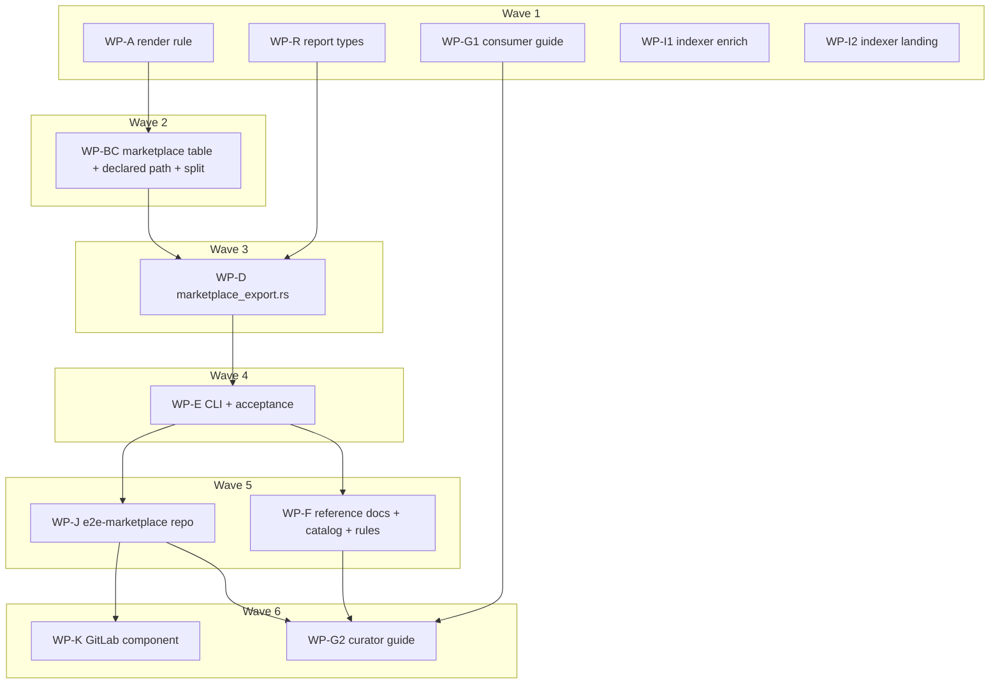

# Plan: Harness marketplace export (phase 2)

## Status

- **Plan:** plan_harness_marketplace_export
- **Active phase:** Phase V — review ⇄ execute loop (owned by /hex-review)
- **Step:** /hex-review Phase V — 2 review rounds run (cap reached), all actionable findings fixed; Windows rig + remote acts outstanding
- **Last update:** 2026-09-29 (Phase V review approved locally; grimoire tip 014ebcd7)
- State:   landing
- Tier:    xhigh
- Tier-grammar: 5
- Effective-tier: derived
- Updated: 2026-09-29
- Next:    Windows rig (`/mnt/c/Users/ecom/grim-wintest/run.sh /home/mherwig/dev/grimoire-duo`, incl. the 5 `windows_only` junction tests + S-021), then § Remote acts
- Reviewed: grimoire 014ebcd7 · indexer ab0d72e · components d210baa · e2e 9db11e6
- Repos:   <!-- frozen at execution start; bases are never re-resolved. Not a hex Federation (no Federation keys in hex.md): sibling worktrees live under grimoire-duo/.agents/worktrees/ -->
  - `grimoire`            /home/mherwig/dev/grimoire-duo       branch `hex/adr-harness-marketplace-export` base `9f2ed45b99707eabe4e667ee423af5493015f4e8`  landed: no
  - `grimoire-indexer`    /home/mherwig/dev/grimoire-indexer   trunk `main` base `98ba71a1dd55b5239d3d7bf68fd9e8c12ac1f96d` → `feat/marketplace-enrich-landing`  landed: no
  - `grimoire-components` /home/mherwig/dev/grimoire-components trunk `main` base `6fd8054116af7f67b49f00ad84f95ebbaee138b6` → `feat/marketplace-component`  landed: no
  - `e2e-marketplace`     .agents/worktrees/e2e-marketplace     fresh `git init`, branch `main`  landed: no

---

## Header

- **Goal contract (binding):** `.agents/goals/adr-harness-marketplace-export.md` — DoD D1–D11 + merge-ready PRs, CI green, deep verify; § Rules ("Pull qoder in", use-case docs for native integration without grim, one PR per project).
- **ADR (Accepted):** `.agents/adr/adr_harness_marketplace_export.md` — D1–D13, Round-1 amendments 1–33, **Round-2 amendments R2-1…R2-27 (binding, supersede conflicting text)**.
- **Design record:** `.agents/specs/design_harness_marketplace_export.md` (Accepted). It carries no IDs; the C-/S- IDs below are the traceability keys.
- **Phase-1 records:** `adr_harness_plugin_export.md`, `design_harness_plugin_export.md`, `plan_harness_plugin_export.md`.
- **Research (this run):** `research_qoder_plugin_marketplace.md`, `research_cursor_plugin_probe.md`, `research_marketplace_native_consumption.md`. **Earlier:** `research_marketplace_manifest_schemas.md`, `research_derived_version_compat.md`, `research_marketplace_ci_write_path.md`, `research_marketplace_multi_harness_root.md`, `research_marketplace_hosting_prior_art.md`, `research_marketplace_multi_version.md`, `research_marketplace_phase2_recon.md`, `research_incremental_pages_builds.md`, `research_url_marketplace_trust.md`.
- **Classification:** scope large · reversibility one-way (high) — new frozen CLI verb, frozen repo layout + marketplace file table, version-value move, four repos · tier xhigh (`architect=inline` — ADR/design pre-existed, amended by the orchestrator; `research=3`; `adversary=on`).
- **Run shape (team-lead directives, recorded):** inner loops minimal — one self-check per WP, **no per-WP review panels**; all review deferred to ONE bounded review ⇄ execute loop over the whole change set (Phase V). Every worker is **sonnet**; **opus** only for the final review panel, the security review, and escalation after a sonnet worker fails the same subtask twice.

## Objective

Ship `grim export marketplace`: from a curated `marketplace.toml` with a
`[marketplace]` table, statelessly regenerate a git repo that Claude Code,
Copilot, Codex and Qoder add natively (Cursor opt-in), with render-derived
plugin versions shared with `grim export plugin`; the maintenance job
(GitLab component + documented GitHub workflow); indexer probe-first enrich
and `/marketplace/` landing page; a public end-to-end showcase repo
`grimoire-rs/e2e-marketplace` driven by a dev grim from `dev.ocx.sh`; and
use-case docs for consuming the repo **without grim** (CLI, Claude Code on
the web, org rollout, customers).

### In scope

- grimoire: D7 version rule, Qoder family + `.qoder-plugin/plugin.json`, Cursor `.cursor-plugin/plugin.json`, `[marketplace]` table, `export marketplace`, report, containment, docs (reference + two guides), catalog drift, rules.
- grimoire-indexer: D10 enrich + landing page.
- grimoire-components: `templates/marketplace.yml` (D9 GitLab).
- grimoire-rs/e2e-marketplace (new): showcase + canonical GitHub workflow copy.

### Out of scope (ADR D13 + R2-23)

- `grimoire-index` config change and the curated `grimoire-rs/marketplace` seed (follow-up; needs a live curated marketplace).
- Release attestations (open question 3 → separate release-pipeline change, follow-up issue).
- Incremental skip, `--check`, `--plugin`, `renames`/`forceRemoveDeletedPlugins`, Droid/Junie/OpenClaw own files, Codex ≥0.157 smoke, live Cursor probe.
- The release itself, `CHANGELOG.md`, and the site `changelog.md` page (release-time, `/changelog` skill).

## Backwards compatibility (Principle 9 gate)

Additive-only; **no Constitution Deviations** (ADR D11 + R2 rows).

| Frozen surface | Change | Proof (test) |
|---|---|---|
| `grim export plugin` CLI | none (flags, defaults, exit table unchanged) | existing `test_export_plugin.py` flag/exit tests pass with **no expectation edits** except the version rows listed in C-003 |
| `grim export plugin --format json` shape | none; `version` may differ per client (meaning, D7) | `export_report.rs` key-order unit test unchanged (C-021) |
| `export plugin` version value | suffix input: member lines → rendered tree (grammar `<base>+<12 hex>` frozen, unchanged) | C-002 grammar test; `upgrading.md#plugin-version-move` |
| `export plugin --client qoder` | 78 → success (R2-15) | S-019; D11 row |
| `export plugin` with `[options].clients` naming qoder | warn-skip → `<plugin>.qoder` (new path, never overwrite) | S-019b; `upgrading.md` bullet |
| `export plugin --client cursor` tree | + `.cursor-plugin/plugin.json` (additive file; tree bytes Unstable, `stability.md:195-205`) | S-020 |
| `marketplace.toml` | optional `[marketplace]` (backward-, not forward-compatible, D4) | S-011: every phase-1 fixture manifest parses; `update --marketplace` unchanged |
| `marketplace.lock` | none | S-011 lock bytes identical before/after for a manifest without `[marketplace]`; adding `[marketplace]` never re-pins (C-007) |
| Exit codes / `ErrorReason` / `ExportError` variants | none new | C-021: exit-code and `ErrorReason` lists equal `main`'s; `error.rs:1253` table test unchanged |
| Published schema ids / doc URLs | none removed; new anchors and two guide URLs only | `task docs:check` (DOC-URL-03/06) |
| New frozen at 1.0 | `export marketplace` CLI + exit table; report shape + `action` literals; `[marketplace]` keys/grammars; client→file table + `./<client>/<plugin>`; default set `{claude, copilot, codex, qoder}`; ownership convention; document guarantees; version grammar | `stability.md` rows (WP-F) |

Migration: no layout move, no state, so no reaper and no upgrade fixture.
Release notes: `upgrading.md` sections for the version move (D7), Qoder
default-output change (R2-15), and "`[marketplace]` needs grim ≥ 0.15.0"
(D4 forward-incompatibility).

## TDD approach

Every WP runs **Specify → Implement → Self-check**, the stub step folded in
(signatures are fixed below, so a separate stub gate adds nothing):

1. **Specify** — write the tests named in the WP's contract rows from this
   plan, not from code. Run them; they must fail for the stated reason
   (missing symbol, wrong value). Record the red run in the WP report.
2. **Implement** — until the WP's tests and the existing suite pass.
3. **Self-check (the only inner review)** — `task rust:verify` (or the
   repo's gate) + targeted pytest, plus **one empirical mutation per
   contract**: apply a single-token mutation to real source, show a test
   fails, revert. Report the mutation and the failing test name.

A sonnet builder that fails the same subtask twice is re-spawned on opus
(recorded in the schedule log). Acceptance tests hit the local zot
registry (`test/conftest.py`), never ghcr.io.

## JSON interface

`grim export marketplace --format json` → sibling type
`MarketplaceExportReport` (`src/api/export_report.rs`); `ExportReport` is
untouched.

```json
{"items":[{"plugin":"team","client":"claude","family":"claude",
  "path":"/abs/repo/claude/team","version":"1.4.0+3f9a0c12b7de",
  "action":"unchanged","members":[{"kind":"skill","name":"plan","lock_name":"team-plan","pinned":"<host>/team-plan@sha256:<64 hex>"}],
  "omitted":[]}],
 "files":[{"client":"claude","path":"/abs/repo/.claude-plugin/marketplace.json",
  "action":"written","plugins":["team"]}]}
```

- `items[].action` ∈ `written | unchanged | removed | empty`; `files[].action` ∈ `written | unchanged | removed`. Literals frozen.
- Every key always present; no `skip_serializing_if` in `src/api/` (`subsystem-cli-api.md`).
- `removed` row: `family` from the client, `path` = the deleted tree path, `version` null, `members` `[]`, `omitted` `[]`. `empty` row: `path` = the would-be tree path, `version` null, `members` `[]`, `omitted` = every member with its reason. `removed` file row: `plugins` `[]`.
- Order: current plugins by name bytes, then client selection order; then `removed` rows by `(client, plugin)` bytes. Files: selection order, then removed by client name.
- One row per `(plugin, client)` (R2-13).
- Plain output: **one** table `Plugin | Client | Version | Action | Omitted`; each file action is one stderr line, e.g. `wrote .claude-plugin/marketplace.json (3 plugins)` (R2-19). Plain wording is Unstable (only JSON is frozen).
- Report emitted only on success (exit 0).
- `export plugin --format json`: shape unchanged; `client` may now be `qoder`.

## Exit codes

No new exit code, `ErrorReason` or `ExportError` variant
(`quality-rust-exit_codes.md`, `src/cli/exit_code.rs:17-56`).

| Failure (export marketplace) | Exit | Variant / reason |
|---|---|---|
| Unknown flag (`--client`, `--zip`, positional ref, …) | 64 | clap `Usage` |
| `[marketplace]` missing, bad name / reserved name / owner / email / description length, client outside table (served-by hint) | 65 | `Manifest` |
| Logo, `path:` member or `project` dir outside the manifest dir, or a symlink (R2-22) | 65 | `InvalidLogo` / `Manifest` |
| Plugin empty for every selected client | 65 | `EmptyPlugin` |
| Symlink / non-dir / reparse-point ancestor; case collision; reserved name in a rendered tree | 65 | `UnsafeEntry` |
| Foreign owned path (incl. renamed marketplace, R2-10) without `--force` | 65 `untracked-destination` | `OutputExists` |
| Manifest or output-root lock contended | 75 `locked` | lock error |
| Offline and a member absent from the store; resolver / registry / fs | as phase-1 D9 (69/74/77/78/79/80/81) | unchanged |
| `export plugin --client <no-family client>` (now: not qoder) | 78 | `NoPluginFormat` (unchanged) |

## Component contracts

### grimoire — render rule (release 0.15.0, D7 + R2-12/15/18)

- **C-001 Inventories** (`src/export/archive.rs`). `tree_inventory(root) -> io::Result<Vec<InventoryEntry>>`, `InventoryEntry { name: String, exec: bool, sha256: String /* 64 lowercase hex */ }`, sorted by `name` bytes, regular files only, names via `entry_name`; **strict**: symlink, special file, unsafe name → `Err`. `disk_inventory(root) -> io::Result<Option<Vec<InventoryEntry>>>`: **tolerant**; `None` ("differs") when `root` is missing, a symlink, not a directory, or contains a symlink, special file or unsafe name; never follows a symlink. `exec = mode & 0o111 != 0` on Unix, `false` on Windows. Edge: empty dir → `Some(vec![])`.
- **C-002 Version** (`src/export/family.rs`). `plugin_version(base: &str, inventory: &[InventoryEntry]) -> String` = `format!("{base}+{}", &hex(sha256(serde_json::to_vec(&[[name, exec, sha256], …])))[..12])` — compact JSON array of 3-tuples. Grammar `^<base>\+[0-9a-f]{12}$`. Golden vector: one fixed two-file inventory → a literal 12-hex suffix, asserted in the Rust unit test and in the pytest `_suffix` helper's self-test. Codex-B2 counterexample: tree `{a, b}` ≠ tree `{"a\n<sha of a>  b"}`. Same inventory → same version; any byte, name or exec change → different version.
- **C-003 Staging order** (`src/export/stage.rs`). Per `(plugin, client)`: render members → write every manifest with `version = base` → README → logo → (Cursor) second manifest → `tree_inventory` → `plugin_version` → rewrite **every** manifest with the final version → `check_tree` / zip. `PluginInput.version` becomes `version_base` (normalized, default `0.0.0`, `InvalidVersion` 65 still raised in `plugin_input`). `ExportItem.version` is per client. Both export commands call this one function (byte-equal trees, S-018). Pytest `_suffix` helpers in `test_export_plugin.py:171` and `test_export_update_flow.py:41` become a tree hash (read produced tree, substitute base into every manifest, Python `json.dumps(…, separators=(",", ":"), ensure_ascii=False)`); `test_s006` flips to "description edit changes the version, lock bytes unchanged"; s001/s002/s003/s005/s013/s019 re-derive expectations through the new `_suffix`.
- **C-004 README/ONRAMP golden** — a unit test pins `plugin_readme` bytes (with and without logo and omissions) and `ONRAMP`, so a wording change is deliberate.
- **C-005 Qoder** — `family_of(Qoder) = Some(Claude)`; `family::manifest_rel(client) -> &'static str` returns `.qoder-plugin/plugin.json` for Qoder, `.claude-plugin/plugin.json` for other Claude-family clients, `plugin.json` for Agent Plugins; manifest bytes = `claude_plugin_json`. `mcp_value` for Qoder builds the entry with the **Claude** vendor's `mcp_entry` and the same `PLUGIN_*` → `CLAUDE_PLUGIN_*` translation, so Qoder's `.mcp.json` equals Claude's byte for byte for the same member. Skills/agents render through `QoderVendor`. Rules omitted `no-format-surface`. `--client` help text lists qoder. `c015_family_map_is_total_over_every_client` updated.
- **C-006 Cursor second manifest** — every Cursor tree (both commands) carries `.cursor-plugin/plugin.json` = `claude_plugin_json(name, version, description)` bytes beside the unchanged root Agent Plugins `plugin.json`; both carry the same final version.
- **C-007 Logo read hardening (both commands)** — `read_logo` reads at most `MAX_LOGO_BYTES + 1` bytes (`take`), refusing over-cap 65 `InvalidLogo` by bytes read, not only `metadata().len()`. Accepted set unchanged. Not red-first testable through the filesystem (a regular over-cap file is already refused by `len()`): unit-test the bounded reader on an in-memory `Read`, plus the mutation check.

### grimoire — manifest + declared path (D4, R2-14, R2-22)

- **C-008 `[marketplace]` parse** (`src/export/marketplace.rs`). `RawManifest` gains `#[serde(default)] marketplace: Option<MarketplaceMeta>`; `MarketplaceMeta { name, owner: MarketplaceOwner { name, email: Option }, description: Option, clients: Vec<String> }`, both `deny_unknown_fields`. `MarketplaceManifest.marketplace: Option<MarketplaceMeta>` (ad-hoc literal at `stage.rs:216` = `None`). `declaration_hashes` never reads it (adding the table re-pins nothing). Top-level `name`/`owner`/`description` rejection message gains "use `[marketplace]`".
- **C-009 `[marketplace]` validation**, inside `marketplace::load` for **every** caller (`export plugin`, `export marketplace`, `update --marketplace`), all 65 `Manifest`: name `^[a-z0-9]([a-z0-9-]*[a-z0-9])?$`, ≤ 64; refused when it contains `anthropic`, `claude`, `official` or `qoder`, or equals one of `agent-skills knowledge-work-plugins inline builtin skills-dir synced github gh npm pip uv cargo`; `owner.name` non-empty; `owner.email` matches `^[^@\s]+@[^@\s]+\.[^@\s]+$`; `description` ≤ 500 UTF-16 units; each client ∈ `{claude, copilot, codex, qoder, cursor}`, deduplicated first-mention; `junie`/`openclaw`/`droid` get "`<c>` reads `.claude-plugin/marketplace.json`; select `claude`".
- **C-010 Shared declared path** — the `ExportMode::Declared` arm (`stage.rs:278-366`) is extracted into `resolve_declared(...) -> DeclaredPlan { inputs, lock_write, guard, … }` that holds the manifest `ConfigFileLock` until the lock is written; `NoneDeclared` and `--plugin` filtering stay in the `export plugin` caller only (R2-14). Pure extraction: the existing `stage.rs` and pytest suites pass **unchanged** (committed as its own `refactor:` commit before behaviour edits).
- **C-011 Stage/place split + layout** — `stage_plugins(req, access) -> Result<StagedRun { staging: TempDir, outputs, items }, ExportError>`; `export_plugins` = `stage_plugins` + `check_existing` + `place_all` (behaviour unchanged). `ExportRequest` gains a layout (`Flat` = phase-1 `<dir>/<plugin>.<client>[.zip]`, `Repo` = `<root>/<client>/<plugin>`) and `contain: Option<PathBuf>` (R2-22 root; `None` for `export plugin`). `aside_path` includes the client (R2-21). **Input containment (R2-22, `contain = Some(canonical manifest dir)`, `export marketplace` only):** every `project` dir, logo and `path:` member is joined to the manifest dir, lexically normalized, must stay under it, then `symlink_metadata` on every component from the manifest dir to the leaf — any symlink or escape → 65 (`InvalidLogo` for a logo, `Manifest` otherwise). Enforced where `plan_input` and member resolution read these paths (`stage.rs`, WP-BC unit tests); acceptance S-014 in WP-E. `render_members` returns a soft-empty outcome that `export plugin` maps to 65 `EmptyPlugin` and `export marketplace` to an `empty` row (R2-20).

### grimoire — `export marketplace` (D1–D6, D8, R2)

- **C-012 CLI** (`src/command/export.rs`). `ExportCommand::Marketplace(ExportMarketplaceArgs { marketplace: Option<PathBuf>, output: Option<PathBuf>, force: bool })`, `-o/--output`; default manifest `./marketplace.toml`, default output = manifest dir (`std::path::absolute`, canonicalized for the lock key). Rejected by clap (64): positional refs, `--name`, `--project`, `--plugin`, `--zip`, `--version`, `--description`, `--logo`, `--client`. Missing `[marketplace]` → 65 naming the table. `run` returns an `ExportOutput { Plugin(ExportReport), Marketplace(MarketplaceExportReport) }` implementing `Printable`, so `app.rs:134-138` keeps one arm. Global `--format`, `--offline`, `--progress` apply.
- **C-012a Input/output overlap** — the manifest, its lock, or the advisory sidecar lying under any table client's `./<c>/` or equal to a table marketplace file path → 65 `Manifest`, checked before any mutation.
- **C-013 Clients** — `clients = []` → 65 `Manifest` ("select at least one client or omit the key"). Selected = `[marketplace].clients` or `DEFAULT_CLIENTS = [claude, copilot, codex, qoder]` (frozen at 1.0, R2-11). `MARKETPLACE_CLIENTS` table = ADR D2 (5 rows). `tree_rel(client, plugin) = "<client>/<plugin>"`.
- **C-014 Ownership** (`src/export/marketplace_export.rs`). `file_ours(c)` = file absent, or parses as JSON with `.name == [marketplace].name`. Selected `c`: owns `./<c>/` and `file(c)`; refuse 65 `untracked-destination` (listing paths) unless `--force` when the file is present and not ours, or `./<c>/` is non-empty and the file is absent; a rename (file names another marketplace) says both names, "`--force` adopts", and "consumers must re-add the marketplace" (R2-10). Unselected table client whose file is **present** and `file_ours` → dropped: remove its file and `./<c>/`. Unselected client with no file (even with a non-empty `./<c>/`) or a foreign file → untouched (test: unselected `cursor/` with content and no file survives). Never touches `README.md`, `LICENSE`, CI files, `marketplace.toml`, the lock (except the phase-1 lock write), `.github/` itself.
- **C-015 Containment** — before any write: `symlink_metadata` on every component from the output root to every owned path (selected and table clients); symlink, non-directory, or on Windows a reparse point → 65 `UnsafeEntry`, nothing written. Pre-check covers: every component from the output root to `./<c>/`, each marketplace file's parent chain, and each existing `./<c>/<p>` tree root (a symlinked tree root is 65, not replaced; C-001's `None` for a symlinked root is defense-in-depth). Below a tree root, the tolerant `disk_inventory` decides: a symlink, special file or unsafe name inside ⇒ "differs" ⇒ replaced by `place`. A stray symlink directly under `./<c>/` is unlinked by removal. Output root: missing → created; exists and not a directory → 65 `UnsafeEntry`; may differ from the manifest dir (the documented job uses the default). Rendered trees: names colliding under `str::to_lowercase()` in one directory (ponytail: Unicode simple lowercase, no NFC/NTFS upcase table; covers ASCII and common cases), or Windows-reserved names (`CON PRN AUX NUL COM1-9 LPT1-9`, with or without extension; trailing dot/space; `: * ? " < > |`) → 65 `UnsafeEntry` (marketplace only). Removal unlinks a symlink at an owned path, never descends.
- **C-016 Locks, staging, order** — advisory lock on `<root>/.grim-export` (sidecar `.grim-export.lock`, removed on drop) held from before staging through the lock write; contention → 75. `.grim-export` and `.grim-export.lock` are in C-015's pre-check (a symlink or non-regular file there → 65 before the lock is taken; the lock helper follows links, `advisory_lock.rs:96,164`). A manifest whose file name starts with `.grim-export` → 65 (its data lock would be the advisory sidecar). Leftover `.grim-export-*` dirs are **never swept** — phase 1 keeps them as recovery backups after a failed swap (`stage.rs:785`) and a live `export plugin` may own one; each leftover gets one stderr warning naming it (the repo `.gitignore` covers them). Order: marketplace files (only when bytes differ, plain `store::atomic_write`) → trees (`disk_inventory` equal → `unchanged`, else `place` via layout-aware aside) → removals + pruning → lock (phase-1 rule `stage.rs:357-364`). An error before the first write writes nothing.
- **C-017 Removal + pruning** — under each selected `./<c>/`, every entry not in the render set is removed; after any removal, empty ancestors are pruned up to but excluding the output root, never `.github/` or `.agents/` (R2-8).
- **C-018 Empty cases** — plugin empty for `c`: absent from `file(c)`, stale `./<c>/<p>` removed, one `empty` row (`path` = the would-be tree path, `version` null, `members` `[]`, `omitted` = every member with reason), one stderr warning. Empty for every selected client → 65 `EmptyPlugin`. Zero declared plugins → every selected file written with `"plugins": []`, owned trees removed, `items: []`.
- **C-019 Marketplace document** — `{name, owner{name, email?}, metadata?{description}, plugins[]}` from fixed-order structs, `serde_json::to_vec_pretty` + `\n`; `owner.email` / `metadata` only when declared; entries in plugin-name byte order `{name, source: "./<client>/<plugin>", version, description}`; entry `name`, `version`, `description` byte-equal to that tree's manifest; no `$schema`, `metadata.pluginRoot`, object sources, `../`.
- **C-020 Idempotence + byte equality** — a second run with no upstream, manifest or grim change reports every item and file `unchanged` and mutates nothing (inventories and mtimes of owned paths identical; lock bytes identical). Every tree is byte-equal to `grim export plugin --client <c>` output for the same plugin.
- **C-021 Principle 9 proofs** — `ExportReport` JSON key order unchanged; exit-code / `ErrorReason` enumerations unchanged; message assertions added for each reused variant's new cases.
- **C-022 Shadow warnings** (R2-4) — one stderr warning each when `.factory-plugin/marketplace.json` exists, and when `.qoder-plugin/marketplace.json` exists un-owned with `qoder` unselected; exit unchanged.

- **C-034 Report types** (`src/api/export_report.rs`) — `MarketplaceExportReport { items: Vec<MarketplaceItem>, files: Vec<MarketplaceFileRow> }`, `ExportAction { Written, Unchanged, Removed, Empty }`, `FileAction { Written, Unchanged, Removed }` serialized lowercase; fields, key order, null rules, sort order and plain output exactly as § JSON interface; `Printable` impl with one `print_table`.

### Maintenance job (D9, R2-1/5/6/7/23)

- **C-023 Regenerate job (both forges)** — inputs `grim_version` (`^v\d+\.\d+\.\d+$`), `grim_sha256` (64 hex, x86_64 musl `.tar.gz`, verified with `sha256sum -c` against the literal), `manifest` (default `./marketplace.toml`), `mode` (`merge-request` | `push`), `branch` (default `grim/marketplace`), `token`, `max_file_bytes` (default 10485760), optional `registry`/`registry_user`/`registry_password` (empty skips login). Flow: install → `grim update --marketplace` + `grim export marketplace`, both `--format json` into the runner temp dir (`$RUNNER_TEMP`; on GitLab a `mktemp -d` outside the checkout — never the checkout) → policy gate → empty status ⇒ exit 0 → commit as the bot → deliver (fixed branch, `--force-with-lease`, one PR/MR rewritten in place). Concurrency group / `resource_group` `grim-marketplace`, no cancel. Triggers: daily schedule, push to default branch touching `marketplace.toml`, manual.
- **C-024 Policy gate** — `git add -A` is **not** run before it; parse `git status --porcelain=v1 -z --untracked-files=all --no-renames`. Allow-list, all derived from the run and made repo-relative (the manifest may sit in a subdir, e.g. the S-029 `tests/marketplace.toml`): the manifest's lock path, every `files[].path`, `<output root>/<client>/**` for every `files[].client`. Fail on: any other path; a symlink; `git check-attr filter` = `lfs`; a file over `max_file_bytes`. All before the commit. One POSIX `sh` script, `scripts/marketplace-gate.sh`; the GitLab template inlines the same logic, diff-checked against the e2e copy in WP-K's self-check.
- **C-025 Verification job** — R2-1 steps in the checkout (no copy, no `paths:` filter, `pull_request` only, login only for same-repo heads), then `claude plugin validate` (no `--strict`, ADR wording) on the marketplace root and each `claude/<plugin>`. `claude` is installed at an exact pinned version (`npm install -g @anthropic-ai/claude-code@<x.y.z>`, version literal in the workflow; WP-J confirms the install form runs headless without login). It additionally fails when any table client **not** in `files[].client` has a tracked marketplace file or a tracked `./<c>/` entry (closes the foreign/dropped-tree bypass: the verified repo is fully owned). Trust residual (R2-27): on `pull_request` the workflow file and the tool pins (`ocx.toml`/`ocx.lock`, or the release+sha256 literal) come from the PR head, so a PR can swap the verifier; mitigation is CODEOWNERS with required code-owner review on `.github/**`, `ocx.toml`, `ocx.lock` (shipped in the e2e repo, documented in the hosting guide), never `pull_request_target`. With the `GITHUB_TOKEN` fallback the regenerate job runs the same steps **after the bot commit, before the push** (the committed tree is clean, so the status check is meaningful) (R2-7).
- **C-026 GitHub workflow hygiene** — top-level `permissions: {contents: read}`; regenerate job `contents: write, pull-requests: write`; keepalive job only `actions: write` (`PUT …/actions/workflows/{id}/enable`); every `uses:` pinned by full SHA with a version comment; no `${{ }}` in `run:` (values through `env:`); token = `actions/create-github-app-token@<sha>` (`permission-contents: write`, `permission-pull-requests: write`, this repo only) when `APP_ID` is configured, else `github.token`; PR body built by `scripts/pr-body.sh` from the JSON reports — plugin names re-validated against the plugin-name grammar, pins matched `@sha256:[0-9a-f]{64}$`, capped at 60 000 chars — passed with `gh pr create|edit --body-file`.
- **C-027 GitLab component** (`grimoire-components/templates/marketplace.yml`) — `spec: inputs` per C-023 (+ `stage` default `deploy`, `image` default `alpine:3.22`, `dry_run` default `false`: stop after the gate, used by the self-test); installer copied from `templates/publish.yml:83-151` with the sidecar check replaced by the literal; MR mode `git push --force-with-lease -o merge_request.create -o merge_request.target=$CI_DEFAULT_BRANCH …`; push mode without `ci.skip`; verification job on `merge_request_event` (C-025 steps); README section with inputs table and token rules (Developer + `write_repository` for MR mode; Maintainer only for push mode; 365-day expiry).

### grimoire-indexer (D10, R2-2/24)

- **C-028 Checkpoint round-trip** — test: pack → seed restores every sidecar (`data.json` incl. a new `describedAt`, companions, logo) byte-equal; fix `checkpoint.ts` only if this test is red.
- **C-029 Probe-first enrich** — per package `grim fetch <ref> --digest-only`; digest equal to the seeded `contentDigest` and not in the slice ⇒ carry `data.json` forward verbatim (no `describe`, no fetch); else today's path, `describedAt = now` (RFC 3339 UTC, seconds). Companion `--description --digest-only` probe runs every run; a moved companion digest takes the full describe path. Slice = ⌈N/7⌉ packages with oldest `describedAt` (missing first, ties by name). Bounded pool `--concurrency <n>` (default 8, ≥1); one package's failure never aborts others. `compileIndex` strips `describedAt` (`src/data/index.ts:146`) so `all.json` is unchanged.
- **C-030 Landing page** — config `marketplace: {url, name, clients?} | null` (default `null`): `url` https-only, no userinfo; `name` matches C-009's grammar; `clients` ⊆ `{claude, copilot, codex, qoder, cursor}`, default the first four. Route `/marketplace/` exists iff set (empty `getStaticPaths` otherwise) and is in the sitemap. URL shown as `owner/repo` iff host is exactly `github.com` and path has exactly two non-empty segments, else the full URL; text interpolation only, never `set:html`. One row per listed client with its add command (Claude `/plugin marketplace add`, Copilot `copilot plugin marketplace add`, Codex `codex plugin marketplace add`, Qoder `qoder plugins marketplace add`, Cursor: Team Marketplace dashboard import) and the `<plugin>@<name>` install form, each row date-stamped `verified 2026-09-29`.

### Showcase + docs

- **C-031 e2e-marketplace repo** — `marketplace.toml` (`[marketplace] name = "grimoire-e2e"`, owner, description; plugins `grim-essentials` from `ghcr.io/grimoire-rs/grim-essentials` and `hex` from the arcana registry), `marketplace.lock`, generated files + trees for the default set, `.gitignore` (`.grim-export*`), `ocx.toml` + `ocx.lock` pinning `grim = "dev.ocx.sh/grimoire/cli:<tag>"`, workflows `marketplace.yml` (regenerate + keepalive), `verify.yml` (C-025), `gate-selftest.yml` (runs `marketplace-gate.sh` against crafted repos: out-of-list path, LFS path, oversize file, symlink → each fails), `scripts/{marketplace-gate.sh,pr-body.sh}`, README (purpose, layout table, "add it in your harness" per harness, "pinning a dev build", "the one step that differs from the documented workflow": install via `ocx-sh/setup-ocx` project mode instead of the release+sha256 step). Runs with no secrets (App token optional).
- **C-032 Docs** (`docs/src/content/docs/`) — `commands.md` `## grim export marketplace {#export-marketplace}` (flags, output layout, ownership, JSON `{#export-marketplace-json}`, exit codes `{#export-marketplace-exit}`), export-plugin version paragraph (`:1855-1866`), families + admission tables (`:1745-1783`: Qoder, Cursor second manifest), lifecycle row for `grim export`; `configuration.md#marketplace-toml` `[marketplace]` + "requires grim ≥ 0.15.0"; `json-interface.md` enveloped list + item row; `stability.md` frozen rows + Unstable bullet; `upgrading.md` `{#plugin-version-move}`, `{#qoder-plugin-export}`, `{#marketplace-table-needs-new-grim}`; `stability.md:33` wording (frozen = version grammar only; hash input not frozen, D7). `guides/team-plugin.md` (`:70-77`, `:121-134`) is WP-G2's. New how-to pages, both `doc_type: how-to`, `doc_tier: integration`, in the "Teams and automation" sidebar group after `guides/team-plugin`: `guides/use-a-marketplace.md` ("Use a plugin marketplace without grim": individual dev per harness; repo-pinned team config incl. **Claude Code on the web** — repo config ignored, server-managed settings or committed `.claude/` are the routes; org-managed rollout incl. claude.ai/Cowork org sync; customers of a public repo; pinning and update cheat-sheet; troubleshooting) and `guides/hosting-a-marketplace.md` (curator: layout, `[marketplace]`, ownership, both workflows verbatim, tokens + R2-7, repo prerequisites, `.gitignore`, sparse clone, shadowing files, merge = publish, rename advice, `.gitattributes` `* -text` for Windows autocrlf curators, consumer effect of plugin removal (Claude keeps the installed copy; `forceRemoveDeletedPlugins` is consumer-side), the curator two-step (a toml-only PR fails verification until the bot PR lands), push mode for trusted private registries only, Junie/OpenClaw/Droid served best-effort by the Claude file). `.agents/discovery/use-cases.yaml` rows T33/T34 + inventory entries.
- **C-033 Catalog + rules** — `catalog/skills/grim-usage/SKILL.md:75` row + `references/publish.md` export section (links `commands.html#export-marketplace`, the two guide URLs); `.claude/rules/subsystem-cli-commands.md` command row; `vendor-capability-watchlist.md` Qoder plugin/marketplace row and Cursor plugin row (dated 2026-09-29, sources = the two research artifacts) and correction of the stale Qoder MCP env-ref row.

## User-experience scenarios

Each: action → outcome → errors. Acceptance tests in `test/tests/test_export_marketplace.py` unless named otherwise.

- **S-001 First export into an empty repo** — `grim export marketplace` with `[marketplace]` + 2 plugins → four files at their D2 paths, `./<c>/<p>` trees, lock; JSON items `written`, files `written`; `source` values `./<c>/<p>`, no `../`.
- **S-002 Quiet re-run** → every item and file `unchanged`; no owned path's bytes or mtime change (C-020).
- **S-003 Member bump** — move one member's tag, `grim update --marketplace`, export → only that plugin's trees `written`, its versions change, others `unchanged`.
- **S-004 Description edit** → that plugin's versions change for every client, lock bytes unchanged; same in `export plugin` (flipped `test_s006`).
- **S-005 Plugin dropped** → its trees `removed` (`version` null), absent from every file.
- **S-006 Client dropped** (`clients` without copilot) → `.github/plugin/marketplace.json` and `copilot/` removed, file row `removed`; `.github/` (holding another file) survives; an otherwise-empty `.github/` survives too.
- **S-007 Hand-edited tree** (edit a byte, add a stray file, chmod +x a file) → `written`, stray removed.
- **S-008 Foreign `./claude/`, no file** → 65 `untracked-destination`, nothing written; `--force` adopts → exit 0.
- **S-009 Renamed marketplace** → 65 naming old and new names; `--force` adopts.
- **S-010 Bad `[marketplace]`** (missing for export marketplace; bad name, reserved name, `qoder` substring, bad email, `clients = ["junie"]` with the served-by hint) → 65 from `export marketplace`, `export plugin` and `update --marketplace` alike.
- **S-011 Phase-1 manifest, no table** → `export plugin` and `update --marketplace` outputs and lock bytes identical to today's.
- **S-012 Symlinked `claude/`, `.github/plugin/`, tree root** (unix) and a junction (Windows rig) → 65 `UnsafeEntry`, nothing written.
- **S-013 Case-colliding or reserved name in a rendered tree** → 65 `UnsafeEntry` (unit test on the checker + one acceptance case with a skill file named `aux.md` or `A.md`/`a.md`).
- **S-014 Escaping inputs** — logo `../x.png`, a symlinked logo, a `path:` member or `project` dir outside the manifest dir → 65.
- **S-015 Empty for one client** — a plugin holding only an agent → `empty` rows for copilot/codex (agents omitted in Agent Plugins), trees for claude/qoder; a rules-only plugin → 65 `EmptyPlugin`.
- **S-016 Zero plugins** → files with `"plugins": []`, prior trees removed, `items: []`, no lock created.
- **S-017 Concurrent runs on one root** (held flock on `.grim-export.lock`, pattern `_held_flock`) → 75.
- **S-018 Byte equality** — for each default client, `./<c>/<p>` equals `grim export plugin --client <c>` output dir.
- **S-019 Qoder export** — `export plugin --client qoder` → `.qoder-plugin/plugin.json`, `skills/`, `agents/`, `.mcp.json` equal to the Claude tree's `.mcp.json`; **S-019b** `[options].clients = ["qoder"]` without `--client` → `<p>.qoder` (not `<p>.agents`) (`test_export_plugin.py`).
- **S-020 Cursor export** — `export plugin --client cursor` → root `plugin.json` + `.cursor-plugin/plugin.json` (three keys), equal versions (`test_export_plugin.py`); `clients = [..., "cursor"]` → `.cursor-plugin/marketplace.json` + `cursor/<p>`.
- **S-021 Version invariants** — codex-B2 counterexample (unit); README golden (unit); `exec` = the staged file's mode as rendered (HEAD packs skill scripts `0644`, `skill_package.rs:443`, and extraction does not restore modes, so staged trees carry no exec bits today; no source-mode carrying is in scope); Linux and Windows produce equal versions for the same fixture (Windows rig run, Phase V).
- **S-022 Shadowing warning** — a pre-existing `.factory-plugin/marketplace.json` → stderr warning, exit 0.
- **S-023 Policy gate** (e2e `gate-selftest.yml` + local run) — out-of-list path, LFS path, oversize file, symlink → gate exits non-zero before commit; allowed set → exit 0.
- **S-024 Verification job** — bot output unchanged → pass; hand-edited tree / stray file / toml-only curator change → fail (e2e repo, run locally with `act`-free shell reproduction of the job steps, then in CI).
- **S-025 Native consumption without grim** (local harness smoke, throwaway config dirs) — `CLAUDE_CONFIG_DIR=$tmp claude plugin marketplace add <e2e dir>` + `claude plugin install grim-essentials@grimoire-e2e` succeed; `claude plugin validate` passes; Copilot CLI (`COPILOT_HOME=$tmp copilot plugin marketplace add …`) and Codex (`CODEX_HOME=$tmp codex plugin marketplace add …`) list the plugin; Qoder not installed → rests on the research probe, stated in the README.
- **S-026 Indexer enrich** — unchanged index: only probes + slice describes (fake-grim call log); moved digest → describe + fetch; moved companion → describe; pool never exceeds `--concurrency`; one failing package leaves the rest enriched; `all.json` has no `describedAt`.
- **S-027 Landing page** — configured → `/marketplace/` with one row per listed client, in sitemap; unconfigured → no route; `github.com/o/r` → `o/r`; GitLab URL → full URL escaped; `http:` URL or userinfo → config error; cursor row only when listed.
- **S-028 Feedback loop** (remote, meta-orchestrator) — dev grim on `dev.ocx.sh/grimoire/cli:0.15.0-dev_<ts>` pinned in e2e → dispatched regenerate run is a no-op (idempotence across machines); a curator push adding a plugin → one bot PR → verification check green → PR ready.
- **S-029 GitLab component self-test** — `.gitlab-ci.yml` includes the component at `$CI_COMMIT_SHA` with `dry_run: true` and `tests/marketplace.toml` → installs the pinned grim by literal digest, runs update + export + gate, stops before push (green once grim 0.15.0 is released).

- **S-030 Offline with an absent member** — `--offline` and a locked member missing from the store → phase-1 offline exit, nothing written.

## Parallelization

Cut by structural boundary: `src/export/{archive,family}.rs` + the render
half of `stage.rs` (WP-A) → the declared path and manifest (WP-BC) → the new
orchestration module (WP-D) → the CLI surface (WP-E). `stage.rs` is the hot
spot (WP-A, WP-BC), so those two are sequential by design; `marketplace.rs`
could not join wave 1 because its new field breaks the ad-hoc literal at
`stage.rs:216` that WP-A owns. Sibling-repo WPs and docs run beside them.

Model column: **every WP is sonnet** (directive 2); escalation to opus after
two failures of the same subtask. Review column: `risk` marks WPs whose
security-adjacent surface the final panel must read first. Per-WP review is
the self-check only (directive 1).

| WP | Repo | Scope (IDs) | Expected files | Size | Wave | Depends on | Review | Verify | Model | Status |
|---|---|---|---|---|---|---|---|---|---|---|
| WP-A | grimoire | Render rule for 0.15.0: C-001–C-007; S-004 (export plugin), S-019, S-019b, S-020, S-021 (unit) | `src/export/archive.rs`, `src/export/family.rs`, `src/export/stage.rs`, `src/command/export.rs` (help text only), `test/tests/test_export_plugin.py`, `test/tests/test_export_update_flow.py` | L | 1 | — | risk | full | sonnet | merged |
| WP-R | grimoire | Report types: C-034; key-order, null-rule and action-literal unit tests | `src/api/export_report.rs`, `src/api.rs` | M | 1 | — | | scoped | sonnet | merged |
| WP-G1 | grimoire | Consumer guide (C-032 `guides/use-a-marketplace.md`), use-case row T34 | `docs/src/content/docs/guides/use-a-marketplace.md`, `docs/astro.config.mjs`, `.agents/discovery/use-cases.yaml` | M | 1 | — | | scoped | sonnet | merged |
| WP-I1 | grimoire-indexer | C-028, C-029; S-026 | `src/enrich/index.ts`, `src/enrich/checkpoint.ts` (only if C-028 is red), `src/cli/enrich.ts`, `src/cli/main.ts`, `src/data/index.ts`, `test/enrich/enrich.test.ts`, `test/enrich/checkpoint.test.ts`, `test/data/index.test.ts`, `docs/reference/cli.md`, `docs/reference/output-layout.md` | M | 1 | — | | scoped | sonnet | merged |
| WP-I2 | grimoire-indexer | C-030; S-027 | `src/config.ts`, `src/renderer/astro/pages/marketplace/[...slug].astro` (new), `src/renderer/astro/lib/marketplace.ts` (new), `src/renderer/index.ts` (sitemap), `test/renderer/config.test.ts`, `test/renderer/build.test.ts`, `test/renderer/marketplace.test.ts` (new), `docs/reference/config-schema.md` | M | 1 | — | risk | scoped | sonnet | merged |
| WP-BC | grimoire | C-008, C-009, C-010, C-011 (incl. R2-22 input containment); unit tests only | `src/export/marketplace.rs`, `src/export/resolve.rs` (test literal), `src/export/stage.rs` | L | 2 | WP-A | risk | full | sonnet | merged |
| WP-D | grimoire | C-012a, C-013–C-020, C-022 (module + unit tests); S-013 (unit) | `src/export/marketplace_export.rs` (new), `src/export.rs`, `src/export/archive.rs` (case-fold + reserved-name checker) | L | 3 | WP-BC, WP-R | risk | scoped | sonnet | merged |
| WP-E | grimoire | C-012, C-021; S-001–S-018, S-022, S-030 (acceptance; S-010's three-command 65 rows and S-011 live here) | `src/command/export.rs`, `src/app.rs` (only if `ExportOutput` cannot keep one arm), `test/tests/test_export_marketplace.py` (new) | L | 4 | WP-D | risk | full | sonnet | merged |
| WP-F | grimoire | C-032 reference docs + `upgrading.md`, C-033 catalog + rules; Principle 9 rows | `docs/src/content/docs/{commands,configuration,json-interface,stability,upgrading}.md`, `catalog/skills/grim-usage/SKILL.md`, `catalog/skills/grim-usage/references/publish.md`, `.claude/rules/subsystem-cli-commands.md`, `.claude/rules/vendor-capability-watchlist.md` | M | 5 | WP-E | | full | sonnet | merged |
| WP-J | e2e-marketplace | C-023–C-026, C-031; S-023, S-024, S-025 (local) | new repo at `.agents/worktrees/e2e-marketplace/`: `marketplace.toml`, `marketplace.lock`, `.claude-plugin/`, `.github/plugin/`, `.agents/plugins/`, `.qoder-plugin/`, `claude/`, `copilot/`, `codex/`, `qoder/`, `.github/workflows/{marketplace,verify,gate-selftest}.yml`, `scripts/{marketplace-gate.sh,pr-body.sh}`, `ocx.toml`, `.github/CODEOWNERS`, `.gitignore`, `README.md`, `LICENSE` | L | 5 | WP-E | risk | scoped | sonnet | merged |
| WP-G2 | grimoire | Curator guide `guides/hosting-a-marketplace.md` (embeds WP-J's workflows verbatim), cross-links from `use-a-marketplace.md`, `team-plugin.md` link, sidebar, use-case row T33 | `docs/src/content/docs/guides/hosting-a-marketplace.md` (new), `docs/src/content/docs/guides/use-a-marketplace.md`, `docs/src/content/docs/guides/team-plugin.md` (`:70-77`, `:121-134`), `docs/astro.config.mjs`, `.agents/discovery/use-cases.yaml` | M | 6 | WP-F, WP-J, WP-G1 | | full | sonnet | merged |
| WP-K | grimoire-components | C-027; S-029 | `templates/marketplace.yml` (new), `.gitlab-ci.yml`, `tests/marketplace.toml` (new), `scripts/marketplace-gate.sh` inlined or `README.md` section | M | 6 | WP-J | risk | scoped | sonnet | merged |

`Verify: full` justifications — WP-A: moves every export version value and
qoder's default output (full acceptance proves the rest unchanged); WP-BC:
extracts the shared declared path both export commands and `update
--marketplace` rely on; WP-E: assembly of every seam; WP-F: touches
`catalog/**` and rules (`task catalog:verify`, `task claude:tests`); WP-G2:
final grimoire merge — `task verify` plus `task docs:check` (Node 24).
Sibling repos: WP-I1/I2 gate = `task check` in the indexer; WP-K gate =
local shell run of the template script against the local grim build (CI
green only after release); WP-J gate = S-023/S-024/S-025 locally.

Shared files (`hub`): `src/export/stage.rs` (WP-A → WP-BC), `src/export/archive.rs`
(WP-A → WP-D), `src/command/export.rs` (WP-A → WP-E),
`docs/astro.config.mjs`, `use-a-marketplace.md` and `use-cases.yaml`
(WP-G1 → WP-G2). Every shared file is touched in different waves; no two
WPs in one wave share a `(Repo, path)` pair.



- **Critical path:** WP-A → WP-BC → WP-D → WP-E → WP-J → WP-G2 → Phase V.
- **Shippable after wave:** 4 — `grim export marketplace` complete and acceptance-tested; waves 5–6 add docs, the showcase and the GitLab component.
- **Effective tier:** `effective tier: high 4 · xhigh 8 (ceiling xhigh)` (plan-time snapshot; WP-R, WP-G1, WP-I1, WP-I2 at high; the rest reach the ceiling through `L`, `door` or `sec`).
- **Merge plan (serialized, topological):** WP-A → WP-R → WP-G1 → WP-BC → WP-D → WP-E → WP-F → WP-G2 (grimoire branch `hex/adr-harness-marketplace-export`); WP-I1 → WP-I2 (indexer branch `feat/marketplace-enrich-landing`); WP-J (e2e `main`, local); WP-K (components branch `feat/marketplace-component`). Grimoire merges gate on the WP's Verify budget; a checkpoint commit follows every green merge.
- **Worktrees:** the integration branch `hex/adr-harness-marketplace-export` stays checked out in `grimoire-duo`; each grimoire WP gets its own branch `hex/mkt/<wp>` (cut from the integration tip at wave start) in `.agents/worktrees/mkt-<wp>`, merged back in merge-plan order, then worktree and branch removed. Indexer: integration branch `feat/marketplace-enrich-landing` from `origin/main` in `.agents/worktrees/indexer-mkt`, with WP-I1/WP-I2 on `feat/mkt-i1`/`feat/mkt-i2` worktrees merged into it; components likewise at `.agents/worktrees/components-mkt`; e2e is a fresh `git init` at `.agents/worktrees/e2e-marketplace` (removed after the meta-orchestrator pushes it). Each grimoire worktree needs `git submodule update --init --recursive`.

## Executable phases (per WP)

Each WP: **Specify** (tests from the named C-/S- rows, red run recorded) →
**Implement** → **Self-check** (gate + one empirical mutation per
contract). Builder briefs carry: "write from the contracts and the source,
not from this brief's paraphrase; flag a contract that contradicts the code
rather than reinterpreting it; your report is a file".

- **WP-A** — Specify: unit tests for C-001 (strict vs tolerant on symlink, fifo, unsafe name, missing root; exec bit), C-002 (grammar, counterexample, determinism), C-004 golden, C-005 map test + Qoder manifest path + Qoder `.mcp.json` == Claude's, C-006, C-007 (over-cap by bytes read on a file whose `len()` lies is not constructible — test the `take` path with a >1 MiB file). Pytest: rewrite both `_suffix` helpers, flip `test_s006`, add S-019/S-019b/S-020. Implement in that order: archive → family → stage (order of C-003) → help text. Self-check: `task rust:verify`, `test_export_plugin.py`, `test_export_update_flow.py`, `test_update_marketplace.py`. Commit series: `feat(export)!`-free — `feat(export): derive plugin versions from the rendered tree`, `feat(export): export qoder plugins`, `feat(export): add .cursor-plugin/plugin.json to cursor trees`, `fix(export): cap logo reads by bytes read`.
- **WP-R** — Specify: key-order + always-present-null tests for items/files, action literal serialization, sort order, plain one-table output. Implement types + `Printable`. Self-check: `cargo nextest run export_report`.
- **WP-G1** — Write `use-a-marketplace.md` from `research_marketplace_native_consumption.md` § 6–8 (per-harness table, pinned `#ref` examples, Claude Code on the web truth, org rollout, customers, troubleshooting); marketplace name in examples `grimoire-e2e` and repo `grimoire-rs/e2e-marketplace`; link only to pages that exist now (`team-plugin.md`, `commands.md#export-plugin`); declarations; sidebar entry; T34 row. Self-check: `test_docs.py`, `python3 .claude/rules/docs-quality/checks/{doc_declaration,prose,page_type}.py` on the page, `task docs:check`.
- **WP-I1** — Specify: C-028 round-trip test first (report red/green; fix only if red); fake-grim call-log tests for S-026; `all.json` strip test. Implement probe/carry/slice/pool/flag/strip + docs. Self-check: `task check`.
- **WP-I2** — Specify: config validation tests (https-only, userinfo, name grammar, clients), `lib/marketplace.ts` URL-rendering unit tests (github two-segment, GitLab, trailing slash, escaping of `<script>` in name/url), build tests with and without the key (route presence, sitemap, cursor row only when listed). Implement. Self-check: `task check`.
- **WP-BC** — Step 1 (own `refactor:` commit): extract `resolve_declared` and `stage_plugins` with **no test edits**; full suite green. Step 2: Specify C-008/C-009 unit tests (every refusal message, `clients = []`), input-containment unit tests (escape, symlinked leaf, symlinked ancestor), layout + soft-empty + layout-aware aside unit tests. Acceptance for S-010/S-011 is WP-E's. Implement. Self-check: `task --force verify` (full).
- **WP-D** — Specify: unit tests on a temp dir for ownership matrix (C-014 incl. rename), containment (symlinked ancestor, symlinked tree root, non-dir ancestor), unsafe-name checker (C-015), compare/`unchanged`, removal + pruning incl. `.github/`/`.agents/` survival (C-017), empty cases + one-row rule (C-018), document bytes (C-019), order files→trees→removals (inject a failure after files and assert the next run owns the layout), shadow warnings (C-022), stale-staging sweep. Implement. Self-check: `task rust:verify`.
- **WP-E** — Specify: `test_export_marketplace.py` S-001–S-018, S-022 (model on `test_export_plugin.py` fixtures `_publish_stack`, `_held_flock`, `unix_only`), clap rejection tests, C-021 enumeration test. Implement wiring + `ExportOutput`. Self-check: `task --force verify`.
- **WP-F** — Write **from the merged source**, not from this plan (docs WP rule): every section in C-032 except the two guides, C-033 catalog + rules; Principle 9 rows and the three `upgrading.md` sections. Self-check: `task --force verify`, `task docs:check`, `task catalog:verify`, `task claude:tests`.
- **WP-J** — Build grim from the branch (`cargo build --release`), `git init` the repo, author `marketplace.toml`, run `grim update --marketplace` + `grim export marketplace` to produce the committed tree (public reads only), write workflows/scripts/README per C-031, run S-023 (gate self-test locally), S-024 (verification steps locally: clean → pass; hand-edit → fail), S-025 (harness smoke with throwaway config dirs; record exact commands and outcomes in the README's "verified" table). `ocx.toml` carries a placeholder tag `0.15.0-dev_PENDING` that the meta-orchestrator replaces. Commit locally on `main` with `--signoff`. Self-check: `shellcheck` + `shfmt -d` on scripts, `actionlint`/`zizmor` on workflows if installed (else note), README declared commands re-run.
- **WP-G2** — Write `hosting-a-marketplace.md` embedding WP-J's `marketplace.yml`/`verify.yml` verbatim (note at top of each block: "carried verbatim by grimoire-rs/e2e-marketplace"), cross-link both guides and `team-plugin.md:77` ("no marketplace repository to add" → link), T33 row, sidebar. Self-check: `task --force verify`, `task docs:check`, docs-quality checks on both guides.
- **WP-K** — Port `marketplace-gate.sh` and the verification steps into `templates/marketplace.yml` (C-027); self-test job with `dry_run: true`; README section. Self-check: run the template's `script:` bodies locally under `sh` against a temp git repo with the local grim build (install step skipped via a local path), `shellcheck` on extracted scripts; YAML lint.

## Phase V — verification and landing (after wave 6)

One bounded review ⇄ execute loop over the whole change set, **max 2
rounds** (goal § Loop shape: 2 refinement rounds total, repair cycles
included).

1. **Review panel (opus, file-first — "write findings to `<path>`, append as you confirm, reply with the path and a one-line verdict"), in one batch:**
   - `reviewer:spec` — every C-/S- ID maps to code + test; Principle 9 table proven; docs match source.
   - `reviewer:quality` — correctness of stage/place split, ownership, removal, idempotence; exit-code and JSON contracts.
   - `reviewer:security` — containment/removal (symlinks, junctions, ancestors, aside paths), policy gate, token scopes, `pull_request` trigger model, script injection, PR-body validation, landing-page escaping; ask for a read-site/write-site audit table, not an opinion.
   - Cross-model adversary: `codex exec --sandbox read-only --skip-git-repo-check -` (prompt on stdin, properties to falsify: "find an input where export marketplace writes or deletes outside the output root", "find a PR that passes the verification job with a hand-edited tree", "find a manifest where two runs disagree"). Commit before launching.
2. **Fix round** — findings grouped **by owning file** into fix WPs (sonnet), merged with `task --force verify`. Round 2 re-runs only perspectives with actionable findings.
3. **Windows local run** — `/mnt/c/Users/ecom/grim-wintest/run.sh /home/mherwig/dev/grimoire-duo` full suite, plus a baseline run on `origin/main` to separate pre-existing failures; S-012 junction case and S-021 cross-OS version equality asserted. Rerun `-n auto` flakes once before investigating.
4. **Local final gates** — `task --force verify`, `task docs:check`, indexer `task check`; `cargo fmt`.
5. **Hand-off to the meta-orchestrator** — the remote acts below. Deep verify runs after the Windows run (directive 7).

## Remote acts (meta-orchestrator only — this plan performs none)

In order:

1. **Push grimoire branch** `hex/adr-harness-marketplace-export`; open **one** grimoire PR (draft).
2. **Deploy dev grim** — build `x86_64-unknown-linux-musl` (`cargo zigbuild --release --locked --target x86_64-unknown-linux-musl`), stage `bin/grim`, `ocx package create … -m packaging/grim/metadata.json -p linux/amd64`, `ocx login dev.ocx.sh`, `ocx package push --identifier dev.ocx.sh/grimoire/cli:0.15.0-dev_<YYYYMMDDhhmmss> --platform linux/amd64` (no `--cascade`). Needs a `dev.ocx.sh` credential with write scope on `grimoire/cli` (unverified).
3. **Create `grimoire-rs/e2e-marketplace`** (public); enable "Allow GitHub Actions to create and approve pull requests"; optionally install a GitHub App and set `APP_ID`/`APP_PRIVATE_KEY` in a default-branch Environment; replace the placeholder tag in `ocx.toml`, run `ocx lock`, commit, push `main`; make the verification check required on `main`.
4. **Exercise the loop (S-028)** — dispatch the regenerate workflow → expect a no-op run; push a curator change (add a plugin) to `main` → one bot PR → verification green (close/reopen once if on `GITHUB_TOKEN`) → PR ready. Re-deploy dev grim + re-pin on any grim fix (repeatable feedback loop).
5. **Deep verify** — after the Windows run: `gh workflow run verify-deep.yml --ref hex/adr-harness-marketplace-export`, watch; mark the grimoire PR ready when CI + deep verify are green.
6. **grimoire-indexer** — push `feat/marketplace-enrich-landing` to `origin` (`grimoire-rs/indexer`), open one PR, ready when `ci.yml` is green.
7. **grimoire-components** — push `feat/marketplace-component` to GitLab, open one MR; its self-test turns green only once grim 0.15.0 is released (the MR is otherwise ready).
8. **Follow-up issues** (not security findings): release attestations (ADR Q3, grimoire); live Cursor probe + unexpanded `${PLUGIN_ROOT}` in Cursor `mcp.json` (`family.rs:307`); curated `grimoire-rs/marketplace` seed + `grimoire-index` `marketplace` config; keepalive 60-day reset validation; Codex ≥0.157 double-listing smoke; stale subcommand counts (`AGENTS.md:18` says 20, `product-context.md:101` says 18; real 24).

## Goal DoD trace (ticks between hex-mode runs, with this evidence)

| DoD | WPs | Evidence to cite |
|---|---|---|
| D1 generation model | WP-D, WP-E | `marketplace_export.rs` commit + S-001/S-002/S-005 tests |
| D2 layout, file set, clients | WP-A, WP-D | C-005/C-006/C-013 tests, S-019/S-020 |
| D3 document | WP-D | C-019 byte test, S-001 |
| D4 `[marketplace]` table | WP-BC, WP-E | C-008/C-009 tests, S-010 |
| D5 CLI | WP-E | C-012 clap tests, `test_export_marketplace.py` |
| D6 inventory, compare, safety | WP-A, WP-BC, WP-D | C-001/C-015/C-017 tests, S-012/S-013/S-014, Windows run |
| D7 version | WP-A | C-002/C-003 tests, flipped `test_s006`, `upgrading.md#plugin-version-move` |
| D8 JSON, errors, exits | WP-R, WP-E | C-034/C-021 tests, exit table |
| D9 maintenance job | WP-J, WP-K, WP-G2 | e2e repo workflows + S-023/S-024, component self-test, hosting guide |
| D10 indexer | WP-I1, WP-I2 | indexer PR, S-026/S-027 tests |
| D11 Principle 9 | WP-A, WP-F | § Backwards compatibility proofs, `stability.md` rows |

## Decisions recorded by the orchestrator (goal § Issue resolution)

| Question | Research | Decision |
|---|---|---|
| How to fix the carried Block (verification job) | ADR D9, goal § Emphasis; Discover: compare set undefined, dropped-client leftovers invisible to a temp root | In-place run + `git status` over fixed owned pathspecs (R2-1); dissolves Warn 2 |
| Qoder shape | `research_qoder_plugin_marketplace.md` (qodercli 1.1.64 bundle + probe) | Claude family, `.qoder-plugin/plugin.json`, Claude MCP entry; default client (R2-15) |
| Cursor | `research_cursor_plugin_probe.md` (~80% needs `.cursor-plugin/plugin.json`; schema forbids `$schema`/`extensions`) | Claude-shape second manifest in both commands; opt-in forever (R2-11, R2-12) |
| Native docs content, Claude Code web | `research_marketplace_native_consumption.md` | Cloud sessions ignore repo plugin config — documented honestly; server-managed settings / committed `.claude/` routes |
| Where D9 ships | explore_siblings § 5 (components GitLab-only; setup-grimoire exists, sidecar-only) | GitLab component + docs + e2e repo; index untouched now (R2-23) |
| Two releases vs one PR per project | goal rule | One PR, one release 0.15.0; D7 separable commit (R2-17) |
| Indexer seed gap | explore_siblings § 1.2 (unproven) | Round-trip test first, fix only if red (R2-24) |
| Dev build channel | explore_infra § 1 (ocx deploy-dev prior art, e2e-mirror pin pattern) | `dev.ocx.sh/grimoire/cli:0.15.0-dev_<ts>`, consumed via `ocx.toml` + `setup-ocx` project mode |
| Open questions 1–3 | ADR `Recommended:` lines | Adopted (R2-16) |
| Cross-model adversary: lock-path symlink, `.grim-export.toml` lock collision, sweep deleting recovery backups, manifest under an owned dir, foreign unselected-client tree passing verification, PR-controlled verifier pin, same-branch worktrees, exec-mode source, subdir manifest in the gate | codex plan-artifact pass (7 Block, 2 Warn), each checked against HEAD | All fixed in C-012a, C-016, C-024, C-025, S-021, Worktrees; verifier-pin trust accepted as residual with CODEOWNERS (R2-27) |
| `clients = []`, case fold, `--strict` (spec review) | ADR silent; `claude plugin validate` wording at ADR D9 | 65 `Manifest`; `str::to_lowercase()`; no `--strict` (R2-26) |

## Open questions

None open. (The three ADR questions are resolved, R2-16.)

## Risks

| Risk | Mitigation |
|---|---|
| `stage.rs` edits by WP-A and WP-BC collide semantically | sequential waves; WP-BC's first commit is a pure extraction with unchanged tests |
| Cross-OS byte determinism breaks the version | S-021 Windows rig assertion; job runs Linux only |
| `dev.ocx.sh/grimoire/cli` namespace or credential missing | remote act 2 is gated on it; fallback: a grim prerelease tag + sha256 literal in the documented install step |
| Components MR cannot be green before release | stated in the MR; `dry_run` self-test pins the release version |
| Harness docs drift (Claude Code cloud, Copilot, Codex) | every harness claim in the guides dated and linked; watchlist rows |
| Indexer speed claim unmeasured (ADR asks for a timed 400-artifact before/after enrich) | deferred to the indexer PR description: one timed run on the live index by the meta-orchestrator; S-026 proves the call reduction |
| Each dev-grim re-deploy after a grim fix is a repair cycle | counts against the goal's 2-round budget (goal § Loop shape) |
| Sonnet builders on security-adjacent WPs (WP-D, WP-J) | `risk` hint; opus security reviewer reads them first in Phase V; escalation rule |

## Manual testing

- WP-J local harness smoke (S-025) and the Windows rig (Phase V step 3).

## Schedule log

- 2026-09-29T00:00Z · planned · 12 WPs in 6 waves · ready: WP-A, WP-R, WP-G1, WP-I1, WP-I2 · blocked: —
- 2026-09-29 · execute start · deviation (worktrees): disk at 98% (23 GB free) and a warm `target/` of 17 GB in `grimoire-duo` — a second cold cargo target per grimoire WP does not fit. So the one cargo-heavy WP of each wave (WP-A, then WP-BC, WP-D, WP-E, WP-F, WP-G2) runs **in the main checkout on the integration branch** (hex single-WP shape); light parallel grimoire WPs (WP-R, WP-G1) get `.agents/worktrees/mkt-wp-<x>` on `hex/mkt/wp-<x>` with `CARGO_INCREMENTAL=0`. Indexer: WP-I1 commits on `feat/marketplace-enrich-landing` in `.agents/worktrees/indexer-mkt`; WP-I2 on `feat/mkt-i2` in `.agents/worktrees/indexer-mkt-i2`, merged into it. The plan's `Repo` column is informational, not a hex Federation (hex.md declares no Federation keys).
- 2026-09-29 · wave 1 merged · grimoire: WP-A 25c4090d 0868e895 ba0ecec9 adcb691f, WP-R bf569e47, WP-G1 c5424159 (cherry-picked, linear) · `task --force verify` exit 0 (acceptance 1393 passed, 1 xfailed) · indexer `feat/marketplace-enrich-landing`: WP-I1 66f836f 7b5df56, WP-I2 53131d2 merged efbb954, `task --force check` exit 0 · ready: WP-BC
- 2026-09-29 · decision (WP-I2 open point): `github.com/o/r.git` rendered as `o/r.git` per C-030's literal two-segment rule; a `.git` suffix is not a valid shorthand for the harness add commands → Phase V fix: render the full URL when the last segment ends in `.git`.
- 2026-09-29 · wave 2 merged · WP-BC 17dc921e (pure refactor) 9179256c f5031246 · orchestrator re-ran `task --force verify` exit 0 (nextest 3568, acceptance 1393 passed, 1 xfailed) · ready: WP-D · WP-BC notes: `stage_plugins` returns `crate::error::Error` (not `ExportError`); `contain_input` refuses any `..` that climbs above the manifest dir; soft-empty keyed on `Layout::Repo`
- 2026-09-29 · wave 3 merged · WP-D 97eb2cf3 58d83190 (mutation found a symlinked-lock overlap gap, fixed) · `task --force rust:verify` 3625 passed
- 2026-09-29 · wave 4 merged (shippable) · WP-E 60ea5bc8 77fbdd1d · orchestrator re-ran `task --force verify` exit 0 (nextest 3629, acceptance 1464 passed, 1 xfailed) · ready: WP-F, WP-J · finding (pre-existing, not a regression): `grim --offline export plugin` from a **warm** cache exits 81 (also on the 0.14 binary) → S-030 covers the cold case only; warm case → follow-up issue (goal § Issue resolution 6)
- 2026-09-29 · wave 5 merged · WP-F 002bfe15 caecf2e8 6ea638a1 (docs from source: version hash covers the rendered tree, so render/description/logo edits move it; `--force` on a foreign `./<c>/` also removes undeclared entries) · WP-J e2e `main` ffc14f8 516b186 a336657 9e810fb (S-023 25/25, S-024 all mutations fail verify, S-025 Claude/Copilot/Codex add+install in throwaway dirs, Claude validate; qoder CLI absent → research probe) · deviation: bundle refs are `ghcr.io/grimoire-rs/bundles/grim-essentials:0` and `ghcr.io/michael-herwig/arcana/hex:0` (plan refs did not exist); extra scripts `marketplace-verify.sh`, `gate-selftest.sh`
- 2026-09-29 · wave 6 merged · WP-G2 d99cf35f · WP-K components `feat/marketplace-component` 81b7d12 (inlined gate + verify byte-identical to e2e scripts; self-test red until grim 0.15.0 is released) · orchestrator gates at grimoire tip: `task --force verify` exit 0 (nextest 3629, acceptance 1465 passed, 1 xfailed), `docs:check` 0, `catalog:verify` 0, `claude:tests` 91 passed · handed to /hex-review (Phase V)
- 2026-09-29 · decisions (goal § Issue resolution): (1) curator two-step — canonical path is committing the export output in the same PR as the `marketplace.toml` change (check green); admin-merge-then-bot-PR is the documented fallback; Phase V confirms the hosting guide leads with the canonical path. (2) WP-K `release_base_url`/`release_auth_header` inputs — not added (outside C-023/C-027; YAGNI) → follow-up only if a mirror user asks. (3) Lock metadata (`declaration_hash`, `generated_by`) hand-edits pass verification because export ignores them → Phase V security reviewer rules on it; otherwise follow-up issue. (4) zizmor medium: registry password on same-repo PRs in `verify.yml` — by design (login only for same-repo heads, R2-1); Phase V security reviewer confirms.
- 2026-09-29 · Phase V round 1 (opus spec/quality/security + codex) → fixes: grimoire f1490f9a 8202d719 (symlinked manifest/lock, R2-22 inputs under owned dirs, case-folded ownership, reserved plugin names, project config/lock links, created-root cleanup, Windows-gated junction pytests; hosting guide leads with the one-PR path), indexer b9a1ffe 5ae540b 5c28bdd a9d1b4f (`.git` URL kept whole), components b730baa (token confined to default branch, Protected+Masked), e2e ea833d9 (verify credential-free; zizmor 0 medium) · round 2 (delta) → fixes: grimoire f46941fb 014ebcd7 (project lock members/logo overlap), indexer ab0d72e (probe regression), components d210baa + e2e 9db11e6 (gitlink refusal in verify, GitLab verify credential-free, dry-run token unset) · gates: `task --force verify` 0 (nextest 3642, acceptance 1473 passed / 5 skipped windows_only / 1 xfailed), `docs:check` 0, `catalog:verify` 0, indexer `task check` 0 (871), e2e gate-selftest all ok + shellcheck 0
- 2026-09-29 · Phase V decisions: (1) C-023 deviation — component `manifest` default is `marketplace.toml` (no `./`: GitLab `rules:changes` cannot match it); unreleased component, no break. (2) C-025 deviation — GitHub and GitLab verify jobs are credential-free (no registry login); private-registry verification is a follow-up. (3) Lock metadata (`declaration_hash`, `generated_by`) hand-edits: accepted — no reader feeds bytes or staleness; per-plugin hashes are verified; pin provenance is the lock diff under CODEOWNERS. (4) Case-colliding member entries on a case-insensitive FS: follow-up (Linux verify catches the mismatch).
