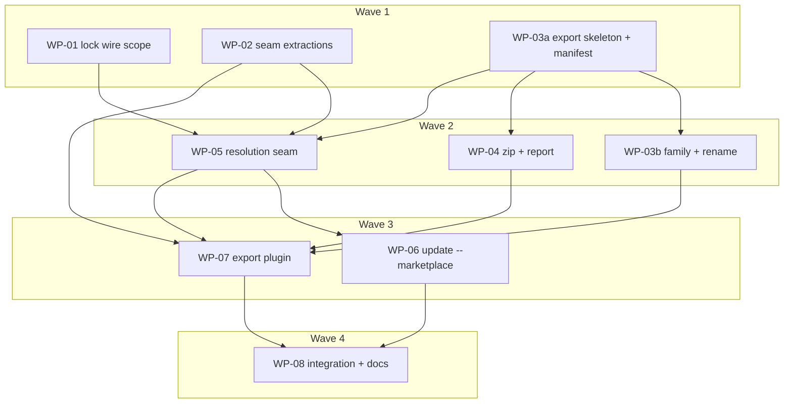

# Plan: Harness plugin export (phase 1)

## Status

- **Plan:** plan_harness_plugin_export
- **Active phase:** 1 — Execution (waves 1–4)
- **Step:** /hex-review → done (L3 review approved; fixes landed on the branch)
- **Last update:** 2026-09-27 (initialized; review round 1 applied — spec, architect and research panel plus a cross-model `codex exec` pass; re-validation fixes R1–R9 applied; Agent Plugins `mcp.json` reinstated by meta-orchestrator decision — C-036, S-031 in WP-03b / WP-07, waves unchanged)
- State:   done
- Tier:    xhigh
- Tier-grammar: 5
- Effective-tier: derived
- Updated: 2026-09-27
- Next:    —
- Reviewed: 0762b5eb

---

## Header

- **Source:** `.agents/discussions/harness-native-marketplaces.md` (phase 1 `## Requirements` only)
- **Goal contract:** `.agents/goals/harness-native-marketplaces.md` § Definition of done, criteria G1–G8
- **ADR (Accepted):** `.agents/adr/adr_harness_plugin_export.md` (D1–D13, amendments A1–A20) — lands **before any code** (G1): commit it with the spec and this plan as the first commit of execution
- **Design record (canonical contract text):** `.agents/specs/design_harness_plugin_export.md` — C-001…C-036, S-001…S-031
- **Research:** `research_reproducible_zip_rust.md`, `research_marketplace_lock_patterns.md`, `research_plugin_manifest_fields.md` (this run); `research_plugin_support_matrix.md`, `research_plugin_format_compat_{a,b,c}.md`, `research_agent_plugins_spec_verify.md`, `research_claude_app_install_surfaces.md` (discussion)
- **Classification:** scope large · reversibility one-way (high) — new frozen CLI verb, two new frozen file formats, additive wire field on the lock format · tier xhigh (`architect=on research=3 adversary=on`)

## Objective

Ship `grim export plugin` (ad-hoc refs or `marketplace.toml` `[plugins]`,
per `--client`, folder or `--zip`, rendered exactly like install,
byte-reproducible), `marketplace.lock` (the `grimoire.lock` wire format with
an additive `plugin` scope, held in memory as a map of `GrimoireLock`), `grim
update --marketplace` (roll pins, install nothing), and `[plugins.x.rename]
strip_prefix` (fail closed) — through the existing lock, resolve, update and
render seams only.

Out of scope (phase 2, recorded in the discussion): `grim export
marketplace`, marketplace-level fields, filter view / `--candidates`,
opt-in annotation, CI component, public marketplace, "latest major only".

## Backwards compatibility (Principle 9 gate)

Additive-only; no Constitution Deviations (ADR D11). Invariants are
contract C-031 and are tested, not asserted:

| Frozen surface | Change | Proof |
|---|---|---|
| `grimoire.lock` wire + published schema | `LockedArtifact` unchanged in memory; `plugin` and `[[plugin]]` exist only on the raw wire struct, `#[schemars(skip)]`; `grimoire.lock` serializer untouched; `lock_io::load` rejects them (78) | `grim schema --kind lock` byte-identical to a golden captured from `main`; every existing lock fixture round-trips byte-identically (C-005, C-031.1–2) |
| `grim update` CLI + JSON | new `--marketplace <PATH>`; rows gain always-present `plugin` (`null` normally); `roll_forward` extracted verbatim | existing `test_update.py` / `test_json_interface.py` unchanged; S-025 |
| `grim install` / `grim add` | seam extractions only (`declare_reference`, `parse_client_list`, `stage_locked_artifact`, `fetch_verified_layer` visibility) | existing suites green with **no expectation edits** (C-031.5); WP-02 verifies `full` |
| Exit codes / error doc | none new — reuses 64/65/74/75/78/79/80/81 and reasons `untracked-destination`, `stale-lock`, `locked` | C-028 table; C-031.4 unit test comparing the `ExitCode` / `ErrorReason` lists to `main`'s |
| Published schema ids / docs URLs | no new schema id; new doc anchors and one guide URL (additions only) | `test_check_urls.py` schema tuple untouched (C-031.4) |
| New surfaces frozen at 1.0 | `grim export plugin`, `marketplace.toml`, `marketplace.lock`, export JSON, version grammar | documented in `stability.md` (C-032) |

Migration: none — new files and a new subcommand; no layout move, no state
change, so no reaper or upgrade fixture is needed.

## TDD approach

Contract-first per WP: **Stub** (signatures, `unimplemented!()`) →
**Specify** (unit tests from the C-IDs, acceptance tests from the S-IDs,
written from the design record, failing against stubs) → **Implement** →
**Review-Fix Loop**. Every C-/S- ID maps to a WP Scope cell below and to at
least one test step. Byte-equality (S-011) and reproducibility (S-012) are
acceptance tests over the real binary, not unit mocks. Stubs reference only
types that exist in the WP's base (WP-03a's stubs never name WP-02's
`StagedArtifact`).

## JSON interface

- `grim export plugin --format json` → `{"items":[ExportItem…]}`; `ExportItem`
  = `plugin, client, family ("claude"|"agent-plugins"), format ("dir"|"zip"),
  path, version, members[{kind,name,lock_name,pinned}], omitted[{kind,name,reason}]`;
  every key always present, arrays sorted `(kind, name)`; items by plugin then
  `--client` order (C-029, S-026).
- `OmitReason` literals: `client-declined`, `no-format-surface`,
  `not-representable` (C-016, C-020, C-036).
- `grim update --format json` rows gain `plugin` (always present; C-013),
  built by the existing `build_report` keyed on `(plugin, kind, name)`.
- Errors: the existing error document `{"error":{code,exit,message,hint,reason,retryable,forceable}}`.

## Exit codes

From ADR D9 / C-028 — no new `ExitCode`, no new reason:

| Failure | Exit |
|---|---|
| usage: `--name` rules, `--plugin` + refs, `--marketplace` + refs, malformed selector, `update --marketplace` with `--client`/`--force`/`--global`/`--config` | 64 |
| `marketplace.toml` load/validation (incl. non-`.toml` path, `grimoire.toml`, invalid declared `version`), none declared, invalid `--version`, rename empty/invalid/collision/stale ref, empty plugin, unsafe entry name, output exists (`untracked-destination`, forceable), stale plugin + member selector (`stale-lock`) | 65 |
| I/O (incl. symlink in a staged tree, scan read failure) | 74 / 77 (`classify_io`) |
| advisory lock contention (`locked`) | 75 |
| unknown client, explicit client with no plugin format, member conflict, lock flavor mismatch / invalid lock names | 78 |
| unknown `--plugin`, unknown update selector/member, tag absent | 79 |
| registry / auth / offline miss | 69 / 80 / 81 (existing) |

## Component contracts (index — canonical text in the design record)

| ID | Contract | WP |
|---|---|---|
| C-001 | `export::marketplace::load` — parse, deny-unknown, reserved top-level keys, `.toml`-only path, all failures 65 | WP-03a |
| C-002 | plugin name rule = `SkillName::parse` (keys 65, `--name`/derived 64) | WP-03a |
| C-003 | include ref → plugin `DesiredSet`: extracted `add::declare_reference` (overrides, anchors, intrinsic path names, cause-preserving `DeclareError`) · `export::resolve::plugin_set` with member dedupe/conflict (78) | WP-02 (seam), WP-05 (`plugin_set`) |
| C-004 | whole + per-plugin declaration hashes (offline; excludes description/version/rename; `MARKETPLACE_HASH_VERSION`) | WP-03a |
| C-005 | `plugin` / `[[plugin]]` wire-only fields; `LockedArtifact` untouched; `grimoire.lock` bytes unchanged | WP-01 |
| C-006 | flavor validation: `load` rejects scope (78); `load_marketplace` requires it + `SkillName` on every name; `save_marketplace` same checks | WP-01 |
| C-007 | `MarketplaceLock` + `load_marketplace` / `save_marketplace` (shared raw parse, serializer, atomic write) | WP-01 |
| C-008 | `content_equal` untouched, reused per part | WP-01 |
| C-009 | `export::resolve::resolve_marketplace` → `MarketplaceResolution` (`PluginSelection`/`PluginPick`, bundle pins, post-resolve member-conflict checks); returns `crate::error::Error` | WP-05 |
| C-010 | lock path = `<stem>.lock`; `ConfigFileLock` across resolve+write (75) | WP-05 |
| C-011 | `UpdateArgs.marketplace`, first-statement branch to `run_marketplace`; registry context anchored at `M.parent()`; no install code | WP-06 |
| C-012 | selector grammar (`
` / `
:<member>`, cross-kind member match; 64 / 79) | WP-06 |
| C-013 | `UpdateEntry.plugin` always present; extended `build_report` | WP-06 |
| C-014 | `ExportPluginArgs` + input matrix; ad-hoc = in-memory manifest, no lock | WP-07 |
| C-015 | `target::parse_client_list` (extracted) · `family_of` · client default chain, no-format handling | WP-02 (parse), WP-03b (`family_of`), WP-07 (chain) |
| C-016 | `admits(family, client, kind)` + `OmitReason` | WP-03b (types in WP-03a) |
| C-017 | `installer::stage_locked_artifact` extracted; `fetch_verified_layer` `pub(crate)` for MCP | WP-02 |
| C-018 | member rendering via `ClientTarget::materialize` into plugin paths (Global scope); byte-equality with install | WP-07 |
| C-019 | `render::rebind_agent_name` | WP-02 |
| C-020 | plugin MCP file assembly: Claude `.mcp.json` via `mcp_entry`, Agent Plugins `mcp.json` via C-036, one `json_splice` routine; `not-representable` branch | WP-07 |
| C-021 | `rename::apply` — strip; every emitted name `SkillName`-checked; empty/invalid/collision 65; before any fetch | WP-03b |
| C-022 | `rename::scan` over `skills/` + `agents/` only → `io::Result<Vec<StaleRef>>`; `client: relpath:line` (65) | WP-03b |
| C-023 | `plugin_version` — precedence (annotation from the pinned manifest), semver check, `+` 12-hex member hash | WP-03b |
| C-024 | description = base + omissions sentence + on-ramp sentence (exact bytes) | WP-03b |
| C-025 | two `plugin.json` emitters, fixed keys/order, trailing `\n`, `$schema` const (name pattern asserted in pytest) | WP-03b |
| C-026 | `archive::write_zip -> io::Result<()>` — `zip` 8.6 no default features, Stored, 1980 epoch, 0o644, sorted, no dir entries | WP-04 |
| C-027 | output placement: staging under `<DIR>/.grim-export-*`, no-replace `hard_link`/`rename`, `--force` swap, lock written last | WP-07 |
| C-028 | `ExportError` + classification (enum WP-03a; `classify_export` + wiring in `src/error.rs` WP-05) | WP-03a, WP-05 |
| C-029 | `ExportReport` / `ExportItem`, JSON + plain | WP-04 |
| C-030 | reproducibility contract (TZ, umask, cwd, output dir) | WP-04 (zip), WP-07 (end-to-end) |
| C-031 | Principle 9 invariants 1–5 | WP-01 (1–2), WP-06 (3), WP-05 (4), WP-02 (5) |
| C-032 | docs + `grim-usage` / `grim-authoring` drift review | WP-08 |
| C-033 | per-plugin staleness (only stale plugins re-resolve; fresh parts carried byte-identically) | WP-05 |
| C-034 | `update::roll_forward` extracted verbatim; the only roll-forward | WP-02 |
| C-036 | `family::agent_plugins_mcp_entry` — `McpDescriptor` → Agent Plugins `mcp.json` entry (`http` → `streamable-http`; ws / oauth / unexpandable `${…}` → `None`; refinement fields dropped) | WP-03b |
| C-035 | path containment: staged destinations (WP-07), zip entry names (WP-04), load/emit name checks (WP-01, WP-03b) | WP-01, WP-03b, WP-04, WP-07 |

## User-experience scenarios (index — canonical text in the design record)

| ID | Scenario | WP |
|---|---|---|
| S-001 | Claude-app zip from one bundle ref | WP-07 |
| S-002 | Agent Plugins directory (codex) with `mcp.json` and named omissions | WP-07 |
| S-003 | two refs need `--name` | WP-07 |
| S-004 | member conflict (direct-vs-direct, direct-vs-bundle, path-vs-bundle → 78) / same ref twice deduped | WP-07 (+ unit WP-05) |
| S-005 | declared plugin, no lock → lock written after outputs; `--force` rerun idempotent | WP-07 |
| S-006 | stale plugin after include edit; description edit keeps lock + version | WP-07 |
| S-007 | offline export from warm cache; cold → 81 | WP-07 |
| S-008 | selection errors (79 / 65 / 64) | WP-07 |
| S-009 | clients without a plugin format (explicit 78, config skipped, fallback `agents`) | WP-07 |
| S-010 | per-client declines (droid, junie, claude) | WP-07 |
| S-011 | rendered like install (claude, codex, openclaw) | WP-07 |
| S-012 | reproducible across TZ/umask/`-o` | WP-07 |
| S-013 | rename success | WP-07 |
| S-014 | rename empty/invalid (65, nothing written) | WP-07 (+ unit WP-03b) |
| S-015 | rename collision (65) | WP-07 (+ unit WP-03b) |
| S-016 | stale reference file:line (65, nothing written) | WP-07 (+ unit WP-03b) |
| S-017 | overwrite policy, `--force` swap, symlink unlinked not followed | WP-07 |
| S-018 | empty plugin (65) | WP-07 |
| S-019 | `--version` override + member patch → `update --marketplace` → re-export bumps suffix | WP-08 (cross-command integration) |
| S-020 | update rolls all, installs nothing (snapshot excludes `GRIM_HOME` and `L`) | WP-06 |
| S-021 | update one plugin | WP-06 |
| S-022 | update one member (all kinds of that name) | WP-06 |
| S-023 | update selector errors, absent-lock validation | WP-06 |
| S-024 | `grimoire.lock` scope → 78 via `install`/`status`; `marketplace.lock` without scope → 78 | WP-06 (acceptance), WP-01 (unit) |
| S-025 | normal update report additive (`plugin: null`) | WP-06 |
| S-026 | export JSON shape | WP-07 |
| S-027 | advisory lock contention (75) | WP-06 (update), WP-07 (export) |
| S-028 | junie + OAuth MCP → `not-representable` | WP-07 |
| S-029 | hand-edited lock `name = "../evil"` → 78, nothing written | WP-07 (+ unit WP-01) |
| S-030 | editing plugin a leaves b's lock and export bytes identical | WP-07 |
| S-031 | Agent Plugins MCP projection (`streamable-http`, declines named, `agents` client emits `mcp.json`) | WP-07 (+ unit WP-03b) |

## Parallelization

Cut along module boundaries: lock (`src/lock`), install/update seams
(`src/install`, `src/command/{add,update}.rs`), the new `src/export/`
module (manifest core first, render-side core second), the two commands,
then integration + docs. **WP-03a creates the whole `src/export/` skeleton**
— `src/export.rs` with every `mod` line (re-exporting only WP-03a items;
callers use `export::<module>::…` paths), the full data types of `family.rs`
(`Family`, `OmitReason`) and `export_error.rs`, stub functions in
`family.rs`, `rename.rs`, `archive.rs`, and **empty** `resolve.rs` /
`stage.rs` modules (their signatures name WP-01/WP-02 types, so WP-05 and
WP-07 stub them) — so later WPs own only the files they fill and never touch
`src/export.rs`.

| WP | Scope (IDs) | Expected files | Size | Wave | Depends on | Review | Verify | Status |
|---|---|---|---|---|---|---|---|---|
| WP-01 | Lock wire scope + `MarketplaceLock`: C-005, C-006, C-007, C-008, C-035 (load names), C-031.1–2; S-024, S-029 (unit) | `src/config/hash.rs` (`MARKETPLACE_HASH_VERSION`), `src/lock/locked_artifact.rs`, `src/lock/grimoire_lock.rs`, `src/lock/lock_io.rs`, `src/lock/lock_error.rs`, `src/error.rs` (`classify_lock`) | M | 1 | — | risk | full | merged |
| WP-02 | Seam extractions, no behaviour change: C-003 (`declare_reference`), C-015 (`parse_client_list`), C-017, C-019, C-034, C-031.5 | `src/command/add.rs`, `src/command/update.rs`, `src/install/target.rs`, `src/install/installer.rs`, `src/install/render.rs` | M | 1 | — | risk | full | merged |
| WP-03a | Export skeleton + manifest core: C-001, C-002, C-004, C-028 (enum only), types for C-016/C-029 | `src/main.rs` (`mod export;` only), `src/export.rs`, `src/export/export_error.rs`, `src/export/marketplace.rs`, stubs `src/export/{family,rename,archive}.rs`, empty `src/export/{resolve,stage}.rs` | M | 1 | — | | scoped | merged |
| WP-03b | Render-side pure core: C-015 (`family_of`), C-016, C-021, C-022, C-023, C-024, C-025, C-035 (emitted names), C-036; S-014/15/16, S-031 (unit) | `src/export/family.rs`, `src/export/rename.rs` | M | 2 | WP-03a | | scoped | merged |
| WP-04 | Zip + report: C-026, C-029, C-030 (zip half), C-035 (zip names) | `src/export/archive.rs`, `Cargo.toml`, `Cargo.lock`, `src/api/export_report.rs`, `src/api.rs` | M | 2 | WP-03a | | scoped | merged |
| WP-05 | Marketplace resolution seam + error wiring: C-003 (`plugin_set`), C-009, C-010, C-033, C-028 (`classify_export` beside `classify_lock`, needs private `classify_io`), C-031.4; S-004 (unit) | `src/export/resolve.rs`, `src/error.rs` (`Error::Export` + `classify_export`) | M | 2 | WP-01, WP-02, WP-03a | risk | scoped | merged |
| WP-06 | `grim update --marketplace`: C-011, C-012, C-013, C-031.3; S-020–S-025, S-027 (update) | `src/command/update.rs`, `src/api/update_report.rs`, `test/tests/test_update_marketplace.py` | M | 3 | WP-05 | | scoped | merged |
| WP-07 | `grim export plugin`: C-014, C-015 (chain), C-018, C-020, C-027, C-030 (end-to-end), C-035 (staging); S-001–S-018, S-026, S-027 (export), S-028–S-031 | `src/command/export.rs`, `src/command.rs`, `src/main.rs` (`Command::Export`), `src/app.rs`, `src/export/stage.rs`, `test/tests/test_export_plugin.py` | L | 3 | WP-02, WP-03b, WP-04, WP-05 | risk | full | merged |
| WP-08 | Integration + docs + catalog drift + command index: S-019, C-032 | `test/tests/test_export_update_flow.py`, `docs/src/content/docs/commands.md`, `docs/src/content/docs/configuration.md`, `docs/src/content/docs/stability.md`, `docs/src/content/docs/json-interface.md`, `docs/src/content/docs/guides/team-plugin.md`, `docs/astro.config.mjs` (sidebar lists guides), `docs/check_urls.py` + `test/tests/test_check_urls.py` only if they enumerate guide URLs (additions only), `catalog/skills/grim-usage/SKILL.md`, `catalog/skills/grim-usage/references/{consume,publish}.md`, `catalog/skills/grim-authoring/**` (drift review; edit only on drift), `.claude/rules/subsystem-cli-commands.md` | M | 4 | WP-06, WP-07 | | full | merged |

`Verify: full` justifications — WP-01: changes the lock wire struct behind a
published schema (byte identity must hold on the full suite); WP-02:
refactors `install_one`, `grim add` and `grim update`, whose unchanged
behaviour only the full acceptance suite proves; WP-07: assembly of every
seam, S-011 byte-equality; WP-08: the final merge — full gate incl. `task
docs:check`, `task catalog:verify`, `task claude:tests`.

Shared files (`hub`): `src/error.rs` (WP-01 → WP-05), `src/main.rs` (WP-03a
→ WP-07), `src/command/update.rs` (WP-02 → WP-06), the WP-03a stub files
(→ WP-03b, WP-04, WP-05, WP-07). Every shared file is touched in different
waves; no two WPs in one wave share a file. Test helpers stay per test file
(DAMP), so `test/src/helpers.py` is edited by no WP.

- **Critical path:** WP-03a → WP-05 → WP-07 → WP-08 (WP-01/WP-02 run beside
  WP-03a in wave 1).
- **Shippable after wave: 4** — both commands, the cross-command flow, docs
  and catalog drift land together (G8 requires them with the feature); waves
  1–3 carry no documented surface.
- **Merge plan (serialized topological order):** WP-01 → WP-02 → WP-03a →
  WP-03b → WP-04 → WP-05 → WP-06 → WP-07 → WP-08. First commit of execution
  (before WP-01): the ADR, spec and this plan (`chore:`), so G1's "ADR
  before any code" is visible in history.
- **Effective tier (Decompose-gate snapshot, recomputed at spawn):**
  `effective tier: xhigh 9 (ceiling xhigh)` — every WP carries `hub`
  (shared stub/error/main/update files) or `door`/`sec`/`L`; WP-08 would be
  `high` on size but carries `door`.
- S-019 lives in WP-08 because it needs both commands; putting it in WP-07
  would add a WP-06 → WP-07 edge and a fifth wave.

## Executable phases (per WP)

Every WP runs Stub → Specify → Implement → Review-Fix Loop, then merges.
Gate after Implement: `task rust:verify`; WP-06/07/08 also `cp -f
target/release/grim test/bin/grim && cd test && uv run pytest
tests/<file>`; WP-08 `task docs:check`, `task catalog:verify`, `task
claude:tests`. The WP's `Verify` column sets the merge gate.

- **WP-01 lock wire scope** — Stub: `RawLockedArtifact.plugin`,
  `RawLock.plugin` rows, `MarketplaceLock`, `load_marketplace`,
  `save_marketplace`, `LockErrorKind::ScopeMismatch`, `MARKETPLACE_HASH_VERSION`.
  Specify: capture `main`'s `grim schema --kind lock` output as a golden
  fixture first; byte-identity over every existing lock fixture; `load`
  rejects `plugin`/`[[plugin]]` (78); `load_marketplace` rejections (missing
  scope, orphan plugin, `[[bundle]]`, `../evil` / absolute names); save
  refuses what load rejects; load∘save round-trip; `generated_at` kept when
  every part is `content_equal`, two plugins pinning one artifact differently
  never conflated. Implement: serde/schemars attrs, shared raw parse +
  serializer view, classification → 78.
- **WP-02 seam extractions (Hat 1)** — Stub: `add::declare_reference`
  (`DeclareError`), `target::parse_client_list`,
  `installer::stage_locked_artifact` (`StagedArtifact`), `fetch_verified_layer`
  → `pub(crate)`, `render::rebind_agent_name`, `update::roll_forward`.
  Specify: unit tests per C-003/C-015/C-017/C-019/C-034 edge cases (incl.
  `add`'s `--kind`/`--name` overrides, intrinsic path names, cause
  preservation); no acceptance edits — the existing suites are the safety
  net. Implement: move code verbatim; `add`, `InstallTarget::parse`,
  `install_one`, `update::run` call the seams.
- **WP-03a export skeleton + manifest core** — Stub: the whole
  `src/export/` surface from ADR § Module placement (full types, stub fns).
  Specify: C-001 wire cases (reserved keys, empty include, invalid name,
  invalid version, non-`.toml` path, `grimoire.toml`), C-002 name table,
  C-004 hash invariants (whole + per-plugin; order-, description-, version-,
  rename-insensitive; offline); `.toml`-only path rules; absolute `path`.
  Implement: pure functions plus `read_capped`.
- **WP-03b render-side core** — Specify: C-016 admission table per phase-1
  client, C-021 (every emitted name checked) and C-022 positive/negative
  token cases incl. an `.mcp.json` mention that must not trip, scan I/O
  error propagation, C-023 examples, C-024 exact bytes, C-025 key list/order
  + `$schema` const, C-036 one case per transport row, each decline, dropped
  refinement fields, determinism. Implement: pure functions; the scan's file
  walk is the only I/O.
- **WP-04 zip + report** — Specify: zip determinism (two writes with
  different TZ/umask → equal SHA-256; sorted, Stored, 1980 epoch, 0o644, no
  dir entries); unsafe names (`\`, `..`, drive prefix, non-UTF-8) →
  `InvalidData`; symlink → `InvalidInput`; report JSON key presence +
  ordering, plain table. Implement: `zip = { version = "8.6",
  default-features = false }`; `cargo deny` clean.
- **WP-05 resolution seam** — Stub: `plugin_set`, `resolve_marketplace`,
  `PluginSelection`/`PluginPick`, `MarketplaceResolution`, `lock_path`,
  `Error::Export`. Specify: selection matrix (All / Whole / Members / mixed,
  absent lock), per-plugin staleness (only stale parts re-resolve, fresh
  parts byte-identical), member conflicts (direct-vs-direct,
  direct-vs-bundle, path-vs-bundle → 78; identical identifier → dedupe),
  bundle pins captured, registry context anchored at `M.parent()`, advisory
  lock contention (75); `DeclareError` cause → exit table (79 / 81 / 65 / 64);
  exhaustive `classify_export` table; C-031.4
  variant-list test. Implement: calls only `roll_forward`,
  `load/save_marketplace`, existing classifiers.
- **WP-06 update --marketplace** — Stub: `UpdateArgs.marketplace`,
  `run_marketplace`, `UpdateEntry.plugin`. Specify: S-020–S-025, S-027
  (acceptance, `test_update_marketplace.py`); unit: selector grammar table,
  `build_report` keyed `(plugin, kind, name)`, runtime 64 for
  `--global`/`--config`. Implement: first-statement branch; no install,
  prune, reap, `sync_config`, state.
- **WP-07 export plugin** — Stub: `ExportPluginArgs`, `run_plugin`,
  `stage::stage_plugin` (per plugin × client), placement. Specify: S-001–S-018,
  S-026–S-031 (acceptance, `test_export_plugin.py`, fixture bundle
  `team-stack`; Agent Plugins name pattern asserted with Python `re`); S-011
  compares against a real `grim install --client <c>` tree; S-012 runs twice
  with varied `TZ`/`umask`/`-o`. Implement: wire the seams; containment
  assertion before every write; lock written after outputs; `bin/`, rules,
  `sync_config`, install state never touched.
- **WP-08 integration + docs** — Specify: S-019 (`test_export_update_flow.py`);
  `task docs:check` link/anchor gates and `test_docs.py` pass with the new
  anchors; page declarations per `docs-quality.md`. Implement: C-032 list
  (incl. the MCP relative-`command` warning, per-client member support
  table, "bump `version` when you change `description`"); `grim-usage`
  frontmatter gains `export`; drift review of `grim-usage` and
  `grim-authoring`; command-index row.

Review perspectives: spec (every WP), quality/over-engineering (reuse
mandate — reject any second lock/update/render path, G7), stability
(Principle 9: WP-01/02/06/07), security (WP-01 lock-name validation; WP-04
zip writer + new dependency; WP-07 `--force` swap, symlinks, containment,
staged-tree scan), doc-reviewer (WP-06/07/08, `src/command/**` always-on).

## Decisions recorded by the orchestrator (goal § Issue resolution)

Question → research → decision; the ADR carries the rationale.

1. **MCP in Agent Plugins exports?** First decision (plan round 1): omit in
   phase 1, reason `not-yet-supported`, because the mandate lists no MCP
   emitter. **Overturned by the meta-orchestrator** (goal I4, no feature
   cutting). Research: `research_plugin_manifest_fields.md` § MCP file
   mapping — `mcp.json` is one of the two components of the Agent Plugins 1.0
   shape the mandate already licenses; Copilot, Codex and Cursor read it; the
   field mapping (`http` → `streamable-http`, ws/oauth declines, no expansion
   in `command`/`url`/headers) is settled. **Decision:** ship a family-level
   emitter (C-036, WP-03b) assembled by the same routine as `.mcp.json`
   (C-020, WP-07); per-server declines are named `not-representable`
   omissions; refinement fields are dropped as every vendor projection does;
   `not-yet-supported` is removed. Agent Plugins MCP is admitted per family,
   not gated on the client's install-time `kind_support` (so `--client
   agents`, the default, carries it). Waves unchanged.
2. **Member collisions?** Panel: the resolver's direct-wins override would
   contradict the ratified "different digest → error" and leaves path-vs-bundle
   duplicates. **Decision:** honour the ratified rule strictly, post-resolve,
   no resolver change — same (kind, name) from two sources with different
   identifiers → 78; identical identifier → dedupe. Identifier comparison is
   stricter than digest comparison; loosening later is additive (ADR D4 ⚑).
3. **Staleness granularity?** Panel: whole-file staleness breaks "a team zip
   changes only on purpose"; `marketplace.lock` is a new file, so a
   per-plugin hash table costs no compatibility. **Decision:** per-plugin
   staleness (C-033).
4. **Lock in memory?** Panel: a `plugin` field on `LockedArtifact` touches
   every struct literal and the `grimoire.lock` path. **Decision:**
   `plugin` is wire-only; `MarketplaceLock` is a `BTreeMap` of the same
   `GrimoireLock` type (not a parallel lock struct); IO shared.
5. **Overwrite policy?** **Decision:** refuse existing outputs (65,
   `untracked-destination`, forceable) with no-replace placement; `--force`
   swaps atomically, never following a symlink.
6. **Version hash input?** **Decision:** post-rename emitted names + digests,
   12 hex. Accepted risk (ADR D6): description or renderer changes do not bump
   the suffix — documented "bump `version`".
7. **Top-level `name`/`owner`/`description`?** **Decision:** reserved →
   rejected in phase 1 (accepting later is additive).
8. **All members omitted for a client?** **Decision:** 65 `EmptyPlugin`.
9. **Explicit client with no plugin format?** **Decision:** 78, parity with an
   unknown client.
10. **`homepage`/`author`?** **Decision:** not in phase 1.
11. **"Latest major only"?** **Decision:** phase 1 honours each ref's tag.
12. **"Two clients sharing a format get byte-identical files"?** Superseded by
    per-client rendering (ADR D13).

Execution-time decisions (/hex-execute, design gaps surfaced by workers and reviewers):

13. WP-01 — `MarketplaceLock` placement → `src/lock/grimoire_lock.rs` beside the raw parse/serializer it shares; re-exported from `src/lock.rs` (one-line file-set expansion).
14. WP-01 — marketplace view with empty kind arrays? The shared serializer writes `skill = []` before `[metadata]`. → the marketplace entry view omits empty kind arrays so `[metadata]` stays first (C-007 wire order).
15. WP-01 — "existing grimoire.lock fixtures round-trip" (C-031.2): inline TOML in tests is not serializer output (already true on base). → three golden `.lock` files under `src/lock/testdata/grimoire_lock/` produced by the untouched serializer, plus a `grim schema --kind lock` golden from base 520c6540.
16. WP-01 — mcp name containment `..` → substring match (`a..b` rejected), matching the conservative reading of C-006.
17. WP-02 — `DeclareOverrides.kind` → `Option<ArtifactKind>`; path errors carry `{ name, value, reason }` so `add` messages stay byte-identical; `DeclareAnchors.cwd: Option<PathBuf>` (lazy `current_dir()`, today's order); access acquired lazily to keep `grim add` exit ordering; deprecation warning moves into the seam; not-found and offline miss share `Unresolved` (export distinguishes with its own offline check per C-003).
18. WP-03a — C-002 → `marketplace::validate_plugin_name`; C-023 grammar has one home, `marketplace::normalize_version` (used by `load`, `plugin_version`, and WP-07's annotation filter); `rename::apply` takes a leading `plugin: &str`; emitters return `Vec<u8>`; `RenameStaleReference.hits: Vec<String>` pre-formatted; `admits` maps a bundle to `no-format-surface` defensively (bundles never reach it).
19. WP-01 — duplicate `[[plugin]]` rows (unspecified) → `load_marketplace` rejects with ScopeMismatch 78 (a map would silently merge parts). Check order: `[[bundle]]`, version, rows, entry names. Duplicate `(plugin, kind, name)` entries are left to C-009 step 5 (MemberConflict 78).
20. WP-03a — malformed include string at hash time (unspecified) → `ExportError::Manifest` 65 naming the include.
21. WP-02 — C-003's `access: &Arc<dyn OciAccess>` becomes a lazy builder `&(dyn Fn() -> anyhow::Result<Arc<dyn OciAccess>> + Sync)` so `grim add` keeps today's exit ordering (access_seam's 74 after resolve_reference); new `DeclareError::{Unpinnable, AccessSetup}`.
22. WP-03a — tagless include at hash time → hashes as `:latest` (grimoire.toml / `grim add` parity), digest refs untouched; `jcs_sha256` stays local to marketplace.rs (hash.rs helpers hash a flat map only; generalising a frozen-hash file for 3 lines is worse).
23. WP-03b — `rename::scan` on a tree without `skills/` or `agents/` → no hits (Agent Plugins trees have no `agents/`); `InvalidVersion.value` carries the raw `--version` input.
24. WP-04 — `ExportReport::new` sorts each item's `members`/`omitted` by (`ArtifactKind` order, name); item order is the caller's (plugin, then `--client` order). A fifo/socket/device under the staged root → `InvalidInput` (74) like a symlink; drive prefix checked at name start; `write_zip` validates every name before creating `out` with `create_new`, and entries carry `System::Unix` so bytes do not depend on the build host.
25. WP-03b — the mcp name containment rule has one home, `grimoire_lock::is_contained_mcp_name` (`pub(crate)`), shared by the lock load check and `rename::apply` (C-021 says "C-006's containment check").
26. WP-05 — `plugin_set`/`resolve_marketplace` gain `plugin: &str`, `offline: bool` (the digest lookup returns `None` both offline and online, C-003) and `origin: IncludeOrigin { Declared, AdHoc }` (guard → 65 vs 64); `resolve::load_lock` is the single "missing lock = absent" home. A tag or manifest not found → new `ExportError::IncludeNotFound { plugin, include }` → 79 (additive variant, no new exit code or reason; `ResolveError` needs a kind that is unknown before inference). Path-shape refusals and `Unpinnable` → `Manifest` 65 declared / `ConfigUsage` 64 ad-hoc; ad-hoc manifest-class messages name the include, not the in-memory path.
27. WP-05 — `plugin_set` takes the manifest path (anchor = its parent) so declared 65s name `M`; ad-hoc failures reuse `grim add`'s error for a malformed ref (65) and `Usage` 64 for path-shape/guard refusals, never printing the in-memory path; `resolve_marketplace` emits only `SelectorNotFound` (`"
"` / `"
:<m>"`), export emits `PluginNotFound` after checking `--plugin` against M; path-vs-bundle overlap is always `MemberConflict` 78, and `first`/`second` carry include strings as written; `PluginSelection::Some({})` = carry + drop only, no network; step 3 precedes step 4 (documented).
28. WP-05 — ad-hoc `PathInvalid` exits 65 like `grim add <path>` (same input, same exit on both commands); its message names the include as written, never the in-memory manifest path.
29. WP-05 — the step-3 stale refusal names the locked member with its real kind and pin (resolver `stale_reference` parity; placeholder only as fallback); ad-hoc `NoKind` → `KindInferenceFailed` 65 (`grim add` parity).
30. WP-06 — `UpdateEntry.plugin` is serialized last (after `refused`) so every existing key keeps its position; `--global`/`--config` with `--marketplace` are refused (64) before M is loaded; selectors are order-independent, repeated members merge (`a:x a:y` → `Members{x,y}`), exact duplicates accepted; `ghost` (79) is decided by `resolve_marketplace` against M.
31. WP-07 — orchestration (manifest/lock load, advisory lock, staleness, `resolve_marketplace`, rename/version/description, placement, lock save) lives in `export::stage::run` per ADR § Module placement; `command/export.rs` keeps the C-014 matrix and client chain. Each member is fetched once per run and rendered per client. `EmptyPlugin` = no member emitted for (P, c) after MCP declines. Declared mode always calls `resolve_marketplace` (`Some{}` when nothing is stale); `L` is saved when an exported plugin was stale, a part's plugin left M, or `L` was absent. Output paths are checked with `symlink_metadata`; `-o` is made absolute. The single-ref annotation read (`pinned_annotations`) uses the pin, never the floating tag, and ignores an invalid version. `contained` reuses `archive::entry_name` (one C-035 rule).
32. WP-06 — C-013 rows come from one `build_report` call per plugin part of the result: a carried, unselected plugin reports its entries as `unchanged` (parity with normal `grim update`); dropped plugins produce no rows.
33. WP-07 — `pinned_annotations` returns `Result`: a registry/auth/offline failure reading the pinned manifest propagates with its classified exit; only an absent annotation, an invalid version or a path source is "none" (C-023) — never a swallowed error.
34. WP-07 — the MCP file (`.mcp.json` / `mcp.json`) is written iff ≥1 MCP member was emitted, for both families (C-020's "admitted" read as "emitted after projection"); a symlink at an output path without `--force` is `OutputExists` 65; S-011 for OpenClaw compares the skills only (a global OpenClaw install of the whole bundle refuses its MCP member, 65 — existing behaviour).
35. WP-06/WP-07 — declared mode anchors both the registry context and the access seam (insecure-host set) at M's directory (`access_seam_scoped`), never the cwd project; M is used as `marketplace::load` returns it (absolute, not canonicalized), so L and the advisory sidecar sit beside M as given (C-010). `parse_selectors` runs before the lock and L load (malformed selector → 64 even against a corrupt L).
36. WP-07 — **Divergence (S-007 warm half).** Question: offline export from a warm cache (S-007) needs `fetch_manifest` offline, which `CachedAccess` refuses (no manifest cache). Research: `src/oci/access/cached_access.rs:93-101`; `adr_mcp_percall_scope_fetch_render.md` § Deferred already defers a manifest cache for true offline fetch; `grim install --offline` into a fresh target fails the same way (its warm-cache test only passes as a no-op reinstall). Decision: keep install parity (offline → 81 `OfflineMiss`); the warm-cache test is `xfail(strict=True)` naming the deferral, so it flips when a manifest cache lands; the cold-cache 81 half passes. Strong reason: closing the gap changes the `OciAccess` contract on the security-sensitive `src/oci/**` for every command and needs its own ADR — out of this plan. Follow-up issue candidate: manifest cache for offline fetch/install/export.
37. WP-07 — a missing `marketplace.toml` reads "manifest not found" (65), path once (S-008 wording; one-line change in `marketplace::load`).
38. WP-07 — a single ad-hoc ref without `--name` names the plugin after its binding (C-014/C-003): a registry ref's last path segment, a path ref's packed intrinsic name (resolved under a placeholder key first), never the path's file stem. The client chain propagates a malformed project config instead of falling back (only "config not found" falls back). A failed `--force` swap moves the old output back before returning the error. Residual risk (documented in WP-08): a SIGINT mid-run can leave the hidden `<DIR>/.grim-export-*` staging dir behind.
39. L2/cross-model — C-001's file-name rules also apply to a symlinked `marketplace.toml`'s resolved target, so the advisory sidecar (`<resolved>.lock`) can never alias `<stem>.lock`.
40. L2/cross-model — a `--force` swap whose rename-in and restore both fail keeps the staging dir and names the preserved backup in the error (no data loss; no new exit code).
41. L2/cross-model — ad-hoc CLI path refs get `grim add`'s `normalize_cli_path` (CLI values only; manifest values stay strict).
42. L2 — a changed local path member in a declared plugin exits 65 with the hint `grim update --marketplace <M> 
` (not `grim update`/`grim lock`, which act on grimoire.toml).
43. L2 — `plugin_set` inserts through `add::declare` (no second kind→table insert).
44. L2 — the `grimoire.toml` name guard is ASCII-case-insensitive (case-insensitive filesystems).

45. L3 review (item a) — Question: `grim update --marketplace M P:missing` printed the placeholder `invalid.localhost/<m>`. Research: the resolver invents that identity for an undeclared name (`resolve_lock_partial`, `stale_reference`), `ResolveError` always prints its source, and plain `grim update <undeclared>` on `main` leaked it too. Decision: fix at the root — a `ResolveErrorKind::NotDeclared` (exit 79, no new reason slug) and `ResolveError::unidentified`, which prints the name only; the marketplace path maps it to `SelectorNotFound` so the lock and no-lock paths read the same (640fdbdb).
46. L3 review (item b) — Question: fix the `export::resolve` ↔ `command::{add,update}` cycle now? Research: the only file-level 2-cycle ran through `update::roll_forward`; `add.rs` imports nothing from `export`. Decision: move `roll_forward` into `src/resolve/resolver.rs` now, as a pure move (2f5e2ef2). Moving the declare seam (~420 lines) into a neutral `src/declare.rs` is deferred to a follow-up, because the remaining edge is one-way.
47. L3 review (item c) — Question: does RUSTSEC-2026-0285 block CI? Research: `verify-basic.yml` › Supply Chain runs `task rust:audit` (`cargo deny check advisories bans sources`) as a hard gate, and it failed on `main` too (rustls 0.23.42). 0.23.45 is the first patched release. Decision: bump rustls to 0.23.45 (43d1d114). `cargo deny` now reports advisories, bans and sources ok.
48. L3 review (item d) — Question: does the S-007 xfail reason hold? Research: `CachedAccess::fetch_manifest` refuses every offline call, and `installer::fetch_verified_layer` always fetches the manifest. `grim install --offline` into a fresh target or a new client exits 81 for the same pins; its warm-cache test passes only through the `AlreadyInstalled` short-circuit. Decision: the reason holds. It is parity with install, so decision 36 stands.
49. L3 review — Question: a missing `marketplace.toml` exits 65, but a missing `grimoire.toml` exits 79. Align them before 1.0? Research: S-008 fixes 65 (every manifest-class failure of `M` is `ExportError::Manifest`), and the command has not been released. Decision: keep 65, add a hint toward `<ref>…` or `--marketplace <PATH>`, and document it in the export exit table.
50. L3 review — Question: two performance Warns: sequential `declare_reference` round-trips per include, and per-member staging with no cross-plugin dedupe. Research: both are latency only. Output and correctness are unaffected, and realistic team marketplaces (a handful of plugins) stay in seconds. Parallelising is Hat 2 work that needs benchmarks (`quality-core.md` Two Hats). Decision: defer both to follow-ups.
51. L3 review — the cross-model `codex exec` pass hit the provider usage limit on its first attempt, so it re-ran after the reset (see Schedule log).

52. L3 review, cross-model round 2 — Question: codex raised 2 Blocks and 2 Warns. Research and decision, finding by finding:
    - Case-insensitive `.toml` stem suffix (CWE-178, `marketplace.rs`). Fixed: de938c06.
    - Directory exports skipped the C-035 entry-name walk that `--zip` runs. Fixed through `archive::check_tree`: 5ce05bab.
    - Crash between the two `--force` renames. No grim path deletes the staging directory after a crash; only the docs told users to delete it by hand. Downgraded to Warn. The docs now point at the `.replaced-*` backup first (8e2b7362). A crash-injection test is deferred.
    - A member-only `update --marketplace P:m` infers the kind of every include of P, so an unreachable sibling blocks the update. Carrying unselected members without a network read needs an include→kind record that the frozen lock format lacks. Deferred as a follow-up, together with decision 50.
53. L3 review convergence — S-024's export side now has an acceptance case (`test_s024_marketplace_lock_of_the_wrong_flavor_is_78` runs both commands). C-009 step 5's duplicate-entry clause is amended as subsumed by the resolver. The unrequested behaviours the spec reviewer found are anchored by decisions 39–44.

## Open questions

None blocking. The spec carries no `[NEEDS CLARIFICATION]` markers.

## Risks

| Risk | Mitigation |
|---|---|
| Seam extractions regress install/add/update | WP-02 is a verbatim move, `Verify: full`, no expectation edits allowed |
| Global-scope materialize differs from project install bytes | verified: scope reaches only `rule_index` (`client_target.rs:365-367`), rules are never exported; S-011 compares real install output |
| Claude app zip reader rejects Stored / no-dir-entry zips | most conservative subset; manual smoke below |
| Semver-aware consumers ignore `+<hash>` | documented; a real bump still moves the base version |
| Strict stale scan stops `hex` (links `../hex-core/…`) | intended (discussion); follow-up in `arcana` |
| Hand-edited `marketplace.lock` injects paths | C-006 name validation (78) + C-035 containment |

## Manual testing

- [ ] Upload `team-stack.claude.zip` in the Claude app (Customize → Plugins → Upload) and confirm skills load.
- [ ] `claude plugin validate` on an exported Claude tree.

## Follow-up issue candidates (not filed)

- `--locked` for `grim export plugin` (ADR D13).
- `homepage`/`author` manifest fields (decision 10).
- `arcana` `hex` bundle: remove cross-skill relative links so it exports with `strip_prefix = "hex-"`.
- Stale subcommand counts: `AGENTS.md` ("20"), `product-context.md` ("18") vs `src/main.rs`.
- Manifest cache for true offline fetch/install/export (decision 36; `adr_mcp_percall_scope_fetch_render.md` § Deferred) — flips the S-007 strict xfail.
- Move the declare seam (`declare_reference` and friends, ~420 lines) out of `command::add` into a neutral `src/declare.rs` (`adr_fetch_service_extraction.md` precedent). `roll_forward` already moved (decision 46).
- Performance: run `plugin_set`'s `declare_reference` calls concurrently (JoinSet, resolver `resolve_work` shape) and dedupe identical includes across plugins; stage each distinct pin once across plugins (decision 50). Benchmarks required.
- `marketplace.lock` written through a committed symlink follows the link, the same policy as `grimoire.lock` since #117. Owner policy call on replace-link-on-write for grim-generated locks.
- `json_splice::upsert_array_element` splices `key` unescaped. Callers pass constants only today; escape it like `upsert_member` if a caller ever passes data.
- `update --marketplace P:m` should not need the network for P's unselected includes. That needs an include→kind record in `marketplace.lock` (additive), or a manifest cache (decision 52).
- A crash-injection test for an interrupted `--force` swap between its two renames (decision 52).
- `test_path_deps.py:806` asserts `"tag not found" not in stderr`, which can no longer fail after decision 45. Assert `"not declared"` instead.
- Plain `grim update`'s stale-lock refusal still ends "retry with a full resolve", which names no command. Rewording it touches the quoted example in `json-interface.md`.

## Schedule log

- WP-01 merged at 9f477fdf — trigger: full (Verify cell) — `task --force verify` green (3073 unit, 1160 acceptance).
- WP-03a merged at eb83defe (rebased; WP-02 still in review-fix, independent) — trigger: scoped cell, ran full `task --force verify` green (3112 unit, 1160 acceptance).
- WP-02 merged at f05179f5 (rebased onto 96166587) — trigger: full (Verify cell) — `task --force verify` green (3159 unit, 1160 acceptance, no expectation edits).
- WP-03b merged at 8199efe9, WP-04 at 435fe6ed (both rebased, file-disjoint, merged back to back) — trigger: scoped cells; one full `task --force verify` after the pair, green (3226 unit, 1160 acceptance). WP-04 pins a golden zip digest (`c030_golden_zip_sha256`).
- WP-05 merged at 62daf36c (rebased onto ec719b45) — trigger: scoped cell; full `task --force verify` green (3267 unit, 1160 acceptance).
- WP-06 merged at baf56e8b (rebased onto 32eca9a2) — trigger: scoped cell; full `task --force verify` green (3274 unit, 1180 acceptance). S-020 asserts `$GRIM_HOME/state` absent or empty (the store creates an empty `state/` on first cache use).
- WP-07 merged at 6e551694 (rebased onto 946ef1d0; stale `PluginPick::Members` allow dropped) — trigger: full (Verify cell) — `task --force verify` green (3338 unit, 1239 acceptance + 1 strict xfail, decision 36).
- L2 aggregate review (native PASS with 1 Warn + 3 Suggest) and cross-model code-diff pass (`codex:rescue`, 3 Block) over 520c6540..4a5f3646; one merged fix pass landed at f3f66714 (decisions 39–44) — full `task --force verify` green (3343 unit, 1241 acceptance + 1 strict xfail).
- WP-08 merged at 5f49aee1 (rebased onto 14290a45) — trigger: full (Verify cell) + final gate: `task --force verify` green (3343 unit, 1243 acceptance + 1 strict xfail), `task docs:check`, `task catalog:verify`, `task claude:tests` (52) green.
- L3 review (`/hex-review` xhigh) — panel: spec, test coverage, user-feedback, security, performance, docs, architect, researcher; cross-model `codex exec` in 2 rounds (the first hit the provider usage limit). Fixes landed at 2f5e2ef2, 640fdbdb, 47940026, ce081797, 59a3d70a, 3fe36224, 520c93c4, 43d1d114, ebf76821, de938c06, 5ce05bab, 8e2b7362, 0762b5eb (decisions 45–53). Final gate: `task verify` green (1248 acceptance + 1 strict xfail), `task docs:check` green, `cargo deny check advisories bans sources` ok. Verdict: Approve.
