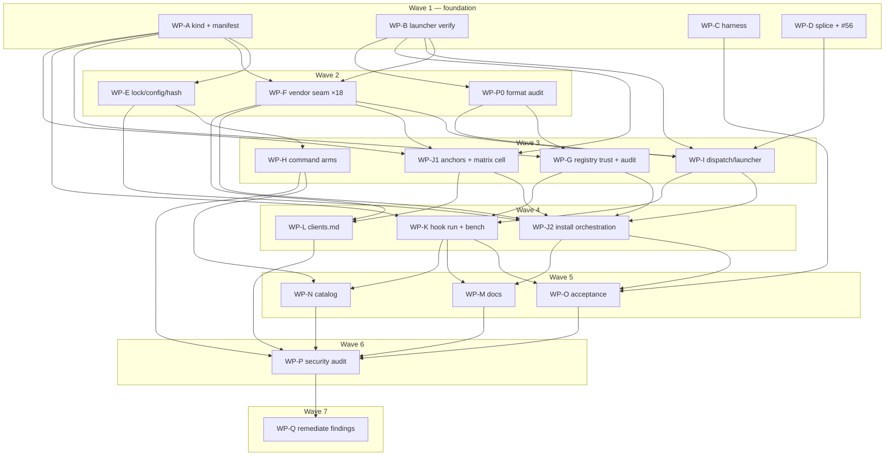

# Plan: hooks as `ArtifactKind::Hook` behind a `grim hook run` trampoline

## Status

- **Plan:** plan_hooks_artifact_kind
- **State:** review
- **Step:** awaiting /finalize
- **Last update:** 2026-08-18 (branch squashed to four conventional commits; ready to fast-forward onto main)
- **Active phase:** 7 — complete. Every wave merged; the bounded Review-Fix Loop converged over two rounds (all Blocks closed, side-findings fixed or filed as #90-#96); branch squashed to four conventional commits.
  Round 1's panel (8 reviewers, reports in `.agents/review/round1-*.md`) is **fully discharged: all
  Blocks closed**, each with a regression test that fails without its fix:
  - spec B-1 — an `A|B` matcher armed everywhere and fired on nothing (`e0802e8`).
  - security B-1 — a hook binding name from a repository file overwrote arbitrary files (`3676803`).
  - tests B1 — the documented preferred `${GRIM_HOOK_DIR}` argv form never fired (`89f9569`).
  - perf B-1 — the dispatch table grew without bound; at 1 MiB every hook disarmed (`eeca22f`).
  - tests B2–B6 — `trust.rs` had no test module, `audit.rs` no rotation/cap tests,
    `hook_consent.rs` none, and contract C-015's golden fixture had no consumer
    (`e76f93a`, `f88b346`).
  - docs B-1…B-7 — six false or incomplete published claims (`3698724`).
  - quality Q-B1 — one predicate spelled four times, with a note owing the collapse (`7f54c2b`).

  Round 2 is a two-reviewer panel scoped to **the fixes themselves** (correctness, security), since
  the original code was already reviewed and the fixes were not.
- **Deferred to GitHub** (not critical to this implementation): issues 90 (declaration-key traversal
  in *every* kind — pre-existing, reproduced on released 0.12.1), 91 (uncapped hook `timeout`),
  92 (`trust_hooks = false` indistinguishable from never-granted), 93 (install can write a table past
  the cap), 94 (`grim hook list` client column reads `—` when armed).
- **The feature arms and fires**, proved by execution in WP-R: a real hook built, released,
  declared, installed, armed and **fired**, with the dispatch table, registration, launcher and
  dispatcher output pasted in `.agents/wp-r-report.md` § 5.
- **THE PLAN GREW FIVE WORK PACKAGES DURING EXECUTION**, each from a defect or requirement the
  original decomposition could not have known:
  - **WP-R (arming composition)** — WP-J2 proved nothing armed (below).
  - **WP-S (hook bundle membership)** — owner requirement 2026-08-17; the install side already
    treated a hook as a first-class bundle member, only the authoring parser and packer were missing.
  - **WP-T (SEC-1)** — WP-R proved by execution that a **cloned repository's own committed
    `.grimoire/` armed a hook offline** (T3 against I2). Payloads are now machine-local under
    `$GRIM_HOME` at both scopes, and convergence derives that directory from `$GRIM_HOME` rather
    than from the install record — that derivation, not the relocation, is the fix. I1 now names the
    payload explicitly, because omitting it had been read as a licence.
  - **WP-U (guard-path performance)** — measurement found a 24-worker Tokio runtime built on every
    tool call and a per-record audit append that costs +14 ms per armed hook on 9P.
  - **WP-V (example hooks)** — owner requirement 2026-08-18.
- ⛔ **THE PLAN WAS 18+1 WPs IN 8 WAVES, NOT 17 IN 7.** WP-J2 proved **by execution** that
  **nothing arms** — `sync_for_state`'s six-step convergence body does not exist, and the cause is
  structural (`Vendor::sync_config` cannot see the config, so neither the experimental flag nor
  per-registry trust can be evaluated where the plan put them). **`grep -rn 'unimplemented!(' src/`
  returning zero was true and did not mean convergence was implemented** — the body returns
  `Err(unsupported_kind())` unconditionally instead. New **WP-R (arming composition)** owns it; WP-O
  moved 5→6, WP-P 6→7, WP-Q 7→8, and the critical path is now **8 levels**.
- **Two Blocks in merged code, found by WP-J2 with executed proof, both fixed:** `prune_orphans`
  deleted every installed hook on the next `grim update` (the hand-maintained `declared` chain omitted
  `hooks` — the **third** firing of a trap that function's own comment warns about); and
  `grim remove`/`grim uninstall` parsed `hook` as `rule`, so `grim uninstall hook X` would delete
  **rule X's** files. One more Block from WP-K: the dispatch table had **no client dimension**, so a
  hook grim *declined* for a client was indistinguishable from one it armed there.
- **Prior wave-4 entry state, for the record:**
  - **Implement pass COMPLETE 2026-08-17.** Seven packages implemented and merged (WP-A, WP-D, WP-F,
    WP-G, WP-H, WP-I, WP-J1). **`grep -rn 'unimplemented!(' src/` returns zero.**
    `task --force verify` green: 2800 unit tests, 1019 acceptance, 51 AI-config.
  - **Both live panics are closed, verified by execution not inference.** `grim status` on a
    hand-written `[hooks]` table exited **101**; it now exits **0** reporting `state: gated` with a
    per-client arming cause. `grim build <dir with hook.toml>` exited **101**; it now exits **65** on a
    malformed manifest, naming the unknown field, and **builds a real layer digest** on a valid one —
    including rejecting a handler that invokes a payload file directly, because a registry-delivered
    payload carries no exec bit, and naming the interpreter form instead.
  - **The shipped C-013 column:** claude `✓`, codex `✓`, copilot `◐`, the other fifteen `✗`. Copilot's
    gap is an empty verdict set at `PostToolUse` (gatekeeper is declarable there on the other two), so
    it is matcher-independent. No cell moved when Decision K went live.
  - **WP-J2 must read all three ⛔ ordering boxes before starting**, and discharge its three
    obligations in the one commit that first lets a hook install: the `client_supports_kind` arm, the
    widened no-op guard, and the panic refusal.
- **All four owed choices RESOLVED 2026-08-17 — wave 3 is unblocked.**
  - **Q4 → `--table '<abs>'`** (orchestrator). It passes exactly the one path the runtime needs,
    rather than a directory from which the runtime could derive others — least authority.
  - **Q5 → HMAC of the root path under a machine-local key** (owner). Derivable on demand, so the
    table needs no separate path→token mapping and a lost or partially-written mapping cannot strand
    a workspace's hooks. The key lives in `$GRIM_HOME`, never in a repository. Unguessable without
    it, and stable across re-installs of the same workspace — which the token must be, since
    re-materialization has to find its own entry.
  - **Q6 + Q6b → BOTH environment variables are DELETED** (owner). *"`GRIM_EXPERIMENTAL_HOOKS` is a
    FEATURE FLAG, not an opt-in… rather delete it in favour of the grim option that sets the feature
    flag"* and *"go with config file only for now (YAGNI)"*. So: the feature flag is
    `grim config set options.experimental.hooks true` (project or global config); per-registry
    consent stays `trust_hooks` in TOML; `--allow-hooks` remains the **per-invocation** escape.
    **Three questions, three places** — is the feature on, is this registry trusted, is this one run
    permitted. **This dissolves WP-P0's B6 and W6 rather than mitigating them**: with no environment
    variable there is no repo-carried path to either, and no environment-vs-config precedence rule
    left to get wrong. Landed in `24a14bb`; C-026 is withdrawn.
- **Step:** /hex-plan → plan-approved → **/hex-execute (running)**
- **Tier:** high · `review=adversarial loop-rounds=3 adversary=substitute`
- **Feature branch:** `hex/hooks-artifact-kind` (from `main` @ `03e59b0`)
- **Last update:** 2026-08-17 (WP-P0's audit propagated into the contracts — see the Progress Log)
- **Next:** `/hex-review .agents/plans/plan_hooks_artifact_kind.md`

**Gate decisions, 2026-08-16.** WP-B verifies **all three** live clients — Codex and Copilot CLIs
installed for it, so Open Questions 2 and 3 get real answers rather than declines. Run scope is
**all 7 waves**, no intermediate checkpoint. The configured cross-model adversary `codex:rescue`
is absent for the **7th** run; a **fresh-context same-model** adversary substitutes — an
independent pass, but it shares this orchestrator's blind spots and is **not** the cross-model
gate tier high specifies. Labelled as a substitute wherever it appears.

---

## Overview

**Status:** Approved (2026-08-16)
**Author:** Orchestrator (`/hex-plan high`)
**Date:** 2026-08-14 · approved 2026-08-16
**Related ADR:** [`adr_hooks_support.md`](../adr/adr_hooks_support.md) (**Status: Accepted** 2026-08-16, amendments A1–A5 folded in)
**Tier:** high · one-way-door high · cross-area + external contract

## Objective

Ship `ArtifactKind::Hook` — a directory artifact whose `hook.toml` manifest declares
lifecycle handlers — installed into claude, codex and copilot by registering **one
grim-owned dispatcher entry per `(client, event, scope, matcher)`** that invokes
`grim hook run`. Grim owns normalization, matching, ordering, failure policy and
response projection. Off by default behind `[options.experimental] hooks = false`.

## Scope

### In Scope

- The kind end to end: enum, wire form, `hook.toml`, `grim schema --kind hook`.
- v1 clients **claude + codex + copilot**. **Global scope on all three; project scope on claude
  only** — the owner directed widening at the gate, and the review established it is not
  achievable in v1 on security grounds (§ Launcher, Open Question 1).
- Runtime: `grim hook run`, dispatch table, launcher, response projector, tier pipeline.
- Consent: **per-registry trust** in `[[registries]]` (no per-hook prompt), the `--allow-hooks`
  CI escape, and a redacted-only audit trail.
- Tiers `observer` + `gatekeeper` + `mutator`, with all nine mutator controls.
- **GitHub #56** (`json_splice` unescaped key interpolation) — promoted into scope; see § G-1.
- Docs, the first-party catalog drift review, and the `catalog/taskfile.yml` hooks loop.

### Out of Scope

- **Copilot's cloud agent.** With no committed registration it never sees a grim-owned hook at
  all, so this is a genuine exclusion rather than a risk to be guarded. Its `HOME=/root`, absent
  `grim`, and `ask`→`deny` coercion are recorded in § Launcher as reasons the committed shape
  was rejected.
- The other 12 hook-capable clients (additive, Phase 3 of the ADR).
- The codegen install shape (trait variant exists; no templates).
- Plugin render mode, agent-scoped hooks, non-command handler kinds, a resident daemon.
- Full-body (unredacted) audit capture.
- A latency *budget number* — measured and reported, not gated (owner decision).

## Research

Design record: [`adr_hooks_support.md`](../adr/adr_hooks_support.md) — 17 decisions A–Q,
contracts C-001…C-014, five-option matrix (Option 4 chosen, 130/145; 109/145 on a blind
re-score). Evidence, all 2026-08-14, **do not re-derive**:

- [`research_hooks_trampoline.md`](../research/research_hooks_trampoline.md) — F1–F13, D1–D10
- [`research_hooks_vendor_survey.md`](../research/research_hooks_vendor_survey.md) — 17 clients, 15 with hooks
- [`research_hooks_codex_surface.md`](../research/research_hooks_codex_surface.md) — trust-hash mechanics, source-verified
- [`research_hooks_hotpath_cost.md`](../research/research_hooks_hotpath_cost.md) — measurement methodology
- [`research_hooks_autoexec_supply_chain.md`](../research/research_hooks_autoexec_supply_chain.md) — consent prior art, threat checklist
- [`hooks_vendor_reports/`](../research/hooks_vendor_reports/) — 17 primary-source reports

Discover reports for this plan (scratchpad, not committed): architecture map, kind-plumbing
inventory, install/vendor seams, CLI/docs/catalog, test-harness capability, launcher
portability spike.

## Technical Approach

### What Discover changed relative to the ADR

Six workers verified the ADR against source at `03e59b0`. The design holds; **the cost
model does not**. Corrections that shape this plan:

| # | Finding | Consequence |
|---|---|---|
| **D-1** | The ADR omits **18 `vendor_*.rs` files** entirely. All 18 would silently answer `kind_support(Hook) == Native`; **claude, copilot and cursor have no override at all** (trait default), so the natural `rg "_ => KindSupport::Native"` audit misses 3 of them. Confirmed independently by 3 workers. | WP-F exists and owns all 18 files. Decision A is more necessary than argued. |
| **D-2** | `config/hash.rs` is a **silent correctness risk**: omit `hooks` and declaring/changing `[hooks]` does **not** change the declaration hash, breaking staleness detection. JCS needs sorted keys and `"hooks"` sorts **between `bundles` and `mcp`** — position is load-bearing. | WP-E, with a byte-identity test (C-015). |
| **D-3** | `DesiredSet`: ADR claims 7 literal sites; **actual is 1** (`from_maps`), and it derives `Default`, so `::default()` is safe with no edit. `GrimoireLock`: claims 13; **actual 31** (6 production, 25 test) but derives **no** `Default`, so all are compiler-forced. Both risk shapes were inverted. | WP-E sizing; `GrimoireLock` is the safe case. |
| **D-4** | `tui/app.rs` has **8** dispatch sites, not 5 — only 2 compiler-forced; 2 of the 6 silent ones are fixed arrays with *pre-existing* gaps (one omits `Bundle`, one omits `Mcp`). | WP-H must visit all 8 explicitly. |
| **D-5** | **No test anywhere would catch a missed silent site** — every "every kind" loop, *including the test loops*, is a hand-maintained fixed array. | WP-A ships a compile-time exhaustiveness gate (C-016). |
| **D-6** | `candidate_anchors` is **228 lines** of per-`(client, kind)` arms with ~26 individually spelled-out declined pairs, and `is_declined_global_pair` delegates to `kind_support` — which Decision A forbids for `Hook`. It needs its own gate. | WP-J, and it is the largest single function in the change. |
| **D-7** | `sync_config` failure is **warn-only** (`installer.rs:394-402`: "artifacts installed and state saved, registration skipped"). `grim install` can report success while a security control silently fails to arm. | New threat row 13; C-017. |
| **D-8** | `catalog/taskfile.yml:21-65` is a hardcoded loop over **five** globs. A `catalog/hooks/*/` package added without a sixth loop is **never validated** — silently, no CI failure. Unnamed in the ADR. | WP-N owns it. |
| **D-9** | Three more kind-count sites the ADR misses: `docs/src/artifacts.md:3` (prose), `catalog/skills/grim-authoring/SKILL.md:14` (prose), `docs/src/package-index.md:117` (**closed enumeration**). Plus a second hooks carve-out at `vendor-metadata.md:228-229`. | WP-M / WP-N. |
| **D-10** | `ExperimentalOptions` must follow **`TuiOptions`**, not `VendorOptions`: `[options.experimental]` is a *table*, so `ConfigOptions.experimental` needs `skip_serializing_if = "…is_empty"` regardless of field count, or an unset table still serializes. | WP-E. |
| **D-11** | `prune::shared_by_surviving_sibling` supports N outputs → 1 destination with **zero changes**. `entry` is genuinely a flat two-segment pointer. `Mcp`'s landing commit `68c564b` = 28 files / 807 insertions, and it **deferred all vendor writers** — a floor, not a ceiling. | Decision B lands free; sizing floor. |
| **D-12** | **No production code sets `0o755` anywhere**; no "grim wholly owns a config file" precedent exists. Both the launcher generator and the `OwnFile` shape are new machinery. | WP-I. |
| **D-13** | `GrimRunner.run()` has **no stdin parameter** (one test-file-private helper in `test_login.py` is the only stdin use in the suite). No benchmark harness exists at any level — `hyperfine` is not installed and has zero repo footprint. | WP-C; bench folded into WP-K. |

### G-1 — GitHub #56 is promoted into scope

`json_splice::upsert_member` interpolates the member **key** into a string literal without
JSON-escaping. #56 rates it *latent* because "OCI reference validation constrains artifact
names… **Any future change that sources the member from less-constrained data would make it
live, silently.**"

> **Correction, WP-D stub phase 2026-08-16 — #56 under-counts its own defect, and this plan
> inherited the under-count.** The issue names three sites in `upsert_member`; there are
> **five sites and seven unescaped interpolations**, because lines 62 and 77 each interpolate
> **two** identifiers (`container` *and* `member`), and the same defect exists twice more in
> **`upsert_array_element`** (lines 189, 199), which #56 never mentions.
>
> | Line | Function | Unescaped | Hostile-reachable today? |
> |---|---|---|---|
> | 62 | `upsert_member` (empty-text skeleton) | `container`, `member` | `member` ← `artifact.name` |
> | 77 | `upsert_member` (insert whole container) | `container`, `member` | `member` ← `artifact.name` |
> | 111 | `upsert_member` (insert into existing container) | `member` | `member` ← `artifact.name` |
> | 189 | `upsert_array_element` (empty-text skeleton) | `key` | no — const `INSTRUCTIONS_KEY` |
> | 199 | `upsert_array_element` (insert absent array) | `key` | no — const `INSTRUCTIONS_KEY` |
>
> `container` is always a vendor literal today (`mcpServers`, `mcp`, `servers`,
> `amp.mcpServers`, `context_servers`), and 189/199 are unreachable-with-hostile-input
> (`opencode_config.rs:53`). **All five are fixed in the same pass regardless** — leaving two
> of five is precisely how this defect class gets reopened, and "currently unreachable" is the
> same reasoning that made #56 latent in the first place.
>
> The `member ← artifact.name` chain is **verified, not assumed**: `installer.rs:2152` calls
> `vendor.mcp_entry(scope, &artifact.name, &descriptor)`, pointer split at `installer.rs:2181`.

This change is that future change, by two routes: Option 4's managed unit is "one array
element whose identity *is* its own command string", and **Decision J pushes `hook.toml`'s
`matcher` into the vendor's own matcher field** — publisher-authored free text constrained
only to "exact name or glob, never regex", with no charset rule. It lands in a file grim
does not own.

Therefore: the new nested primitive **must** serialize keys and string values through
`serde_json`, `matcher` **must** be charset-validated at `grim build`, and WP-D fixes **all
five** existing sites in the file it already opens — as a separate `fix:` commit (Two Hats).

> ### ⛔ SEVERITY ESCALATION 2026-08-16 — #56 is **live**, not latent, and reachable **today**
>
> **Corrected by `reviewer:spec` at WP-D post-stub, after this plan (and the stub report, and #56
> itself) asserted the opposite. The orchestrator propagated the false premise into this section;
> it is retracted here.**
>
> The claim was: *"`member` is constrained by the OCI reference grammar, which admits none of `"`,
> `\`, `U+0000–U+001F`, so escaping is a no-op and the fix is prophylactic."* **The `serde_json`
> half is verified to the byte** (`ser.rs` `ESCAPE` table: exactly `0x00–0x1F`, `0x22`, `0x5C`;
> `/` and `0x80–0xFF` are not escaped). **The OCI half is false.**
>
> `member` is **not** an OCI reference. It is the **config binding name — an unvalidated TOML map
> key**:
> - `src/lock/locked_artifact.rs:41-43` — `pub name: String`, *"Config binding name (TOML key from
>   `grimoire.toml`)."*
> - `src/config/project_config.rs:834-895` (`parse_artifact_map`) — iterates `for (name, value)`
>   and validates **only `value`**; the key is `name.clone()`d in untouched. **Independently
>   re-verified by the orchestrator**: no charset check, no length check, no `SkillName::parse` on
>   this path.
> - `src/skill/skill_name.rs:47-80` *is* the constrained grammar — but it applies to skill names
>   **inside a package**, never to the binding key that becomes `artifact.name`.
>
> TOML permits quoted keys (`"a\"b" = "…"`), so a `grimoire.toml` can carry a binding name
> containing `"`, `\` or a control character, and nothing between that file and the `format!`
> rejects it. **`grim install` then writes it into `~/.claude.json` / `.mcp.json` — files grim does
> not own.** That is **CWE-116 with threat-model attacker T3** (*an untrusted repository the user
> clones or opens*) **in shipped code, with no hook work involved.**
>
> **A `\` in a binding name is already corrupting installs today.** It emits valid JSON decoding to
> key `a<BS>b`; `Member.key` is the *decoded* key and `last_member` compares verbatim, so the
> lookup never matches and **grim re-inserts a duplicate on every install**. A `"` or a control
> char emits invalid JSON, after which `parse_value` fails and every later run returns `refused()`.
>
> **SETTLED 2026-08-17 — the answer is NO. #56 is T3-only; there is no T1 path.** Verified twice,
> independently (WP-D re-stub, then the re-validation reviewer, who was told not to take it on trust
> because it sets a severity). **Both** `ExpandedMember` construction sites are gated by
> `SkillName::parse`: the registry branch at `resolver.rs:483` (comment: *"The member name is
> registry-controlled and flows into a filesystem install path… so it cannot traverse out of the
> workspace (CWE-22)"*) and the local/path branch via `validate_local_members` at `resolver.rs:645`,
> called at `:564`. `ExpandedMember.name` is the only bundle route to a binding name —
> `merge_bundle_members` keys on `(kind, member.name)` and invents nothing. `SkillName::parse` admits
> `[a-z0-9]` plus `.`/`-`, so none of `"`, `\`, `U+0000–U+001F` survives. And `parse_member_map`
> (`project_config.rs:904`) is reached only from `parse_bundle_source` — the local authoring side.
>
> **Consequence for Specify: no bundle fixture is needed.** The reachable hostile input is a
> `grimoire.toml` **binding key**, and that is the single place `"`, `\` and a control character must
> be fed. The direct declaration path (`parse_artifact_map:834-895`) remains confirmed unvalidated on
> the key — which is the whole defect.

**Why this is still safe to land in wave 1** — the conclusion survives; the *reason* is replaced.
Escaping is the identity function exactly on strings containing none of `"`, `\`, `U+0000–U+001F`.
For a name containing one of them, **the pre-fix file was never a healthy prior state**: it was
either invalid JSON (so every run already `refused()`) or a mis-keyed duplicate-generator. So:
**escaping is a no-op for every name whose pre-fix output was valid, re-readable JSON; a name
needing escape never produced a re-readable prior state, so there is no byte-identical guarantee to
break.** That argument depends on no upstream grammar, which is why it is the stronger one.

**Specify must be re-aimed accordingly** — the original fixture tested the wrong set:
(a) a pre-fix fixture whose member name needs **no** escaping ⇒ byte-identical, `status`
not-modified; (b) the regression test feeds `"`, `\` and a control char **as the binding name in
`grimoire.toml`** — not as an artifact-internal name — because that is the actual reachable input
and the only test that proves the attacker path is closed.

**Owed, and named so it is not silently assumed handled:** whether binding-name charset validation
is required as a defence-in-depth second layer. An unvalidated binding name also flows to
filesystem paths and state records, not only to this splice. **Out of WP-D's scope to fix; in
scope to name.**

**`toml_splice` is clean — audited, no fix needed.** It builds no TOML by interpolation:
keys reach the document via `Table::entry`/`Table::insert` (which quote and escape), values via
`json_to_toml_value` into typed `toml_edit` nodes; its only `format!` calls compose error
messages. Two existing tests already pin the `member` name. **Gap for Specify:** neither covers
the **`container`** name — one added case closes it. The audit outcome is recorded as a module-doc
invariant so the class cannot be reopened without deleting a warning.

**#54 / #55 are *not* in scope, but inform the design:** both are orphaned-recorded-
registration defects, and Decision L ("registrations are `sync_config` projections, never
recorded") is structurally the fix direction both issues propose. Hooks must **not** be
built by copying `install_mcp`'s record-a-`ClientOutput`-per-registration shape — that shape
is the bug.

### Hook is a hybrid, not "basically Mcp"

`install_one` branches to `install_mcp` at the top (`installer.rs:426`) and Mcp never
reaches the materializer. Hook **materializes like Agent/Skill** (one shared payload dir per
scope, a real recorded `ClientOutput`) and **registers like Mcp** (foreign config via
`sync_config`) — except more restrained, because the registration is never recorded at all —
**plus a trust gate no existing kind has any precedent for.** A plan that models it as
one or the other mis-scopes half the work.

### The launcher and project scope — differentiated per client

> **Rewritten after the review panel.** The first draft widened project scope to all three
> clients and shipped three Blocks (A-1/S-2 the unportable `--root`, A-3 an approval-boundary
> bypass, A-5 a tracked-file collision). It answered only half of Decision I. This is the
> corrected position; the history is in the Progress Log. **The owner's directive to widen
> stands as a goal** — it is now reachable per client on evidence rather than uniformly.

Decision I gave **two** independent reasons for Claude-only project scope. The first draft
answered only reason 1:

1. a committed absolute `$GRIM_HOME` launcher path is wrong on a teammate's machine —
   **answerable** with an unexpanded `${GRIM_HOME:-$HOME/.grimoire}`, which is byte-identical in
   the file and expands per machine. Codex hashes the raw unexpanded string (source-verified,
   `research_hooks_codex_surface.md:74-101`), so byte-stability genuinely holds and trust clears
   once. The spike was wrong to fold this in with reason 2.
2. **Decision P requires the registered command to carry `--root <abs|global>`** so the arming
   root is never derived from client-supplied data. `--root` is an absolute **workspace** path and
   is *not* `$GRIM_HOME`; no shell default makes it portable. The first draft elided it behind a
   `…` in its own command string — `grep -n '\-\-root'` on that draft returned **zero hits**.

Reason 2 is structural, and it decides the question per client:

| Client · project scope | Verdict | Evidence |
|---|---|---|
| **claude** | **Ship** | ~~exec-form argv~~ — refuted by execution: Claude's hook command is a **shell string**, not exec-form argv (WP-B § 6.1), so the guard string of C-008 is required here too. The `.local.` ignore lands in the user's global excludes rather than the repo's `.gitignore` (probe § 4) — hygiene, not the T3 control; grim appends to `.git/info/exclude` best-effort. What carries the scope: the **absolute launcher literal** plus marker and digest approval. See the note under the registration table. |
| **copilot** | **NOT FEASIBLE in v1 — global-only** | `{{project_dir}}` (DOCUMENTED, `hooks_vendor_reports/copilot.md:205`, CLI 1.0.12) makes **`--root`** portable — but not the **launcher path**, which is the executed binary. See the decisive finding below. |
| **codex** | **NOT FEASIBLE in v1 — global-only** | Two independent blockers. DOCUMENTED: "none of the 11 modern hook events pass data via env vars, argv, or `{{template}}` interpolation into" the command (`hooks_vendor_reports/codex.md:483-484`), so `--root` has no portable form at all — only `$PWD`, the **session** cwd, mutable mid-session via `CwdChanged` (`codex.md:362,374-375`), exactly the client-derived arming input Decision P and threat row 9b forbid. Plus the launcher-path finding below. |

**The decisive finding: a committed registration makes the *executed binary path*
environment-derived, and every grim control is downstream of it.** The inertness argument reasons
about what happens after `grim hook run` starts — but the committed string does not name
`grim hook run`, it names `${GRIM_HOME:-$HOME/.grimoire}/hooks/bin/grim-hook`, expanded by the
client's shell in the client's inherited environment. Whoever controls `GRIM_HOME` there chooses
which executable runs, **before** any dispatch table, approval, digest or tier check exists
(CWE-426 untrusted search path).

No forgery is required, and every carrier is an ordinary repo file: `.envrc` (direnv),
`.mise.toml`, `.devcontainer/devcontainer.json` `containerEnv`, or a CI `variables:` block sets
`GRIM_HOME=./.devcontainer/tools/grim`; the repo also commits an executable at
`.devcontainer/tools/grim/hooks/bin/grim-hook`; the developer clones, opens the repo, and makes
**one tool call**. That is clone-to-RCE at user privilege — precisely the class Decision P closed
by insisting that *nothing armable lives inside a repository*. Secondary variants need no env file
at all: `HOME=/root` in Copilot's cloud agent and in containers; `HOME` unset yielding
`/.grimoire/…`; and on Windows `${GRIM_HOME:-$HOME/.grimoire}` is not PowerShell syntax, so an
empty expansion yields the **relative** path `hooks/bin/grim-hook`, resolved against the client's
cwd — *inside the cloned repo*.

> ⛔ **CORRECTED 2026-08-16 by WP-B, on execution (§ 6.1). The reason below was wrong; the
> conclusion survives.** Claude Code 2.1.233's hook entry is
> `{"type":"command","command":"<string>"}` and **that string is executed by `/bin/sh` with full
> expansion.** There is no argv array. WP-B set `GRIMPROBE` in each client's environment and
> observed `${GRIMPROBE:-DEFAULT}` expand to the attacker value in the launcher's `argv` on
> **claude, codex and copilot alike**.
>
> So Claude is **not** immune "by construction / no shell". It is immune because **grim writes an
> absolute literal into a file that is not committed** — the control is the literal path plus the
> non-committed location, never the absence of a shell. The § Launcher security argument is
> therefore **confirmed by execution rather than weakened**: an env-derived executed path is
> attacker-selectable on every client, in every scope.
>
> Two consequences: **C-018b now covers 3 of 3 clients, not 2 of 3** (every registration is a shell
> string), which is why it moved to WP-F beside the single assembly site; and **Claude's
> registration should carry the same `[ -x "$L" ] || exit 0` guard** — Claude is fail-open so it is
> not a Block there, but without it the user gets a spurious `Hook command failed with code 127`
> in their transcript on **every tool call** while grim is not yet installed.

**Claude's project registration is immune**, and that is the whole asymmetry: an
**absolute literal path** in a file the client
gitignores itself. The `${GRIM_HOME:-…}` form existed only to make a string portable enough to
commit. **Portability and non-environment-derivation are in direct opposition**, and there is no
third shape that is both. `{{project_dir}}` does not rescue it: it addresses `--root`, not the
executable.

So v1 lands back on the ADR's Decision I, reached independently by three of five review
perspectives: **project scope is Claude-only; codex and copilot ship global-only**, where the
registration lives outside every repository and can carry an absolute path.

**A second, independent attack on the same shape — recorded because it is why no future widening
may simply commit a registration.** Inertness also requires the *root key* to be absent, and a
committed registration lets an attacker **choose** it. You approve a `gatekeeper` in `~/work/prod`
that answers `allow`; on Copilot `allow` **suppresses the interactive tool-approval prompt**
(`copilot.md:262`). A hostile repo commits a registration byte-identical to yours except
`--root /home/you/work/prod`, and your prod verdict fires in their clone. **No file is forged.**
Checking `--root` against the invoking workspace would require scope resolution C-007 forbids.
Client-side interpolation (`{{project_dir}}`) closes *this* one; it does not close the
launcher-path finding above, which is why both had to be answered and only one could be.

> ⛔ **CORRECTED 2026-08-17 by WP-P0 · B3 · T3/T4 · I1, I4.** The paragraph above scopes this attack
> to a *committed registration* and therefore treats it as closed by "no client commits a
> registration" (and by ~~`{{project_dir}}`~~ on a future widening). **Both readings are too narrow.**
> A hostile repo can commit **its own, non-grim** registration invoking the victim's real launcher
> with `--root global` — a fixed literal — so the attack needs neither a grim-written file nor a
> guessed workspace path, and it reaches the **shipped v1 global-only** shape. Grim cannot prevent a
> foreign registration; that is not claimed here. What grim controls is that the root key be
> **unforgeable**, so a foreign registration cannot *select* a root: `--root <opaque per-install
> token>`, unknown token ⇒ no match ⇒ exit 0. Full finding in the B1–B8 box in § Launcher; threat row
> 14 is corrected accordingly and row 15 is new.

**Two operational reasons the shape is unworkable even setting security aside.** Every teammate's
`grim install` would rewrite a **tracked** file to their own root — permanently dirty worktree,
guaranteed conflicts, and a Codex trust re-prompt after every teammate's commit lands, losing the
"trust cleared once" property Option 4 was scored on. And Codex project scope would make grim the
wholesale owner of a *tracked* file: `load_hooks_json` reads one fixed path, no glob — "one file,
full ownership or none" (`research_hooks_codex_surface.md:187`) — with pre-existing project files
empirically common (`:189`), so `--force` adoption **deletes the team's committed hooks as a git
change** and wholesale regeneration destroys any hook a teammate hand-adds. No other kind grim
ships writes a tracked file, and v1 keeps it that way.

### The registration table

| Client · scope | Registration surface | Form |
|---|---|---|
**Rewritten 2026-08-16 from WP-B's executed evidence.** Every row is a **shell string** — no client
gets exec-form argv, and Copilot's exec-form field is deliberately refused (see below).

| Client · scope | Registration surface | Form |
|---|---|---|
| claude · project | `.claude/settings.local.json` (**grim must ensure the ignore — the client does not**) | shell string, absolute launcher, guard, ~~`--root <abs>`~~ → `--root <token>` + `--table <abs>` |
| claude · global | `~/.claude/settings.json` | shell string, absolute launcher, guard, ~~`--root global`~~ → `--root <token>` + `--table <abs>` |
| codex · global | `$CODEX_HOME/hooks.json` | shell string, absolute launcher, ~~`--root global`~~ → `--root <token>` + `--table <abs>`, guard, `commandWindows` |
| copilot · global | `~/.copilot/hooks/grim.json` (dir glob, no collision) | shell string, absolute launcher, ~~`--root global`~~ → `--root <token>` + `--table <abs>`, guard, `powershell` field, **PascalCase event keys** |

> ⛔ **Every `Form` cell amended 2026-08-17 by WP-P0.** The command string **gains one argv element**
> and its root value changes shape, on **all four** registrations:
> - **`--table '/abs/resolved/grim-home/hooks/dispatch.json'` is new** (B1 · T3 · I1, I4) — the table
>   path is baked at install time, POSIX-single-quoted, and is never recomputed from the environment
>   at runtime. Equivalently `--home '/abs/grim-home'`; the choice is owed to WP-I.
> - **`--root <opaque per-install token>` replaces both `global` and `<abs workspace>`** (B3 · T3/T4 ·
>   I1, I4) — a fixed literal or a guessable path lets a foreign registration select the victim's
>   root.
> - The **assignment** of `L` is POSIX-single-quoted, not double-quoted (B2 · T3 · I1, I6), the guard
>   gains `[ -f "$L" ]`, `exec` is dropped, and a `case` allowlists grim's own verdict codes
>   (B8 · I3). Full string and rationale: the WP-P0 box in § Launcher.
>
> S3 (Suggest, deferred) would pin each of these four strings **byte-for-byte** as a golden fixture,
> so a future "improvement" back to `exec`, back to double quotes, or back to `--root global` fails a
> test instead of depending on a reviewer noticing. WP-B § 6.2 records that Copilot even *has* an
> `exec` form a future reader will be tempted by.
| **codex · project** | `<cwd>/.codex/hooks.json` **does load** | **not registered in v1** — for the executed-path reason in § Launcher, *not* absence of a surface |
| **copilot · project** | — | **not registered in v1** |

> ### Note 2026-08-17 — where the ignore rule actually lands (hygiene, not a boundary)
>
> Executed against Claude Code 2.1.233
> ([`research_hooks_claude_marker_probe.md`](../research/research_hooks_claude_marker_probe.md) § 4):
> when the client creates `.claude/settings.local.json` it appends the ignore rule to the **user's
> global git excludes file** (`core.excludesfile`, default `~/.config/git/ignore`), not the
> repository's `.gitignore`. That is a sensible implementation of the `.local.` convention — it works
> in every repository without touching a tracked file — and the file name states the intent
> unambiguously. **Not a defect, and it does not change the T3 posture.**
>
> **Why it does not:** a git ignore rule prevents nothing from being *read*. It affects `git add` and
> `git status` only. An attacker's committed `settings.local.json` in a repository the user clones is
> read regardless of any ignore rule on any machine — so the ignore was never T3's control. T3's
> controls are the ownership marker, digest-pinned approval, and the **absolute launcher path**
> (§ Launcher, C-008 — the clause that actually carries CWE-426).
>
> **What the ignore is for:** stopping the user from accidentally committing their own local arming.
> Accident prevention, adjacent to N1, not a boundary.
>
> **Required of WP-I — best-effort, never a gate:** because grim may register *before* the client ever
> writes that file, grim appends `.claude/settings.local.json` to **`.git/info/exclude`** when it
> creates a `claude · project` registration — per-clone, never committed, no diff to review — and
> removes it when the last project-scope hook goes. When that is not possible (not a git worktree,
> unwritable, or the file is already tracked and git makes any rule inert) grim **arms anyway** and
> notes it in `grim status`. Blocking here would trade a real availability failure for a hygiene
> benefit, which is what **I3** forbids.
>
> **Separate obligation from the same probe, still UNVERIFIED and therefore assumed hostile:** it is
> not known whether Claude **preserves** an unknown member when the *client itself* rewrites the
> `hooks` block. This one stands on its own — it is an orphan risk, not an ignore question. Until
> settled, grim **re-asserts the ownership marker on every `grim install`** (idempotent, cheap);
> otherwise a client rewrite silently orphans a registration grim can no longer recognise, which is
> D-1 again by a third route.

**⛔ Never use Copilot's exec-form field.** Copilot CLI 1.0.80 accepts
`{"type":"command","exec":"<abs>","args":[…]}` and invokes the launcher with no shell — which sounds
safer and is not. With `exec` there is **no shell, therefore no guard**, and a missing launcher is a
spawn failure; on `preToolUse` Copilot is **fail-closed**, so WP-B observed the tool call **denied**:
`Error in preToolUse hook … (fail-closed): Error: spawn …`. That breaks **S-009** outright. The
shell-string-plus-guard form is the only shape satisfying both "absolute path" and "grim absent ⇒
nothing blocks". This belongs in C-008 so a later reader does not "improve" it into `exec`.

For both, `grim status` reports the hook `Declined` for that `(client, scope)` pair with the
reason, using the shipped `Declined` reporting path (S-013). Widening is additive under
Principle 9 and needs a client that lets the registration name a **non-environment-derived**
launcher path — a gitignored project surface (as Claude has) or a client-substituted absolute
tool path. `{{project_dir}}` alone is not sufficient; WP-B records the evidence for v1.1.
**`$PATH` is not an alternative**: a bare `grim` in a committed command is the same
untrusted-search-path defect through the classic vector, and `PATH_add ./bin` is direnv's most
common idiom.

**The shim must not resolve `grim` through `$PATH` either.** Decision D says the generated shim's
body "resolves `grim`" — and if that means a `$PATH` lookup, the dependency Decision D rejected has
merely moved inside the trusted file, where a poisoned `$PATH` in the client's environment selects
the binary. So the shim **records the absolute path of the `grim` binary that generated it** and
`exec`s that, falling back to a `$PATH` lookup only if the recorded path no longer exists (a
package-manager upgrade that relocated it), and exiting 0 if neither resolves. The shim's own *path*
stays fixed under `$GRIM_HOME`, so the registered string stays byte-stable across grim upgrades —
the whole reason the shim exists. Only its contents change, and no client hashes those.

**The guard tests the launcher, not `grim`.** The first draft used
`command -v grim … && exec "<launcher>" … || exit 0`, which tests the wrong predicate: when `exec`
cannot execute its target a non-interactive POSIX shell **exits 127** and `|| exit 0` is never
reached (executed and confirmed in both `bash` and `sh`). A teammate with `grim` installed who has
not yet run `grim install` would hit 127 → Copilot fails **closed** → every tool call denied,
reintroducing the exact Block Decision I closed. Correct form:

```sh
# ⛔ SUPERSEDED 2026-08-17 by WP-P0 (B1, B2, B3, B8) — DO NOT IMPLEMENT THIS FORM.
# Kept visible because the reversal is the reviewable fact. Corrected string: see the box below.
L="/absolute/resolved/grim-home/hooks/bin/grim-hook"   # grim writes the resolved absolute path
[ -x "$L" ] || exit 0
exec "$L" run --client copilot --event PreToolUse --root global
```

The launcher path is the **absolute path grim resolved at install time** — never
`${GRIM_HOME:-…}`, which would make the executed binary environment-derived. Because every
registration is now global-scope-only or client-gitignored, nothing armable is committed and an
absolute path is correct by construction. Quoting `"$L"` is required regardless; an unquoted
expansion word-splits on a home directory containing a space.

Testing the launcher rather than `grim` also removes the `$PATH` dependency Decision D rejected,
and makes a `$GRIM_HOME` divergence (`src/env.rs:23-32` — set-and-non-empty, else
`home_dir()/.grimoire`, else a *relative* `.grimoire`) fail **safe** instead of fail closed.

> ### ⛔ CORRECTED 2026-08-17 by WP-P0 (`.agents/security_audit_hooks_formats.md`) — the command
> string above is **superseded**, and the `$GRIM_HOME`-divergence sentence understates the defect
>
> The string in the block above is the **pre-audit** form. It is kept visible because the reversal is
> the reviewable fact, but it must not be implemented: ~~`L="…"; [ -x "$L" ] || exit 0; exec "$L" run
> --client <c> --event <E> --root <abs|global>`~~. Four independent findings land on it. The
> **corrected registered string** is:
>
> ```sh
> L='/abs/resolved/grim-home/hooks/bin/grim-hook'
> [ -f "$L" ] && [ -x "$L" ] || exit 0
> "$L" run --client <c> --event <E> --table '/abs/resolved/grim-home/hooks/dispatch.json' --root <token>
> s=$?
> case "$s" in 0) exit 0 ;; <grim's own verdict codes for this client>) exit "$s" ;; *) exit 0 ;; esac
> ```
>
> **B1 · T3 (escalates T4) · I1, I4 — the dispatch table's location is environment-derived at
> runtime, so the "machine-local" claim in C-006 does not hold.** `env::grim_home()`
> (`src/env.rs:26-34`) returns the env value **verbatim** — no absoluteness check, no
> canonicalization — and falls back to a **relative** `.grimoire` when `HOME` is unset. Executed
> against the shipped 0.13.0 binary: `GRIM_HOME=.devcontainer/tools/grim` yields
> `"grim_home": ".devcontainer/tools/grim"`, and `env -u HOME -u GRIM_HOME` yields `".grimoire"` —
> **both relative to the process CWD**, which for a `grim hook run` spawned by a client *is the
> workspace*. Independently re-verified against source by the orchestrator. So a hostile repo that
> ships `.envrc` / `.mise.toml` / devcontainer `containerEnv` with `GRIM_HOME=./tools/grim` **and
> commits `./tools/grim/hooks/dispatch.json`** has grim read the attacker's table on the victim's
> next tool call, with every launcher-path control intact and downstream of it — the CWE-426 class
> Decision I/P closed at the *launcher* path, reappearing one layer down at the *table* path where
> no control stands in front of it. The `HOME`-unset variant needs no repo env file at all
> (`<workspace>/.grimoire/hooks/dispatch.json`, and a committed file is unaffected by grim's
> self-managed `.gitignore`). The same mechanism also makes the **global config path**
> repo-relative, which is how B4/B5 are reached. **This does not contradict WP-B § 5** — WP-B proved
> env vars in the *registered command string* expand; this is grim's own `env::grim_home()` call
> inside the runtime, one layer under it. Required, all four parts:
> 1. the launcher argv carries the **resolved absolute table path**, baked at install time
>    (`--table '/abs/…/dispatch.json'`);
> 2. `grim hook run` **never calls `env::grim_home()`** — pinned by a source-level import test, the
>    A-10 pattern (**owner: WP-K**, see its bullet — WP-I generates the argv but does not create the
>    runtime module the test must inspect);
> 3. the runtime **refuses a non-absolute `--table`** (exit 0, one log line);
> 4. `sync_config` **refuses to arm** — status `not-armed`, C-017 — when `grim_home()` is relative
>    **or** resolves *inside* the workspace being installed for. `subsystem-file-structure.md`
>    records "GRIM_HOME must not be nested inside a workspace directory" as a state-record *caveat*;
>    for hooks the same condition makes an **armable** file repo-resident, which I1 forbids outright,
>    so it becomes a refusal.
>
> **B2 · T3 · I1, I6 — the assignment site expands what it embeds.** The quoting discussion above is
> entirely about the *use* site (`"$L"`); the **assignment** was a double-quoted literal, and a
> double-quoted literal still performs parameter expansion, command substitution and backtick
> substitution. Executed under `dash` with a side-effect marker: `GRIM_HOME` containing `$(…)` or a
> backtick **ran the payload and the launcher never ran** — it fails silently in *both* directions,
> the substitution firing *and* the guardrail not. `shlex.quote` (POSIX single-quoting, `'` → `'\''`)
> is correct for **every** hostile shape tested — space, `'`, `${…}`, `$(…)`, backtick, newline,
> `;`, `\`. So: the path is embedded as a **POSIX single-quoted literal**, never double-quoted,
> never bare — stated as a rule about the *assignment* site, distinct from the use-site rule. Note
> **C-018b did not cover this**: "grim-owned literals plus the resolved absolute launcher path"
> exempted the one value that is environment-derived, which is precisely the hole. Plus:
> `sync_config` **refuses to arm** when the resolved launcher path contains a newline or any control
> character — no vendor's JSON-plus-shell round trip has a correct quoting for a newline, and no
> legitimate path needs one.
>
> **B3 · T3 to fire, T4 to profit · I1, I4 — the root key is guessable, so a repo can select another
> root's hooks.** The `--root` *derivation* discipline is sound and must stay (see "What I attacked
> and found sound", item 4) — the defect is that **grim is not the only writer of client hook
> configs**, and the launcher is an ordinary executable any local file can invoke.
> `hooks_vendor_reports/claude.md:764-772` records that a `.claude/settings.json` hook — the primary
> hook location — runs even in a `claude -p` / SDK session in a folder **never trusted at all**, and
> WP-B § 2.1 S1 executed a hand-written `.claude/settings.local.json` hook running "with no prompt
> of any kind". So a hostile repo commits **its own** registration invoking the **victim's real
> launcher** (via `${HOME}/.grimoire/hooks/bin/grim-hook`, which WP-B § 6.1 proved expands on
> Claude) with an attacker-chosen event, matcher and `--root`. Both specified root forms are
> attacker-supplyable: `--root global` is a **fixed literal**, and `--root <abs workspace>` is
> usually guessable. The gain is real without new code being introduced: a `gatekeeper` answering
> `allow` **suppresses the client's own tool-approval prompt** (Copilot `copilot.md:262`; Claude's
> `permissionDecision: allow` likewise), so the victim's prod-scoped auto-approve verdict fires
> inside the attacker's repo — exactly the escalation T4 needs — and the victim's payloads run at
> events they were not written for, with attacker-authored stdin. ⛔ **The § Launcher paragraph
> below** ("A second, independent attack on the same shape") **concluded this class is closed by
> grim not committing registrations. That conclusion is wrong and is corrected here: the attacker
> does not need grim to write the file.** Because checking `--root` against the invoking workspace
> is exactly what C-007 forbids, the fix is an **unforgeable** key, not a validated one:
> 1. the table's root key becomes an **opaque per-install token** — 128 bits of randomness, or an
>    HMAC of the root under a machine-local key — generated at first `sync_config` and stored in the
>    machine-local table **beside** the human-readable root path for diagnostics; the argv carries
>    `--root <token>`, never `global` and never an absolute path;
> 2. an **unknown token ⇒ no match ⇒ exit 0** (already the specified degrade path), so a forged
>    registration is inert rather than authoritative;
> 3. C-007 states explicitly that **the entire launcher argv is untrusted input** — see its
>    amendment row;
> 4. defence-in-depth only, never authority: for a project-scope token, if the envelope carries a
>    `cwd` differing from the recorded root, **log once**. Client-supplied, so it may inform a
>    diagnostic and must never gate.
>
> **B8 · no attacker required · I3 — the guard admits states whose `exec` then fails, and Copilot
> fails closed.** `[ -x "$L" ]` is necessary but not sufficient. Executed (`/bin/sh` → `dash`), the
> pre-audit form yields: **a directory at the launcher path ⇒ 126** (directories carry the exec
> bit), **executable with a missing interpreter ⇒ 127**, **ENOEXEC ⇒ 126**, **mode 0100 ⇒ 2**. On
> Copilot `preToolUse` **any** non-zero exit denies the tool call (WP-B § 2.3, executed:
> `Denied by preToolUse hook from "…" (hook errored)`), so each of those rows means **grim denies
> every tool call in the session**; on Claude `exit 2` *is* the deny code, so the mode-0100 row
> blocks a call while intending to be absent. The ordinary triggers are a **`noexec` mount** (common
> in hardened `/home`, `/tmp`, and some devcontainers — `EACCES` on exec is also 126) and a
> partially-completed install; T4 can induce it deliberately. The plan's claim that the guard yields
> exit 0 when the launcher is *absent* is true; the claim that the shape is fail-open on every
> client is **not**. Required: `[ -f "$L" ]` is **mandatory**; **`exec` is dropped**, because `exec`
> forfeits the ability to distinguish "the launcher never ran" from "the launcher ran and returned a
> verdict" (cost: one extra `fork` per invocation — WP-K's latency measurement must include it, and
> it is dwarfed by the spawn already in the design); the `case` **allowlists grim's own exit-code
> vocabulary per decision G** and collapses everything else to 0, because every other code was
> produced by something that is not grim. **Mandatory for `copilot`** (the only fail-closed client),
> **recommended for `claude` and `codex` too** — one string shape, one code path, and it removes
> Claude's `exit 2` deny risk.
>
> **W9 · T3, conditional · I1 · ⚠ DEFERRED TRIAGE — the audit does not list W9 among the six Warns
> "cheap enough to do now" (those are W1, W2, W4, W5, W6, W8). It is recorded here because it lands on
> this exact string, and it is carried in WP-I's deferred list — do not read it as folded-and-armed.**
> Delete A5's `$PATH` fallback inside the launcher. A5 has the shim
> `exec` a recorded absolute grim "with a `$PATH` lookup only as fallback"; § Launcher's own next
> paragraph says `$PATH` is not an alternative and names `PATH_add ./bin` as direnv's most common
> idiom. When the recorded path is gone, a poisoned `$PATH` from the client's inherited environment
> chooses the binary the **trusted shim** executes. ~~"falling back to a `$PATH` lookup only if the
> recorded path no longer exists"~~ → **exit 0 instead**. Re-running `grim install` regenerates the
> launcher, which is the documented self-heal, so the fallback buys nothing a supported command does
> not.
>
> **Owed choices, not decisions this sweep may make.** (a) B1's argv may carry `--table '/abs/…'`
> **or** `--home '/abs/grim-home'` — the audit states they are equivalent and the point is that it is
> argv, not environment. (b) B3's token may be **128 bits of randomness** **or** an **HMAC of the
> root under a machine-local key**. Both are **owed to WP-I** at its stub gate, recorded in the
> Progress Log either way. (c) B6's `GRIM_ALLOW_HOOKS` disposition is owed to **WP-G** — see C-022.
>
> **Also corrected in the sentence just above this box:** a `$GRIM_HOME` divergence failing "safe
> instead of fail closed" is true only of the **launcher**; the same divergence on the **table** path
> is B1, and it fails *open* into attacker-chosen argv.

**WP-B is the gate, reframed.** Its question is no longer "can we avoid `$HOME`" but **"does this
client interpolate the project root into the registered command string?"** — plus the guard,
`GRIM_HOME` divergence, and Windows forms. **It no longer gates project scope** — there is none
beyond Claude, which needs no verification. Its job is now (a) to verify the *global* registrations
end to end on real CLIs, (b) to settle Open Questions 2 and 3 while it has the clients running, and
(c) to record whether `{{project_dir}}` reaches plain `.github/hooks/*.json`, as evidence for a
v1.1 widening that would still need a non-environment-derived launcher path.

### Key Decisions

| Decision | Rationale |
|---|---|
| `Hook` resolves **only** through `hook_surface()`, never `kind_support` | D-1: all 18 vendors would silently claim support; a forgotten vendor must fail safe |
| Ship a compile-time exhaustiveness gate (C-016) | D-5: nothing today converts a silent site into a compiler error |
| Promote #56 into this plan | G-1: this change makes a latent injection defect live |
| Project scope is claude-only; codex and copilot global-only | A committed registration makes the executed binary path environment-derived (clone-to-RCE on one tool call), and `--root` has no portable form on codex. Both documented, not speculative |
| Latency measured, not gated | No baseline has ever been measured; an invented number becomes a waiver |
| `/security-auditor` is a WP, not a note | "Required before any implementation merge" needs a place in the DAG |

## Component contracts

C-001…C-014 live in the ADR and are **not renumbered** — they are the Specify gate's join key.
**One is amended in place by this plan** (C-008; C-006's row records a reversal, not an amendment), and the amendments below are the text a test is
generated from. The first draft claimed all fourteen were "carried unchanged" while § Launcher
contradicted two of them; a tester following that instruction would have written tests from the
ADR, then deleted them at implement time, silently disarming the gate for the riskiest WP.

### Amendments to ADR contracts

| Contract | Amended by | What changed |
|---|---|---|
| **C-006** (dispatch table) | § Launcher | ~~**Not amended after all — the ADR's sentence stands.**~~ "Only Claude's table can carry a non-global root key" is correct for v1: codex and copilot ship global-only. Recorded here because the first draft *did* amend it, and the reversal is the reviewable fact. The root key is never derived from `$PWD`, the envelope `cwd`, or a walk-up. **⛔ AMENDED 2026-08-17 by WP-P0 — four changes, see the C-006 paragraph under "Contracts this plan adds": (B1) the table is located by an argv-supplied absolute path, never by `env::grim_home()` at runtime — "one small JSON file for the whole machine" was the load-bearing claim and it does **not** hold; (B3) the root key is an **opaque per-install token**, not `global` and not an absolute workspace path; (W1) "atomically and wholesale per root key" becomes "**under the dispatch lock**"; (W2) the `schema` field gains a reader contract; (W4) `approved digest` → `resolved_digest`, provenance only.** |
| **C-008** (launcher) | § Launcher | The ADR says "registered as an absolute path in exec form." **Amended 2026-08-16 on WP-B's executed evidence: absolute in every case, and a SHELL STRING on all three clients — claude included. Claude Code has no argv array; its `command` string is run by `/bin/sh` with full expansion.** Copilot *does* have an exec-form field (`exec`+`args`) and grim **must not use it**: no shell ⇒ no guard ⇒ a missing launcher is a spawn failure, and `preToolUse` is fail-closed, so the tool call is **denied** (breaks S-009). The guard is emitted for **claude too**. That string carries `[ -x "$L" ] || exit 0`, testing **the launcher**, not `grim` on `$PATH`, because a failed `exec` exits **127** and never reaches `|| exit 0`; and `"$L"` is quoted, because an unquoted expansion word-splits on a home directory containing a space. The path is the resolved absolute path, **never** `${GRIM_HOME:-…}` — an environment-derived executed path in any registration is prohibited (see § Launcher). The not-gitignored warning (ADR Validation) applies to **`claude · project` only**, the sole repo-resident target. **⛔ AMENDED AGAIN 2026-08-17 by WP-P0 — the string's shape changes on all four registrations: ~~`L="…"`~~ → a POSIX **single-quoted** assignment with `'` → `'\''` (B2 · T3 · I1, I6); `[ -f "$L" ]` added ahead of `[ -x "$L" ]` (B8 · I3 — a directory passes `-x`); ~~`exec`~~ **dropped** plus `s=$?` and a `case` allowlisting grim's own verdict codes per decision G, everything else → 0 (B8, mandatory on copilot, recommended on all three); `--table '<abs dispatch.json>'` added to argv (B1 · T3 · I1, I4); ~~`--root <abs\|global>`~~ → `--root <opaque token>` (B3 · T3/T4 · I1, I4); A5's `$PATH` fallback inside the shim **deleted** in favour of exit 0 (W9 · T3 · I1 — ⚠ **deferred triage**, see WP-I's deferred list); and `sync_config` **refuses to arm** when the launcher path holds a newline or control character (B2), when `grim_home()` is relative or workspace-nested (B1), and — S1, deferred — when the generated launcher is not a regular file with the exec bit and a resolvable interpreter. Verbatim string in the WP-P0 box in § Launcher.** |
| **C-007** (no runtime scope resolution) | **WP-P0 2026-08-17** | **NEW AMENDMENT.** Two additions, both B1/B3. (1) **The entire launcher argv is untrusted input** — any local file can invoke `grim hook run`, so no argv value may be used as a path, as a trust input, or as anything but a **lookup key**. C-007's existing text ("the client, event, and root are grim-chosen") is true of *grim's own* registrations only and reads as an invariant it is not. (2) `grim hook run` **must never call `env::grim_home()`**, pinned by a source-level import test (the A-10 pattern) — C-007's "the table is the sole runtime input" is only true once this holds, because `env::grim_home()` is otherwise a second runtime input and an attacker-chosen one. The structural no-`Context`/no-`scope_resolution` property is unchanged and still correct. |

### Contracts this plan adds

- **C-002 is owned by WP-K** (it was assigned to no WP in the first draft — the one contract
  *hook authors* code against). Its two failure modes are the untested ones: `raw` must be passed
  through **byte-for-byte**, never re-serialized through grim's serde; and the env-var set is a
  closed **allowlist** — no convenience variable carrying tool input, which would re-open threat
  row 8 (`/proc/<pid>/environ`, grandchild inheritance, CI logs).
- **C-006 — amended in place 2026-08-17 by WP-P0. This is the text WP-I's tests are generated
  from; the amendments table row is the pointer, this is the contract.**
  1. **The table is located by argv, never by the environment** (B1 · T3, escalates T4 · I1, I4).
     Its path arrives as `--table '<abs>'` (or `--home '<abs>'`, choice owed to WP-I), baked at
     install time. `grim hook run` never calls `env::grim_home()` (C-007), refuses a non-absolute
     `--table` with exit 0 and one log line, and `sync_config` refuses to arm when `grim_home()` is
     relative or workspace-nested (C-017 causes 1–2). **"One small JSON file for the whole machine …
     so there is nothing plantable in a repository" was the load-bearing claim of decision P at this
     layer, and it did not hold** — executed against the shipped 0.13.0 binary.
  2. **The root key is an opaque per-install token** (B3 · T3 to fire, T4 to profit · I1, I4) —
     128 bits of randomness **or** an HMAC of the root under a machine-local key (choice owed to
     WP-I), generated at first `sync_config`, stored in the table **beside** the human-readable root
     path for diagnostics. **Unknown token ⇒ no match ⇒ exit 0.** The *derivation* discipline (never
     `$PWD`, never the envelope `cwd`, never a walk-up) is unchanged and was found sound.
  3. **"Atomically and wholesale per root key" becomes "under the dispatch lock"** (W1 · no attacker
     for the correctness half; **T5** on a shared `$GRIM_HOME` · I3). C-006 requires per-key
     replacement of a file holding **all** root keys — a read-modify-write of shared machine-global
     state. `src/store/atomic_write.rs:32-68` gives crash safety and **that half of C-006 is sound
     and verified by reading the primitive** (tempfile → `sync_data` → mode capped `0o644` →
     `persist` → parent `fsync`; the previous table survives a mid-write crash). What is missing is
     **mutual exclusion**: two `grim install` runs in two workspaces are last-writer-wins on the
     *record set*, and the loser's hooks are silently absent while `grim status` believes they are
     armed. `arch-principles.md` already mandates advisory locks for read-modify-write on shared
     metadata and `src/lock/advisory_lock.rs:91` ships `AdvisoryFileLock::try_acquire(path)`. Take
     it around the read-modify-write; on `LockErrorKind::Locked` report `not-armed` (C-017 cause 4)
     rather than writing.
  4. **`schema` gains a reader contract** (W2 · T3 while B1 stands, none afterwards · I3). Codex's
     own behaviour (WP-B § 2.2 — one bad key silently drops every hook in the file) is the
     cautionary precedent. The runtime (a) reads `schema` **first**; (b) treats **any** unrecognized
     value — **including a newer one after a grim downgrade** — as an **empty table**, one log line,
     exit 0, never an error; (c) **caps the file size** and **re-checks `MATCHER_MAX_BYTES`
     (`src/oci/hook.rs:84`) at read time**, since a build-time cap does not bind a file on disk;
     (d) never panics on malformed input (no `unwrap`, per `quality-rust.md`).
  5. **`approved digest` → `resolved_digest`, provenance for diagnostics only, never a gate**
     (W4 · no attacker — a false security claim, which is what **I5** forbids). A2 deleted the
     approval store and A3 deleted the exec-time re-check, so the runtime "hashes nothing" (C-009),
     and a field named `approved` that gates nothing will be read as a control by the next reviewer
     — WP-P in wave 6 would re-litigate it. **Delete C-011 control (7) ("digest re-verified at
     execution time") in the same edit — ⚠ that sentence lives in `adr_hooks_support.md`, outside
     this plan, so it is an ADR amendment (A6) owed to the orchestrator/owner, not to a WP; WP-K's
     C-011 Specify must not generate a test from it.** It is otherwise — it is the surviving prose of a control that no longer
     exists.
- **C-015 — declaration-hash and lock byte-identity, against committed golden fixtures.** A
  hook-free project's `grimoire.lock`, `state/global.json` and `declaration_hash` are
  byte-identical to **golden fixtures generated at `03e59b0` and committed before WP-E's stub
  lands** — asserting current-binary-equals-current-binary is vacuous. `DECLARATION_HASH_VERSION`
  stays `1`. For a hook-bearing project, adding, removing or editing any `[hooks]` entry
  **changes** the hash, and `"hooks"` is emitted between `"bundles"` and `"mcp"` (JCS order,
  independently testable).
- **C-016 — two separate obligations, because a compile error and a failing test are different
  artifacts.** (a) *Compile-enforced:* `from_artifact_type`, `from_config_media_type` and
  `from_kind_str` derive their variant list from one total `match`, so a new variant is a
  `cargo check` failure. This is a build obligation, **not** a test — the repo has no
  compile-fail harness and this plan does not add one. (b) *Runtime-tested:* an enumerated
  **consumer-site** list — `src/command/status.rs:531-537`, `src/command/release.rs:208,211`, and
  all 8 `tui/app.rs` sites — each with a test asserting a `Hook` artifact appears. **C-016 does
  not protect arbitrary future consumer arrays**; that limit is stated rather than implied.
- **C-017 — convergence failure is visible.** A `sync_config` failure during a hook install
  **emits a warning naming both the client and the un-armed hook** (today's warning names only
  the client, `installer.rs:393-401`) and `grim status` reports that hook's state as
  **`not-armed`** — a new state token, additive to the frozen `grim status --format json` schema
  and documented as an enum value. Exit code is unchanged (warn, not fail): the tool call still
  proceeds, so the fail-safe direction is preserved. The earlier "exits non-zero **or** warns"
  disjunction is removed — a tester could not write one failing test from it.
  > **EXTENDED 2026-08-17 by WP-P0 — `not-armed` gains five *refusal* causes, each a status/UX
  > obligation and not merely a runtime check.** `sync_config` **refuses to arm** and reports
  > `not-armed`, naming the client and the hook, when:
  > | # | Refusal cause | Finding | Attacker · invariant | Owner |
  > |---|---|---|---|---|
  > | 1 | `grim_home()` is **relative** | B1 | T3 · I1, I4 | WP-I |
  > | 2 | `grim_home()` resolves **inside the workspace** being installed for | B1 | T3 · I1, I4 | WP-I |
  > | 3 | the resolved launcher path contains a **newline or any control character** | B2 | T3 · I1, I6 | WP-I |
  > | 4 | the **dispatch lock** is held by another `grim install` (`LockErrorKind::Locked`) | W1 | — · I3 | WP-I |
  > | 5 | the table or the launcher is **group- or other-writable** *(W3 — deferred, see WP-I)* | W3 | T5 · I1, I5 | WP-I |
  > Causes 1–4 are **in this fold**; cause 5 is deferred with W3. The **status token** and its
  > message text are **WP-H's** (`grim status`, `--format json`); the **refusal behaviour** is
  > **WP-I's** (`hook_registrar`, `sync_config`). Both need a `Specify:` line — a refusal with no
  > reported state is the silent-guardrail class C-025/C-017 exist to prevent, and a reported state
  > with no refusal arms the thing B1 forbids. This is **in addition to** the third state WP-H
  > already owns ("registered but not yet trusted by the client", Codex `/hooks`).
- **C-018 — `matcher` validation is an allowlist with a length cap.** `grim build` rejects
  (exit 65) any `matcher` outside `[A-Za-z0-9_*?./-]` or longer than 256 bytes. An allowlist, not a
  denylist of `"`/`\`/control chars: the denylist form still admits bidi and homoglyph characters
  that let a matcher **spoof what the approval prompt and the vendor's own trust TUI display**, and
  admits `$`/backtick forms that become a latency bomb on the hot path. The splice primitive escapes
  keys and string values through `serde_json` regardless — belt and braces, because #56's whole
  lesson is not to depend on a rule one layer up.
- **C-018b — no publisher-controlled value is ever interpolated into a generated shell string.**
  The registered command is assembled from grim-owned literals plus the resolved absolute launcher
  path; the client, event, and root are grim-chosen. `matcher`, `hook.id`, artifact name and any
  other manifest value reach the vendor's own **structured** fields, never the command text.
  Pinned by a test that builds a registration from a manifest full of shell metacharacters and
  asserts the command string is byte-identical to the metacharacter-free case. *This corrects
  § G-1's causal argument: #56's defect is real and worth fixing in the file WP-D already opens,
  but the matcher reaches JSON as a **value**, which serde already escapes — the exposure that
  actually needed a contract is the shell string, and it had none.*
  > ⛔ **WIDENED 2026-08-17 by WP-P0 · B2 · T3 · I1, I6.** ~~"no **publisher-controlled** value is
  > ever interpolated"~~ → **"no value grim did not itself choose, *including the resolved launcher
  > path and the resolved table path*."** The old wording exempted "grim-owned literals plus the
  > resolved absolute launcher path" — and the resolved launcher path is **not** grim-owned, it is
  > environment-derived (`env::grim_home()`, `src/env.rs:26-34`, returned verbatim with no
  > absoluteness check). That exemption **is** the hole: executed under `dash`, a `GRIM_HOME`
  > containing `$(…)` or a backtick embedded in a **double-quoted** assignment ran the payload while
  > the launcher never ran — silent in both directions. The pinning test **grows a case where
  > `$GRIM_HOME` contains `$(id)`, a backtick, a `'`, and a newline**, asserting POSIX
  > single-quoting (`'` → `'\''`) and, for the newline/control-char case, a **refusal to arm** rather
  > than a quoted write.
- **⛔ C-026 IS WITHDRAWN IN FULL — owner decision 2026-08-17, landed in `24a14bb`.** There is **no
  environment form** of the experimental flag, and `GRIM_ALLOW_HOOKS` never reaches the surface
  either. Owner wording: *"`GRIM_EXPERIMENTAL_HOOKS` is a FEATURE FLAG, not an opt in… rather delete
  it in favour of the grim option that sets the feature flag"*, and *"config file only for now
  (YAGNI)"*.
  **The replacement surface, in three places for three different questions:**
  1. **Is the feature on?** `grim config set options.experimental.hooks true` — project or global
     config. Config only; nothing in the environment overrides it.
  2. **Is this registry trusted?** `trust_hooks` on the `[[registries]]` entry (C-022), TOML.
  3. **Is this one invocation permitted?** `--allow-hooks`, per-invocation, for CI.
  **Two audit findings dissolve rather than being mitigated:** **B6** (`GRIM_ALLOW_HOOKS` specified
  two contradictory ways, one of them repo-carried arming) and **W6** (the experimental flag flippable
  from a cloned `.envrc`). With no variable there is no repo-carried path to either, and **no
  environment-vs-config precedence rule left to get wrong** — which is a stronger outcome than either
  option the sweep recorded, because a documented-but-inert variable is the shape that gets "fixed"
  into a vulnerability later. `hooks_enabled()` is now a plain read of the config key.
  *Everything below is historical, retained for the reasoning trail.*
- ~~**C-026 — the experimental flag has an env form, `GRIM_EXPERIMENTAL_HOOKS`.**~~ It overrides
  `[options.experimental] hooks` for the scope the command operates in, following `GRIM_OFFLINE`'s
  config-plus-env precedent, and is listed in `AGENTS.md`'s environment table. **It is deliberately a
  different variable from the approval escape**: enabling the *feature* is safe because every hook
  still faces the registry-trust gate (C-022), whereas bypassing that gate
  is the one thing a repository must never be able to carry — one name for both would hand a cloned
  `.envrc` the bypass. Setting it falsy must also *disarm*, the same convergence obligation
  `grim config set` carries (C-010).
  > ⛔ **AMENDED 2026-08-17 by WP-P0 · W6 · T3 · I4 — the env form must be one-directional.** C-026
  > correctly distinguishes the feature flag from the consent escape, **but `.envrc` is still a repo
  > file**, and I4 is about the *default flip* being the one control with a track record. A repo that
  > ships `GRIM_EXPERIMENTAL_HOOKS=1` turns the feature on for the victim's next `grim install` in
  > that clone. Arming then still needs a trusted registry (B4/B5), so the exposure is **narrower**
  > than B1–B6 — but a default-deny **execution** feature must not be flippable by a cloned file.
  > Required, **and the choice is owed to WP-G** (this sweep records both, per the audit's "or"):
  > - **Option 1:** honour the env form **only to disable** — a falsy value disarms; a truthy value is
  >   **ignored** when it would enable what config leaves off.
  > - **Option 2:** require the flag to come from **global config** when it enables.
  >
  > **Document which.** Either way the "falsy must also disarm" obligation above is unchanged and is
  > the half that stays env-honoured.
- **C-022 — trust is per registry; consent is a config fact, not a prompt per hook.**
  *Owner decision, reversing D5's per-hook digest approval: "no one wants to review every hook."*
  A hook resolved from a registry that has an explicit `[[registries]]` entry is trusted and arms
  with **no prompt** — configuring the registry *is* the trust act, the Homebrew 6.0 "Tap Trust"
  and Docker precedent. A registry with no entry prompts **once**, and on acceptance grim writes an
  entry carrying `trust_hooks = true` into **global** config, so trust is visible, diffable and
  revocable by editing config — with **no approval store, no hash chain, and no per-artifact
  record**. `trust_hooks = false` opts one registry out. `--allow-hooks` stays the explicit CI flag;
  **`GRIM_ALLOW_HOOKS=1` alone still arms nothing** *(⛔ "alone" is **not** an operational definition
  — superseded by the B6 amendment below; the variable's disposition is owed to WP-G)*, because the environment is routinely
  repo-carried (`.envrc`, `.mise.toml`, devcontainer `containerEnv`) and a repository must never be
  able to grant itself trust. `RegistryConfig` is `deny_unknown_fields` (`declaration.rs:239`), so
  `trust_hooks` is additive under the asymmetry already recorded.
  > ### ⛔ AMENDED 2026-08-17 by WP-P0 — five findings. **This is WP-G's Specify source; each row below is a test.**
  >
  > **B4 · T3 · I1, I4 — which config scope *grants* trust was unspecified, and the default unions
  > the repo's.** C-022 said "has an explicit `[[registries]]` entry" and said nothing about which
  > scope is *read*. The obvious implementation reads the resolved registry set, and
  > `src/config/registry_resolve.rs:342` is `for rc in project.iter().chain(global.iter())` —
  > project entries **then** global entries, **unioned**. A project `grimoire.toml` is an ordinary
  > repository file, so on the default reading **a hostile repo grants itself hook trust in four
  > committed lines** and the victim's next `grim install`/`grim add` in that clone arms it with no
  > prompt. Same defect class as the withdrawn committed-registration shape, arriving through config
  > instead of a vendor file. **This is not N1** — the victim never had commit access to that repo and
  > never reviewed it; they cloned it (T3). The precedence table is now part of the contract,
  > **verbatim**, and each row is a test:
  >
  > | Input | Must grant trust? | Why |
  > |---|---|---|
  > | authored `[[registries]]` in **global** config | **yes** — this is the trust act | human-edited, `git diff`-visible, revocable |
  > | authored `[[registries]]` in **project** config | **no** for granting; **yes** for `trust_hooks = false` | a repo file may restrict, never grant — the same asymmetry Claude applies to `allow` vs `deny` rules |
  > | `--registry <ref>` flag | **no** | `registry_resolve.rs:300-316` synthesizes entries with no authored fields; a browse-set flag is not a consent act |
  > | `GRIM_DEFAULT_REGISTRY` | **no** | environment, therefore repo-carried (`.envrc`) — the CWE-426 lesson |
  > | built-in fallback `ghcr.io/grimoire-rs` / `https://index.grimoire.rs` | **no** | nobody configured anything; C-022's word is "explicit" |
  >
  > The deny rule is stated as **any `trust_hooks = false` in any scope wins over every grant** —
  > **never** `resolve_registries`' first-occurrence-wins dedup, which would let a global `true`
  > shadow a project `false`. Test every row, **including "a project `[[registries]]` entry alone arms
  > nothing"**.
  >
  > **B5 · T1 (malicious/compromised publisher), T2 (mutable identity) · I4, and I2's
  > name-vs-content principle — trust identity granularity was undefined.** `RegistryConfig.oci` is
  > documented (`declaration.rs:247-250`) as a host **or** a host-with-namespace, and C-022 keyed
  > trust on "the registry", ambiguous across both. A **host-only** check means a user whose config
  > says `oci = "ghcr.io/acme"` has silently consented to code execution from **every publisher on
  > ghcr.io** — which converts "configuring the registry is the trust act" into "configuring any
  > registry is the trust act for the whole internet" and defeats I4. Required:
  > 1. trust matches the artifact's **resolved registry + repository (from the lock pin)** against the
  >    authored locator as a **path-segment-boundary prefix**, case-normalized on the host and
  >    trailing-slash-normalized (**reuse `normalize_locator`**). `ghcr.io/acme` grants for
  >    `ghcr.io/acme/*`, **never** for `ghcr.io/acme-evil/*`, **never** for `ghcr.io/other/*`;
  > 2. a **bare-host** entry (`oci = "ghcr.io"`, no namespace) **never grants implicitly** — it
  >    prompts, and acceptance writes a **namespaced** entry carrying `trust_hooks = true`;
  > 3. an **`index`** entry **never grants** for the hosts its pointers name — that source's entries
  >    carry their own fully-qualified refs (`declaration.rs:252-259`), so the bytes come from a
  >    *different* host than the configured locator; those hosts need their own entries. State it,
  >    because the opposite is the natural reading of "has an entry".
  > 4. Which name is matched is settled by (1): the typed reference may be a short id or an
  >    `alias/repo` qualified form, but the authoritative identity is the **resolved registry +
  >    repository in the lock**, never the typed spelling.
  >
  > **B6 · T3 · I4 — `GRIM_ALLOW_HOOKS` is specified two contradictory ways.** ADR C-009's body
  > honours the escape "from global config **or the invoking environment** only"; amendment A2 and
  > this contract say "**`GRIM_ALLOW_HOOKS=1` alone still arms nothing**". The amendment wins by the
  > ADR's own precedence rule, but **"alone" is not an operational definition** — a reasonable
  > implementer reads it as "arms nothing *unless the feature flag is on*", which **is** repo-carried
  > arming, and `GRIM_EXPERIMENTAL_HOOKS` is itself repo-carried (W6). A documented variable with no
  > defined effect is also the shape that gets "fixed" into a vulnerability in a later release — the
  > CWE-426 lesson this plan cites. **Required: pick one, and it is owed to WP-G at its stub gate —
  > this sweep records both, it does not choose:**
  > - **Option 1 (the audit's recommendation): delete `GRIM_ALLOW_HOOKS` from the surface** — docs,
  >   `AGENTS.md`'s environment table, and the CLI help — leaving `--allow-hooks` as the **only**
  >   escape. CI can pass a flag.
  > - **Option 2: specify it as read-and-ignored, with one warning line naming `--allow-hooks`**, and
  >   keep WP-G's inertness test.
  >
  > **Do not ship a third reading.** Under **either** option the variable no longer has an arming
  > effect, so every plan sentence that describes its effect changes — see the sweep note under
  > § Risks and the WP-M obligation naming `AGENTS.md`'s environment table.
  >
  > **B7 · T1 (a publisher on a registry the user deliberately opted out of) · I4, I5 —
  > `trust_hooks` must be `Option<bool>`, not `bool`.** `grim add` / `grim remove` / the TUI rewrite
  > `grimoire.toml` through the hand-rolled serializer at `src/command/add.rs:999-1030`, whose bool
  > convention is **emit-only-when-true** (`if rc.default { writeln!(out, "default = true") }`,
  > likewise `insecure`). **Independently re-verified against source by the orchestrator.** A
  > `trust_hooks: bool` following that convention **silently drops an authored `trust_hooks = false`**
  > on the next `grim add`, and the drop **re-arms** the registry the user explicitly opted out of — a
  > control that stops existing without a trace, which is neither prevention nor evidence (I5). The
  > existing tripwire `registry_config_round_trips_every_field` (`add.rs:1390-1414`, which forbids
  > `..Default::default()`) catches a **missing emitter**, not a `false` the emitter **skips** — it
  > would set `true` and pass. Required: (1) **`trust_hooks: Option<bool>`** — absent (default per
  > B4/B5), `Some(true)`, `Some(false)` — emitted by `write_config` whenever `Some`; (2) a round-trip
  > test with **`Some(false)` surviving `write_config` → `from_toml_str`**; (3) **append `trust_hooks`
  > to `RegistryField::ALL`** (`src/command/config_keys.rs:204`, documented append-only, positions
  > frozen) so `grim config registry set`/`show`/`list`/`fields` can address it, and the field count
  > in `.claude/rules/subsystem-cli-commands.md` moves **6 → 7** in the same commit. **⚠ Ownership
  > differs from the audit's Appendix D — see the post-hoc note in § WP-E.**
  >
  > **W8 · T2 (same reference, different bytes — a network position on a plain-HTTP fetch) · I2,
  > I4 — an `insecure = true` registry must never be implicitly trusted for code execution.** Under
  > presence-equals-trust, an entry declaring `insecure = true` silently also means "code from this
  > registry may execute", **and the digest pin cannot help**: the *first* resolution that produces
  > the pin is itself attacker-influenceable on the wire. Required: an `insecure = true` entry
  > **never grants trust implicitly** — it requires an explicit `trust_hooks = true` (a legible,
  > deliberate act) or it prompts. **Loopback hosts may be exempted**, since that is the
  > test-registry path.
- **C-023 — non-interactive never blocks and never auto-trusts.** With no TTY (CI, a cloud agent, a
  hook-triggered grim invocation) an untrusted registry must neither hang nor silently become
  trusted: grim reports the hook **not armed**, names `--allow-hooks`, and exits 0 for the install
  as a whole. Tested with stdin closed.
  > ⛔ **AMENDED 2026-08-17 by WP-P0 · W5 · no attacker · I3 — "no TTY" and the prompt's channel were
  > undefined.** "Tested with stdin closed" leaves the common shapes undefined: `grim install
  > --format json` **piped into a consumer** — which is exactly how `grimoire-vscode` drives grim —
  > still has a **TTY on stdin**, so the current text would have it prompt into a machine-read
  > stream. Required: **interactive is defined as stdin AND stderr both being TTYs**; the prompt is
  > written to **stderr**, never stdout (stdout carries the `--format json` document); and a test with
  > **stdout piped and stdin a TTY** asserts **no prompt**, `not-armed`, **exit 0**, and a
  > **well-formed JSON document** on stdout. If B6 lands as Option 1, this contract's "names
  > `--allow-hooks`" is the only escape it may name.
- **C-009 — integrity is lock-time; payload drift is evidence, not prevention.** *Owner decision:
  the exec-time digest re-check is dropped.* Identity stays pinned where it already is — the lock
  resolves a content digest and the dispatch table carries the resolved payload path — which closes
  the four resolution-identity failures the prior art records (tag mutation CVE-2025-30066, Bun's
  name-only trust CVE-2026-24910, Cursor's create-vs-edit gap CVE-2025-54135/54130) **at
  resolution, where they actually occur**. The runtime therefore hashes **nothing**: the matched
  path spawns directly and the no-match path was already hash-free. What is given up is detection of
  *post-install tampering of the materialized payload*, which needs a same-privilege local process —
  **N2 in `arch-threat-model.md`, out of scope**. The one residual inside scope is a malicious hook
  (T1) rewriting a **sibling** hook's payload; `ClientOutput::content_hash` already gives payload
  drift detection for free, so it surfaces at the next `grim status` or install. **State it as
  tamper-evidence (I5), never as prevention**, and hand it to `/security-auditor` as an explicitly
  accepted residual rather than an oversight.
- **C-024 — withdrawn.** It specified the convergence leg of a hash-chained approval store; under
  C-022 there is no store and no chain, so trust is read at convergence like any other config. The
  number is retired, not reused, so nothing that cited it silently re-points.
- **C-019 — the exec bit is never load-bearing, and `grim build` enforces the premise.** A
  payload fetched through OCI arrives `0o644` (`skill_package.rs:439`). `grim build` **rejects
  (exit 65) a handler whose `argv[0]` or whose `command`'s first token resolves to a
  payload-relative file** — so `command = "$GRIM_HOOK_DIR/guard.sh"` (the idiom C-002's
  `GRIM_HOOK_DIR` invites, and which a shell would `execve` into `EACCES`) fails at build with a
  message naming the interpreter form. Only then is F1 genuinely non-blocking.
- **C-020 — prune refcount safety for the shared payload dir.** *Restated: the first draft was
  wrong on both claims — the `entry.is_some()` guard is at `installer.rs:1389-1394`, not
  `:955-957`, and shared `entry: None` destinations already ship (`installer.rs:708-718`,
  shared-pool skills), so hooks are **not** the first. D-11 already said so; the draft
  contradicted itself.* The real contract is over
  `prune::shared_by_surviving_sibling` (`prune.rs:660`, contract tests `:883-980`, DATA-LOSS
  REGRESSION GUARD `:1543`): install hook H for claude+codex → uninstall for codex → the payload
  directory **survives** and is still recorded for claude → uninstall for claude → it is removed.
  Plus the direction issue #54 exposes: the refcount is **record-only with no filesystem
  fallback**, so a lost or partial record must not delete a payload another client references.
- **C-025 — matcher dialect translation is explicit, lossless-or-declined, and owned.** Decision J
  pushes grim's declared `matcher` into the vendor's **own** matcher field, and those fields do not
  share a dialect — the survey records glob, JS regex, and event-category forms across clients. No
  WP owned the translation, which is a silent-guardrail defect rather than a hygiene one: a grim
  glob emitted into a regex field is either **inert** (`Bash` never matching `BashTool`) or
  **over-broad** (`*` as a regex quantifier matching everything), and in both cases the guardrail
  reports as installed. So: `hook_registration` translates grim's dialect into the target's, the
  translation is a table pinned by per-client tests including anchoring, and **a matcher that
  cannot be expressed losslessly in the target dialect makes that `(hook, client)` pair
  `Declined`** — never approximated. WP-B establishes each client's actual dialect; WP-F owns the
  table.
- **C-021 — the `(vendor, event)` projection table has exactly one instance.** C-004's 13-row
  matrix lives in `src/oci/hook.rs` (WP-A) and is consumed by both the render-time refusal
  (WP-F) and the runtime projector (WP-K). Two hand-maintained copies would drift, and the drift
  direction is "runtime permits a field render-time forbade" — the Codex fail-closed bug C-004
  exists to prevent. An agreement test pins `hook_tier_support` as a query over that table.

## User-experience scenarios

- **S-001** `grim add ghcr.io/acme/shell-guard:1 --kind hook` with the flag **off** → resolves
  and locks normally; install skips with a warning; `grim status` reports `gated`; exit 0.
- **S-002** Flag on, hook from a registry with a `[[registries]]` entry → **no prompt**; it arms,
  and the install report names what was armed, on which clients, at which tier (mutator wording
  distinct). From a registry with **no** entry → one prompt naming the **registry**, not the
  artifact; accepting writes `trust_hooks = true` into global config and never asks again for that
  registry; declining arms nothing, exit 0. No TTY ⇒ never prompt, never arm (C-023).
- **S-003** Approved install → payload under **`$GRIM_HOME` at both scopes** —
  `$GRIM_HOME/hooks/<name>/` globally, `$GRIM_HOME/hooks/payload/<workspace-key>/<name>/` for a
  workspace — one dispatcher registration per `(client, event, scope, matcher)`, dispatch table
  entry under the workspace root key.
  **⛔ AMENDED 2026-08-18 by WP-T, closing SEC-1.** This scenario said `<scope>/hooks/<name>/`,
  which put a project payload at `<workspace>/.grimoire/hooks/<name>/`. WP-R reproduced, by
  execution and offline, a repository carrying its **own committed** `state.json` *plus* payload
  arming on a fresh machine with no fetch and no install history: the integrity gate compares the
  *recorded* hash against the on-disk payload and an attacker who ships a repository supplies both,
  so it short-circuits to `AlreadyInstalled`, and convergence then read `hook.toml` out of the
  directory the record named (attacker **T3**, invariants **I1** and **I2**). Two changes, and the
  second is the actual fix:
  - the payload is machine-local at both scopes, keyed by a **SHA-256 of the workspace path** so
    two workspaces under one `$GRIM_HOME` cannot collide — deliberately *not* the dispatch
    `root_token`, because a recorded install target is printed by `grim status` while a guessable
    root token lets a hostile repo's own registration fire the victim's armed hooks (**B3**), and
    because deriving the token creates key material, which a read-only command must not do;
  - `desired_entries` derives that directory from `$GRIM_HOME` and the resolved scope, **never**
    from the install record. Relocating without moving the read would have left the hole open.

  Principle 9 does not bind the relocation: hooks have never been released (gated off, absent from
  0.13.0), so there is no shipped on-disk payload layout — this is a layout *choice* made before
  first release, the same reasoning that made `DispatchEntry::client` required rather than
  defaulted. The pre-relocation path is still classified by `candidate_anchors` and swept by
  `installer::reap_relocated_roots`' sibling `reap_moved_outputs`, so anyone who armed a hook on
  this branch is migrated on the next `grim install` with no orphan and no `--force`. `payload`
  joins `RESERVED_ARTIFACT_NAMES`.
- **S-004** A tool call fires `PreToolUse`; matcher does not match → exit 0, nothing spawned,
  no hash computed.
- **S-005** Matcher matches → payload spawned with the C-002 envelope on stdin; canonical
  response projected into that client's per-event shape.
- **S-006** A `gatekeeper` denies → the client blocks the tool call per its own convention,
  with the reason surfaced.
- **S-007** The artifact's digest changes on `grim update` → re-prompt before it can run again.
- **S-008** `grim uninstall hook shell-guard` → registration removed from every client,
  dispatch entries dropped, payload released when the last client drops it, user-authored
  entries in the same config untouched.
- **S-009** `grim` is absent or mid-upgrade → hook silently does not fire; **no client blocks**.
- **S-010** A teammate clones the repo and a hook event fires **before** they run `grim install`.
  Two formulations, because the subject differs by branch and the first draft only wrote the first:
  - *v1 (the shipped shape):* **no client commits a registration.** The scenario asserts the
    *absence* of any grim-owned hook entry anywhere in the clone's working tree — the strongest
    form, and the one that keeps the "nothing armable lives in a repository" invariant testable.
  - *the hostile variant (WP-O):* a repo that commits a registration **anyway** — forged, or
    generated by a future grim — must not cause execution: the dispatch table has no entry for
    that root, and no environment-derived path is ever consulted.
- **S-016** A `mutator` rewrite is also surfaced **to the model**, via `systemMessage` /
  `additionalContext` where the client's response shape supports it, so the agent's own transcript
  records that its command was altered (mutator control 5 — no vendor does this by default). It
  had no scenario and no WP bullet in the first draft, surviving only by an un-decomposed C-011
  citation, which made it the control most likely to be dropped in practice.
- **S-011** A hostile repo commits its own dispatch table and payload → nothing executes.
  **⛔ WIDENED 2026-08-17 by WP-P0 — "its own dispatch table" was only one of four entry points, and
  the other three were reachable.** The scenario now also covers: a repo that plants **`GRIM_HOME`**
  (or exploits an unset `HOME`) so grim reads the repo's table (**B1** · T3, escalates T4 · I1, I4);
  a repo that commits its **own non-grim registration** invoking the victim's real launcher with
  `--root global` or a guessed workspace path (**B3** · T3/T4 · I1, I4); and a repo that commits a
  project `grimoire.toml` **granting itself registry trust** (**B4** · T3 · I1, I4). In every case:
  nothing executes, no prompt, exit 0. Concrete cases in § WP-O.
- **S-012** `grim config set options.experimental.hooks false` → refuses with "run `grim install`
  to disarm" rather than silently leaving hooks armed.
- **S-013** A hook declared for a client with no hook surface → `Declined`, warned, zero
  outputs, visible in `grim status`.
- **S-014** An older `grim` meets a hooks-bearing lock → a clean explanatory error naming the
  version requirement, not a bare TOML parse failure.
- **S-015** `grim hook list` → an ordinary report command (`--format json` supported) showing
  each hook, its tier, events, per-client verdicts, approval state and armed/not-armed.

## Implementation Steps

Every WP runs Stub → Specify → Implement → Review. Below, per WP, the surface to stub and the
tests to write. `/hex-execute` runs this without further decomposition.

### WP-A — kind enum, wire form, hook types, manifest, schema
- **Stub:** `ArtifactKind::Hook`; arms in `subdir`("hooks")/`artifact_type`/`config_media_type`/
  `is_dir_artifact`(**true**)/`Display`/`from_kind_str`; add `Hook` to both `from_*` arrays;
  new `src/oci/hook.rs` with `HookManifest`, `HookEntry`, `HookTier`, `CanonicalEvent`,
  `HookSurface`, `HookRegistration` (all `schemars::JsonSchema` where published);
  `SchemaKind::Hook` + 3 arms in `schema.rs`.
- **Specify:** C-001, C-014, C-016(a) (a `cargo check` obligation, **not** a test — this repo has
  no compile-fail harness and this plan adds none), C-018's **allowlist + 256-byte cap**,
  ~~C-018b~~ (**moved to WP-F 2026-08-16 — see the note below**), **C-021** (the projection table has exactly one
  instance, in `src/oci/hook.rs`), C-019's build-time handler rule, plus (manifest validation:
  exactly one of `argv`/`command`;
  `mutator` only on `PreToolUse`; `gatekeeper` only on verdict-admitting events; reserved
  client-name keys; `policy` reserved-unparsed; matcher charset; TOML-1.0 subset).
- **⛔ C-018b moved to WP-F 2026-08-16 (WP-A spec review, B2) — WP-A has no seam to test it against.**
  C-018b's test is *"build a registration from a manifest full of shell metacharacters and assert the
  command string is byte-identical to the metacharacter-free case."* That needs a
  `HookManifest`/`HookEntry` → `HookRegistration` function. **No such function exists in WP-A**, and
  the plan already assigns the constructor (`hook_registration`, C-025) to **WP-F**
  (`src/install/vendor.rs`, wave 2). The WP-A tester's only alternatives were both damaging: invent
  a command-assembly function inside `hook.rs` — creating the **second assembly site** that C-021
  and C-018b jointly exist to prevent — or write a test that asserts nothing. **C-018b travels with
  the assembly site.** WP-F's Specify already owns C-025's matcher-dialect tests, which is where the
  metacharacter case belongs.
- **⚠ B1 (WP-A spec review) — the "exactly one of `argv`/`command`" rule is validation, NOT a type
  invariant.** Proven empirically against `serde 1.0.229`/`toml 1.1.4`: a manifest supplying **both**
  keys deserializes cleanly. `FlatMapDeserializer::deserialize_enum` takes the first key matching a
  **variant name** (declaration order, not authored order), so `argv` wins in either ordering and the
  surplus `command` is swept into the vendor catch-all — caught later only *by accident*, by
  `ReservedClientKey`, with a nonsense message. **T1 review-legibility consequence:** a published
  `hook.toml` can carry two handlers; a human reading bottom-up believes the last one runs, and grim
  runs `argv`. The rule needs `HookError::AmbiguousHandler` / `MissingHandler` and a real check in
  `validate` — **and a real test**, which the withdrawn "cannot fail here" doc would have suppressed.
- **⚠ Ownership assigned 2026-08-16 (WP-D spec review, WARN-4) — an orphan § G-1 clause.**
  § G-1 states three obligations in one sentence; its third — ***"`matcher` must be charset-validated
  at `grim build`"*** — appeared in **no** WP's bullet list. It is **WP-A's**, and it is the layer
  *above* the escaping: the control that stops publisher-authored free text (Decision J) from
  reaching the splice at all. WP-A already owns `MATCHER_ALLOWED`/`MATCHER_MAX_BYTES` and manifest
  validation, so it lands here rather than falling between WP-A and WP-F.
- **Implement + fix in passing:** `artifact_kind.rs:4-5` module doc is already stale (omits `mcp`).
- **Added 2026-08-16 (WP-A stub, § 5.3) — two mechanical risks Specify must EXERCISE, not assume.**
  1. `HookEntry` carries **two `#[serde(flatten)]` fields** — the `HookHandler` enum and the vendor
     capture map. Serde supports both, but **which one claims `argv` is ordering-sensitive** and is
     untested. A round-trip test is **mandatory** before this shape is trusted; a silent mis-claim
     here would route a handler into the vendor bag and arm nothing.
  2. `policy` and the vendor map are `serde_json::Value`, **not `toml::Value`**, because
     `HookManifest` must derive `schemars::JsonSchema` for `grim schema --kind hook` and
     `toml::Value` does not implement it. Consequence: **a TOML datetime in a reserved or vendor key
     will not round-trip.** That is a real narrowing of "round-trips unparsed" — acceptable for v1,
     but it must be **documented in the published format** (WP-M), not discovered by a publisher.
- **`HookEntry` cannot carry `deny_unknown_fields` — a deliberate deviation from convention.**
  Every other grim manifest type has it; `HookEntry` cannot, because the format reserves
  `<vendor>.<field>` override tables *and* the unparsed `policy` key, both of which must round-trip
  through a grim that does not understand them (ADR decision F). The hole is closed by **validation
  instead** — reserved client-name keys via `HookError::ReservedClientKey` — which means that until
  WP-H's build gate lands, **a typo'd vendor namespace parses silently**. Specify owns proving the
  validation actually closes it.

### WP-B — live vendor verification spike (verifies the global registrations; feeds WP-P0)
- No source changes. Deliverable: `.agents/research/research_hooks_launcher_verification.md`.
- Verify, per client, on a real CLI: does it execute an **absolute** launcher path with no shell
  expansion of the path itself, and does `[ -x "$L" ] || exit 0` yield exit 0 when the launcher is
  absent **while `grim` is present** — the case the first draft's guard got wrong? Does a path
  containing a space survive quoting? Windows form
  (`commandWindows` for codex; `powershell` for copilot)? **What matcher dialect does each client's
  matcher field actually take** — glob, anchored regex, unanchored regex, or an event category — and
  what does grim's `matcher = "Bash"` translate to in each (C-025)? Does Copilot's `{{project_dir}}`
  interpolate in a plain non-plugin `.github/hooks/*.json`? Does Codex re-prompt when the
  command string is unchanged but the file is rewritten?
- **Output contract:** a per-client PASS/FAIL table covering **security as well as function** —
  a PASS on "the shell expands it" alone would have authorized exactly the shape SEC-1 killed. Per
  client: is there a per-command **human** trust prompt (codex: yes, positional and fragile;
  copilot CLI: **no**, folder trust only; cloud agent: **none**)? Is exit 127 fail-open or
  fail-closed there? Does a per-hook cloud-agent exclusion exist? What matcher dialect does the
  matcher field take (C-025)? Feeds WP-P0.

### WP-C — test-harness prerequisites
- **Stub/Implement:** add `stdin: str | None = None` to `GrimRunner.run()` (promoting
  `test_login.py`'s private pattern); a fixture giving **two** workspace roots sharing one
  `$GRIM_HOME`; a hostile-clone fixture builder (planted dispatch table + sentinel payload,
  modelled on `test_publish_announce.py`'s `ext::sh -c "touch <sentinel>"` pattern).
- **Specify:** the fixtures are exercised by a smoke test asserting stdin reaches the binary.

### WP-D — `json_splice` nested primitive + #56
- **Two commits.** (1) `fix:` — escape keys and string values through `serde_json` at **all five**
  sites (`json_splice.rs:62,77,111` in `upsert_member` **plus 189,199 in `upsert_array_element`** —
  see the § G-1 correction; seven interpolations, not three); regression test feeding `"`, `\` and
  a control char and asserting the file re-parses to one intended member. (2) `feat:` — the object-in-nested-array primitive:
  locate-or-insert a matcher-group object in `hooks.<Event>` keyed on the matcher **value**, and
  locate-or-insert a handler object in that group's own `hooks` array keyed on **semantic
  identity of the handler object**, not string equality.
- **Specify:** idempotency, removal-undoes-insert byte-for-byte, comment/key-order/format
  preservation (mirroring `opencode_config.rs`'s round-trip tests), add-strict/remove-tolerant —
  **plus the Principle 9 self-heal proof the Constitution deviations table requires**: install
  against a **pre-escaping-era on-disk fixture**, upgrade, and assert `status` is not-modified and
  the file byte-unchanged for every member name the OCI reference grammar permits. Every other test
  here runs against files the new code wrote, so none of them proves self-heal.
- `toml_splice` **audited clean at stub phase** (§ G-1) — no fix needed. The remaining obligation
  is one added test case covering the **`container`** name, which the two existing injection tests
  do not reach.
- **⛔ RE-STUB required (post-stub panel, 2026-08-16) — 2 architect Blocks + 1 spec Block.**
  1. **D-1 — the surface cannot express Decision L's convergence, and only WP-D can fix it.**
     L recomputes registrations wholesale from install state, citing `opencode_config` as
     precedent. That precedent works because its managed set is **cardinality ≤1 with a `const`
     member** (`want: bool` + `MANAGED_PROJECT_GLOB`). Hooks are one registration per
     `(client, event, scope, matcher)` — **variable cardinality, members derived from installed
     hooks**. On uninstall the record naming matcher `"Bash"` is already gone from state, so the
     registrar can construct neither `path.matcher` nor `handler` and **cannot call
     `remove_nested_handler` at all**. The registration stays armed in a user-owned file,
     permanently. That is #54/#55's orphan class **moved, not closed**: recorded-and-orphaned →
     **unrecorded-and-unfindable**. Fix: add one **ownership-keyed read** —
     `owned_nested_handlers(text, path_without_matcher, owner: &[(&str, &Value)]) -> Vec<(String, Value)>`
     — and have the registrar remove `owned − desired`. **Scheduling consequence, which is why
     this cannot be deferred: WP-I's Expected files exclude `json_splice.rs`, so WP-I cannot add
     this later without breaking file-disjointness.**
  2. **D-2 — `identity_keys = ["type","command"]` keys identity on a value grim itself rewrites.**
     The command holds the launcher path **and** `--root <abs workspace>`. Move or rename the
     workspace, or relocate `$GRIM_HOME`, and identity no longer matches: grim inserts a **second**
     handler and (per D-1) can never reap the first. No signature change needed — **document that
     `identity_keys` may name only fields grim does not recompute**, and prefer a stable
     grim-owned marker member serving as both identity and D-1's owner predicate. Specify pins
     `install → relocate → install` ⇒ **exactly one** registration.
  3. **BLOCK-1 (spec) — the `json_key` doc comment states a false premise** (the OCI-grammar
     claim). Rewrite it to the escaping-is-identity argument in § G-1. It is a shipped doc
     contract; a later reader will cite it.
  Also apply: **`#[expect(dead_code, reason=…)]` not `#[allow]`** — `expect` fires
  `unfulfilled_lint_expectations` the moment the item becomes used, which under `-D warnings` makes
  the five-site wiring **compiler-proven instead of reviewer-trusted** (`allow` is inert and would
  survive silently, defeating its stated purpose); pin the two `identity_keys` edge cases
  (**handler missing an identity key** ⇒ never matches ⇒ insert-every-run; **empty `identity_keys`**
  ⇒ vacuously true ⇒ grim adopts and overwrites a **user-authored** handler — the worst default in
  an add-strict module); state **first-match vs last-match at both nesting levels** (the module is
  internally inconsistent today: `upsert_member`/`remove_member` take the **last** duplicate,
  `upsert_array_element`/`remove_array_element` the **first** — if the new pair splits, "removal
  undoes insert byte-for-byte" is unsatisfiable); and rename `NestedHandlerPath`'s fields to
  `member`/`group_key`/`group_value`/`elements_key` so the struct is not Claude's hook vocabulary
  by another name (zero design change — `container`+`event` is literally `split_pointer`'s
  `(container, member)` renamed).
- **Handler identity (settled at stub phase, then amended by D-2 above).** Two handlers are the same registration iff, for
  every name in a caller-supplied `identity_keys: &[&str]`, both objects carry that member and the
  values are equal **after parsing**. The vendor supplies the list (**not** `["type","command"]` —
  that literal is **disqualified** by D-2: the command string embeds the launcher path and
  `--root <abs workspace>`, both environment-derived. Use one grim-owned marker member whose **value
  is a constant**, per the WP-F requirement below),
  keeping `json_splice` vendor-neutral as it already is for `container`/`member`. Rejected, each
  being the duplicate-on-reinstall bug: raw-span string equality (one object has many spellings),
  whole-object `Value` equality (a user-added field forks the entry grim owns), positional index
  (a user inserting above grim's entry silently re-targets it), and hardcoding `command` (couples
  the module to one vendor's dialect). The matcher **group** is located the same way one level up,
  by the parsed value at `matcher_key`.

### WP-E — lock, config, resolve, hash, experimental flag
- **Stub:** `GrimoireLock.hooks` + `RawLock` mirror (`#[serde(default, skip_serializing_if)]`);
  `DesiredSet.hooks` (one edit in `from_maps`); resolver tuple + fan-in arm;
  `effective_set.rs` arm; `ExperimentalOptions { hooks: bool }` with `is_empty()` and
  `ConfigOptions.experimental` skipped when empty (**`TuiOptions` shape** per D-10);
  `ConfigKey::ExperimentalHooks` as an 8th `ConfigKey::ALL` arm; the `apply_set` refusal arm.
- **Specify:** C-015 both directions **against the committed golden fixtures**; C-010; **C-022**
  (a bare `GRIM_ALLOW_HOOKS=1` with no global-config digest list and no `--allow-hooks` flag arms
  nothing — the repo-carried-environment path; **this inertness test survives both of B6's options,
  and gains an assertion on the warning line if WP-G keeps the variable read-and-ignored**); S-012; S-014 (a hand-crafted unknown-field lock →
  assert the message, and the same for the **state** read path per the second Principle 9 row).

> ### ⛔ POST-HOC ADDITIONS 2026-08-17 from WP-P0 — **WP-E is RUNNING; these arrive mid-flight**
>
> Marked post-hoc deliberately: WP-E started before WP-P0 merged, so these are **additions to an
> active WP**, to be relayed rather than assumed read. Three of them, all **B7** · attacker **T1** (a
> publisher on a registry the user deliberately opted out of) · invariants **I4, I5**.
>
> 1. **`trust_hooks` is `Option<bool>`, never `bool`** — tri-state: absent (default per B4/B5),
>    `Some(true)`, `Some(false)` — in `src/config/declaration.rs`'s `RegistryConfig`. A plain `bool`
>    is silently lossy: see the C-022 amendment for the executed reasoning
>    (`src/command/add.rs:999-1030` is emit-only-when-true, so an authored `trust_hooks = false`
>    disappears on the next `grim add` and the opted-out registry **re-arms**).
> 2. **Append `trust_hooks` to `RegistryField::ALL`** — `src/command/config_keys.rs:204`, currently
>    `[RegistryField; 6]`, **append-only with positions frozen** → `[RegistryField; 7]`, so
>    `grim config registry set`/`show`/`list`/`fields` can address it. (`insecure` is the sixth; this
>    is the seventh.)
> 3. **`Specify:` gains two tests** — (a) a round-trip test with **`Some(false)` surviving
>    `write_config` → `from_toml_str`**; (b) an assertion that `RegistryField::ALL` addresses
>    `trust_hooks` end to end. The existing tripwire `registry_config_round_trips_every_field`
>    (`src/command/add.rs:1390-1414`) **does not cover this** — it forbids `..Default::default()` and
>    so catches a *missing* emitter, not a `false` the emitter *skips*; it would set `true` and pass.
>
> **⚠ File-set consequence — ownership differs from the audit's Appendix D, and this is the one place
> to resolve it.** Appendix D puts the serializer, `RegistryField::ALL` and the doc field count "all
> three in **WP-G**'s commit, or the tripwire test fails". Against this plan's declared file sets that
> is not achievable: WP-G owns only `src/hook/{trust,audit}.rs` + `src/main.rs`. Correct split:
> - `src/config/declaration.rs` (the `Option<bool>` field) → **WP-E**, already in its set;
> - `src/command/config_keys.rs` (`RegistryField::ALL`) → **WP-E**, already in its set;
> - **`src/command/add.rs`** (the `write_config` emitter **and** the `registry_config_round_trips_every_field`
>   tripwire) → **must be ADDED to WP-E's `Expected files`**. It is otherwise **WP-H's** file, and
>   WP-H is wave 3 while WP-E is wave 2, so the serialized merge order (`E → F → G → H`) makes this
>   safe **exactly as the WP-A marker-arm precedent did** — WP-H branches from a tip already carrying
>   WP-E's change. It is **not** safe left undeclared: the tripwire forbids `..Default::default()`, so
>   adding the field in `declaration.rs` without the emitter in `add.rs` **breaks the build in WP-E's
>   own worktree**, and an undeclared cross-WP edit is how a parallel merge silently drops a line.
> - `.claude/rules/subsystem-cli-commands.md`'s field count **6 → 7** → **WP-M** (it already owns that
>   file). Flagged there too, because a count that moves in a different commit from the field is
>   exactly the drift `catalog:verify` and that file's own sync header exist to catch.
>
> **The trust *resolution* itself stays WP-G's** (B4's precedence table, B5's locator matching, B6's
> `GRIM_ALLOW_HOOKS` disposition, W8's `insecure` rule). WP-E ships only the **field and its
> addressability** — which is what its Scope cell already says (`C-022` (the `trust_hooks` field)).

### WP-F — `Vendor` hook seam + all 18 vendor decisions
- **Stub:** four defaulted trait methods (`hook_surface`, `hook_tier_support`,
  `hook_event_name`, `hook_registration`) on `src/install/vendor.rs`.
- **⛔ WP-B's executed verdict — three hard requirements, 2026-08-16. WP-F is GREEN to proceed.**
  1. **Copilot registrations MUST use PascalCase event keys.** Copilot has **two matcher dialects,
     selected by the casing of the event key**, and they see different tool names (`bash` vs
     `Bash`). Under camelCase `preToolUse`, grim's `matcher = "Bash"` **never fires**, and
     `matcher = "*"` is **rejected as an invalid regex and the hook is skipped** — the guardrail
     reports as installed and does nothing. That is exactly the silent-guardrail failure C-025
     exists to prevent, **reproduced on a real binary**. Under PascalCase, grim's Claude-style
     dialect translates 1:1 and the payload arrives in the same snake_case shape as Claude and
     Codex, which also simplifies WP-K's projector.
  2. **An interior `*` in a grim matcher ⇒ `Declined` on ALL THREE clients** — the C-025
     lossless-or-declined case. No client's field is a glob: Claude's and Codex's regexes are
     start-anchored, so `Ba*` means `B` followed by zero-or-more `a`, **not** the glob; Copilot
     treats it as neither glob nor match-all. Only **exact name**, **full `*`**, and **`A|B`
     alternation** translate losslessly.
  3. **Copilot `mutator` is SUPPORTED, not `Declined`** (Open Question 2, resolved by execution) —
     ship it as `hookSpecificOutput.updatedInput`, and record the display mismatch as an accepted,
     disclosed residual.
- **⛔⛔ F-2 (WP-F post-stub review, 2026-08-17) — DECISION K HAS NO SEAM, AND THE GAP IS NOW LIVE.**
  This WP's own Implement bullet assigns *"`mutator` ⇒ `Declined` for shell-command-string tools
  (Decision K)"*. The ADR is explicit that the permitted-field table **"gates field names, not
  contents"** and is therefore *insufficient*, that the decline is per **tool shape**, and that this
  is one of **three controls the research would not ship the tier without** — the `sudo`
  **CVE-2023-22809** shape. But `hook_tier_support(tier, event)` takes **no tool and no matcher**, so
  Decision K is **unexpressible through it**: no `HookDecline` variant, no arm in the refusal order,
  and it appeared in no WP's blocker list.
  **It became live on 2026-08-17**, not theoretical: the orchestrator fixed the copilot `PreToolUse`
  projection row (`mutation: Some("hookSpecificOutput.updatedInput")`, `forbidden: &[]`) on WP-F's own
  correct evidence — and with that fix and no Decision K seam, `mutator` at `PreToolUse` resolves
  **`Native` on claude and copilot for `matcher = "Bash"`**, shipping precisely the string-rewrite
  path the ADR refused to ship. A correct fix moved the system toward the CVE shape because the guard
  was never built. **Resolve one of two ways, and record which:** (a) add the seam — a `HookDecline`
  variant plus the per-vendor shell-command-string tool roster, refusal ordered **before**
  `MatcherEmpty` (this is per-client data, so the seam is its natural home); or (b) hand it to WP-K's
  runtime projector with a **live** owner, stating plainly that `hook_tier_support` then reports
  `Native` for a control that no-ops at runtime — an **S-013 silent-guardrail** case. Not deciding is
  the only option that ships the CVE shape.
- **⛔ F-3 (same review) — `classify_matcher` cannot be client-independent, and the claim that it is
  contradicts its own cited evidence.** WP-B § 3.2, executed: claude and codex are start-anchored but
  **tail-OPEN** (`Ba*` fires; `^Bash$` fires, so the end is not forced), which makes an exact name a
  **prefix** match there and a **literal** match on copilot PascalCase — and `Bash` is a real prefix
  of Claude Code's real `BashOutput`, so one manifest addresses two different tool sets. Fail-safe for
  `observer`/`gatekeeper` (fires more), **not** for `mutator`, which would rewrite the input of a tool
  the author never named. Separately, copilot PascalCase matches **case-insensitively** while claude is
  **case-sensitive**, so `matcher = "bash"` installs, reports installed, fires on copilot and is
  **silently inert on claude and codex** — the silent-guardrail class reached through casing rather
  than dialect. **Narrow the contract to what is true: identity is the only portable translation, and
  it is not lossless.** Record both residuals on `classify_matcher`; Specify pins the residuals rather
  than hunting a per-client branch. **Do NOT anchor as `^(?:NAME)$`** — § 3.1 shows `^Bash$` fires on
  claude and does **not** fire on codex or copilot-PascalCase, so anchoring is *less* portable than
  identity. Canonical PascalCase tool names therefore become an **authoring requirement** (WP-M).
- **⛔ The registration's ownership marker — added 2026-08-17 (WP-D re-validation, N-1/N-2). WP-F
  makes this choice; WP-D can only document it.** WP-D's primitive locates a grim-owned registration
  by `identity_keys` (upsert) and by an `owner` predicate (enumerate-and-reap), **both by exact
  parsed value**. Use **one stable grim-owned marker member** serving as both.
  - **Its VALUE must be a grim constant** — not the artifact name, not the scope, not the workspace,
    not `$GRIM_HOME`. An artifact-derived marker cannot be reconstructed for an **uninstalled**
    artifact, because the artifact's name is exactly what has already left install state: the
    registration then stays armed forever in a user-owned file. That is the unreapable-orphan hole
    (D-1) that sent WP-D back for a re-stub, **re-opened by a choice two WPs later while technically
    satisfying "stable, not path-derived"**. An earlier review offered `"__grim": "<artifact name>"`
    as an illustration — that shape is the trap.
  - `["type","command"]` is **disqualified** (D-2). If artifact identity is ever needed in the
    registration, it goes in a **different** member that is neither an identity key nor an `owner`
    field.
  - **Specify must pin `install → relocate the workspace → install` ⇒ exactly ONE registration**, and
    `install → uninstall` ⇒ **zero** grim-owned elements remain. Neither test exists elsewhere.
  - **SETTLED at WP-F stub, 2026-08-17.** Two frozen constants in `src/install/vendor.rs`:
    `HOOK_MARKER_KEY = "com.grimoire.managed"`, `HOOK_MARKER_VALUE = "hook-dispatcher"`. A string
    rather than `true` so the predicate stays meaningful if grim ever manages a second kind of
    element in the same file; **unversioned**, so it can never need to change. **Both are frozen
    under Principle 9** — they live in a file grim does not own, so changing either makes every
    already-written registration invisible to the `owner` predicate: unreapable, with no reaper that
    could sweep the old spelling.
  - **⛔ REFINEMENTS (a) AND (b) BELOW ARE WITHDRAWN — corrected 2026-08-17 by WP-F's post-stub
    review (F-1). The orchestrator adopted them from WP-F's stub report; they are incompatible with
    WP-D's *merged* primitive in both directions, and the incompatibility re-opens D-1.**
    - `upsert_nested_handler`'s documented `InvalidData` fires when the **element** lacks an identity
      key. Under (a) the handler element keeps "exactly the client's own shape", so it carries
      neither the marker nor `matcher` — **both identity keys are unsatisfiable on the object the
      primitive actually tests**, and every call refuses.
    - `owned_nested_handlers` matches `owner` against **elements**, so a group-level marker is
      invisible to it and the reap driver owns nothing — **the unreapable-registration hole (D-1)
      re-opened one level up**, which is what the constant marker existed to close.
    - `"matcher"` as a second identity key is a category error against this primitive:
      `NestedHandlerPath` already carries `group_value` (the matcher) as a separate field that
      selects the group **before** identity is consulted. WP-D states it directly: *"A constant
      marker is unambiguous as an identity key because there is at most one grim-owned element per
      group."*
    - No group-level write or group-level ownership read exists — `NestedGroupPath` was split out
      *solely* so `owned_nested_handlers` can address every group under one member. Adding
      `upsert_nested_group` would mean editing merged WP-D code with no live owner.
    - The stated benefit of group placement was **asserted, not evidenced**: both levels are
      UNVERIFIED on claude, while codex — the only client with executed evidence — tolerates an
      unknown **handler** field and fails catastrophically only at the **top** level.

    **CORRECTED CONTRACT: the marker goes on the handler ELEMENT.**
    `identity_keys = [HOOK_MARKER_KEY]` **alone**; `owner = [(HOOK_MARKER_KEY, HOOK_MARKER_VALUE)]`.
    Identity and ownership then agree **by construction** — which is what WP-D says the pair is for —
    and the identity-vs-ownership asymmetry dissolves entirely. Grim still owns the whole group when
    it *creates* one. **The fallback ladder inverts:** escalate to group placement **only if** the
    claude probe shows the handler object rejects an unknown member.

  - ~~**Refinement (a) — the marker goes on the matcher GROUP, not the handler object.**~~ *(withdrawn
    above; retained for the reasoning trail.)* Claude's
    shape is `hooks.<Event>[] = {matcher, hooks:[{type, command, timeout?}]}`. Grim owns a whole
    group per `(event, matcher)`, so the handler object stays **exactly the client's own shape** —
    grim never interleaves a member into the object Claude validates hardest, and never mutates an
    array element the user authored. Semantics are unchanged because Claude runs every matching
    group.
  - ~~**Refinement (b) — identity and ownership are DIFFERENT predicates and must not be collapsed.**~~
    *(withdrawn by F-1 — see the corrected contract above. With the marker on the element, identity
    and ownership agree by construction and the asymmetry this refinement built does not arise. The
    reasoning is retained because the underlying warning still holds for any FUTURE second identity
    key: only ownership has to survive the artifact.)*
    `identity_keys = [HOOK_MARKER_KEY, "matcher"]`, because several grim groups can share one event
    with different matchers (Decision H is per `(client, event, scope, matcher)`), so the marker
    alone does not *identify* an element. `matcher` is safe here exactly where `["type","command"]`
    was not: publisher-authored, charset-validated by C-018, **not environment-derived**. But the
    **`owner` predicate is the marker ALONE, never marker-plus-matcher** — a group whose matcher
    changed in a new artifact version, or whose artifact is gone, must still be enumerable. Only
    ownership has to survive the artifact; identity does not. Collapsing these two re-breaks reaping.
  - **`OwnFile` clients need no marker at all** — grim owns the whole file, so ownership is the
    **path** and reaping is regenerating or removing it. This is why Copilot's fail-closed
    per-field strictness never becomes a risk here: grim puts no marker in its file. The tempting
    symmetry ("stamp it everywhere") is the wrong instinct. Codex is the cautionary case — WP-B
    observed an unknown **top-level** field trip `deny_unknown_fields` and **drop every hook in the
    file**.
  - **⏳ One UNVERIFIED remains, and it decides the design: does claude tolerate the unknown member
    on the group object?** Codex is settled by execution (unknown *handler* field accepted, hook
    ran); copilot is moot (no marker). Claude is unverified — WP-B's hooks ran from a hand-written
    `settings.local.json`, but no probe carried an unrecognized member. **A dedicated probe is
    running.** Fallback ladder if claude rejects it, in order: (1) marker on the **handler** object
    instead; (2) last resort, a **structural** predicate — a handler whose `command` begins with
    grim's launcher-directory prefix — which is **environment-derived and therefore re-opens the
    orphan failure the constant marker exists to prevent**, so it ships only with the residual
    disclosed.
- **⛔ C-018b lands here 2026-08-16 (moved from WP-A, spec review B2).** WP-F owns
  `hook_registration` — the **single** `HookManifest`/`HookEntry` → `HookRegistration` assembly site —
  so C-018b's test belongs with it: build a registration from a manifest full of shell
  metacharacters and assert the command string is **byte-identical** to the metacharacter-free case.
  WP-A had no seam to test this against, and inventing one there would have created the second
  assembly site C-021 exists to prevent.
- **⚠ Added 2026-08-16 (WP-A stub, § 5.4) — the one place C-021 can be quietly violated.**
  `RESPONSE_PROJECTION` in `src/oci/hook.rs` has **12 rows; C-004 lists 13**. The missing one is
  `codex · PermissionRequest`, deliberately absent because it is a **native-only moment, not a
  canonical event**, so it cannot be keyed by `CanonicalEvent` — it is reached through a
  `<vendor>.event` override and projected by native passthrough. If WP-F needs its forbidden-field
  set (`updatedInput`, `updatedPermissions`, `interrupt` — reserved upstream, **fail closed**)
  enforced through the same table, **widen `ProjectionRow.event` to a native-event-aware key —
  do not add a second table.** C-021 says exactly one instance exists; a parallel lookup for
  native events is the violation that would pass review by looking like new code.
- **Implement:** `Some(HookSurface)` for claude (`SpliceConfig`), codex and copilot (`OwnFile`);
  **explicit `None` is the default, so the other 15 need no edit** — but each gets a line in the
  pinned-set test. Per-event names, per-tier verdicts from C-004 (copilot `mutator` ⇒ `Declined`,
  Open Question 2), `mutator` ⇒ `Declined` for shell-command-string tools (Decision K).
  Registrations per the § Launcher table, scoped by WP-B's verdict.
- **Specify:** the pinned-set test asserting the exact hook-capable set and every per-tier verdict
  (C-005, Decision A); the projection rule (rename/narrow allowed, **moment substitution
  forbidden**); C-004's forbidden-field sets reject at render time; **C-021** (`hook_tier_support`
  is a query over the one table, not a second copy); **C-025** — the matcher-dialect table with
  per-client tests including **anchoring**, and a matcher that cannot be expressed losslessly in the
  target dialect makes that `(hook, client)` pair `Declined`, never approximated.

### WP-G — registry trust resolution + audit trail
*Substantially smaller than the first draft, which built a hash-chained per-artifact approval store.
C-022 deleted it: trust is a `[[registries]]` config fact, so there is no store, no chain, no key,
and no `hook_approvals.json`.*
- **Stub/Implement:** resolve "is this artifact's registry trusted for hooks?" from config
  (`[[registries]]` entry present and not `trust_hooks = false`); the one-time prompt for an
  untrusted registry, whose acceptance path writes a global `[[registries]]` entry through the
  existing config-write seam rather than a new store; the redacted audit record (C-012) with
  sanitisation, per-record size cap, rotation, and write-failure-fails-closed for the audit.
- **Specify:** **C-022** (a configured registry arms with no prompt; an unconfigured one prompts
  once and persists to global config; `trust_hooks = false` opts out; ~~a bare `GRIM_ALLOW_HOOKS=1`
  … arms nothing~~ — **DELETED 2026-08-17, the variable does not exist; there is nothing to be
  inert**), **C-023** (no TTY ⇒ never prompt, never arm, exit 0 — tested with stdin closed), C-012
  (record shape, redaction, sanitisation, size cap, rotation — **defined only in
  `adr_hooks_support.md:1377-1391`**, see the pointer below).
- **⛔ WP-P0's verdict, 2026-08-17: WP-G is NOT CLEARED to implement trust resolution until B4, B5,
  B6, B7 and W5, W6, W8 are folded in.** They are folded — into C-022 (B4, B5, B6, B7, W8), C-023
  (W5) and C-026 (W6) above. The **Stub/Implement** line above is now insufficient as written:
  ~~"`[[registries]]` entry present and not `trust_hooks = false`"~~ is exactly the under-specified
  reading B4 and B5 exploit. Replace it with the four rules below, and note that **B7's field lands
  in WP-E** (see the post-hoc note there), so WP-G *consumes* `Option<bool>` and does not define it.
  1. **Scope (B4 · T3 · I1, I4).** Only an authored `[[registries]]` entry in **global** config
     grants. A **project** entry never grants — it may only **restrict** (`trust_hooks = false`).
     `--registry <ref>`, `GRIM_DEFAULT_REGISTRY` and the built-in fallback never grant. **Any
     `trust_hooks = false` in any scope wins over every grant** — do **not** reach for
     `resolve_registries`' first-occurrence-wins dedup, which lets a global `true` shadow a project
     `false`. `src/config/registry_resolve.rs:342` (`project.iter().chain(global.iter())`, unioned)
     is the seam that must **not** be the trust input.
  2. **Identity (B5 · T1, T2 · I4, I2).** Match the artifact's **resolved registry + repository from
     the lock pin** against the authored locator as a **path-segment-boundary prefix**, host
     case-normalized and trailing-slash-normalized (**reuse `normalize_locator`**). A **bare-host**
     entry never grants implicitly; an **`index`** entry never grants for the hosts its pointers
     name.
  3. ~~**Escape (B6 · T3 · I4).**~~ **CLOSED 2026-08-17 — the owner deleted `GRIM_ALLOW_HOOKS`
     from the surface** (audit's own recommendation). There is no disposition to choose, no
     variable to read, and **no inertness test to write**. `--allow-hooks` is the per-invocation
     escape and the only one; the feature flag is config-only (`options.experimental.hooks`).
     **Read no hook environment variable anywhere.**
  4. **`insecure` (W8 · T2 · I2, I4).** An entry declaring `insecure = true` never grants
     **implicitly** — it needs an explicit `trust_hooks = true` or it prompts. Loopback hosts may be
     exempted (the test-registry path).
- **`Specify:` additions (test source, not prose).** Each row of B4's precedence table is its own
  test, **including "a project `[[registries]]` entry alone arms nothing"**; B5's four grant/deny
  cases (`ghcr.io/acme` grants `ghcr.io/acme/*`, denies `ghcr.io/acme-evil/*` and `ghcr.io/other/*`;
  bare host prompts; `index` entry grants nothing); W5's **stdout-piped-with-stdin-a-TTY** case
  asserting no prompt, `not-armed`, exit 0 and a well-formed JSON document, plus **the prompt goes to
  stderr**; W8's `insecure = true` case. ~~W6's env-form direction~~ — **removed 2026-08-17: no env form
  exists to be falsy.**
- **Deferred here, recorded so they are not lost — W7 (Warn) and W3's documentation half.**
  - **W7 · no attacker · a usability/compat obligation under Principle 9.** `RegistryConfig` is
    `deny_unknown_fields` (`declaration.rs:239`) and so is the root `RawConfig`
    (`project_config.rs:75-78`), so **any** new key makes an older grim exit **78** on every command
    touching that file — and uniquely here the write is triggered by **pressing "y" at a prompt**,
    not by editing config. Change owed: the prompt states the exact file it will modify, the exact
    line it will add, and that grim versions before this release will reject that file;
    `docs/src/stability.md` gains the note. **Deferred by the audit's own triage** (not in the
    do-now six) — but see the Constitution-deviations note, which is where the trade is recorded.
  - **W3 (documentation half) · T5 · I1, I5** — "hooks + a `GRIM_HOME` shared across trust domains"
    is documented **unsupported**. The enforcement half is WP-I's.

### WP-H — command dispatch arms + TUI
- **Implement:** arms in `command/{add,build,remove,install,update,publish,uninstall,lock}.rs`
  (incl. `single_entry_lock`'s 4-tuple → 5-tuple), **`command/status.rs:531-537`'s
  `collect_declared` array and `command/release.rs:208,211`'s kind special-cases** — both
  *production* silent sites no WP owned in the first draft — `skill/local_pack.rs`, `fetch.rs`,
  `mcp/render.rs`, and **all 8** `tui/app.rs` sites (D-4), the 6 silent ones visited explicitly.
- **Specify:** `grim build --kind hook`, `grim add`, `grim remove`, `grim publish` for the kind;
  **C-016(b)** — one test per enumerated consumer site asserting a `Hook` artifact appears, covering
  `status.rs`, `release.rs` and each of the 8 `tui/app.rs` sites individually; **C-017's status
  token** — `grim status` and `--format json` report a gated hook as `gated` and an un-armed one as
  `not-armed`, which is what makes S-001, S-013 and C-017 satisfiable at all.
- **⛔ A third `not-armed` case, found by WP-B on execution 2026-08-16 — and it needs UX text, not
  just a token.** **Codex hooks do not run at all until a human trusts them, and the skip is
  SILENT.** Grim will have written a correct registration, `grim status` would say armed, and
  nothing fires — until the user approves in Codex's interactive `/hooks` TUI. There is no scripted
  verb to grant it. C-017 must model "registered but not yet trusted by the client" as a
  first-class state distinct from `gated` and from `not-armed`, and the message must **tell the
  user to run `/hooks` in Codex**. Reporting a silent no-op as armed is the single most misleading
  thing this feature could do.
- **⛔ ADDED 2026-08-17 from WP-P0 — `not-armed` gains four *refusal* causes, and each needs its own
  message, not a shared one.** WP-I owns the refusals; **WP-H owns the token and the text**, and a
  refusal whose reported state is indistinguishable from the others is the silent-guardrail class
  again. The four (full table in C-017): (1) `grim_home()` is **relative** — B1 · T3 · I1, I4;
  (2) `grim_home()` resolves **inside the workspace** — B1 · T3 · I1, I4; (3) the launcher path holds
  a **newline or control character** — B2 · T3 · I1, I6; (4) the **dispatch lock** is held by another
  `grim install` — W1 · I3, and this one is **transient**, so its message must say "retry", unlike
  1–3 which say "fix your `GRIM_HOME`". A fifth (**table or launcher group/other-writable**, W3 ·
  T5 · I1, I5) is deferred with W3.
  **`Specify:` additions:** one test per cause asserting the token **and** a distinguishing message,
  in both human and `--format json` output; plus the pre-existing obligation that `not-armed` remains
  an **additive** enum value on the frozen `grim status --format json` schema.
- **Added 2026-08-16 (WP-A stub, § 5.1) — an unowned gap, now WP-H's.** `src/oci/annotations.rs`
  needs an **`annotations_for_hook`** builder, the sixth sibling of
  `annotations_for_{skill,rule,agent,bundle,mcp}`. WP-A's declared set listed `annotations.rs` but
  needed no edit there (`kind_from_manifest` resolves through `ArtifactKind::from_*`, which now
  covers `Hook` for free) — **a hook cannot be released without the builder**, and no WP named it.
  It belongs with the publish path. Add `src/oci/annotations.rs` to WP-H's file set.
- **Added 2026-08-16 — the two deferred marker arms (§ Parallelization note).** `command/install.rs`
  has two `unimplemented!()` markers deliberately left for you: decide whether a hook is
  **dev-installable from a path**, beside the existing
  `Bundle | Mcp => unreachable!("dev-install is limited to skill/rule/agent")`. That is a real
  decision, not a mechanical replace — record it in the Progress Log either way.

### WP-I — dispatch table, launcher, `sync_config` convergence
- **Stub/Implement:** `src/install/hook_dispatch.rs` (C-006: one machine-local
  `$GRIM_HOME/hooks/dispatch.json` **— ⛔ "machine-local" is only true once B1's argv-supplied
  absolute path lands; see the amended C-006**, keyed by ~~workspace root~~ **an opaque per-install
  root token** (B3), replaced **atomically and wholesale per root key** **under the dispatch advisory
  lock** (W1 — "atomic per key" alone was insufficient), precompiled matchers never regex source,
  `schema` field **with the W2 reader contract**, and `resolved_digest` **not** ~~`approved digest`~~
  (W4));
  `hook_launcher.rs` (C-008: generated at `$GRIM_HOME/hooks/bin/grim-hook`, `chmod 0o755` —
  **new machinery, no writer to extend** per D-12; note **S1**: `atomic_write` caps modes at `0o644`,
  so the `0o755` must be a separate `chmod`, and a silent failure there means the hook never fires —
  self-healing, byte-stable, exits 0 when
  `grim` is absent); `hook_registrar.rs` (the convergence algorithm, derive-never-record per
  Decision L, following `opencode_config::sync_for_state`'s add-strict/remove-tolerant
  discipline); `sync_config` impls on the three vendors.
- **⛔ Name the primitive you must consume — added 2026-08-17 (WP-D re-validation, N-4).** The
  convergence loop **must** call WP-D's **`owned_nested_handlers`** to enumerate grim-owned
  registrations and remove **`owned − desired`**. This is not optional plumbing: the `opencode_config`
  precedent works only because its managed set is cardinality ≤1 with a `const` member, while hooks
  have variable cardinality with members derived from installed hooks — so on uninstall the record
  naming a group is already gone from state and the enumeration is the **only** way to find it.
  `#[expect(dead_code)]` proves the function is *reachable*, never that it is *consumed*; without an
  explicit call the registration silently stays armed in a user-owned file forever.
- **Known limit of that enumeration (WP-D re-validation, N-3), deferrable and additive.** It reads
  per canonical-event `member`, so an entry written under an event key the **current** binary does not
  project — a future grim adds an event and an older grim converges, or a vendor's event-name
  projection changes — is invisible to it. Principle 9's "enum literals are added, never removed"
  makes only one direction safe. The fix, if it ever matters, is an additive variant enumerating every
  member of `container`.
- **⛔ WP-B's executed verdict — WP-I is GREEN, with four hard requirements, 2026-08-16.**
  1. **The guard form `L="<abs>"; [ -x "$L" ] || exit 0; exec "$L" …` is verified correct on all
     three clients, and MANDATORY on copilot.** ⛔ **SUPERSEDED 2026-08-17 by WP-P0 — the*conclusion*
     survives (a guard is mandatory on copilot, and the `command -v grim` form is genuinely fixed) but
     **this exact string must not be implemented**: `L="…"` becomes single-quoted (B2), `[ -f "$L" ]`
     is added (B8), `exec` is **dropped** (B8), and the argv gains `--table` and an opaque `--root`
     token (B1, B3). WP-B measured only the *absent* and *mode-0644* launcher states; WP-P0 measured
     **directory / bad-interpreter / ENOEXEC / mode-0100** and found 126, 127, 126, 2 — each of which
     **denies the tool call on copilot**. The two results do not conflict; the audit's matrix is
     strictly larger.** This is not a style preference: Copilot's
     `preToolUse` is **fail-closed on a non-zero hook exit**, and the first draft's
     `command -v grim && exec …|| exit 0` produced **exit 127**, at which Copilot denied the tool
     call verbatim — `Denied by preToolUse hook from "…/grim.json" (hook errored)`. Both forms were
     executed. The corrected guard yields exit 0 and the call proceeds.
  2. **Emit the guard for claude too** (§ 6.1) — fail-open there, so not a Block, but it removes a
     spurious `Hook command failed with code 127` from the user's transcript on **every tool call**
     while grim is absent.
  3. **Keep the string POSIX-`sh`-safe and fully quoted**; `/bin/sh` is `dash` on the verification
     host, and `"$L"` unquoted word-splits on a home directory containing a space (tested with a
     launcher path that contains one).
  4. **Never `exec`-form on copilot** (see § The registration table) and **never an env-derived
     path anywhere** — WP-B set a variable in each client's environment and watched it expand into
     the launcher's `argv` on all three.
- **Specify:** C-006, C-008, C-017; an **untrusted registry ⇒ no dispatch entry** for that
  artifact, so trust is expressed structurally the same way the feature flag is; flag off ⇒ empty
  table + zero registrations; registration
  reversible, idempotent, edit-preserving; unmanaged keys untouched across
  install/update/uninstall/prune; **exactly one registration per `(client, event, scope, matcher)`**
  (single render mode only — see Open Question 3).
- **⛔ WP-P0's verdict, 2026-08-17: WP-I is NOT CLEARED to implement the launcher or the dispatch
  table until B1, B2, B3, B8 and W1, W2, W4 are folded in.** They are folded — into the amended
  C-006 paragraph, the C-007 and C-008 amendment rows, C-017's refusal table, C-018b, and the WP-P0
  box in § Launcher. **Two owed choices belong to this WP's stub gate** (record either way in the
  Progress Log): **`--table '<abs>'` vs `--home '<abs>'`** (B1 — equivalent; the point is argv, not
  environment), and **128 bits of randomness vs an HMAC of the root under a machine-local key**
  (B3 — the root token).
- **`Stub/Implement:` additions.**
  1. **The launcher generator emits the corrected string verbatim** (B1, B2, B3, B8, W9) — POSIX
     **single-quoted** `L='…'` with `'` → `'\''`, `[ -f "$L" ] && [ -x "$L" ] || exit 0`, **no
     `exec`**, `--table '<abs>'`, `--root <token>`, `s=$?` and a `case` allowlisting grim's own
     verdict codes per decision G with everything else → 0. A5's `$PATH` fallback inside the shim is
     **W9 · T3 · I1 — deferred triage, in the deferred list below**, not part of this fold; the
     recommended change there is exit 0 instead of a `$PATH` lookup.
  2. **The dispatch table gains a root *token*** (B3) — generated at **first `sync_config`**, stored
     beside the human-readable root path for diagnostics; and a **`resolved_digest`** field replacing
     ~~`approved digest`~~ (W4 · I5), documented as provenance only, never a gate.
  3. **The read-modify-write takes the advisory lock** (W1 · T5 on a shared `$GRIM_HOME` · I3) —
     `AdvisoryFileLock::try_acquire` (`src/lock/advisory_lock.rs:91`); on `LockErrorKind::Locked`
     report `not-armed`, do **not** write. `arch-principles.md` already mandates this for
     read-modify-write on shared metadata. `atomic_write`'s crash safety is **sound and unchanged** —
     only mutual exclusion was missing.
  4. **Four arming refusals** (C-017 causes 1–4): `grim_home()` relative (B1); `grim_home()`
     workspace-nested (B1); launcher path containing a newline or control character (B2); dispatch
     lock held (W1). Each reports `not-armed` naming the client and the hook; the **status token and
     message text are WP-H's**, the **refusal is WP-I's** — both need a test.
- **`Specify:` additions (test source).** The launcher string is generated with `$GRIM_HOME` holding
  **`$(id)`, a backtick, a `'`, and a space**, asserting single-quoted output and byte-identity with
  the metacharacter-free case (C-018b, which lives with the assembly site in WP-F — WP-I's case is
  the **generator** half); a **newline** in the launcher path ⇒ `not-armed`, **no registration
  written**; a **relative** `GRIM_HOME` ⇒ `not-armed`; a `GRIM_HOME` **inside the workspace** ⇒
  `not-armed`; **two concurrent installs in two workspaces** ⇒ one wins, the other reports
  `not-armed`, and **neither root's records are lost** (W1's silent-un-arm case, which the two-workspace
  fixture from WP-C exists for); a table whose `schema` is **unrecognized — both newer and
  garbage** ⇒ treated as an **empty table**, one log line, exit 0, never an error (W2); a table
  **over the size cap** and a matcher **over `MATCHER_MAX_BYTES` re-checked at read time** ⇒ same
  degrade (W2); **malformed JSON never panics** (W2 (d), `quality-rust.md`); a **forged
  registration carrying an unknown `--root` token** ⇒ no match, exit 0, nothing spawned (B3 — the
  runtime half is WP-K's, the table half is WP-I's).
- **Deferred here, recorded so they are not lost.**
  - **W9 · T3, conditional on the recorded absolute `grim` path no longer existing · I1 — A5's
    `$PATH` fallback inside the launcher reintroduces CWE-426 in the *trusted shim*.** A5 has the
    shim `exec` a recorded absolute grim "with a `$PATH` lookup only as fallback", while § Launcher's
    own text says `$PATH` is not an alternative and names `PATH_add ./bin` as direnv's most common
    idiom. When the recorded path is gone (a package-manager relocation), a poisoned `$PATH` from the
    client's inherited environment chooses the binary the trusted shim executes. Change owed: **delete
    the fallback — exit 0 instead.** Re-running `grim install` regenerates the launcher, the
    documented self-heal, so the fallback buys nothing a supported command does not. *Deferred by the
    audit's own triage (not in the do-now six); cheap, and it lands on the same generator, so WP-I may
    take it in passing if it does so **explicitly**.*
  - **W3 · T5 · I1, I5 — a shared `$GRIM_HOME` puts the arming authority in another trust domain.**
    `subsystem-file-structure.md` explicitly contemplates a shared `GRIM_HOME` across machines and
    containers ("v1 stance: single writer at a time"); for skills that costs a lost record, for hooks
    the shared file **is** the arming authority. `atomic_write` caps at `0o644`, so the table is
    **world-readable by default**, and its mode-preservation (`mode & 0o644`) means a `0o600` file
    **stays** `0o600` across writes — **so a tighter mode is implementable with the shipped
    primitive.** Change owed: create `$GRIM_HOME/hooks/` `0o700` and `dispatch.json` `0o600`; refuse
    to arm when the table or the launcher is **group- or other-writable** (C-017 cause 5); document
    the shared-`GRIM_HOME` case as unsupported (the doc half is WP-G's/WP-M's).
  - **S1 · Suggest — verify the generated launcher at install time.** `atomic_write` caps modes at
    `0o644` (`atomic_write.rs:40-50`), so C-008's `0o755` **must be a separate `chmod`** — and D-12
    records that no production code sets `0o755` today. If that step silently fails, `[ -x ]` is
    false and the hook **silently never fires**. Change owed: after generation, verify the launcher
    is a regular file with the exec bit and a resolvable interpreter, else `not-armed` (C-017).
  - **S2 · Suggest — bound the guard's own stderr noise.** On the B8 remap shape a failed spawn
    prints one shell diagnostic per tool call, which Copilot logs and Claude shows in the transcript.
    **Keep** the diagnostic (silencing it hides a real failure from the vendor's log), keep it
    single-line, and let grim's own `not-armed` reporting be the durable signal.
  - **S3 · Suggest — pin the registered command string byte-for-byte per client** (all four
    `(client, scope)` registrations, golden fixtures). See the note under § The registration table.
  - **WP-B § 4's `$SHELL` risk, cross-referenced because B8 touches the same string.** Codex runs
    hooks through **`$SHELL -lc`** — a *login* shell — so a user whose `$SHELL` is `fish` or
    `nushell` cannot execute the guard at all (`L='…';` is not fish syntax), and B8's `s=$?` / `case`
    additions are likewise POSIX-only. Not a WP-P0 finding and **not** in this fold; it belongs in
    `vendor-capability-watchlist.md` (WP-M) as a "hook silently never fires" class.

### WP-J1 — path/anchor resolution and the matrix cell (structural)
- **Implement:** `candidate_anchors` (`path_anchor.rs:700`, **228 lines** of per-`(client, kind)`
  arms with ~26 individually spelled-out declined pairs) plus a **Hook-specific gate in
  `is_declined_global_pair`**, which today delegates to `kind_support` — the seam Decision A
  forbids for `Hook`; `client_target.rs`'s `path_for`/`materialize` arms; `hook_matrix_cell`.
- **Specify:** **C-013**'s cell semantics as a pure function of the vendor's declared hook
  capability (the doc-parity half is WP-L's), **S-003**'s payload location — one directory per
  **root**, at `$GRIM_HOME/hooks/payload/<workspace-key>/<name>/` and `$GRIM_HOME/hooks/<name>/`
  (⛔ amended by WP-T — see S-003), anchored at `PathAnchor::GrimHome` at **both** scopes with
  **no new anchor variant** (`Workspace` stays in the project candidate set only so the
  pre-relocation records classify for the reaper).

### WP-J2 — install orchestration (depends on the formats WP-I fixes)
- **Implement:** `install_one`'s `Hook` branch, shaped like the `install_mcp` branch point at
  `installer.rs:426` but with its own body (fetch → materialize once per scope → registry-trust gate →
  one `ClientOutput` per client onto the **shared** payload dir); `client_supports_kind`'s
  special-case to `hook_surface().is_some()`; the prune/refcount and reaper interaction.
- **Specify:** **C-019** (a payload fetched through OCI at `0o644` runs, *and* `grim build` rejects
  a handler whose first token is a payload-relative file), **C-020** (the concrete sequence:
  install H for claude+codex → uninstall for codex → payload survives and stays recorded for
  claude → uninstall for claude → removed; plus the record-only-refcount direction), **S-002** (the
  approval prompt names the artifact, its digest, its tier in plain language with **distinct
  mutator wording**, and every bundle-delivered member — this is C-011 control 6, a security
  control, so its required contents are pinned), **S-007** (a digest change on `grim update`
  re-prompts before the hook can run again), S-008, S-010, S-011; re-materialize leaves `status`
  not-modified.

### WP-K — `grim hook run` runtime, projector, pipeline, bench
- **Stub/Implement:** new `src/command/hook.rs` with `run` and `list`; the `&args`-only dispatch
  arm in `app.rs`; **no `ScopeResolver` seam** — C-007's property is *structural* (the arm never
  constructs `Context`), so put the runtime in a module that does not import `crate::config` or
  `scope_resolution` and pin that with a source-level import test, as this repo already pins
  structural facts. A production injection point with one real implementor would add indirection to
  the hot path to prove a compile-time truth, and would *weaken* the guarantee: a seam can be
  called, an absent import cannot; an envelope builder for C-002; the response projector as a **data table** keyed `(vendor, event)` with closed
  permitted and explicit forbidden sets; the tier pipeline implementing Decision O.
  Also add `src/command/hook*` to `arch-threat-model.md`'s `paths:` — it is deliberately omitted
  until this WP creates the file, because a glob matching nothing is a rule that silently never
  fires (`test_all_rule_globs_match_files` enforces it).
  Plus `taskfiles/bench.taskfile.yml` wrapping `hyperfine` (**absent from this repo entirely** —
  D-13; add to dev docs and CI images).
- **Specify:** **C-002** (`raw` byte-for-byte identical to the vendor payload, never re-serialized
  through grim's serde; the env set a closed **allowlist** with no variable carrying tool input),
  C-003, C-004, C-007 (**no scope resolution — asserted structurally by the import test**),
  **C-009** (the runtime hashes **nothing** — assert the matched path spawns without
  computing a digest, per the owner's decision that integrity is pinned at resolution), **C-012's
  fail-closed leg**
  (an audit write failure refuses the hook), C-011, **C-021** (the agreement test pinning
  `hook_tier_support` as a query over the one projection table), **S-016**; S-004…S-006, S-009,
  S-015; a `gatekeeper` never observes pre-mutation input;
  `mutator` on a shell-command-string tool refused at render time; an unpermitted field is an
  error, never a silent drop; version-skew table ⇒ no-match, exit 0.
- **⛔ ADDED 2026-08-17 from WP-P0 — WP-K owns the runtime half of B1, B2's blast radius, B3 and
  W2, because WP-K creates the module the tests must inspect.** Appendix D routes B1/B3 to WP-I,
  which is right for the *format*; the *runtime* is `src/command/hook*`, which only exists once WP-K
  lands. Explicitly:
  1. **WP-K owns the `env::grim_home()` import test** (B1 · T3, escalates T4 · I1, I4). It is a
     **source-level import test** in exactly the A-10 pattern this WP already uses for C-007's
     no-`Context`/no-`scope_resolution` property — same file, same mechanism, one more forbidden
     symbol: `grim hook run`'s module must not import or call `env::grim_home()`
     (`src/env.rs:26-34`, which returns the env value verbatim with no absoluteness check).
     **WP-I cannot host this test** — it does not create the module, and a seam can be called while
     an absent import cannot, which is the argument already recorded above.
  2. **The runtime parses and validates the new argv** (B1, B3): `--table` (or `--home`) **must be
     absolute** — a non-absolute value is **refused with exit 0 and one log line**, never an error;
     `--root <token>` is treated as an **opaque lookup key only** — never as a path, never as a
     trust input, never validated against `$PWD` (C-007's amendment), and an **unknown token ⇒ no
     match ⇒ exit 0**.
  3. **`schema` and defensive parsing** (W2 · I3): read `schema` first; **any** unrecognized value —
     **including a newer one after a grim downgrade** — is an **empty table**, one log line, exit 0;
     cap the file size and **re-check `MATCHER_MAX_BYTES` (`src/oci/hook.rs:84`) at read time**,
     because a build-time cap does not bind a file on disk; **never panic** on malformed input (no
     `unwrap`). Codex's own behaviour (WP-B § 2.2 — one bad key silently drops every hook in the
     file) is the cautionary precedent.
  4. **`Specify:` additions:** the import test (1); a non-absolute `--table` ⇒ exit 0, nothing
     spawned; an **unknown `--root` token** ⇒ exit 0, nothing spawned (the forged-registration case,
     B3 — pair it with WP-O's hostile-clone fixture); unrecognized/newer/garbage `schema` ⇒ empty
     table, exit 0; oversized table and oversized matcher ⇒ same; malformed JSON ⇒ no panic.
  5. **Latency:** the **`exec`-drop from B8 adds one `fork` per invocation** — the measurement below
     must include it, and report it as part of the no-match row (it is on the *guard* path, so it is
     paid even when nothing matches).
- **Measure:** no-match vs match-and-dispatch, p50 **and** p99, cold and warm stated separately,
  Linux / macOS / Windows / **WSL2 as a distinct row**. Report the table; no pass/fail gate.

### WP-L — `clients.md` Hook column + parity test
- **Implement:** `parse_first_matrix`'s `[Option<Cell>; 4]` → `; 5]` at every call site; a Hook
  branch computing `hook_matrix_cell(client)` — it **cannot** join the `[Skill, Rule, Agent]`
  enumerate loop, because Hook is not `kind_support`-driven; the doc column + legend + Known-gaps
  prose distinguishing **no upstream surface** (warp, zed) from **surface exists, grim pending**.
- **Specify:** C-013 — doc and code agree; the existing placeholder-detection panic fires on an
  unpopulated cell.

### WP-R — arming composition (ADDED 2026-08-17 from WP-J2's A2; **wave 5, before WP-O**)

**Why this WP exists.** WP-J2 established by execution that **nothing arms**, and that the gap is
structural rather than an unfinished body. `hook_registrar::sync_for_state`'s six documented steps
(refuse early → generate launcher → compute desired set → write dispatch entry → converge the client
surface incl. the `owned − desired` reap → git-exclude hygiene) do not exist; past the widened no-op
guard the function returns `Err(unsupported_kind())` unconditionally. Corroborated by every
`#[expect(dead_code)]` in `hook_registrar.rs` and `hook/trust.rs` still carrying its
"REMOVAL TRIGGER: … when that caller lands" reason.

**The structural cause, and it is a real plan defect.** `Vendor::sync_config(state, workspace, scope)`
cannot see the config, the CLI flags, or the global-config path — so neither
`ExperimentalOptions::hooks_enabled` **nor** per-registry trust can be evaluated where the plan puts
them (`sync_for_state` step 3). `desired_entries` already takes
`trust: &dyn Fn(&LockedSource) -> bool`, so the *seam* exists and someone above must supply the
closure. `trust.rs:546-554` and `:670-676` both say the composition belongs "one layer up"; the plan
never named who.

**The shape — smaller than WP-J2's own recommendation, and the split is the point.** WP-J2 proposed
widening `install_and_persist` / `install_all_with_progress` at 7 production call sites. Not needed,
because **`InstallTarget::parse` is already the shared seam every one of those sites constructs
through**, and it already reads the resolved scope's config — that is exactly how `shared_skills`
(`src/install/target.rs:42-48`) reaches the installer today. So:

- **Pure config-derived policy rides `InstallTarget`** — `hooks_enabled` plus the resolved
  per-registry `trust_hooks` tri-state. Derived in `parse` beside `shared_skills`, **zero call-site
  signature changes.**
- **The interactive consent prompt does NOT ride `InstallTarget`.** ⛔ `parse` is also called by
  `status.rs`, `search.rs` and `context.rs` — read-only commands. A prompt inside `parse` would make
  **`grim status` prompt for hook consent**, which is both a UX defect and an I3 violation. The grant
  (prompt + `persist_grant`) stays at the **mutating** command boundary, above the per-client loop —
  the composition point already established at 6 call sites.

That asymmetry — policy data down through the resolver, consent up at the mutating boundary — is the
same split the design already uses for the dispatch table (`converge_root` takes `grim_home`; the
runtime takes only `--table`) and for the audit trail (writer without home authority, reader with it).

- **Implement:** `InstallTarget`'s hook-policy fields + their derivation in `parse`;
  `sync_for_state`'s six-step body; the flag/trust/consent composition at the mutating boundary;
  delete the `#[expect(dead_code)]` attributes whose REMOVAL TRIGGER this WP is.
- **Specify:** **S-001**'s "gated ⇒ install skips with a warning" (unmet today — install materializes
  the payload and reports `installed`; `grim status` correctly says `gated`, so I3/I4 are intact but
  the scenario's wording is not); **S-007**'s re-prompt half (unreachable today for the same reason);
  the six convergence steps incl. the `owned − desired` reap; **`grim status`, `grim search` and
  `grim context` never prompt** — assert that negative explicitly, it is the failure mode the split
  above exists to prevent.
- **Also owed here or to WP-M, assign explicitly:** S-002's *second* half — the **install report**
  naming what was armed, on which clients, at which tier with distinct `mutator` wording
  (`src/api/install_report.rs`, today `Kind | Name | Target | Status`). WP-J2 correctly left it
  alone as outside its file set. The alternative is withdrawing that half in favour of
  `grim status`'s `arming[]`, which ships and works.

> ### ⛔ Two briefing errors by the orchestrator, recorded because they cost worker time
>
> **A1 — the S-002 wording in WP-J2's brief was the withdrawn design.** The brief demanded a prompt
> naming "the artifact, its digest, its tier … and every bundle-delivered member". That is
> **pre-reversal D5** — per-hook digest approval — which the owner reversed on **2026-08-14** in
> favour of *one prompt naming the registry, not the artifact* (plan `:989-994`, and `trust.rs:541-543`
> states it as a caller obligation, calling per-hook prompting "the re-prompt-habituation failure the
> ADR lists as a risk"). WP-J2 refused to implement it and cited both. **Digest and bundle-member
> enumeration appear nowhere in S-002.**
>
> **A3 — the WP-J2 ordering box's refusal list was stale, and acting on it would have been a defect.**
> Of the eight sites it named as "WP-J2's to delete", **six are permanent, correct decisions** in the
> merged tree: `fetch.rs:494` and `command/remove.rs:71` are implemented arms, not refusals;
> `mcp/render.rs:110` must stay because honouring a caller-chosen `dest_dir` would arm code there
> (I1 through grim's own write tool); `command/install.rs:219,307` and the four `tui/app.rs` sites are
> WP-H's permanent decision that a path install has no registry, hence no `trust_hooks`, hence no
> expressible consent. **Only the 2 `installer.rs` sites in `locate_canonical` were WP-J2's** — which
> is what the ledger line always said. `rg 'hook kind: WP-' src/` now returns only the doc reference
> at `oci/hook.rs:1184`.
>
> The lesson is the one this plan has now recorded five times: **a line number or a site list in this
> plan is a claim about a tree that has since moved.** Re-derive it before executing it.

> ### ⛔ Two Blocks found by WP-J2 in merged code, both with executed proof, both fixed
>
> **B1 — `prune_orphans` deleted every installed hook on the next `grim update`.** `prune.rs`'s
> `declared` set was a hand-maintained chain `skills → rules → agents → mcp` with **`hooks` missing**,
> so every still-declared hook record looked orphaned. Reproduced against the real binary: the payload
> was deleted and the record dropped. **The function's own comment warned about this exact class**
> ("an omitted kind (agents/mcp were missing until this fix) …") — the trap fired a **third** time.
> Fixed by deriving `declared` from `GrimoireLock::iter_artifacts()`, which removes the drift class
> rather than patching this instance; bundles stay correctly absent, never entering the lock as
> artifacts.
>
> **B2 — `grim remove` / `grim uninstall` silently treated `hook` as `rule`.** Both parsed the
> positional `<kind>` with a local `match` ending `_ => ArtifactKind::Rule`. The `value_parser` was
> widened to accept `"hook"`; **the arm list was not.** Executed: `grim uninstall hook shell-guard`
> reported `rule … not-installed`, exit 0, payload still present. So **S-008 was unsatisfiable**, and
> worse — with a *rule* of the same binding name, `grim uninstall hook X` deletes **rule X's** files.
> Both now parse through `ArtifactKind::from_kind_str`, the existing single source of truth, refusing
> with 64 rather than panicking on an unreachable value.

> ### ⛔ F-1 — the dispatch table had no client dimension (WP-K stub; verified by the orchestrator)
>
> `DispatchEntry`'s own doc comment said the runtime "selects by `(root token, client, event)`" while
> the struct carried **no `client` field** — a dimension designed and never built. `desired_entries` is
> **per vendor**; `converge_root` replaces a root's `hooks` **wholesale**. Per-vendor calls therefore
> wipe each other's rows, and a union yields rows that are **byte-identical** across clients (every
> other field is client-independent, `payload_dir` most of all, since S-003 shares one payload
> directory per scope). So a hook grim **`Declined`** for one client — untranslatable matcher (C-025),
> or a tier that client cannot honour — became indistinguishable from one it armed, meaning **the
> declining client runs code the user was told was not armed for it.** A render-time decline silently
> becoming an arming is precisely what C-017 and C-025 exist to prevent.
>
> **Fixed with a required `client: String`, not `#[serde(default)]`** — and the reasoning inverts the
> usual reflex. Principle 9 governs **released** surfaces; this table has never shipped
> (`git ls-tree 03e59b0 -- src/install/` carries no hook file, and hooks are gated off regardless), so
> there is no `dispatch.json` to be compatible with and `DISPATCH_SCHEMA` stays `1`. A defaulted `""`
> would have to mean either "matches nothing" or "matches every client" — an ambiguity in exactly the
> row-selection path that decides whether a declining client executes code. Required makes the row
> unrepresentable, and W2's row-reject-with-a-log-line already degrades a malformed row to **not
> armed** rather than to **armed for everyone**. A `String` rather than `ClientTarget` matches
> `ClientOutput::client`'s spelling, so an unparsable legacy client name in `state.json` stays
> representable and simply selects no row — the fail-safe direction.

> ### ⛔ F-2 — the audit trail's location (orchestrator decision, ADR amendment)
>
> The runtime has no audit path in argv. C-012 makes it write one; the ADR put it at
> `$GRIM_HOME/state/hook_audit.jsonl`; `--table` is the only path the runtime holds, so honouring the
> ADR means climbing two levels and **reconstructing exactly the `$GRIM_HOME` authority `--table` was
> chosen to withhold** (Q4).
>
> **Settled: the trail lives beside the dispatch table, in the same `0o700` hooks dir.** No new argv
> element, so WP-I's byte-pinned registration string survives — a `--audit '<abs>'` element would
> break a cross-package pin for a location choice. No climb, so the runtime's filesystem authority
> stays "the directory holding the table", strictly narrower than `$GRIM_HOME`. `ensure_hooks_dir`
> already guarantees `0o700` (W3); `$GRIM_HOME/state/` guarantees nothing. The **reader**
> (`grim status`, reporting) runs install-side and *does* hold `$GRIM_HOME`, so it computes the
> location the way `dispatch_path` does — writer without home authority, reader with it.

> ### ⛔ F-3 — "the runtime never calls `env::grim_home()`" was false **for the process**
>
> The plan states the module-level claim; WP-K found the process-level one broken. `Context::new`
> calls `env::grim_home()` unconditionally (`context.rs:169`) and `app::run` built a `Context` for
> **every** command before any arm ran — so the specified import test would have passed while the
> process did the forbidden thing. The `Hook(Run)` arm now returns **before** `Context::new`, pinned by
> a source-level test. **Third instance in this run of a plan claim that is true of a module and false
> of the process**; prefer the process-level assertion when the two can differ.
>
> Also from WP-K's stub, carried forward: **F-4** — `src/oci/hook.rs`'s module-wide
> `#![allow(dead_code)]` names WP-K as its REMOVAL TRIGGER but is **undischargeable by construction**
> (`HookSurface::CodegenModule` and `HookCommand::Argv` are documented as deliberately never
> constructed in v1), so it wants three per-item `#[expect]`s — **owner: WP-K Implement**. **F-6** —
> `EVENT_ECHO_FIELD` is the one projection fact `RESPONSE_PROJECTION` omits and wants a seventh
> `ProjectionRow` column (additive, positions frozen) rather than a second one-fact table — **owner:
> WP-K Implement**. **F-5** — `RootToken` can only be *scanned*, never looked up, because it
> deliberately has no `&str` constructor; documented at the call site so nobody "optimizes" the hole
> back open. **F-7** — the stub exits 0 and spawns nothing on every path, so most specification tests
> pass **vacuously**; every test must assert a real side effect's presence or absence.

### WP-M — docs (files enumerated literally; the table cell copies this list)
- `artifacts.md` — the `:3` prose, the `:17` heading, **and the per-kind table at `:22-28`** (a
  renamed heading over an unchanged five-row table still reads as five kinds). Rename the heading
  **count-neutral** (`## Artifact kinds {#kinds}`) rather than to "six" — the `{#kinds}` tag is
  explicit, so both inbound links (`mcp-servers.md:304`, `stability.md:388`) survive, and a literal
  count recreates the same staleness at the next kind. Sync the two inbound link *texts*.
- `commands.md` — the `grim hook` section, **plus five pre-existing closed enumerations**:
  `:313`, `:801`, `:820`, `:1323`, `:1379` (kind ordering), and `:1476`/`:1489`
  (`grim schema --kind <config|publish|lock|mcp>` — which WP-A itself falsifies). Document
  `grim hook run` in the shape of the `grim mcp` row: **not intended for direct invocation**, its
  caller is the generated launcher; keep the user-facing surface on `grim hook list`.
- `json-interface.md` — the `grim hook list` report shape, the new `not-armed` / `gated` status
  tokens as documented enum values (C-017), **and `:97`'s closed five-value `kind` enumeration**,
  which is the JSON API contract for every enveloped report.
- `configuration.md` — a new `### [options.experimental]` section, following the
  `[options.tui]`/`[options.vendors]` template; the `--allow-hooks` / `GRIM_ALLOW_HOOKS` escape.
- `publishing.md` — the `### Kind ordering {#batch-publish-ordering}` block at `:904-909`.
- `package-index.md:117` — closed enumeration. `concepts.md` — the "third/fourth kind" narrative.
- `vendor-metadata.md:187-188` **and** `:228-229` — both hooks carve-outs.
- `stability.md`; `AGENTS.md` — the env-var table (~~add `GRIM_ALLOW_HOOKS`~~ — **see the WP-P0
  obligation below; this instruction is superseded**) and the
  "20 subcommands" count; `.claude/rules/subsystem-cli-commands.md` — a `grim hook` row plus
  `hook` in the `grim build` and `grim schema` rows (that file's own header requires sync with
  `src/command/`); `.claude/rules/subsystem-file-structure.md` — the new `<scope>/hooks/` and
  `$GRIM_HOME/hooks/` layout; `.claude/rules/vendor-capability-watchlist.md` — dated entries for
  Hook × the 15 non-v1 clients and for Copilot `mutator` (Open Question 2), citing the survey's
  90-day horizon.
- **⛔ ADDED 2026-08-17 from WP-P0 — six docs obligations, one of which corrects an instruction
  above.**
  1. **`AGENTS.md`'s environment table must match WP-G's B6 decision, and this WP closes it**
     (B6 · T3 · I4). ~~"add `GRIM_ALLOW_HOOKS`"~~ is **wrong under either option**: if WP-G deletes
     the variable, the table must **not** gain a row (and neither may the CLI help or
     `configuration.md`); if WP-G keeps it read-and-ignored, the row must say **read and ignored, use
     `--allow-hooks`** — never "CI escape". **A documented variable with no defined effect is the
     shape that gets "fixed" into a vulnerability in a later release**, which is the CWE-426 lesson
     this plan already cites. WP-P0 could not edit `AGENTS.md` (it is outside the plan file), so the
     obligation is named here on purpose. Same correction applies to `configuration.md`'s
     "`--allow-hooks` / `GRIM_ALLOW_HOOKS` escape" line above and to the § Risks row.
  2. **`configuration.md` documents `trust_hooks` as a tri-state** (B7 · T1 · I4, I5) — absent /
     `true` / `false` — and states that **`false` in any scope wins over every grant**, that a
     **project** entry may only restrict, and that a **bare-host** or **`index`** entry never grants
     (B4, B5).
  3. **`.claude/rules/subsystem-cli-commands.md`: the addressable registry-field count moves
     6 → 7** (`trust_hooks`, appended to `RegistryField::ALL` with positions frozen). The **field**
     lands in WP-E; **the count lands here** — flagged in both places because a count that moves in a
     different commit from the field is exactly the drift that file's sync header exists to catch.
  4. **`.claude/rules/subsystem-file-structure.md` gains the hooks-specific `GRIM_HOME` rule**
     (B1 · T3 · I1, I4): that file records "GRIM_HOME must not be nested inside a workspace
     directory" as a **state-record caveat**; for hooks the same condition makes an **armable** file
     repo-resident, which I1 forbids outright, so it is documented as a **refusal to arm**, not a
     caveat. Add the `0o700`/`0o600` modes if W3 lands.
  5. **`docs/src/stability.md` gains W7's note** (deferred finding, recorded so it is not lost):
     accepting the trust prompt writes a key that grim versions before this release **reject with
     exit 78**, because `RegistryConfig` and `RawConfig` are both `deny_unknown_fields`.
  6. **`vendor-capability-watchlist.md` gains WP-B § 4's `$SHELL` entry** — Codex runs hooks through
     `$SHELL -lc`, so a `fish`/`nushell` user cannot execute the POSIX guard at all (B8's `s=$?` and
     `case` additions make the string no more portable). Dated, as that file requires.
  7. **`docs` must state the non-goal explicitly** (from the audit's non-goals table): *a `gatekeeper`
     silently not firing because grim or the launcher is absent is deliberate design* (decision G,
     "hooks are defence-in-depth") — **so no user treats a grim gatekeeper as a security boundary.**

**Open design question this WP surfaces, to be settled before it runs:** `grim publish` has a
**fixed kind order** stated in three places. Nothing in the ADR or this plan says where `Hook`
sits in it. Recommended: after `agents`, before `mcp` — matching declaration and lock field order.

### WP-N — catalog drift + the missing verify loop
- `catalog/taskfile.yml`: add `hooks/**/*` to **both** hardcoded five-item lists — the `cmds:`
  loop at `:34-64` **and** the `sources:` block at `:24-29`. `sources:` drives Task's
  checksum caching, so fixing only the loop means a `hooks/` edit can leave `verify` reported
  up-to-date and **skipped entirely** — worse than running without validating. Confirmed safe to
  land before any hook package exists: the `found` flag at `:65` is shared across loops and
  `catalog/skills/*` already satisfies it.
- `grim-authoring/SKILL.md`: `:14` prose, the `:19` heading, **and the per-kind table at
  `:22-28`**, plus the "Which Clients Host Which Kind" bullets at `~:63-73` (Hook's vendor set is
  materially different — three clients, approval-gated). **The `:19` heading has no explicit
  anchor**, and `references/bootstrap-existing-repo.md:129` targets the auto-slug
  `#the-five-kinds`. Renaming it silently breaks that link, and there is **no link checker
  anywhere in this repo**. Pin an explicit `{#five-kinds}` and keep the slug frozen as a naming
  fossil — the same discipline `artifacts.md`'s `{#kinds}` already uses — then sync the link text.
- `grim-usage/SKILL.md:15` body, its `description` (which also still omits `mcp`), and
  `metadata.keywords`; plus `references/consume.md:66`'s closed enumeration and a sweep of
  `references/{publish,troubleshooting}.md` kind-inference prose.
- `ai-config-authoring` — **adopt** `choosing-types.md:40` per Decision M rather than rewriting
  it; note in the WP that this file is about choosing a type *to author*, so it deliberately does
  not describe grim's Hook kind. Gate: `task catalog:verify`.

### WP-O — acceptance suite
- `test/tests/test_hooks_*.py`: the full lifecycle, the gated path (template:
  `test_declined_rule_vendor_warns_skips_and_uninstalls_clean`), the hostile clone, the
  two-workspace approval boundary, the fail-open paths, `grim hook list --format json`.
- **⛔ ADDED 2026-08-17 from WP-P0 — five hostile-clone cases, each an executed attack in the audit.**
  The existing "hostile clone" bullet covers **S-011's planted *table*** only; these are different
  attacks with different entry points, and every one of them was reachable against the pre-audit
  formats.
  1. **A planted `GRIM_HOME`** (B1 · T3, escalates T4 · I1, I4) — the clone carries an env file
     setting `GRIM_HOME=./tools/grim` **and** commits `./tools/grim/hooks/dispatch.json` with a
     sentinel payload; assert **nothing executes** and the sentinel is absent. Second variant: **`HOME`
     unset**, with the clone committing `.grimoire/hooks/dispatch.json` — needs no env file at all.
     Third: assert `grim install` **refuses to arm** (`not-armed`) under a relative or
     workspace-nested `GRIM_HOME`.
  2. **A foreign registration** (B3 · T3/T4 · I1, I4) — the clone commits its **own**
     `.claude/settings.json` hook invoking the victim's **real** launcher with `--root global` **and**,
     as a second case, with a **guessed absolute workspace path**; assert **nothing from either root
     executes**. This extends threat row 14's control (c), which named only the workspace-path form.
  3. **A repo-granted registry trust** (B4 · T3 · I1, I4) — the clone commits a project
     `grimoire.toml` with a `[[registries]]` entry plus a `[hooks]` declaration; assert `grim install`
     in that clone **arms nothing** and does **not** prompt. Companion: a **project**
     `trust_hooks = false` **does** take effect against a global grant.
  4. **The guard's fail-closed states** (B8 · I3) — plant a **directory** at the launcher path, and a
     launcher with a **missing interpreter**; assert the client's tool call **still proceeds** (exit 0
     from the registered string). On the harness this is the closest reachable proxy for a `noexec`
     mount.
  5. **A `trust_hooks = false` surviving a `grim add`** (B7 · T1 · I4, I5) — author it, run
     `grim add`, assert the line is **still there** and the registry is **still not armed**.
  The **hostile-clone fixture builder** from WP-C (planted table + sentinel payload, modelled on
  `test_publish_announce.py`'s `ext::sh -c "touch <sentinel>"`) is the template for 1, 2 and 4; the
  **two-workspace one-`$GRIM_HOME`** fixture is the template for W1's concurrent-install case.

### WP-P0 — scoped format audit, before the formats are frozen
The single highest-value schedule change the review produced. WP-I fixes the launcher command
string, the dispatch-table format and its `--root` key; WP-G fixes registry-trust resolution and
the CI-escape precedence. **Six later WPs read those formats, and `trust_hooks` becomes a published
config surface the moment anyone sets it** — so a wave-6 finding there is a schema change, not an
edit. Every Block the security panel raised was WP-I-shaped.

- Scope: the launcher command string and its guard; the dispatch-table format and how `--root` is
  derived; the registry-trust gate and CI-escape precedence (C-022, C-023). One shot,
  gated on WP-B's verdict, **blocking WP-G and WP-I**.
- Deliverable: `.agents/security_audit_hooks_formats.md`, PASS or a named list of required format
  changes.

### WP-P — security audit gate
- Hand off to `/security-auditor` with scope: RCA distribution, the equal-privilege approval
  store, the mutator tier, foreign-config writes, **the resolved absolute launcher path and its
  guard**, the **global-only `OwnFile`** writes for codex and copilot, the **registry-trust gate**
  (C-022) and its no-TTY path, the **accepted residual** in C-009 (no exec-time re-hash), and the
  **matcher-dialect table** (C-025). WP-P0 audited
  the formats in wave 2; this is the full-diff gate. Blocks the feature branch landing on the trunk.

### WP-Q — remediate the security audit's findings
- **Input:** WP-P's report, verbatim (not a summary — the hand-off precedent this repo has learned).
- **Gate:** every Block and High closed, or explicitly deferred with the owner's decision recorded.
  Bounded at **two** remediation rounds; anything still open escalates rather than looping.
- Exists because the ADR's own security panel on this design produced **14 Block findings**, so
  budgeting zero remediation was not a plan.

## Parallelization

| WP | Scope (C-/S- IDs) | Expected files | Size | Wave | Depends on | Review | Status |
|---|---|---|---|---|---|---|---|
Every WP that creates a module also edits its **module-declaration file** — this crate declares
modules in sibling `.rs` files, not `mod.rs`. Those files are listed explicitly below, because the
`Expected files` column is the worktree-merge contract and an undeclared edit is how a parallel
merge silently drops a line. `src/main.rs` (WP-G, the crate root) is the highest-risk of the four.

| WP | Scope (C-/S- IDs) | Expected files | Size | Wave | Depends on | Review | Status |
|---|---|---|---|---|---|---|---|
| **WP-A** | C-001, C-014, C-016, C-018, C-021 | `src/oci/{artifact_kind,hook}.rs`, `src/oci.rs`, `src/command/schema.rs`, **`src/error.rs`** (the `Error::Hook` variant carrying the shared refusal) **+ 29 marker arms and 5 added gates in 16 files — see the note below** | M | 1 | — | panel | **merged** |
| **WP-B** | (gates F, I, J1) | `.agents/research/research_hooks_launcher_verification.md` | S | 1 | — | **panel** | **merged** |
| **WP-C** | (enables O) | `test/src/runner.py`, `test/tests/conftest.py`, `test/tests/test_harness_fixtures.py` (**added — see note**) | S | 1 | — | light | **merged** |
| **WP-D** | C-018, #56 | `src/install/json_splice.rs`, `src/install/toml_splice.rs` | M | 1 | — | panel | **merged** |
| **WP-P0** | (design audit; blocks G, I) | `.agents/security_audit_hooks_formats.md` | S | 2 | B | panel | **merged** |
| **WP-E** | C-010, C-015, **C-022** (the `trust_hooks` field — **`Option<bool>` tri-state + `RegistryField::ALL` 6→7, B7, added post-hoc 2026-08-17**), **C-026**, S-012, S-014 | `src/lock/{grimoire_lock,effective_set,lock_io}.rs`, `src/config/{declaration,hash,project_config}.rs`, `src/resolve/resolver.rs`, `src/command/{config,config_keys}.rs`, **`src/command/add.rs`** (added 2026-08-17 — the `write_config` emitter + the `registry_config_round_trips_every_field` tripwire; otherwise WP-H's file, safe under the serialized `E → … → H` merge order, per the WP-A marker precedent) | L | 2 | A | panel | **merged** |
| **WP-F** | C-004, C-005, **C-018b** (moved from WP-A), C-021, **C-025**, S-013 | `src/install/vendor.rs`, `src/install/vendor_*.rs` (×18) | L | 2 | A, B | panel | **merged** |
| **WP-G** | **C-022** (incl. **B4** scope precedence, **B5** locator matching, ~~B6 `GRIM_ALLOW_HOOKS` disposition~~ **RESOLVED — deleted from the surface**, **W8** `insecure`), **C-023** (**W5** TTY definition + stderr channel), ~~C-026~~ (**WITHDRAWN 2026-08-17 — both env vars deleted; B6 and W6 dissolve, no inertness test needed**), C-012 · *deferred: W7, W3-docs* | **`src/hook.rs`** (new module root — the repo has no `mod.rs`, so `src/hook/*.rs` is uninstantiable without it; WP-G's by elimination, zero conflict risk), `src/hook/{trust,audit}.rs` (new), `src/main.rs`, **`src/config/registry_resolve.rs`** (Implement phase only — B5 mandates reusing `normalize_locator`, which is private and belonged to **no** WP; one-word `fn` → `pub fn`. A second spelling of that normalization inside `trust.rs` is precisely how the browse filter and the TUI tree came to disagree about one row) | S | 3 | A, **P0** | panel | **merged** |
| **WP-H** | C-001 (build/add/publish), C-016(b), C-017 (status token — **plus the four `not-armed` refusal causes and their distinguishing messages, B1/B2/W1, added 2026-08-17**) | `src/command/{add,build,remove,install,update,publish,uninstall,lock,status,release}.rs`, `src/skill/local_pack.rs`, `src/fetch.rs`, `src/mcp/render.rs`, `src/tui/app.rs`, **`src/oci/annotations.rs`** (`annotations_for_hook` — added 2026-08-16, previously unowned), **`src/api.rs` + `src/api/{status_report,artifact_status}.rs`** (added 2026-08-17, previously unowned by **any** WP: C-017's status token is a JSON report field, and `subsystem-cli-api.md` gives it nowhere else it *can* live, so the cell was unsatisfiable without them — always-present-null, `skip_serializing_if` banned in `src/api/`) — ⚠ **`src/command/add.rs` is also in WP-E's set as of 2026-08-17** (B7's serializer; WP-E merges first, so branch from a tip that carries it) | L | 3 | E | **panel** | **merged** |
| **WP-I** | C-006 (incl. **B1** argv-located table, **B3** root token, **W1** dispatch lock, **W2** `schema` reader, **W4** `resolved_digest`), C-008 (incl. **B2** single-quoted assignment, **B8** `[ -f ]` + no-`exec` + code allowlist, **W9** no `$PATH` fallback), C-017 (**four refusal causes**), C-018b (generator half) · *deferred: W3, S1, S2, S3* | `src/install/hook_{dispatch,launcher,registrar}.rs` (new), `src/install.rs`, `src/install/vendor_{claude,codex,copilot}.rs` | L | 3 | **B**, D, F, **P0** | panel | **merged** |
| **WP-J1** | C-013 (`hook_matrix_cell`), S-003 | `src/install/{path_anchor,client_target}.rs` | L | 3 | A, **B**, F | panel | **merged** |
| **WP-J2** | C-019, C-020, S-002, S-007, S-008, S-010, S-011 | `src/install/{installer,expected_outputs,prune,install_state}.rs` | L | 4 | E, F, G, I, J1 | panel | pending — ⛔ **see the ordering hazard below** |
| **WP-K** | **C-002**, C-003, C-004, **C-007** (incl. the **`env::grim_home()` import test — B1**, and *argv is untrusted* — **B3**), **C-009** (hashes nothing), C-011, **C-012 (fail-closed)**, C-021, **C-006's runtime half** (non-absolute `--table` refused, unknown `--root` token ⇒ no match, **W2** `schema`/size-cap/no-panic), S-004…S-006, S-009, S-015, S-016 | `src/command/hook.rs` + submodules (new), `src/command.rs`, `src/app.rs`, `src/cli/**`, `taskfiles/bench.taskfile.yml` | L | 4 | A, **G**, I | panel | pending |
| **WP-L** | C-013 (doc parity) | `src/install/client_target.rs` (tests), `docs/src/clients.md` | M | 4 | F, J1 | light | pending |
| **WP-R** | **S-001** (gated ⇒ install skips with a warning), **S-007**'s re-prompt half, `sync_for_state`'s six-step body, the flag/trust/consent composition, and the negative that `grim status`/`search`/`context` **never prompt** | `src/install/target.rs`, `src/install/hook_registrar.rs`, `src/command/{install,update}.rs`, `src/tui/app.rs`, `src/command/add.rs`; **possibly** `src/api/install_report.rs` (S-002's second half, if assigned here rather than WP-M) | L | 5 | J2, K | **panel** | pending — ⛔ **added 2026-08-17 from WP-J2's A2; WP-O cannot pass without it** |
| **WP-M** | C-017 (docs), (docs for all), **+7 WP-P0 docs obligations 2026-08-17** — `AGENTS.md`'s env table matching B6's disposition (**not** a blind "add `GRIM_ALLOW_HOOKS`"), `trust_hooks` tri-state (B7/B4/B5), registry-field count **6→7**, the hooks-specific `GRIM_HOME` refusal (B1), W7's `stability.md` note, WP-B's `$SHELL` watchlist entry, and the gatekeeper-is-not-a-security-boundary statement | the literal list in § WP-M — `docs/src/{artifacts,commands,json-interface,configuration,publishing,package-index,concepts,vendor-metadata,stability}.md`, `AGENTS.md`, `.claude/rules/{subsystem-cli-commands,subsystem-file-structure,vendor-capability-watchlist}.md` | M | 5 | J2, K | light | pending |
| **WP-N** | (catalog) | `catalog/taskfile.yml`, `catalog/skills/{grim-usage,grim-authoring,ai-config-authoring}/**` | M | 5 | H, K | **panel** | pending |
| **WP-O** | **S-001…S-016** | `test/tests/test_hooks_*.py`, **`test/recordings/cast_recorder.py`** (added 2026-08-17 — its `:110` comment measures the status table at 5 columns; WP-H takes it to 6, so the width must be re-measured. Cosmetic, but a stale hardcoded assumption) | L | **6** | C, J2, K, **R** | panel | pending — ⛔ **moved 5→6 on 2026-08-17**: it now depends on WP-R, and this plan's own rule is that a WP never shares a wave with its dependency. Nothing arms without R, so every arming scenario in S-001…S-016 would fail |
| **WP-P** | (security audit) | `.agents/security_audit_hooks.md` | M | **7** | all | light | pending |
| **WP-Q** | (remediate WP-P findings) | per WP-P's findings | M | **8** | P | panel | pending |

> ### ⚠ `expect(dead_code)` is a STUB-PHASE trigger only — it cannot survive first use
>
> Established by the WP-D author after the compiler rejected four separate placements this run, and
> worth stating before WP-J2, WP-K and WP-L land their own scaffolding.
>
> **`#[expect(dead_code)]` is stable only while an item has zero readers anywhere.** At first use it
> fails in *both* directions:
>
> - a **production** reader makes the item live ⇒ the expectation is unfulfilled ⇒ hard error under
>   `-D warnings`;
> - a **test-only** reader makes it live in the test target (unfulfilled there) while its absence
>   fires `dead_code` in the non-test target — so there is **no single placement** that satisfies
>   `--all-targets`.
>
> So at first use the choice is exactly two: **delete the attribute** (production reader), or
> **`#[cfg_attr(not(test), expect(dead_code, reason = …))]`** (test-only reader — the form WP-I used
> for nine items). A third consequence, seen twice: the attribute must sit on the item whose
> *reachability* is missing, not on the type that merely mentions it — an `expect`/`allow` on a
> function makes that function a **live root** for rustc's reachability walk, so a const only it reads
> is already counted live and must carry no attribute of its own.
>
> **This is the argument for `expect` over `allow`, concretely.** Every one of these was found by the
> compiler in seconds rather than by review: `SHELL_COMMAND_TOOLS` (attribute asserted something
> false), `RootToken` on the type then on its field (both unfulfilled), `hooks_enabled` and three
> siblings (forced deletions once callers were wired), and `HOOK_MARKER_KEY` (fired the moment the
> ownership probe read it — exactly the trigger its own text named). An `allow` would have sat inert
> through all of them.
>
> Corollary for reviewers: **an out-of-set edit that deletes only an `expect(dead_code)` is
> mechanically forced, not scope creep.** A worker that wires a caller *must* touch the file declaring
> the item, and no file-set partition can prevent it. Two packages did this and both were correct.

> ### ⛔ Consent belongs ABOVE the per-client loop — and three corrections from the Implement pass
>
> **1. The prompt-and-grant layer (WP-I's D-I-17, verified).** `persist_grant` and
> `prompt_for_registry` originally documented `Vendor::sync_config` as their caller. That is the one
> layer that cannot honour C-023's one-time prompt: `sync_config` is called from **six** sites —
> `installer.rs:395`, `command/uninstall.rs:136`, `command/update.rs:294`, and three in `tui/app.rs` —
> and **every one is inside a per-client loop**. So it runs once per client per command (3 v1 clients ×
> install/update/uninstall/every TUI action), and prompting there would ask **three times for one
> consent** and persist three times. It also contradicts WP-G's own `Arming::ConsentRequired` doc,
> which keeps the prompt out of `arming` precisely "so the prompt stays in exactly one place".
>
> **Therefore: `ConsentRequired` → prompt → grant is composed at the COMMAND BOUNDARY, above the
> per-client loop — WP-J2's `installer.rs` or WP-K.** The trust seam below it stays a **pure
> predicate**; it must not prompt, write, or read ambient state.
>
> **2. That composition owns the config lock.** `persist_grant` deliberately takes no lock, following
> `command::config::commit_config` — the caller wraps it in `command::scope_resolution::lockable_path`
> + `lock::file_lock::ConfigFileLock::try_acquire`. It is a read-modify-write of the **global**
> `grimoire.toml` that re-serializes the **whole file**, so without the lock two concurrent grants are
> last-writer-wins on the entire file and the loser loses **all** its declarations, not just its grant.
> **The trap:** the project-scope lock a `grim install` already holds guards a **different file** and
> does not cover the global config. (An earlier framing of this as "WP-I is the caller" was wrong —
> `persist_grant` has zero callers today.)
>
> **3. `hmac` is `0.13`, not `0.12` — and the record of why the wrong version was approved.**
> `Cargo.toml:35` declares **`sha2 = "0.11"`** (`digest 0.11`). The `sha2 0.10.9` in `Cargo.lock` is a
> **transitive** entry of another crate, and reading the lock instead of the manifest is how "0.10.9
> stable" reached an owner decision as a verified fact. `hmac 0.12` is the `digest 0.10` line, so
> `Hmac<Sha256>` would not typecheck across the majors — **the approved crate could not compile.**
> `hmac 0.13` requires `digest 0.11.2` and is the correct pairing; owner intent (RustCrypto, no
> hand-rolled RFC 2104, no prefix-keyed SHA-256) is unchanged. Additive lock delta of three packages.
> **Also: resolve dependencies ONLINE.** `cargo check --offline` silently downgraded
> js-sys/wasm-bindgen/web-sys/wasi (46 additions / 18 removals) where online resolution is 27 / 0.
>
> **4. `RootToken` was unconstructible as first written** (`vendor.rs`, private field, no `impl` block),
> so `Vendor::hook_registration` was uncallable from outside that file. It compiled only because no
> caller existed yet. Whichever form replaces it, the constraint that killed `HookRoot` still binds: a
> token any caller can mint from an arbitrary `&str` is exactly as forgeable as the absolute path was,
> so **prefer the token type produced only by the real derivation** over a permissive `new(&str)`.

> ### ⛔ C-017's refusal-cause set is EIGHT, not four (corrected 2026-08-17 by WP-H)
>
> The fold gave C-017 "four `not-armed` refusal causes and their distinguishing messages". WP-H found
> that unimplementable as stated: `grim status` must also distinguish **`gated`** — which has three
> distinct reasons (feature flag off, registry not trusted for hooks, client has no hook surface) —
> and **`untrusted`** (WP-B's Codex `/hooks` state). The plan assigned all of them to WP-H as "the
> token and the text" while enumerating only four, so two thirds of the distinctions had no home.
>
> **Now modelled as one `HookArmingCause` enum with eight variants and a total `state()` match**
> mapping cause → token. That makes the relation compiler-checked: adding a cause without deciding
> its token is a `cargo check` failure, so the **generic-`not-armed` defect WP-P0 filed cannot
> reappear by omission**. W3's deferred fifth *refusal* cause is deliberately absent — an inert
> literal would be a documented control enforcing nothing.
>
> **Arming is per-`(hook, client)`, not per-artifact.** A hook can be armed on `claude` and gated on
> `codex`, so C-017's "naming the client and the hook" is unsatisfiable from a per-artifact row. The
> status row carries `arming: Vec<HookArming>` (always-present, `[]` for every non-hook kind, one
> element per affected client) with a documented row-state precedence
> `not-armed > untrusted > gated > lifecycle`. `[]` means "nothing to report", never "unknown".
>
> **Cause 4 (`DispatchLocked`) is NOT authoritative in `grim status`** (WP-I's finding 7). It is
> write-time-only and transient, and Decision L forbids recording it, so nothing can populate it on a
> later read. Causes 1-3 re-derive cleanly from persisted state. WP-H must not build a status path for
> a cause that can never populate — the honest surface for a transient write-time refusal is the
> warning emitted at the moment it happens.
>
> **Near-miss worth keeping:** `ArtifactStatus` carried `rename_all = "lowercase"`, under which
> `NotArmed` serializes `"notarmed"` — the JSON token would have silently disagreed with `Display`
> and with C-017's own spelling, **in a frozen schema**. Switched to `kebab-case`, which moves no
> shipped token because all five pre-hook variants (`Installed`, `Stale`, `Modified`, `Missing`,
> `Outdated`) are single words and serialize identically either way; `UpdateAction`'s `kept-modified`
> in the same file is the precedent. Verified against the source, not assumed.
>
> Plain output goes 5 → 6 columns (a `Note` cell). Permitted: `docs/src/stability.md:130-131` freezes
> "only exit codes and structured JSON output", explicitly excluding human-readable text. Verified.

> ### ⚠ Standing lesson for waves 4-7 — file-set cells were scoped by SUBJECT, not by where code must live
>
> Four instances now, one root cause. Each `Expected files` cell was derived from what a contract is
> *about*, rather than from where this codebase's own conventions force that code to sit — so the
> cell was **unsatisfiable as written** and the worker discovered it at the Stub gate:
>
> | WP | Contract | Missing from the cell | Why it could live nowhere else |
> |---|---|---|---|
> | WP-A | C-018b | (the reverse — a test assigned that the WP could not reach) | the arms it tested were outside its files |
> | WP-E | C-015 | the golden fixtures never existed | generating them from the post-hooks tree would be vacuous |
> | WP-G | C-022 · B5 | `src/config/registry_resolve.rs` | B5 *mandates* reusing `normalize_locator`, which was private and unowned |
> | WP-H | C-017 | `src/api.rs`, `src/api/{status_report,artifact_status}.rs` | a JSON report field must live in `src/api/` per `subsystem-cli-api.md` |
>
> **Before starting any remaining WP, check the cell against the subsystem rules first**, and treat a
> one-file overrun as expected rather than as a scope violation *when* (a) `grep` over this plan shows
> no other WP claims the file, and (b) the convention leaves no alternative location. Report it; do
> not silently widen. The two failure modes this prevents are equally bad: a worker stopping with
> nothing that compiles, and a worker inventing a second spelling of an existing helper — which is
> exactly how the browse filter and the TUI tree came to disagree about one row.

> ### ⛔ C-012 is defined ONLY in the ADR, and its "fails closed" is now disambiguated (settled 2026-08-17)
>
> **Pointer, because the plan never carried the definition** (WP-G's F3): C-012's record shape,
> redaction level, sanitization rule, size cap and rotation obligation live at
> **`adr_hooks_support.md:1377-1391`** and nowhere in this plan. Under contract-first TDD the plan
> is the text tests are generated from, so a Specify worker reading only this file would have
> produced **nothing** for C-012. Read the ADR lines.
>
> **The disambiguation (WP-G's F4).** The ADR says *"a write failure fails **closed** for the audit
> (refuse to run the hook) rather than silently proceeding unlogged."* Read literally as "return a
> deny / non-zero exit" that is a **denial-of-service on the developer's own agent**: on Copilot's
> `preToolUse` *any* non-zero exit denies the tool call, and on Claude `exit 2` **is** the deny
> code — so a full disk or a read-only filesystem becomes *grim denies every tool call in the
> session*. That is the exact outcome **I3** exists to forbid, and it is in scope as a grim-caused
> denial (**N5** covers only the user's *own* slow hook).
>
> **Settled, and it is tier-aware — neither of WP-G's two readings, because both discard more than
> the invariant requires.** What must never happen is an **unlogged mutation**; that is mutator
> control 5's whole point. Nothing else about the audit is load-bearing enough to cost availability.
>
> | Tier | Audit write fails ⇒ |
> |---|---|
> | `observer` | do not spawn, **exit 0**, warn on stderr. Nothing was at stake. |
> | `gatekeeper` | do not spawn, **exit 0**, warn on stderr. The gatekeeper tier **is not a security boundary** — already this design's declared position — so failing open is within the contract, not a regression against it. |
> | `mutator` | **spawn, but discard the rewrite**: the tool call proceeds with its **original** input, **exit 0**, warn on stderr. The unlogged *rewrite* — the only genuinely dangerous outcome — never happens, and the agent is never blocked. |
>
> So "fail closed" is honoured where it means something (no unlogged mutation) and never allowed to
> become "fail blocked". **Never return a deny or a non-zero exit because grim could not write its
> own audit record.**
>
> The durable signal is grim's **`not-armed` / armed-with-a-note reporting** in `grim status`, not
> the hook's silent absence — which nobody sees. That is **I5**: tamper-*evidence*, not prevention.
> WP-K owns the runtime half and its Scope cell carries only the bare phrase "C-012 (fail-closed)",
> the shortest possible form of the sentence most likely to be implemented the wrong way — so WP-K
> must read this box before touching it.

> ### ⛔ Ordering hazard for WP-J2 — D-1's failure mode is already live, held shut by what you will delete
>
> Found by WP-J1 during wave 3 (its F-2), verified in merged code. `client_supports_kind`'s
> catch-all arm in `src/install/installer.rs:1118-1121` already covers `ArtifactKind::Hook`, so
> `client_supports_kind(Warp, Hook, ws, Global)` evaluates
> `kind_support(Hook) != Declined && kind_surface(…)` = `true && true` = **true** — for all 18
> clients, including the 15 with no hook mechanism of any kind. That is exactly decision **D-1**'s
> failure mode, and it has been live since WP-A introduced the variant.
>
> It is inert **only** because every seam refuses `Hook` up front — `command/install.rs:200,289`,
> `command/remove.rs:66`, `fetch.rs:488,930`, `mcp/render.rs:103,130,158`. **Those refusals are
> WP-J2's to delete.** So the ordering is load-bearing, not incidental:
>
> **Add the `Hook` arm to `client_supports_kind` in the same change that removes the first refusal,
> never after.** Deleting a refusal while the catch-all still answers `true` opens the window
> between the two edits, and nothing in the test suite fails inside it.
>
> **Second obligation, same trigger (WP-I's self-report).** `hook_registrar`'s no-op fast path is
> currently `no hook record for this client ⇒ NoHooks`, taken before any read. That is the right
> production shape — `sync_config` runs for every client on every install/update/uninstall/TUI action
> and must cost nothing in the common case — but it is **not the whole no-op condition**. Convergence
> must also run when *no hook is recorded yet a grim-owned registration still exists*: the
> reap-after-uninstall case, where the record naming the group has already left state and only
> `owned_nested_handlers` can find what to remove. **Extend the guard to
> `!has_hook_record(..) && !owns_anything(..)` in the same commit as the body**, or a registration
> stays armed in a user-owned file forever. Unreachable today only because nothing can install a hook
> yet — and the thing that changes that is WP-J2's own install branch.
>
> So both obligations share one trigger: **the commit that lets a hook install is the commit that must
> carry the `client_supports_kind` arm *and* the widened no-op guard.** Neither can be a follow-up.
>
> **Both are WP-J2 *preconditions*, not WP-I to-dos** — WP-I established the reachability chain by
> source: `locate_canonical` refuses `ArtifactKind::Hook` with `unsupported_kind()` **before** any
> record is written, so `has_hook_record` is always false and `sync_for_state` returns `NoHooks`. That
> is why 2689 tests pass over a stubbed convergence body. The path becomes reachable in *exactly* the
> commit that first lets `install_one` produce a hook record.
>
> **One reachable panic is known and deliberately left in the stub** (I3 robustness, attacker N2/N4 —
> the user's own file at their own privilege, so not a security finding): a hand-edited `state.json`
> carrying `"kind": "hook"` **does** deserialize — `ArtifactKind` is `rename_all = "lowercase"`, and
> `InstallState`'s `try_from` validates only the `pinned` XOR `path`/`hash` pair, with no kind filter —
> so it passes `has_hook_record` and reaches `hook_registrar.rs`'s `unimplemented!()`. WP-I's Implement
> pass must make that an `oci::hook::unsupported_kind()` refusal, following `locate_canonical`'s own
> pattern. **This is one site, not four:** `client_target.rs` and `path_anchor.rs` have no panicking
> `Hook` arm — every one is implemented, and the `unreachable!()` calls in those files are pre-existing
> `Bundle`/`Mcp` arms. Verified in the merged tree, because the originally-reported line numbers were
> from a pre-merge base and had shifted onto doc text.
>
> WP-J1 has already closed the *anchoring* half in the fail-safe direction
> (`is_declined_global_pair` in `path_anchor.rs`), so until WP-J2's arm lands the two predicates
> **disagree** for the 15 surfaceless clients: `client_supports_kind` says yes while
> `candidate_anchors` returns the empty set. That divergence is unreachable today and is the right
> way round — the classifier fails safe — but it would surface as an `UnknownAnchor` warning rather
> than a reported skip, so do not read such a warning as a WP-J1 defect.

> **Correction, WP-A stub phase 2026-08-16 — the file-set model had a hole, and WP-A found it by
> hitting it.** `ArtifactKind` is matched **totally** in 16 files outside WP-A's declared set;
> adding a variant makes all 29 sites a compile error, so "touch only these five files" and
> "`cargo check --all-targets` is green workspace-wide" were **in direct conflict**. The gate won,
> correctly. WP-A lands one two-line marker arm per site:
>
> ```rust
> // Compiler-forced by `ArtifactKind::Hook` (WP-A); WP-H owns the real arm.
> ArtifactKind::Hook => unimplemented!("hook kind: WP-H owns this site (plan_hooks_artifact_kind.md)"),
> ```
>
> **WP-E spillover, recorded 2026-08-17 — the same structural cause as WP-A's, one layer over.**
> Adding a **public field** to `GrimoireLock`, `ConfigOptions` and `RegistryConfig` breaks every
> **exhaustive struct literal** of those types crate-wide, and there is no additive escape:
> `#[non_exhaustive]` does not restrict same-crate literals, and none of the three can derive
> `Default`. 13 one-line edits result. **7 are production sites, not fixtures** — `add.rs`'s
> `single_entry_lock` and `bundle_members_lock`, the dev-install synth locks in `command/install.rs`
> and `command/update.rs`, `command/config.rs`'s `run_registry_add`, `tui/app.rs`'s
> `perform_local_dev` synth, and `config/resolved.rs`'s destructure tripwire. The first stub report
> classified all but one as fixtures; that was wrong and the author corrected it unprompted. The
> distinction matters because **a production edit hiding in a list labelled "fixtures" is exactly
> what a reviewer skips.**
>
> ⛔ **CORRECTION 2026-08-16 (WP-A architect, A-3) — the orchestrator's framing below understated
> the failure mode, and the correction is a Block.** This note originally said the risk was "a
> marker surviving into wave 6". **The markers are reachable *today*, from registry-supplied
> input.** `ArtifactKind::Hook` is produced by `annotations.rs:225-237` (`kind_from_manifest`) from
> three **registry-controlled** strings — `artifactType`, the config media type, and the
> `com.grimoire.kind` annotation. The CLI is *not* the exposure (`--kind`'s `value_parser` still
> lists only the five old kinds at `add.rs:67`/`build.rs:35`); the **registry** is:
> `grim add ghcr.io/x/y` with no `--kind` → `infer_kind` → `Hook` → `declare()` → **panic**; same
> via `grim fetch` (`fetch.rs:485`) and MCP `grim_render` (`mcp/render.rs:100`).
>
> A panic exits **101**, bypassing `classify_error` entirely: no typed exit code, and `--format
> json` emits **no error document** — breaking the documented JSON error contract for every
> consumer. The panic text also leaks the internal planning-doc path into a user-facing crash.
> Attacker: **T1/T2**, with no user action beyond naming a reference. It inverts **I3** ("grim
> fails in the direction that does not block the user"), and `quality-rust.md` rates
> `unimplemented!()` **Block-tier if reachable in a released build**.
>
> **The marker *mechanism* is right; the marker *body* is wrong.** Required shape:
> sites returning `Result` (`build.rs`, `fetch.rs`, `mcp/render.rs`, `add::declare`'s caller) return
> one shared typed refusal — a single `hook::unsupported_kind()` classifying to `DataError`/**65** —
> still one symbol, still one grep. Sites that cannot return an error today (`client_target.rs` →
> `PathBuf`, `tui/app.rs` `declared_as_path` → `bool`, the `path_anchor.rs` test helper) need the
> same treatment or an explicit gate; `unreachable!()` is honest there **only** once the parse
> cannot yield `Hook` on that path. And the ledger grep is **enforced by nothing** today — CI is
> silent — so it needs a one-line shell check, not a convention.
>
> `rg 'hook kind: WP-' src/` enumerates all 29 — that grep is the hand-off ledger. Ownership: **WP-E** 2
> (`lock/effective_set.rs`, `resolve/resolver.rs`), **WP-H** 21, **WP-J1** 4 (`client_target.rs` ×2,
> `path_anchor.rs` ×2), **WP-J2** 2 (`installer.rs`).
>
> **This creates no parallel-merge hazard**, and the reason is structural rather than lucky: the
> other three wave-1 WPs touch none of these files (B has no source, C is pytest, D is
> `json_splice.rs`), and every owner WP is in a **later wave**, so each branches from a feature tip
> that already carries the markers and simply replaces its own. Serialized merge does the rest.
>
> **Two arms need their owner's judgement, not a blind replace.** `src/command/install.rs` (both
> sites) sits beside `Bundle | Mcp => unreachable!("dev-install is limited to skill/rule/agent")` —
> whether a hook is dev-installable from a path is a real WP-H decision, deliberately not made
> here. `src/install/path_anchor.rs:2816` is inside the **test** helper
> `expected_anchor_and_relative`, unreachable today only because that file's kind loops are
> hand-maintained arrays excluding `Hook` (exactly D-5); it will panic the moment WP-J1 adds `Hook`
> to those arrays without filling the arm — which is the **desired** failure mode, not a defect.

Changes from the first draft, each closing a named review finding: **WP-H** gains `status.rs` and
`release.rs` (S-3 — `collect_declared` at `status.rs:531-537` is a *production* fixed array owned
by nobody, which made S-001, S-013 and C-017 unsatisfiable) and moves to `panel` (S-9 — largest
silent-omission surface, thinnest Specify). **WP-J splits** (A-7): J1 is the structural
path/anchor half, depends on A+B+F only, is file-disjoint from WP-I and moves to wave 3, taking
the 228-line `candidate_anchors` out of the widest-risk wave and unblocking WP-L a wave earlier;
J2 is the install orchestration that genuinely waits on I. **WP-K** gains C-002 (S-4, dropped end
to end) and the runtime halves of C-009 and C-012 (S-20/R-1 — specified in a WP that cannot reach
them), plus a dependency on G. **WP-I** and **WP-J1** declare `B` in the column, not only in the
mermaid — `/hex-execute` reads the column (S-12). **WP-B** and **WP-N** move to `panel`: B's
PASS/FAIL table decides whether grim writes into consumers' repositories, and N *is* the mandated
catalog drift review, so reviewing itself at `light` is circular. **WP-O**'s range extends to
S-016. **WP-P** drops to `light` (a panel review of an audit report is a category error) and
**WP-Q** is new: the ADR's own security panel produced 14 Blocks, so budgeting zero remediation
was not a plan.



**Critical path (amended 2026-08-17):** `WP-A → WP-F → WP-I → WP-J2 → WP-R → WP-O → WP-P → WP-Q`
(**8 levels**, was 7). **WP-R was inserted after WP-J2 proved by execution that nothing arms** — see
its section and the A2 finding. It lengthens the path by one wave because WP-O's arming scenarios are
unsatisfiable without it, and this plan's rule is that a WP never shares a wave with its own
dependency. The **original** 7-level reading follows, unchanged, for the record:
`WP-A → WP-F → WP-I → WP-J2 → WP-O → WP-P → WP-Q` (7 levels — WP-Q sits in wave 7 because it depends on WP-P; a WP never shares a wave with its own dependency). Four of its
nodes are `L` and in series, so the path is cost-dominated as well as level-dominated. **WP-B is
effectively on it** — WP-F, WP-I and WP-J1 all need its verdict — so run it first in wave 1 and
treat it as critical-path-first in the ready-set.

**Nothing lands on `main` before WP-P.** The ADR requires the security review "before any
implementation merge"; that means before the feature branch lands on the trunk, not before each
WP merges onto the feature branch — WP-P0 covers the formats that cannot wait. Stated explicitly
because the first draft's "shippable after wave 5" invited the reading the ADR forbids.

**Feature-complete after wave 5; landable after wave 7.** The earlier "shippable after wave 5"
claim contradicted WP-P blocking the branch — if the audit blocks landing, wave 5 is not
shippable. Nothing is user-visible before wave 5 regardless, because the flag defaults off, **with
one exception: WP-D lands in wave 1 and changes the splice renderer for every existing kind.**

**Merge plan** (serialized topological order, one at a time, the project's documented
verification after each): `WP-B → WP-A → WP-C → WP-D → WP-P0 → WP-E → WP-F → WP-G → WP-H → WP-I →
WP-J1 → WP-J2 → WP-K → WP-L → WP-M → WP-N → WP-O → WP-P → WP-Q`.

**Under-parallelization justification:** wave 4 carries two WPs despite more file-disjoint
candidates, because **WP-I is a genuine serialization point** — every later WP reads the types and
on-disk formats it establishes, and splitting it would put two WPs on the new `hook_*` modules at
once. The first draft made the same claim for WP-J and it was **wrong**: J's path/anchor half
needs only the kind and `hook_surface()`, so it is now WP-J1 in wave 3. **WP-B stays isolated
below the overhead floor** (one research file) because it gates three large WPs' scope and must
not queue behind unrelated source work.

**Threat rows re-controlled by C-022 and C-009 (owner decisions).** Rows 1, 2, 4 and 10 were
controlled by per-hook digest approval, which is gone. **Rows 1 and 4** — a silent update between
approval and run; injection authoring a hook the approval flow never saw — are now closed at
**resolution**: a hook installs only from a trusted registry, and what installs is what the lock
resolved by digest, so there is no approval state for a new or edited file to be inconsistent with.
**Row 2** — a hook rewriting the approval store to grant itself trust — is closed *structurally*:
there is no store to rewrite, and granting trust means editing `[[registries]]` in global config,
visible in `git diff` and `grim config list`. **Row 10** — a hook staying trusted after its bundle's
composition changes — loses its per-artifact control and is replaced by **visibility, not consent**:
the effective-set change surfaces at `grim add`/`grim update`
(`adr_effective_set_mutations.md`) and `grim status` lists what is armed. That is the right trade
once registries are trusted, and it *is* a trade — a trusted registry can add a hook to a bundle and
it will arm on the next install with no decision point beyond the report.

**Trust boundary.** Every threat row above is scoped by
[`arch-threat-model.md`](../../.claude/rules/arch-threat-model.md), written during this run: grim
defends against **untrusted artifact content and untrusted repositories**, and explicitly does
**not** defend against an insider holding commit access to the consumer's own repository. So rows 18
and 19 of the security review (a malicious edit landed through a reviewed PR; a fleet-wide disarm via
a merged commit) are **non-goals**, not open defects. Rows 14 and 15 survive unchanged, because their
premise is *cloning or opening a repository you do not control* — the supply-chain case grim exists
to address, not an insider one.

## Constitution deviations

| Violation | Why needed | Simpler alternative rejected because |
|---|---|---|
| **Principle 9** — a hand-written `[hooks]` table or a hooks-bearing **lock** is a hard parse error (exit 78) on an older `grim`; every config parse path is `deny_unknown_fields` | There is no additive way to introduce a new declared kind an older binary can ignore; the alternative is never adding a kind again | The same trade was taken twice, for `[options.vendors]` and the `agent` kind. Mitigated by C-015 (a hook-free project stays byte-identical, so the break is opt-in on first use) and S-014 (the error names the version requirement rather than surfacing a bare TOML failure) |
| **Principle 9** — an **install-state** file that has *ever* recorded a hook is unreadable by an older `grim`: `InstallStateFile`, `RawInstallRecord` and the V2 record are all `deny_unknown_fields` and `kind` is a typed `ArtifactKind` (`install_state.rs:317-319,426-428`) | Same reason as the lock row; a recorded output must name its kind | **Blast radius is strictly larger than the lock row and was unrecorded in the first draft.** State is read by install, uninstall, status, prune and context, so a downgrade wedges **every** command in that workspace, not only hook ones. Precedented by the `agent` kind, so this is a recording gap rather than a prohibited break. S-014's "clean explanatory error" extends to the **state read path**, not just the lock |
| **Principle 9 — renderer change** (WP-D, wave 1) | #56's unescaped key interpolation must be fixed in the file the new nested primitive is added to; leaving it means building a new primitive on a known injection defect | `json_splice` is the shipped splice path for **every** existing kind, so this is a renderer change on a frozen surface and AGENTS.md requires it prove self-heal. WP-D's Specify therefore adds: install against a **pre-escaping-era on-disk fixture**, upgrade, assert `status` is not-modified and the file is byte-unchanged for every name the OCI reference grammar permits. If any permitted name *does* change bytes, that is a `stability.md` entry, not a silent fix |

No other deviation. Layout additions (`<scope>/hooks/`, `$GRIM_HOME/hooks/`) sit outside the
1.0 semver contract per `adr_render_layout_stability.md` §1 and ship with self-heal coverage.

> **WP-P0 sweep, 2026-08-17 — no new deviation, and one existing row gains a second trigger.**
> Checked each folded finding against this table:
> - **Row 1 gains a trigger, not a new row (W7 · no attacker · a compat obligation under Principle
>   9).** The row is written around a **hand-written** `[hooks]` table. B4/B5/B7 add `trust_hooks` to
>   `RegistryConfig`, and `RegistryConfig` is `deny_unknown_fields` (`declaration.rs:239`) as is the
>   root `RawConfig` (`project_config.rs:75-78`) — so an older grim exits **78** on every command
>   touching that file. **Uniquely, this write is triggered by pressing "y" at a prompt**, not by a
>   user editing config, which is why W7 asks the prompt to state the exact file, the exact line, and
>   that older grims will reject it. Mitigation is the same shape as the row's existing one (opt-in on
>   first use; a clean explanatory error), plus W7's prompt text and the `stability.md` note (WP-M).
> - **B7's `RegistryField::ALL` 6 → 7 is not a deviation** — that list is documented **append-only
>   with positions frozen**, which is exactly the additive-evolution path Principle 9 prescribes.
> - **B6 removes a potential deviation rather than creating one.** `GRIM_ALLOW_HOOKS` has never
>   shipped, so deleting it (or specifying it read-and-ignored) is a change to an *unreleased*
>   surface. Had it shipped with the two contradictory readings, the later "fix" would have been the
>   breaking change.
> - **B1, B2, B3, B8, W1, W2, W4, W5, W8 touch only unreleased formats** — the launcher string, the
>   dispatch table, and the hook trust gate — which is precisely why WP-P0 was scheduled in wave 2.
>   None is a change to a frozen surface.

## Risks

| Risk | Mitigation |
|---|---|
| **A future widening re-opens the committed-registration class** | § Launcher records the two independent blockers (environment-derived executed path; attacker-chosen `--root`) and the joint condition any widening must meet. A reviewer meeting a proposal to commit a registration should treat this row as the prior art |
| **`GRIM_ALLOW_HOOKS` is repo-carryable in practice** | Decision N honours the CI escape from "global config or the environment only" — but in 2026 the environment is routinely repo-carried (`.envrc`, `.mise.toml`, devcontainer `containerEnv`, compose). C-022 therefore requires the bare variable to arm **nothing** on its own. ⛔ **UPGRADED to a Block 2026-08-17 (WP-P0 B6 · T3 · I4): "arms nothing on its own" is not an operational definition** — a reasonable implementer reads it as "arms nothing *unless the feature flag is on*", which **is** repo-carried arming, and `GRIM_EXPERIMENTAL_HOOKS` is itself repo-carried (W6). The mitigation is no longer this row's sentence but a **single specified disposition**: delete the variable from the surface, or read-and-ignore it with one warning naming `--allow-hooks`. **Choice owed to WP-G**; docs closure owed to WP-M (`AGENTS.md`'s env table). Do not ship a third reading |
| **A relative or workspace-nested `GRIM_HOME` makes the dispatch table repo-plantable** (WP-P0 **B1** · **T3**, escalates **T4** · **I1, I4**) | `env::grim_home()` (`src/env.rs:26-34`) returns the env value verbatim and falls back to a **relative** `.grimoire` when `HOME` is unset — both resolve against the process CWD, which for a client-spawned `grim hook run` is the workspace. Executed against the shipped 0.13.0 binary. Controls: the table path arrives in **argv** as a resolved absolute value; the runtime **never** calls `env::grim_home()` (pinned by WP-K's import test) and refuses a non-absolute `--table`; `sync_config` **refuses to arm** when `grim_home()` is relative or workspace-nested (C-017 causes 1–2). Note this is the CWE-426 class decision I/P closed at the *launcher* path, reappearing at the *table* path |
| **A double-quoted launcher-path assignment executes what it embeds** (WP-P0 **B2** · **T3** · **I1, I6**) | Executed under `dash`: a `GRIM_HOME` containing `$(…)` or a backtick **ran the payload while the launcher never ran** — silent in both directions. Controls: POSIX **single-quoted** assignment (`'` → `'\''`), C-018b widened to *any value grim did not itself choose*, and a **refusal to arm** on a newline or control character in the path. Payoff is worse than the clone-to-RCE this design closed, because the injected text lands in a **global** vendor config and runs on every tool call in every project |
| **The guard admits launcher states whose spawn then fails, and Copilot fails closed** (WP-P0 **B8** · no attacker required; **T4** can induce · **I3**) | Executed: a **directory** at the launcher path ⇒ 126, a **missing interpreter** ⇒ 127, **ENOEXEC** ⇒ 126, **mode 0100** ⇒ 2 — and on Copilot `preToolUse` any non-zero exit **denies the tool call**, so grim would deny *every* tool call in the session; on Claude `exit 2` **is** deny. Ordinary triggers: a **`noexec` mount** and a partially-completed install. Controls: `[ -f "$L" ]` added, `exec` dropped, a `case` allowlisting grim's own verdict codes. This row also corrects the plan's earlier claim that the guard shape is fail-open on every client — it is fail-open only for the **absent** and **mode-0644** states |
| **A concurrent install silently un-arms another root** (WP-P0 **W1** · no attacker for the correctness half, **T5** on a shared `$GRIM_HOME` · **I3**) | C-006 replaces "per root key" a file holding **all** root keys — a read-modify-write of shared machine-global state with **no mutual exclusion**, so two installs are last-writer-wins on the record set and the loser's hooks are silently absent while `grim status` believes them armed. `atomic_write`'s crash safety is sound and verified; only the lock was missing. Control: `AdvisoryFileLock::try_acquire`, and `not-armed` on `Locked` |
| **The resolved `GRIM_HOME` can go stale after install** | Registrations carry the absolute path grim resolved at install time (`src/env.rs:23-32`), so changing or moving `GRIM_HOME` later strands every registration at a path that no longer exists. `[ -x "$L" ] || exit 0` (C-008) makes that fail **safe** — hooks silently off, never a denied tool call — and the next `grim install` re-resolves it. `grim status` must report the gap |
| **`$GRIM_HOME/hooks/` is a namespace collision** — `bin` is a legal artifact name, so `grim add …/bin --kind hook --global` materializes a payload **over the launcher directory**, and uninstalling it brings the launcher into prune's reach | WP-A reserves `bin` and `dispatch.json` as artifact names at `grim build` (exit 65). Nesting payloads under `$GRIM_HOME/hooks/payload/<name>/` is the alternative; the reservation is cheaper and additive |
| **The prune refcount is record-only with no filesystem fallback** (documented limitation A8 of `adr_vendor_config_and_selection.md`) — and this design *depends* on that refcount while declaring #54's defect class out of scope | C-020 tests the direction that matters: a lost or partial record must not delete a payload another client still references. If it can, the payload vanishes while the dispatch entry survives, and the hook silently stops firing |
| **The benchmark's credibility is the only deliverable**, since no threshold gates it — so under-specified methodology defeats the WP | WP-K carries the research's named flags (`--warmup`, `-N`/`--shell=none` for the sub-5 ms regime, `strace -c` for syscall attribution) and **two** WSL2 rows: native process-spawn (~2–5 ms fork/clone translation) and workspace-on-`/mnt/c` (9P, ~6 ms per `stat()`). Conflating them produces numbers that look authoritative and are not comparable to the research's baseline |
| **"The other 12 clients are additive by construction" is narrower than stated** | It holds for the four JS output-mutators the ADR checked. It does **not** hold for Cline (its filename *is* the event name, needing `path_for(scope, event)` rather than `path_for(scope)`) or Kiro (env-var payload delivery, IDE bug #7375). Neither forces v1 rework; Phase 3 planning must not inherit the claim unverified |
| Three load-bearing ADRs are `Proposed`, not `Accepted` — `adr_structured_vendor_metadata.md` (settles that hooks get a dedicated kind **at all**), `adr_vendor_wave_expansion.md` (`KindSupport` tri-state), `adr_client_compat_matrix.md` (the contract C-013 joins) | Surfaced as a deferred finding for the owner. No contradiction found with this design, but C-013 inherits any churn in the matrix shape |
| Four relevant **Accepted** ADRs are missing from the ADR's Links: `adr_codex_vendor.md`, `adr_tool_namespaced_metadata_rendering.md` (introduces the `Vendor` trait surface this extends — the clearest omission), `adr_anchor_escape_recovery.md` (the `forceable` contract, directly relevant to threat 9b), `adr_fetch_service_extraction.md` | Read them during the WPs that touch those seams; add to the ADR's Links on acceptance |
| A missed silent site ships wrong behaviour with no failing test | C-016's exhaustiveness gate, plus D-4's explicit visit list for all 8 `tui/app.rs` sites |
| Size underestimated — `Mcp`'s 28 files / 807 insertions **deferred all vendor writers** | Treated as a floor; WP-F and WP-I are sized `L` accordingly |
| `hyperfine` absent from repo and machine | WP-K adds the harness and the dev-doc/CI-image note; no pass/fail gate depends on the number |
| Grim on the hot path of every tool call | Decision G (internal errors ⇒ exit 0), C-007 (no scope resolution, pinned by a source-level import test), C-006 (precompiled matchers, never regex source) |

**Threat model addition — row 13:** *`sync_config` fails during install; the command reports
success; the hook is never armed, and the user believes a guardrail is active.* Likelihood
**Medium** (it is warn-only today, `installer.rs:393-401`). Control: **C-017**. Severity if
unclosed: **Medium** — fails in the safe direction, but silently misreports a security control's
state.

**Threat model addition — row 14:** *A hostile repository commits a registration byte-identical to
the victim's own except for its `--root`, naming a workspace where the victim has approved an
`allow`-returning `gatekeeper`. In the hostile clone that verdict fires and — on Copilot, where
`allow` suppresses the interactive tool-approval prompt (`copilot.md:262`) — silently removes the
prompt for the attacker's tool calls.* Likelihood **Medium** wherever a registration is committed
with a literal root; **not reachable** where the client interpolates the root itself. Severity if
unclosed: **Critical**. Controls: (a) **only** register project scope on a client that
interpolates the project root into the command string, so the root is never attacker-chosen —
no client registers project scope except claude, whose target is client-gitignored; (b) any
future widening must satisfy **both** a portable root *and* a non-environment-derived launcher
path; (c) an acceptance test in WP-O plants a **registration** (not merely a dispatch table —
S-011 only covered the latter) naming another workspace's root and asserts nothing from that root
executes. Note the residual: no runtime check can close this, because verifying `--root` against
the invoking workspace is scope resolution C-007 forbids. This is why the control is *which
clients we register*, not a guard.

> ⛔ **ROW 14 CORRECTED 2026-08-17 by WP-P0 (B3 · T3 to fire, T4 to profit · I1, I4).** Two of its
> three statements are wrong as written, and control (a) does **not** close the row.
> - ~~"Likelihood **Medium** wherever a registration is committed with a literal root; **not
>   reachable** where the client interpolates the root itself."~~ **The attacker's registration is
>   not grim's.** A hostile repo commits its **own** `.claude/settings.json` /
>   `settings.local.json` hook invoking the **victim's real launcher** — `hooks_vendor_reports/claude.md:764-772`
>   records that this location runs even in a `claude -p`/SDK session in a folder **never trusted at
>   all**, and WP-B § 2.1 S1 executed exactly that with **no prompt of any kind**. Client-side
>   interpolation is irrelevant to a string the attacker wrote.
> - ~~"no client registers project scope except claude"~~ is true of **grim's** registrations and
>   therefore does not bound the row: **`--root global` is a fixed literal**, so the shipped v1
>   **global-only** shape is reachable too, with no path to guess.
> - Likelihood is therefore **Medium on every client grim registers**, not conditional; severity
>   stays **Critical**.
> **New control (d), which is the one that actually closes it:** the root key is an **opaque
> per-install token** (C-006, B3) — 128 bits of randomness or an HMAC of the root under a
> machine-local key — so an **unknown token ⇒ no match ⇒ exit 0** and a foreign registration is
> **inert rather than authoritative**. Grim cannot prevent a foreign registration and does not claim
> to; what it controls is that the key be **unforgeable** rather than validated, because validating
> `--root` against the invoking workspace is the scope resolution C-007 forbids. Control (c)'s
> acceptance test extends: plant a registration with `--root global` **and** one with a guessed
> workspace path, and assert **nothing** executes.
> **Optional defence-in-depth, never authority:** for a project-scope token, if the envelope carries
> a `cwd` differing from the recorded root, **log once**. Client-supplied, so it may inform a
> diagnostic and must never gate.

**Threat model addition — row 15 (WP-P0 B4 · T3 · I1, I4):** *A repository the victim merely clones
commits four lines of `grimoire.toml` — a `[[registries]]` entry plus a `[hooks]` declaration — and
the victim's next `grim install`/`grim add` **in that clone** arms the repo's own hook with no
prompt, because `src/config/registry_resolve.rs:342` unions project entries with global ones
(`project.iter().chain(global.iter())`).* Likelihood **High** on the default reading of C-022 as it
stood. Severity if unclosed: **Critical** — arbitrary code at user privilege on one tool call. Control:
C-022's scope-precedence table (**only global grants; a project entry may only restrict; any
`trust_hooks = false` in any scope wins**). **This is not N1** — the victim never had commit access to
that repo and never reviewed it. Same defect class as the withdrawn committed-registration shape,
arriving through **config** instead of a vendor file.

**Threat model addition — row 16 (WP-P0 B5 · T1, T2 · I4, and I2's name-vs-content principle):**
*Trust keyed on a bare host, or on the typed reference rather than the lock's resolved
registry+repository, silently consents to code execution from **every publisher on a shared
multi-tenant host** (`ghcr.io`) — which nearly every user configures.* Likelihood **High** if the
check is host-only. Severity: **Critical**. Controls: path-segment-boundary prefix matching on the
**lock-resolved** registry+repository (reuse `normalize_locator`); a bare-host entry never grants
implicitly; an `index` entry never grants for the hosts its pointers name.

**Threat model addition — row 17 (WP-P0 B7 · T1 · I4, I5):** *A user sets `trust_hooks = false` to opt
a registry out; the next `grim add` rewrites `grimoire.toml` through the emit-only-when-true serializer
at `src/command/add.rs:999-1030`, **the line disappears**, and the registry is **re-armed** — a control
that silently stops existing, which is neither prevention nor evidence.* Likelihood **High** (it is the
file's existing bool convention). Severity: **High**. Control: `trust_hooks: Option<bool>` emitted
whenever `Some`, plus a `Some(false)` round-trip test — the existing tripwire
`registry_config_round_trips_every_field` does **not** catch it.

**Threat model note — the audit's non-goals, recorded so WP-P (wave 6) does not re-litigate them.**
An insider landing a hook declaration, a `[[registries]]` entry or a `trust_hooks = true` through a
reviewed PR on the team's **own** repo is **N1** (branch protection and code review own it) — and
**row 15 is explicitly not that case**. Post-install rewriting of the launcher, the table or a payload
by a same-privilege local process is **N2**: grim provides tamper-**evidence**
(`ClientOutput::content_hash`), not resistance (**I5**) — which covers B8's *mode-0100* and
*hand-edited-shebang* rows, while its **`noexec`-mount** and **directory** rows are ordinary
misconfiguration and therefore still findings. Exec-time payload tampering is **N2**, accepted by
amendment **A3** — do not re-open it as "the runtime should re-hash". `--allow-hooks` in the user's own
CI, a user editing `trust_hooks = true`, and a user accepting a prompt without reading it are **N4**:
consent means the user may consent, and the obligation is an honest, legible prompt (W7), not an
unbypassable one. A merely slow trusted hook is **N5**, distinct from grim itself denying the agent
(**I3**, which is what B8 is about). Copilot displaying the un-mutated command while executing the
mutated one is **N3**, a disclosed residual.

**What WP-P0 attacked and found SOUND — WP-I and WP-G must not "improve" these.** The guard's core
predicate for the two states the shipped flow actually produces (absent ⇒ 0; mode `0o644` ⇒ 0;
dangling symlink ⇒ 0, re-measured across `sh`/`bash`/`dash`/`zsh`); `"$L"` at the **use** site
(necessary and sufficient for a space — keep the quotes); the **crash safety** of a wholesale table
replacement (`atomic_write.rs:32-68` + its `preserves_original_on_write_failure` test — only *mutual
exclusion* was missing, W1); **`--root` is never derived at runtime** (no `$PWD`, no envelope `cwd`, no
walk-up — B3 is about the key being *guessable*, not derived, and the derivation discipline **must
stay**); `RESERVED_ARTIFACT_NAMES = ["bin", "dispatch.json"]` (`src/oci/hook.rs:110`) closing the
payload-over-launcher and payload-over-table paths; the **matcher allowlist and length cap**
(`hook.rs:74-94`) with `matcher_char_allowed` as a membership test (only gap: a build-time cap does not
bind a file on disk, W2); **`[[registries]]` entries are never created by a fetch or a resolution** —
`grim add` preserves the array verbatim, so the *creation* side is clean and the whole exposure is
which **file** is read (B4) and how the locator is **matched** (B5); and **`exit 0` is the right degrade
code on all three v1 clients**.

**Threat model note — row 9b's second variant is untested.** S-011 covers the *planted-table*
form. The *cwd-confusion* form — `--root "$PWD"` selecting an outer project's root key from a
nested checkout, so hooks approved for repo A run against repo B's tool calls with A's payload —
is closed by construction (no client-derived root is ever used) rather than by a test, because the
only client that would have needed `$PWD` is codex, which now ships global-only.

## Testing Strategy

Contracts drive tests; every test names the C-/S- IDs it covers. Harness realities from
Discover that shape this: the suite **aborts the session** if no registry answers (no silent
skips); the hostile-clone sentinel pattern already exists and is the template for S-011;
`test_declined_*_vendor_warns_skips_and_uninstalls_clean` is the template for S-001/S-013.

**Cannot be proven here, stated rather than quietly dropped:**
1. **Literal old-binary behaviour (S-014).** There is no multi-binary fixture, and the current
   binary cannot observe an older one's parse. Planned: the simulated form (hand-crafted
   unknown-field lock → assert the message). Literal cross-version coverage is deferred CI work.
2. **"One registration across render modes" (ADR validation item 5).** The cross-mode half needs
   plugin render mode, which is post-1.0 and unimplemented. Only the single-mode invariant ships.

## Open Questions

**All three resolved 2026-08-16 — the owner accepted every recommendation, and the ADR is
`Accepted` with amendments A1–A5.** None of the three blocks execution. Two of them resolve to
"decline in v1, verify against a live client in **WP-B**", which is why WP-B sits in wave 1 and
blocks WP-P0: the questions are answered by running the clients, not by more design.

> ### ⛔ THREE NEW OWED CHOICES, opened 2026-08-17 by WP-P0 (`.agents/security_audit_hooks_formats.md`)
>
> Each is a case where the audit says "pick one of two". **Both options are recorded and neither is
> chosen here** — this sweep propagates findings, it does not make design decisions. None blocks
> wave 3 from *starting*; each is owed at its WP's **stub gate**, and each must be recorded in the
> Progress Log whichever way it goes.
>
> | # | Question | Options | Owed by | Finding |
> |---|---|---|---|---|
> | **4** | How does the launcher argv carry the table's location? | (a) `--table '/abs/…/dispatch.json'` · (b) `--home '/abs/grim-home'` — the audit calls them equivalent; the point is that it is **argv, not environment** | **WP-I** | **B1** · T3 · I1, I4 |
> | **5** | What is the dispatch table's root key? | (a) **128 bits of randomness** generated at first `sync_config` · (b) an **HMAC of the root under a machine-local key**. Either way: stored beside the human-readable root path for diagnostics, and an unknown token ⇒ no match ⇒ exit 0 | **WP-I** | **B3** · T3/T4 · I1, I4 |
> | **6** | What becomes of `GRIM_ALLOW_HOOKS`? | (a) **delete it from the surface** (docs, `AGENTS.md`'s env table, CLI help) leaving `--allow-hooks` as the only escape — the audit's recommendation · (b) **read and ignored, with one warning line naming `--allow-hooks`**, keeping WP-G's inertness test. **Do not ship a third reading.** Docs closure is WP-M's either way | **WP-G** | **B6** · T3 · I4 |
>
> **A fourth, narrower one rides with question 6:** C-026's env form must be either *honoured only to
> disable* or *required to come from global config when it enables* (**W6** · T3 · I4). Same owner
> (WP-G), same gate; "document which" is part of the obligation.
>
> **Question 1 (project scope) is unchanged but its *reasoning* is corrected.** Its resolution —
> Claude-only project scope, codex and copilot global-only — **stands**. What changed is that the
> second of its two blockers is now *narrower than stated*: the attacker-chosen-`--root` argument was
> presented as an argument about **committed registrations**, and B3 shows the same attack works
> against grim's **global-only** shape through a repo's own non-grim registration. So project-scope
> widening still needs a non-environment-derived launcher path **and** it now also needs the opaque
> root token (question 5) — which v1 ships regardless. See the row-14 correction under § Risks.

| # | Resolution | Owner |
|---|---|---|
| 1 | **Project scope is Claude-only**; codex and copilot ship global-only. ADR Decision I stands (ADR § A1). Widening stays additive under Principle 9 and needs a client with a non-environment-derived launcher reference. | WP-I, WP-P0 |
| 2 | ~~Copilot `mutator` ships `Declined`~~ — **RESOLVED THE OTHER WAY 2026-08-16 by execution. The decline is LIFTED.** `modifiedArgs` and `updatedInput` are **both real and both work**, each in exactly one dialect. Ship the mutator as `hookSpecificOutput.updatedInput` (the Claude-compat dialect, which § 6.3 already forces). Cell `◐` is no longer justified for the Copilot **CLI**. | ~~WP-B~~ **done** |
| 3 | **Keep the Windows refusal**, but narrow the message. Both fields are real and accepted by the shipping binaries (codex `commandWindows` and copilot `powershell` each loaded and fired alongside `command`). What is unverified is the only thing that matters: whether either client can invoke a **non-`.exe`** launcher on Windows, since `CreateProcess` will not exec a `.cmd`/`.ps1` directly. Message reason changes from "the fields are unverified" to **"launcher invocation on Windows is unverified"**. | ~~WP-B~~ **done** |

The original wording of each is kept below — the evidence is why the declines are honest.

- **[RESOLVED → Claude-only project scope: the review reduced the project-scope widening you
  approved at the gate.]** You chose "widen now via a portable launcher reference" over the recommended
  Claude-only fallback. The panel then established, on documented evidence, that the widening is
  **not achievable in v1 on either client**, for two independent reasons that no mechanism answers
  together. `--root` has no portable form on Codex (it interpolates nothing; only `$PWD`, which is
  threat row 9b and wrong under a nested checkout) — Copilot's `{{project_dir}}` does solve that
  one. But the **launcher path** is the executed binary, and making it committable requires
  `${GRIM_HOME:-…}`, which hands executable selection to anyone who can set an environment
  variable from a repo file (`.envrc`, `.mise.toml`, devcontainer `containerEnv`): clone-to-RCE on
  one tool call, before any grim control runs. Portability and non-environment-derivation are in
  direct opposition, and `{{project_dir}}` does not bridge them. *Recommended: accept the ADR's
  original Decision I — **project scope is Claude-only; codex and copilot ship global-only**, which
  is where three of five review perspectives landed independently. Widening stays additive under
  Principle 9 and needs a client offering a **non-environment-derived** launcher reference.* If you want uniform project scope regardless, say so and I will plan it with the
  Critical threat-row acceptance recorded explicitly — but I am not shipping that silently.

  **Settled 2026-08-16:** the owner accepted the reduction, and the same answer settled the ADR's
  status — it is now `Accepted`, with these amendments folded in as A1–A5 (an orchestrator never
  accepts its own design record; the maintainer did) (the Claude-only project scope, the C-006/C-008 amendments,
  threat rows 13–14 plus the 1/2/4/10 re-controls, and contracts C-015…C-026 — of which **C-022
  reverses D5** to registry-scoped trust and **C-009 drops the exec-time re-check**, both owner
  decisions) and flipping it to `Accepted` before WP-A merges.
- **[RESOLVED → Declined + WP-B verification: Copilot's mutator field name.]** `modifiedArgs`
  (`hooks_vendor_reports/copilot.md` §7) versus `updatedInput`
  (`research_hooks_trampoline.md`, citing an issue whose own title is "`updatedInput` ignored").
  *Recommended: ship Copilot `mutator` as `Declined` (cell `◐`) and fold the live check into
  WP-B, which is already driving a real Copilot CLI.*
- **[RESOLVED → refuse to arm until WP-B verifies: Windows.]** No surveyed source documents how these clients invoke a
  non-`.exe` launcher on Windows, and `CreateProcess` will not exec a `.cmd` directly.
  *Recommended: WP-B verifies `commandWindows` (codex) and the `powershell` field (copilot);
  until verified, the experimental flag **refuses to arm on Windows** with a clear message
  rather than registering something unverified.*

## Notes

Related GitHub issues: **#56 in scope** (§ G-1). **#54** (partial install leaves registrations
untracked) and **#55** (dynamic config-path selection orphans an entry) are out of scope but
inform Decision L — do not reproduce `install_mcp`'s per-registration recording shape.

Cross-repo follow-up, not in this plan: `grimoire-vscode` needs `'hook'` added to `ArtifactKind`,
`KINDS` and `KIND_ICONS` (three lines). Verified 2026-08-14 as forward-compatible — an unknown
kind normalizes to `null` and degrades, and no runtime schema validator exists.

**Cross-model adversary did not run** on the ADR (`codex:rescue` not installed) and is expected
to be unavailable for this plan too. Both artifacts carry one fewer review layer than tier high
specifies.

---

## Progress Log

| Date | Update |
|------|--------|
| 2026-08-17 | **WP-P0's audit folded into the plan's contracts — a propagation sweep across all eight layers, before wave 3 generates anything.** `.agents/security_audit_hooks_formats.md` returned **8 Block / 9 Warn / 3 Suggest** with executed proofs. Folded: **all eight Blocks** plus the six Warns the audit calls cheap enough to do now (**W1, W2, W4, W5, W6, W8**); **W3, W7, W9 and S1–S3 are recorded as clearly-labelled deferred lists** under their WP, not dropped. Layers swept, per the swarm-memory lesson that a fix pass reaching contract prose but not the `Specify:` lines is **unarmed**: the amendment rows (C-006 amended after all — its "not amended" reversal is itself reversed; C-008 amended again; **C-007 gains its first amendment**), the C-006/C-017/C-018b/C-022/C-023/C-026 paragraphs, § Launcher and § The registration table (the command string **gains an argv element**, `--table`, and its root becomes an **opaque token**), the Parallelization rows for **WP-E, WP-G, WP-H, WP-I, WP-K, WP-M**, the `Stub`/`Implement`/`Specify` lines of **WP-E, WP-G, WP-H, WP-I, WP-K, WP-M, WP-O**, S-011, the risk register (**four new rows**, one **upgraded to a Block**), threat **row 14 corrected** and **rows 15–17 added**, the Constitution-deviations note (**no new deviation**; row 1 gains W7 as a second trigger), and **three new Open Questions (4, 5, 6) recording owed choices the audit deliberately left open**. Two Blocks independently re-verified against source by the orchestrator: **B1** (`env::grim_home()`, `src/env.rs:26-34`) and **B7** (the emit-only-when-true serializer, `src/command/add.rs:999-1030`). **WP-E is mid-flight**, so B7's `Option<bool>` + `RegistryField::ALL` 6→7 + the `src/command/add.rs` file-set addition are marked **post-hoc** in § WP-E for relay. Report: `.agents/p0_propagation_report.md`. |
| 2026-08-14 | Planned at tier high (`architect=inline research=skip adversary=on→skipped`). Discover ran 6 workers; 13 corrections to the ADR's cost model recorded as D-1…D-13. Owner widened project scope to all three clients at the gate; the launcher spike returned NOT FEASIBLE against an over-strict constraint, which the orchestrator corrected inline. First draft: 16 WPs in 6 waves. |
| 2026-08-16 | **ADR accepted; plan approved; all three Open Questions resolved.** The owner accepted the panel's project-scope reduction, which was the last gate on execution: **Claude-only project scope**, codex and copilot global-only, ADR Decision I restored. The ADR flipped `Proposed` → `Accepted` with amendments **A1–A5** folded in — A1 the scope reduction, A2 the D5 reversal to registry-scoped trust, A3 the dropped exec-time re-check, A4 `GRIM_EXPERIMENTAL_HOOKS`, A5 the recorded-absolute launcher path — and its three Open Questions resolved to their recommendations. Questions 2 (Copilot `mutator` field name) and 3 (Windows invocation form) resolve to **decline in v1, verify in WP-B**, so neither blocks: both are answered by running a real client, which is what WP-B already does in wave 1. State → `plan-approved`; handing off to `/hex-execute`. |
| 2026-08-14 | **Owner decisions after the panel: registry-scoped trust, no exec-time re-hash.** D5's per-hook digest approval is reversed — "no one wants to review every hook" is the re-prompt-habituation failure the ADR itself lists as a risk. Trust moves to the **registry** (`[[registries]]`; Homebrew "Tap Trust" / Docker precedent), which **deletes** `hook_approvals.json`, the hash chain, the per-artifact key and C-024 outright, and shrinks WP-G from M to S. The exec-time digest re-check is dropped: the four resolution-identity CVEs it was credited with are closed at *resolution* by the lock, and post-install payload tampering is **N2** in the new threat model — out of scope — leaving one in-scope residual (a hook rewriting a sibling's payload) covered as **tamper-evidence** by `ClientOutput::content_hash`, not prevention. Threat rows 1/2/4/10 re-controlled; row 10 trades consent for visibility. Also `GRIM_EXPERIMENTAL_HOOKS` as C-026, kept distinct from `GRIM_ALLOW_HOOKS`; and the shim now `exec`s a **recorded absolute** grim path instead of resolving `$PATH`, since a `$PATH` lookup inside the trusted shim reintroduces exactly what Decision D rejected. New shared rule `.claude/rules/arch-threat-model.md` (T1–T5 in scope; N1–N5 non-goals incl. **insiders with commit access**; invariants I1–I6), registered in the catalog. |
| 2026-08-14 | **Re-validation + second fix pass.** Returned **5 Block / 5 High**, and its diagnosis is the swarm-memory lesson one layer down: last time a fix pass amended decisions and left *contract* text standing; this time it amended contract text and Scope cells and left the **`Specify:` lines** standing — under contract-first TDD the Specify list is equally the text a test is generated from. Thirteen IDs sat in a Scope cell and in no test step, so relocating C-002, C-009's exec-time half and C-012's fail-closed leg into WP-K — the entire point of closing S-4/S-20/SEC-5/R-1 — was **unarmed**. Applied: every `Specify:` line rewritten to match its Scope cell; `### WP-J` split into J1/J2 and `### WP-Q` written (three table rows had no instructions at all); `status.rs`/`release.rs` into WP-H's Implement with per-site tests; WP-D's self-heal fixture, which the Constitution table already claimed existed; WP-G's Stub reworded to detection-only per C-024 with enforcement named in WP-I; the `ScopeResolver` seam deleted for a source-level import test (A-10); six stale project-scope sentences removed; WP-Q → wave 7, WP-L → wave 4. **18 WPs in 7 waves.** |
| 2026-08-14 | **Review panel (5 perspectives) + fix pass.** 9 Block, 13 High, 19 Warn, 5 Suggest. The launcher override was **half wrong**: byte-stability for `$GRIM_HOME` held, but three reviewers independently found that **`--root` is the unportable argument** and the first draft elided it (`grep '\-\-root'` → zero hits). Position corrected to a differentiated per-client verdict — claude ships, copilot conditional on `{{project_dir}}`, **codex global-only** — closing A-1 (guard tested `grim`, not the launcher; a failed `exec` exits **127**, so Copilot would fail closed), A-3/row 14 (attacker-chosen `--root` bypasses the `(digest, scope root)` approval boundary), and A-5 (grim owning a git-tracked file wholesale). Also: C-002 was **dropped end to end** (S-4) and is now WP-K's; C-009's and C-012's runtime halves were specified in a WP that cannot reach them (S-20/R-1) and moved to WP-K; `src/command/status.rs:531-537` is a **production** fixed array owned by nobody (S-3), making S-001/S-013/C-017 unsatisfiable — WP-H gains it plus `release.rs` and moves to `panel`; C-020 was factually wrong on both claims and contradicted D-11 (S-5); C-015 needed committed golden fixtures (S-21); C-016 conflated a compile error with a failing test (S-7); C-019's premise was unenforced and false for the `command` form (S-8); WP-D is a **renderer change on a frozen surface** needing self-heal proof (S-10); WP-J split into J1/J2 (A-7); the `ScopeResolver` seam replaced with a source-level import test (A-10); a second Principle 9 row added for install state (A-9); WP-Q added because budgeting zero audit remediation was not a plan (S-16). **17 WPs in 6 waves.** |
