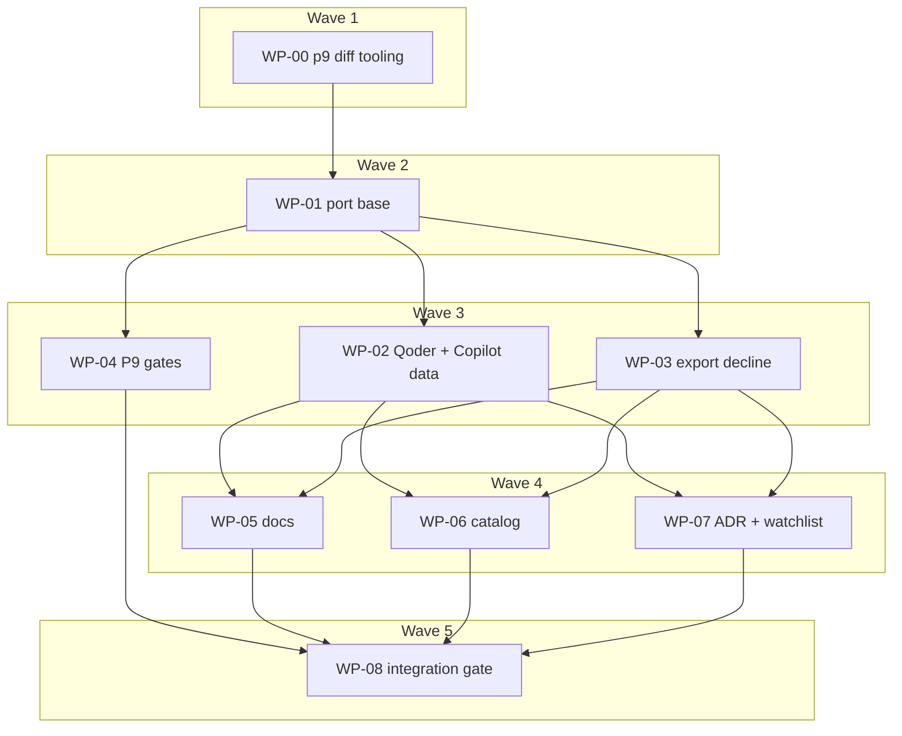

# Plan: Revive PR #98 (hooks artifact kind) for release

## Status

- **Plan:** plan_hooks_pr98_revival
- **Active phase:** 2 — Reviewed (L3 approved after one fix round)
- **Step:** /hex-review → done; next /hex-finalize
- **Last update:** 2026-09-28 (WP-08: every § Verification gate 1–8 green on the branch head; gate 9 is the lead's push)
- State:   done
- Tier:    xhigh
- Tier-grammar: 5
- Effective-tier: derived
- Updated: 2026-09-28
- Next:    
- Reviewed: 4503988a

---

## Header

- **Source:** `.agents/discussions/hooks-pr-98-revival.md` (ratified 2026-09-28 → loop)
- **Goal contract:** `.agents/goals/hooks-pr-98-revival.md` § Definition of done
- **Vehicle:** branch `hex/hooks-pr-98-revival` (on `origin/main` 3194d0dd). The PR
  [grimoire-rs/grimoire#98](https://github.com/grimoire-rs/grimoire/pull/98) diff is
  squashed and applied **once** onto this branch as the port base; this branch
  supersedes #98 as the vehicle (loop-lead instruction, 2026-09-28 — see D-1).
- **Feature design (binding, arrives with the squash):** `.agents/adr/adr_hooks_support.md`
  (C-001…C-014), `.agents/adr/adr_hook_workspace_consent.md`,
  `.agents/plans/plan_hooks_artifact_kind.md` (C-015…C-026, S-001…S-016).
- **Port design record (canonical contract text):** `.agents/specs/design_hooks_pr98_revival.md`
  — C-101…C-160, S-101…S-120. This plan indexes it; it does not restate it.
- **Research:** `research_hooks_pr98_drift.md`, `research_hooks_upstream_2026-09.md`
  (discussion); `research_hooks_qoder_copilot_schemas.md` (this run).
- **Classification:** Large · one-way door (high) for the OCI wire format (hook kind,
  media type, annotations) and literals inside frozen reports; two-way for experimental
  surfaces carved out under `stability.md#unstable`, installer composition and projection
  rows (design record › Reversibility) · tier xhigh.

## Objective

Land hooks on current main as an **experimental, default-off** artifact kind:
ported onto main's extracted install seams and vendor rewrites, extended with
Qoder (global-only) and Copilot SessionStart/mutator evidence, declined by
`grim export plugin` with a warning, documented on the Starlight site, with the
PR's ADR facts corrected — and **zero on-disk change for hook-free projects**.

## Backwards compatibility (Principle 9 gate)

| Surface | Change | Proof |
|---|---|---|
| Lock, state, `grimoire.toml`, declaration hash | Gain content **only** when a hook is declared; empty `hooks` never serialized; `DECLARATION_HASH_VERSION` stays 1 (C-116) | Pinned golden `test/data/golden/pre_hooks_03e59b0` (never regenerated), run in deep verify with `GRIM_TEST_REGISTRY_HOST=localhost:5000` and `GRIM_REQUIRE_GOLDEN=1` (fails on any skip) (C-150) |
| Client output files (all vendors) | None for hook-free projects | `task p9:diff`: main's binary vs branch binary, identical roots, checkpoint diff after **every** command, named volatile-field mask only (C-151) — gates WP-01 |
| `.grimignore` | `hook.toml` never-ignored **for Hook artifacts only**; skills/rules/agents keep main's three names (C-160) | C-151 fixture: a skill carrying an ignored `hook.toml` |
| Flag off (`options.experimental.hooks` unset/false) | From a clean state: nothing hook-related written anywhere. On→off + `grim install`: every grim registration element and dispatch row removed; payload, launcher, consent record retained and documented (C-152) | `test_hooks_flag_off.py`, both scopes, all hook clients |
| Renderer self-heal | Re-converge writes zero bytes (C-124); re-materialize leaves `status` not-modified | Unit + acceptance |
| JSON outputs | Additive only — the closed list in § JSON interface (C-153) | Schema snapshot tests + `p9_diff` stdout key allow-list |
| Config key | `options.experimental.hooks` **appended** at index 10, `subsystem-config-keys.md`-conformant text, no "never run" overpromise (C-153) | `config_key_metadata_matches_published_schema` |
| Env vars | None added (C-154) | Inertness test for `GRIM_EXPERIMENTAL_HOOKS` / `GRIM_ALLOW_HOOKS` |
| Migration / reaper | None: hooks never shipped. PR's pre-SEC-1 payload reaper **dropped** (D-6) | — |
| Downgrade | Hook-bearing lock on older grim → 78 (S-112); hook-free project downgrades cleanly | Documented in `stability.md` › Forward compatibility |

**Constitution deviations** (Principle 9, both additive per `stability.md` › Additive
fields; `subsystem-cli-api.md` forbids `skip_serializing_if`, so both are always present):
1. `grim status --format json` gains `arming: []` on every item, hook-free included.
2. `grim install --format json` rows gain `armed: null` for every non-hook kind (D-20).
On-disk bytes unchanged (C-151).

## TDD approach

Each WP runs Stub → Specify → Implement → Review. Specify writes failing tests
from the C-/S- IDs **before** code: Rust unit tests beside the seam (`#[cfg(test)]`),
pytest acceptance under `test/tests/`. Tests ported from the PR carry over verbatim
(their C-IDs stay binding); new tests cite C-1xx/S-1xx in the docstring. Every
builder answers the mutation question as a deliverable: *which single-token
mutation would make this wrong, and does a test fail on it?* — run empirically,
then reverted. `cp -f target/release/grim test/bin/grim` (or go through `task`)
before any pytest run; `task --force verify` is the only trusted full gate.

## JSON interface

Additive only; this is the **closed** list (C-153). Anything else changing is a Block.

- `grim status --format json`: `kind: "hook"` rows; `arming: []` on every item;
  state literals `gated`, `not-armed`, `untrusted` (D-24).
- `grim install --format json`: `armed` on every row (`null` for non-hook kinds); hook rows per PR C-010. `add`/`update` rows unchanged (D-20).
- `grim hook list --format json`: new report (PR `src/api/hook_report.rs`).
- `grim schema --kind hook`: new CLI value + schema; `--kind config`: `experimental`
  property and `hooks`; `--kind lock`: `hooks` (committed snapshot
  `src/lock/testdata/lock.schema.json` updated); bundle source schema: `hooks`.
- `grim config list`: one appended row.
- `grim schema --kind publish`: `hooks` property (D-14).
- Hook arming cause literal `surface-user-owned` (D-16) in install/status JSON.
- `grim export plugin --format json`: `items[].omitted[]` may carry
  `{"kind":"hook","name":…,"reason":"not-representable"}` (Claude family) or
  `"reason":"no-format-surface"` (families without a hook file) — new `kind` literal only (C-142).

Experimental carve-out (WP-05 writes it into `stability.md#unstable`): `grim hook` verbs
and report JSON, `grim schema --kind hook`, `options.experimental`, `hook.toml`,
`[hooks]`, lock `hooks` may change while experimental. One-way: the literals above
inside already-frozen reports, and the OCI wire format (`grim build/release --kind hook`
are not flag-gated).

## Exit codes

Per `quality-rust-exit_codes.md`, classified in `src/error.rs`. One existing-code change, from D-21/D-23 (issue #90): a declaration key that is not a path-safe segment now refuses for **every** kind.

| Case | Code |
|---|---|
| Hook install with flag off / unconsented / client lacks surface | 0 (warning + `gated`/`not-armed` row) |
| Hook surface file unparseable for one client | 0, that client `not-armed` + warning (C-017) |
| Reserved or charset-invalid hook binding name | 64 (S-111, C-109) |
| `grim add ./dir --kind hook` (path source) | existing `UnsupportedPathKind` mapping (S-110) |
| Invalid `hook.toml` at `grim build` | 65 (`Error::Hook` → DataError) |
| Modified `hook.toml` on `grim install` without `--force` | 65, same as a modified skill (S-116; D-15) |
| `grim remove` of an armed hook | 0 + warning it stays armed until install/uninstall (C-155, S-120) |
| Export with a hook member plus ≥1 emitted member | 0 + warning (C-141) |
| Export whose only members are hooks | 65 via existing `EmptyPlugin` |
| Older grim reading `[[hooks]]` lock | 78 (existing) |
| Tampered `dev = true` hook record on `grim update` | 0 + warning, no panic (C-111) |
| Traversing / drive-relative declaration key, any kind (D-21, D-23) | 65 in `grimoire.toml`, 78 in `grimoire.lock` — **a behaviour change on hook-free configs**; land as its own `fix:` commit at finalize with a CHANGELOG line |
| Hook payload edited since install, any converging command | 0 + warning, hook disarmed until `grim install --force` (review round, 6ff7ef56) |

## Component contracts (index — canonical text in the design record)

| IDs | Area | WP |
|---|---|---|
| C-151 differential run vs main (tooling) | `test/tools/p9_diff.py`, `taskfiles/p9.taskfile.yml` | WP-00 |
| C-001…C-014 (ADR), C-015…C-026 (PR plan; C-022/C-024/C-026 withdrawn) | Feature contracts, ported verbatim with their tests | WP-01 |
| C-101 hook gates in `install_one` (+ policy `debug_assert!` in callers); C-102 staging; C-103 `client_supports_kind` (Qoder `false` in WP-01); C-104 `converge_for(policy, state, workspace, scope, roots)` at every sync loop, count-equality + behavioural tests; C-105 write-free short circuit | `installer.rs` | WP-01 |
| C-106 hook interception with `grim_home` carried on `InstallTarget`; C-107 `expected_outputs` needs no hook code (Qoder `false` in WP-01) | `target.rs`, `expected_outputs.rs` | WP-01 |
| C-108 `materialize_hook` via `MaterializeRequest` | `client_target.rs` | WP-01 |
| C-109 `declare_reference` + hooks; C-110 `install_added` attaches policy | `add.rs` | WP-01 |
| C-111 dev refresh never packs a hook; C-112 `update` converges after its loop | `update.rs` | WP-01 |
| C-113 TUI: delete paths empty consent set; install/update paths pass new lock's declared hooks (drift gates, never grants); WP-H direct hook-row refusal kept | `tui/app.rs` | WP-01 |
| C-114 `parse_artifact_map` kind arm | `project_config.rs` | WP-01 |
| C-115 prune onto `iter_artifacts`; C-116 lock/declaration serialization | `grimoire_lock.rs`, `prune.rs` | WP-01 |
| C-117 one escaping helper (keep main's `json_string`) | `json_splice.rs` | WP-01 |
| C-118 relative `--config` → absolute workspace (PR 2a436191) | `scope_resolution.rs` | WP-01 |
| C-153 config key + closed JSON list; C-154 no env var; C-155 `grim remove` armed-hook warning | `config_keys.rs`, `declaration.rs`, `remove.rs`, `api/*` | WP-01 |
| C-160 `hook.toml` never ignored for Hook artifacts only | `ignore_set` | WP-01 |
| C-140 minimal compile arm `(_, Hook)` in `admits` | `src/export/family.rs` | WP-01 (arm) → WP-03 (final) |
| C-120 Qoder surface; C-121 Qoder evidence gate; C-122 per-cell rows (mutator declined); C-123 MCP coexistence; C-124 self-heal | `vendor_qoder.rs`, `oci/hook.rs`, `hook_registrar.rs` tests | WP-02 |
| C-130 Copilot mutator field chosen by live probe (`updatedInput` → `modifiedArgs` → Declined); C-131 SessionStart context on live probe; C-132 `modifiedArgs` emitted only if probe selects it; C-133 no `.github/hooks/` writes | `oci/hook.rs` | WP-02 |
| C-140 family-aware reason literal, never fetched; C-141 one warning per hook per plugin; C-142 README/JSON reuse existing omitted channels | `src/export/*` | WP-03 |
| C-150 golden in CI; C-152 flag-off (clean state / on→off) | CI, tests | WP-04 |
| C-013 `clients.md` hook column — data in WP-01, Qoder cell WP-02, prose WP-05 | docs | WP-01, WP-02, WP-05 |

Plan-level contracts (defined here):

- **C-170 — Starlight docs.** One use-case page under `docs/src/content/docs/` with
  YAML frontmatter, `<!-- doc_type: how-to -->`, `<!-- doc_tier: integration -->`, the
  experimental marker `**Experimental pre-1.0**; see [Stability](./stability.md#unstable)`,
  a `stability.md#unstable` bullet with the carve-out above, the Frozen `.grimignore` row
  amended for the Hook-only `hook.toml` exception, a sidebar entry in
  `docs/astro.config.mjs`, and hook prose in `artifacts.md`, `commands.md`,
  `json-interface.md`, `clients.md`, `configuration.md`, `vendor-metadata.md`,
  `concepts.md`, `mcp-servers.md` (install order), `package-index.md` (`kind` enum),
  `publishing.md`. `docs/src/hooks.md`, `docs/src/SUMMARY.md`, `docs/src/clients.md`
  do not exist on the branch. `use-cases.yaml` exclusion `X06` becomes a task row.
  *Tests:* `task docs:check`; `test_docs.py` asserts the page is in the sidebar and its
  command fences are covered by the doc-example harness; the PR's
  `HookArmingCause`-documented test passes against the Starlight path.
- **C-171 — catalog drift.** `grim-usage`, `grim-authoring` (incl. `references/hook-spec.md`),
  `ai-config-authoring` describe the shipped hook CLI (Qoder outcome, Copilot outcome,
  export decline, flag); `catalog/taskfile.yml` `verify` sources include `hooks/**` and
  build catalog hooks. *Tests:* `task catalog:verify`; `grim build` of each `catalog/hooks/*` exits 0.
- **C-172 — ADR corrections and amendments.** Gemini `trusted_hooks.json` →
  `trustedFolders.json` at all ten sites (ADRs corrected in place; PR research files get
  a dated correction note, not a rewrite); OpenCode stated plugin-API-only; Copilot
  mutator field and `SessionStart.additionalContext` per WP-02 probe, cloud agent
  supports hooks upstream but stays excluded (D7, deliberate); Claude PostToolUse/Stop
  shapes per WP-02 probe; amendments **A7** (export decline) and **A8** (Qoder), one
  changelog row each in `adr_hooks_support.md`, plus a changelog row in
  `adr_harness_plugin_export.md` (its admission list enumerates kinds).
  *Test:* `rg trusted_hooks.json .agents/adr` returns only the correction note.
- **C-173 — watchlist hook rows.** `.claude/rules/vendor-capability-watchlist.md` gains
  rows dated 2026-09-28: Qoder hooks (surface, unknown-key tolerance, mutator declined,
  `http` handler), Copilot mutator dialect + SessionStart context + cloud agent (D7),
  Cursor allow/ask non-enforcement, OpenCode plugin-API-only, Claude PostToolUse/Stop
  shape and unknown-key warning behaviour. *Test:* `task claude:tests` + one `rg`
  assertion per row topic.

## User-experience scenarios (index — canonical text in the design record)

PR scenarios S-001…S-016 carry over (WP-01). New:

| ID | Scenario | WP · test |
|---|---|---|
| S-101 | Upgrade, hook-free project → `unchanged`, no write; status JSON gains exactly `arming: []` | WP-00 `p9:diff` + WP-04 `test_hooks_flag_off.py::test_hook_free_upgrade_is_unchanged` |
| S-102 | Declare with flag off → locked, `gated`/`feature-off`, nothing written | WP-04 `test_hooks_flag_off.py` |
| S-103 | Global arming across claude/codex/copilot(/qoder); unparseable surface → `not-armed`, exit 0 | WP-02 `test_hooks_qoder.py::test_global_arming_across_clients`, `::test_unparseable_surface_not_armed` |
| S-104 | Qoder at project scope → skipped with warning pointing at `--global` | WP-02 `test_hooks_qoder.py` |
| S-105 | User's own Qoder hooks + MCP entry survive arm/re-arm/uninstall | WP-02 `test_hooks_qoder.py` (pass branch) |
| S-106 | Qoder unverifiable → declined, warning, `clients.md` ✗ | WP-02 `test_hooks_qoder.py` (decline branch) |
| S-107 | Copilot mutator rewrites via the probe-selected field | WP-02 `test_hooks_copilot.py` + unit projector test |
| S-108 | Copilot SessionStart context delivered iff probe admitted | WP-02 `test_hooks_copilot.py` |
| S-109 | Export with hook member → warning, README line, JSON row, exit 0; hooks-only → 65 | WP-03 `test_export_hooks.py` |
| S-110 | Path-source hook → existing `UnsupportedPathKind` | WP-01 (ported) |
| S-111 | Reserved binding name → 64 | WP-01 (ported) |
| S-112 | Older grim, hooks lock → 78 | WP-01 (ported PR S-014) + WP-05 doc |
| S-113 | TUI delete of a hook reaps registration without prompt; direct TUI hook-row install still refused | WP-01 unit tests at all three delete sites |
| S-114 | Relative `--config` isolates repos | WP-01 (ported 2a436191 test) |
| S-115 | Tampered dev record → warning, no panic | WP-01 unit |
| S-116 | `__pycache__` byproduct stays `installed`; `hook.toml` edit → `modified` | WP-01 acceptance |
| S-117 | Copilot cloud agent: nothing under `.github/hooks/`, documented | WP-02 `test_hooks_boundary.py` extension + WP-05 doc |
| S-118 | Reader reaches the hooks page from the sidebar and runs flag → add → install → allow → status | WP-05 `test_docs.py` sidebar + doc-example assertions |
| S-119 | TUI bundle install adding a hook member in a consented workspace → `gated`, nothing armed | WP-01 unit |
| S-120 | `grim remove` of an armed hook → warning it stays armed | WP-01 acceptance |

## Parallelization

| WP | Scope (IDs) | Expected files | Size | Wave | Depends on | Review | Verify | Status |
|---|---|---|---|---|---|---|---|---|
| WP-00 | P9 differential tooling: C-151; S-101 (disk) | `test/tools/p9_diff.py` (new, incl. `--self-test`), `test/tools/p9_fixtures/**` (new), `taskfiles/p9.taskfile.yml` (new), `taskfile.yml` (include) | S | 1 | — | risk | scoped | merged |
| WP-01 | Port base: squash-apply; resolve all 37 conflicts; C-001…C-026 (ported), C-101…C-118, C-140 (compile arm), C-153…C-155, C-160, C-013 (data); S-001…S-016, S-110…S-116, S-119, S-120 | all PR-touched `src/**` + `src/export/family.rs` (arm), `test/**` (PR modules, `runner.py`, `test_config_registry.py`, `test_docs.py`, `manual/README.md`, `uv.lock`), `Cargo.{toml,lock}`, `.github/workflows/verify-deep.yml`, `.claude/rules*`, `AGENTS.md`, `catalog/**` (conflict union), `.agents/**` (PR artifacts), `taskfiles/bench.taskfile.yml`, `taskfile.yml`, `docs/**` (reset to main + data tables in `clients.md`, `json-interface.md`, `vendor-metadata.md`) | XL | 2 | WP-00 | risk | full | merged |
| WP-02 | Vendor data + probes: C-120…C-124, C-130…C-133, C-103/C-107 Qoder flip; S-103…S-108, S-117 | `src/install/vendor_qoder.rs`, `src/oci/hook.rs`, `src/install/hook_registrar.rs` (tests), `src/install/installer.rs` + `expected_outputs.rs` (test modules only), `docs/src/content/docs/clients.md` (Qoder cell), `.agents/research/research_hooks_qoder_copilot_schemas.md`, `test/tests/test_hooks_qoder.py` (new), `test/tests/test_hooks_copilot.py` (new), `test/tests/test_hooks_boundary.py` | M | 3 | WP-01 | risk | full | merged |
| WP-03 | Export decline final: C-140…C-142; S-109 | `src/export/family.rs`, `src/export/stage.rs`, `test/tests/test_export_hooks.py` (new) | S | 3 | WP-01 | — | scoped | merged |
| WP-04 | P9 gates: C-150, C-152; S-101 (stdout), S-102 | `.github/workflows/verify-deep.yml`, `test/tests/test_golden_pre_hooks.py`, `test/tests/test_hooks_flag_off.py` (new) | M | 3 | WP-01 | risk | full | merged |
| WP-05 | Docs prose: C-170, C-013 prose; S-112/S-117 doc, S-118 | `docs/src/content/docs/**`, `docs/astro.config.mjs`, `.agents/discovery/use-cases.yaml`, `test/tests/test_docs.py` | M | 4 | WP-02, WP-03 | — | scoped | merged |
| WP-06 | Catalog drift: C-171 | `catalog/skills/**`, `catalog/taskfile.yml`, `catalog/hooks/**`, `catalog/descriptions/*` | S | 4 | WP-02, WP-03 | — | scoped | merged |
| WP-07 | ADR + watchlist: C-172, C-173 | `.agents/adr/adr_hooks_support.md`, `.agents/adr/adr_hook_workspace_consent.md`, `.agents/adr/adr_harness_plugin_export.md`, `.agents/research/{hooks_vendor_reports/gemini.md,research_hooks_trampoline.md,research_hooks_vendor_survey.md}`, `.claude/rules/vendor-capability-watchlist.md` | S | 4 | WP-02, WP-03 | — | scoped | merged |
| WP-09 | PR #98 follow-up fixes (lead instruction 2026-09-28): #90 declaration-key traversal, #93 dispatch table cap, #88 hooks dir mode, #94 hook list Client column | `src/path_safety.rs` (new), config/lock parse, `installer.rs`, `hook_dispatch.rs`, `hook_registrar.rs`, `command/hook/list.rs`, tests | M | 4 | WP-01…WP-04 | risk | full | merged |
| WP-08 | Integration gate (§ Verification) | fixes only, in whichever file a gate names | M | 5 | WP-04…WP-07 | risk | full | done |

- **Critical path:** WP-00 → WP-01 → WP-02 → WP-05 → WP-08.
- **WP-00 alone in wave 1 (justified):** WP-01's checkpoint-A and merge gates run `task p9:diff`, so the tool must land first; it is small (S).
- **Shippable after wave:** 3 — hooks work end to end on main's seams, export is
  safe, Principle 9 proven; wave 4 is the docs/catalog/record conformance the goal requires before merge.
- **Merge plan (serialized topological order):** WP-00 → WP-01 → WP-02 → WP-03 →
  WP-04 → WP-05 → WP-06 → WP-07 → WP-08. WP-01's checkpoint-A and merge gates
  include an empty `task p9:diff`. Same-wave WPs are file-disjoint; files touched
  in more than one wave (`verify-deep.yml`, `taskfile.yml`, `test_docs.py`,
  `clients.md`, `family.rs`, `installer.rs`/`expected_outputs.rs` test modules) are
  sequential across waves, never concurrent.
- **Why WP-01 is one XL serial unit:** adding `ArtifactKind::Hook` breaks every
  exhaustive match crate-wide (incl. main's `export/family.rs`), so no slice compiles
  alone; `installer.rs` is rewritten by both branches (design record § 5). No safe
  PR-level split exists (a cargo-feature gate adds a build matrix for a runtime flag —
  YAGNI). Two internal checkpoint commits instead: after step 2 (Hook exists, every seam
  refuses it; `task rust:verify` + `task p9:diff` green) and after step 3 (seams ported,
  `cargo check` green).
- **Effective-tier histogram:** xhigh ×1 (WP-01), high ×4 (WP-00, WP-02, WP-04, WP-08),
  medium ×4 (WP-03, WP-05, WP-06, WP-07).

## Executable phases (per WP)

### WP-00 — P9 differential tooling (S, risk)

Specify: `p9_diff.py --self-test` proves it reports a planted one-byte difference and a
planted missing file, and fails when a command exits non-zero or produces no output.
Registry: the task starts an ephemeral `registry:2` on a free port; fixtures are the
committed dirs under `test/tools/p9_fixtures/` (skill incl. one with an ignored
`hook.toml`, rule, agent, mcp, bundle), published **once with main's binary** as v1,
with a v2 published between the `install` and `update` steps; both binaries consume
the same registry and bytes.
Implement `test/tools/p9_diff.py` + `taskfiles/p9.taskfile.yml` (`task p9:diff`):
build `origin/main`'s `grim` (cached by SHA) and the branch `grim`; run the hook-free
scenario list (C-151: init, add skill/rule/agent/mcp/bundle, install, update,
uninstall, remove, both scopes, every detectable client, relative `--config`, and a
skill carrying an ignored `hook.toml`) sequentially under the **same** absolute temp
root, `HOME`, `GRIM_HOME`; diff the tree after **every** command, sorted walks; mask
only the named volatile fields; stdout JSON compared against the C-153 allow-list.
Add the `p9` include to `taskfile.yml`. Deep verify only (not in `task verify`). Commit `test: …`.

### WP-01 — Port base (serial, XL, risk)

1. **Squash-apply.** `git merge --squash origin/hex/hooks-artifact-kind`. Then:
   `.claude/rules*`, `AGENTS.md`, `catalog/**`, `test/manual/README.md` → union (main's
   text wins on overlap, hook additions appended); `.agents/memory/hex.md` → main's;
   `Cargo.lock` regenerated; `test/uv.lock` → fresh `uv lock` (drop e240418a's diff);
   `verify-deep.yml` → main's SHAs + macOS row, PR's Windows `gate`/`GRIM_ALLOW_NO_REGISTRY`
   on the Windows row only; `test_config_registry.py` → one skip (main's reason);
   `test/src/runner.py` keeps main's `HOST_MANAGED_CLAUDE_CONFIG_DIR`, `APPDATA`, UTF-8
   decode. **Docs:** `git checkout HEAD -- docs/` and remove the re-added
   `docs/src/{SUMMARY,clients,hooks}.md` (git rename-follow auto-merged PR text into
   seven Starlight pages — revert all of it); then re-add only the **data** the ported
   tests parse: the `clients.md` Hook column, the `json-interface.md` hook cause table,
   the `vendor-metadata.md` hook keys; re-point every ported `docs/src/*.md` read to
   `docs/src/content/docs/*.md` (`client_target.rs`, `vendor_claude.rs`,
   `vendor_codex.rs`, `catalog_service.rs`, `test_docs.py`).
2. **Stub + checkpoint A.** `ArtifactKind::Hook`, `Error::Hook`,
   `CommandError::HookConsentUsage` (reserved and charset-invalid hook names route
   through main's existing `InvalidBindingName` → 64; the PR's `ReservedBindingName`
   variant is not ported, C-109), net-new PR modules verbatim
   (`src/hook/**`, `src/command/hook/**`, `src/oci/hook.rs`, `hook_dispatch.rs`,
   `hook_launcher.rs`, `hook_registrar.rs`, `hook_consent.rs`, `api/hook_report.rs`),
   every seam arm refusing Hook, `export/family.rs` `(_, Hook) => Err(NoFormatSurface)`.
   Gate: `task rust:verify` + empty `task p9:diff`. Checkpoint commit.
3. **Implement seams** C-101…C-118 against main's shapes: mechanical files first
   (`config*.rs`, `error.rs`, `main.rs`, `install.rs`, `grimoire_lock.rs`, `status*.rs`,
   `local_pack.rs`, `vendor.rs`), then `client_target.rs`, `expected_outputs.rs`,
   `add.rs`, `update.rs`, `remove.rs` (C-155), `project_config.rs`, `tui/app.rs`
   (C-113 split), `ignore_set` (C-160), and `installer.rs` + `target.rs` last as one
   unit. Mandatory read-through (not trust) of auto-merged `vendor_claude.rs`,
   `vendor_codex.rs`, `target.rs`. Checkpoint commit at `cargo check` green.
4. **Specify.** Port PR tests; add failing tests for C-101…C-118, C-153…C-155, C-160,
   S-110…S-116, S-119, S-120: C-103/C-107 over `ClientTarget::ALL` with Qoder `false`
   at both scopes; C-104 per-file count equality + behavioural reaping at uninstall and
   the three TUI delete sites; C-113 consented-workspace TUI bundle install → `gated`;
   C-153 schema snapshots (incl. `lock.schema.json`).
5. **Implement** until green: `task rust:verify`, PR hook acceptance modules, empty `task p9:diff`.
6. **Review-Fix Loop** (spec, quality, security — hook arming is a code-exec surface;
   stability). Commit `feat(hook): …` citing #98, `--signoff`.

### WP-02 — Qoder + Copilot vendor data (M, risk)

1. **Evidence first** (append to `research_hooks_qoder_copilot_schemas.md`, dated, with
   CLI versions): C-121 — Qoder CLI page `docs.qoder.com/cli/hooks-reference` (shape)
   and unknown-key tolerance (doc or probe; `qodercli` not installed locally — try to
   install; else decline). C-130 — live `copilot` probe: PascalCase PreToolUse rewrite via
   `hookSpecificOutput.updatedInput`; if not applied, top-level `modifiedArgs`; else
   Declined ([github/copilot-cli#2013](https://github.com/github/copilot-cli/issues/2013)
   contests the PR's result). C-131 — Copilot SessionStart nonce probe. One live `claude`
   probe: PostToolUse/Stop response shapes and whether the `com.grimoire.managed` marker
   triggers a startup warning.
2. **Stub** `QoderVendor` overrides (C-120) — or keep `hook_surface() → None` (D-4).
3. **Specify** one test per outcome: pass branch — S-103 four-client arming, S-104,
   S-105 (C-123 seeded `settings.json`), C-124 zero-byte re-converge for all four clients,
   C-103/C-107 flip Qoder global `true`; decline branch — S-106 and Qoder stays `false`.
   Always: C-021 agreement covers new rows; qoder mutator `Declined`; C-132 projector
   emits only the probe-selected field; C-133/S-117 `.github/hooks/` absence in
   `test_hooks_boundary.py`; `clients.md` Qoder cell matches `hook_matrix_cell`.
4. **Implement** rows per C-122 / C-130 / C-131 outcomes; fix Claude rows if the probe
   contradicts them (record for WP-07).
5. Review (spec, security). Commit `feat(hook): …`.

### WP-03 — Export decline (S)

Specify: `family.rs` matrix Hook column (`not-representable` for the Claude family,
`no-format-surface` elsewhere — confirm per family), counting-access zero-fetch test,
`test_export_hooks.py` (S-109 incl. hooks-only → 65, warning substring
`hook '<name>' omitted from plugin '<plugin>'`, README `Omitted for …` line, JSON row).
Implement the reason split in `admits` and the C-141 warning in `stage_members`. Review
(spec). Commit `feat(export): …`.

### WP-04 — Principle 9 gates (M, risk)

Specify first: `test_hooks_flag_off.py` — C-152(a) clean state writes nothing (both
scopes, claude/codex/copilot/qoder surfaces; the Qoder assertion is binding only in
WP-08's full run), C-152(b) on→off reaps registrations and dispatch rows while payload,
launcher, consent remain, S-101 stdout (`arming: []` / `armed: null` only), S-102; golden module fails
under `GRIM_REQUIRE_GOLDEN=1` on any skip and asserts both tests ran. Implement the
deep-verify steps: `registry:2` on `localhost:5000`, `GRIM_TEST_REGISTRY_HOST=localhost:5000`,
`GRIM_REQUIRE_GOLDEN=1`, golden module alone; `task p9:diff`. Review (stability, quality). Commit `test(hook): …` / `ci: …`.

### WP-05 — Docs (M)

Author from the **source code on the branch, not from this plan** (this brief
included). C-170 in full; `clients.md` prose around the WP-01/WP-02 data incl.
cloud-agent exclusion (S-117); S-112 in stability › Forward compatibility; S-118
tests. Gate `task docs:check` (Node 24). Review (docs-quality). Commit `docs(hook): …`.

### WP-06 — Catalog drift (S)

`catalog/README.md` drift procedure for the three skills; `hooks/**` in
`catalog/taskfile.yml` verify sources + build branch. Gate `task catalog:verify`.
Commit `docs(catalog): …`.

### WP-07 — ADR corrections + watchlist (S)

C-172 edits + A7/A8 changelog rows + `adr_harness_plugin_export.md` row; C-173 rows
citing WP-02 evidence, one `rg` assertion per row topic. Gate `task claude:tests`.
Commit `chore(agents): …`.

### WP-08 — Integration gate (M, risk)

Run every item of § Verification from the main checkout with explicit paths; fix what a
gate names in the owning file; spec convergence (every C-/S- ID has a passing test).
Hand off to `/hex-review` → `/hex-finalize`.

## Verification

Each must pass on the branch head before `/hex-review`:

1. `git merge-tree --write-tree origin/main HEAD` exits 0, no conflicts.
2. `task --force verify` green (never the cached `task verify`).
3. `task docs:check` green (Node 24).
4. `task catalog:verify` and `task claude:tests` green.
5. `task p9:diff` — empty tree diff at every checkpoint, stdout within the C-153 allow-list.
6. Golden: `registry:2` on `localhost:5000`, `GRIM_TEST_REGISTRY_HOST=localhost:5000`,
   `GRIM_REQUIRE_GOLDEN=1` → both golden tests executed and passed.
7. Windows: `/mnt/c/Users/ecom/grim-wintest/run.sh <worktree>` and the same on an
   `origin/main` checkout; a red counts against the branch only if absent on main
   ([grimoire-rs/grimoire#159](https://github.com/grimoire-rs/grimoire/issues/159) is
   known); rerun `-n auto` flakes (WinError 10054) once before investigating.
8. New acceptance modules green: `test_hooks_qoder.py`, `test_hooks_copilot.py`,
   `test_export_hooks.py`, `test_hooks_flag_off.py`, plus the ported PR hook modules
   (`test_hook_arming.py`, `test_hook_consent.py`, `test_hook_decline_dispatch.py`,
   `test_hook_list.py`, `test_hook_run_runtime.py`, `test_hooks_boundary.py`,
   `test_hooks_lifecycle.py`, `test_bundle_hook_members.py`, `test_example_hooks.py`,
   `test_golden_pre_hooks.py`).
9. Fresh CI green on the new PR head (lead action — agents never push).

## Decisions recorded by the orchestrator (goal § Issue resolution)

- **D-1 Vehicle.** Discussion: "PR #98 stays the vehicle"; loop lead (2026-09-28): this
  branch supersedes #98. → Lead instruction wins; opening the new PR and closing/linking
  #98 is a lead action.
- **D-2 Qoder scope** → global-only (discussion recommendation; ADR A1).
- **D-3 Copilot cloud agent** → stays excluded (D7), recorded as deliberate in the ADR and watchlist.
- **D-4 Qoder unverifiable** → ships declined (`hook_surface() → None`) with a watchlist row;
  mutator declined for Qoder regardless. Goal DoD box "Qoder hooks … wired" is then
  evidenced by the decision record, the decline test (S-106) and the watchlist row — the
  lead should cite those, not report `not met`.
- **D-5 Copilot "modifiedArgs" criterion.** The PR ships `updatedInput` (PascalCase
  dialect, live-verified then; now contested upstream). → C-130 is a live-probe gate:
  whichever field applies is emitted (`modifiedArgs` if selected); neither → Declined.
  The DoD box is evidenced by the probe transcript + the row.
- **D-6 Pre-SEC-1 payload reaper** → dropped; the layout never shipped.
- **D-7 Golden fixture** → deep verify only, fail-not-skip when required.
- **D-8 Golden not regenerated** → its value is the pin at `03e59b0`; C-151 covers what it cannot.
- **D-9 `armed: null` on hook-free rows** → kept always-present (`subsystem-cli-api.md`
  bans `skip_serializing_if`); second constitution-deviation row.
- **D-10 Export reason literal** → `not-representable` for the Claude family,
  `no-format-surface` where a family has no hook file (frozen report literal, decided deliberately).
- **D-11 TUI consent** → delete paths empty set; install/update paths pass the new lock's
  declared hooks, so a newly added hook member is gated, never granted (architect B-1).
- **D-12 Deferred disarm** → `grim remove`, `grim hook revoke`, flag-off take effect at
  the next converging command (PR design); `grim remove` warns (C-155); config-key text
  no longer claims "never run". Runtime gate in `grim hook run` deferred (issue 4).

- **D-13 C-118 changes hook-free stdout.** `p9:diff` showed `$.items[*].target` relative on main, absolute on the branch, for a relative `--config` (disk bytes identical). Accepted as the intended C-118 bug fix (matches default discovery's absolute paths); `p9_diff.py` carries the single named equivalence `c118-relative-config-target`. Design record wording "proven not to move any hook-free byte" holds for disk only.
- **D-14 `grim schema --kind publish` gains `hooks`.** Additive; appended to the closed list (WP-01 review B3).
- **D-15 Exit table corrections from WP-01 specification.** A hand-edited `hook.toml` on install exits 65 like a modified skill (the refusal is reached only when install would arm); S-119's cause is `consent-drifted`, not `workspace-not-consented`; `config list --all` inserts the new row after the fixed keys so `registry.*`/`plugin.*` rows shift by one — the same precedent as main's `search_min_relevance` (c488fae4), so "appended" means appended to `ConfigKey::ALL`; C-105 global excludes `$GRIM_HOME/state`, which main already rewrites; S-112 proven by mechanism (unknown lock table → 78).
- **D-16 Whole-file hook surfaces are grim's only by digest.** Security review B1: the PR deleted/overwrote a user's own `~/.codex/hooks.json` even flag-off. Now Codex `hooks.json` and Copilot `hooks/grim.json` are grim-owned only while their bytes match a SHA-256 under `$GRIM_HOME/hooks/owned_files/`; otherwise the client is `not-armed` with the new additive cause `surface-user-owned`, never written or deleted. No `--force` adopt path exists in convergence; ADR D7a (exit 65 + `--force`) is corrected in WP-07.
- **D-17 Hook consent never reads the global config while the flag is off** (review B1: a malformed global config turned hook-free install/update/add into exit 78). `grim build` infers `SKILL.md` before `hook.toml` (review B2). Plain install/status tables show `Armed`/`Note` columns only when a hook row is present. `--no-trust-hooks` writes no consent record; `grim hook run` has one run-wide deadline below the shortest registered timeout; disarm failures report a distinct outcome.
- **D-18 Deferred security suggestions** (WP-01 review, not blocking): project-scope writes following a committed `.claude` symlink (S1), hook-run stdin hang cases (S4), PowerShell curly-quote escaping in unwired code (S6) → follow-up issue 5.
- **D-19 Qoder ships armed (global-only, mutator declined) on source evidence.** C-121(b) asked for a live invocation or an upstream statement. `qodercli` 1.1.64 installed, but no login, so no hook ran. Evidence accepted in lieu: Qoder's own handler schema admits extra keys, and a control file with a bad `timeout` raises a diagnostic while the `com.grimoire.managed` marker raises none — the whole-file-drop risk (b) guards against is excluded. Residual (live execution unverified) recorded dated in the research file, a watchlist row (WP-07) and follow-up issue 2.
- **D-20 Shipped literals win over the design record's drafts.** The flag-off cause is `feature-flag-off` (not `feature-off`); `grim update|add --format json` rows keep main's exact key sets (no `armed`), which the closed list permits — it caps additions, it does not require them. A failed surface sync reports a new additive not-armed cause instead of reading as armed (WP-02 review B2).
- **D-21 Declaration-key validation (#90) keeps every key main installed.** Keys are split on `/` and `\\`; a leading separator, a drive prefix on the first part, an empty part, a dots-and-spaces-only part, or NUL is refused before any write (exit 65 in `grimoire.toml`, 78 in `grimoire.lock`, like other lock errors). `team/style` and `x:y` install where main put them; `x:y` is refused on Windows only, where it is drive-relative and escapes. Install also checks the landing path before writing.
- **D-22 Pre-existing security finding, recorded by reference only (goal § Issue resolution 7).** Location: project-scope materialization through a repository-committed client directory symlink (`src/install/installer.rs`, write path). Class: path escape via symlinked parent (CWE-59). Present on `origin/main` 3194d0dd; not introduced here; reported in full in the DONE block, not filed as a public issue.
- **D-23 PR #98 follow-up issues.** Fixed here: grimoire-rs/grimoire#90, #93, #88, #94. Deferred unchanged (design decisions or measurements, not Block-tier on the ported code): #85, #86, #87, #89, #91, #95, #96, #97.
- **D-24 `untrusted` joins the closed list.** The ported status report emits the state literal `untrusted` on hook rows (registry not trusted for hooks); additive, hook rows only, never on a hook-free project. The closed list's state literals are `gated`, `not-armed`, `untrusted`.
- **D-25 WP-08 gate record (head 8d28fd16, origin/main 3194d0dd).** merge-tree clean; `task --force verify` 1545 passed / 2 skipped (golden, by design) / 1 xfailed; `task docs:check`, `task --force catalog:verify`, `task --force claude:tests` (91) green; `task --force p9:diff` 35 checkpoints, 0 differences; golden on `registry:2` with `GRIM_REQUIRE_GOLDEN=1` 2/2 passed. Windows: branch 2 errors (`test_login.py` verify pair, zot absent on the Windows PATH), main the same 2 plus 2 failures (`test_clients.py::test_reserved_namespace_key_dropped_for_own_client_warns_by_name`, `test_droid.py::test_droid_mcp_oauth_client_id_is_written_other_fields_skip`) — nothing branch-only. The branch's extra 129 Windows skips are the hook modules' declared POSIX-only v1 gate. No fixes were needed.
## Open questions

None open. Design-record questions resolved as D-4, D-6, D-7.

## Risks

| Risk | Mitigation |
|---|---|
| `installer.rs` port silently drops a main-side behaviour (rebind, roll-forward, reap) | `task p9:diff` gates WP-01 (WP-00 first); C-104 count + behavioural tests; full main test suite |
| Auto-merged vendor files carry a stale PR hunk into main's rewritten impl | WP-01 step 3 mandatory read-through |
| Git rename-follow smuggles PR docs text into Starlight pages | WP-01 step 1 resets `docs/` to main before re-adding data |
| Qoder marker key drops a user's own hooks | C-121 gate (b); decline on doubt (D-4) |
| Copilot mutator silently not applied | C-130 live probe gate (D-5) |
| Windows regressions masked by `GRIM_ALLOW_NO_REGISTRY` | Local run vs `origin/main` (§ Verification 7) |
| Subagent reports green on a cached gate | `task --force verify` re-run by the orchestrator before each merge |

## Deferrals (follow-up issues to file — lead action)

1. **"Grim-free hook runtime for exported plugins"** — `grim export plugin` declines
   hooks because exported plugins run without grim; decide via `/hex-architect` between a
   TS/Python author SDK and a generated shim so hooks can ship inside plugins.
2. **"Enable the Qoder hook mutator on live evidence"** — Qoder documents `updatedInput`,
   but the mutator stays declined until a live `qodercli` probe proves the rewrite
   applies; also covers Qoder's `http` handler type (and Qoder hooks entirely if WP-02 declines them).
3. **"Run the pre-hooks golden fixture on every PR"** — it needs a registry on
   `localhost:5000`, which clashes with the dynamic-port session registry; today it runs in deep verify only.
4. **"Fail-closed runtime gate in `grim hook run`"** — `grim remove`, `grim hook revoke`
   and turning the flag off only disarm at the next `grim install`/`uninstall`; have the
   dispatcher re-check the flag and consent at fire time.
6. **"Run gatekeepers concurrently under the shared deadline"** — `pipeline.rs` runs gatekeepers and observers serially under one deadline, so a slow first hook can time out a later deny guardrail (L3 review, Warn).
7. **"Dedupe overlapping hook matchers"** — two registrations with different but overlapping matchers (`Bash`, `Bash|Edit`) both fire for one tool call, running a hook twice (L3 review, deferred part of e6872ff9).
8. **"Move hook config validation off the install layer"** — `src/oci/hook.rs` now imports `crate::install` to parse client names (new `oci → install` edge); also `hook::consent` ↔ `install::hook_dispatch` cycle (L3 review, architecture).
5. **"Harden hook arming edge cases"** — project-scope writes follow a committed `.claude` symlink; two `grim hook run` stdin-hang cases; PowerShell curly-quote escaping in the not-yet-wired launcher (WP-01 security review S1/S4/S6, D-18).
