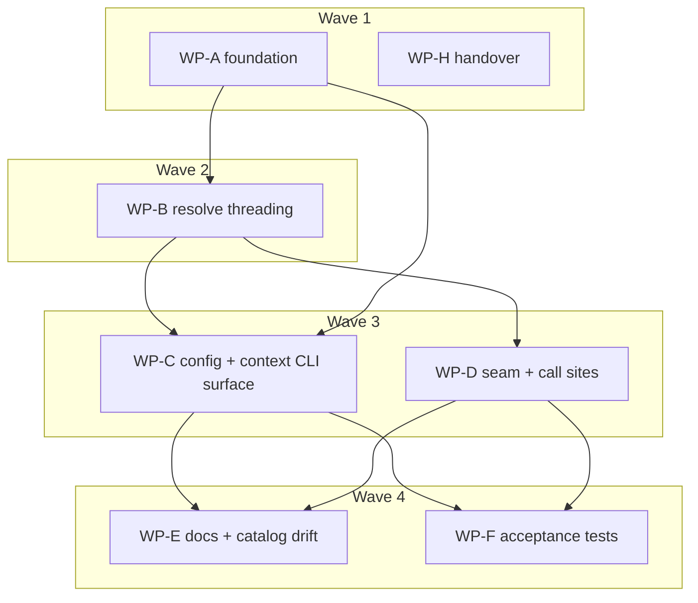

# Plan: Per-registry browse filters (`include` / `exclude`)

## Status

- **Plan:** plan_registry_browse_filters
- **Parent plan:** meta-plan_promotion_1_0 (resume after `Step: finalized`)
- **Active phase:** 3 — Second review convergence (waves 7–8)
- **Step:** finalized
- **Last update:** 2026-08-10 (after 62ebc4d: round-3 review + fix loop complete — 27 findings across 7 same-model perspectives plus a cross-model adversary, resolved into 5 work packages, all merged. `task --force verify` green end to end with no builders live: 2542 Rust, 964 acceptance, 51 AI-config, 0 failed, 0 skipped. The adversary's best find was P4 — the aggregate pattern budget charged *authored* bytes while `compile_set` builds *expanded* ones, so ~65 500 one-byte patterns cleared a 64 KiB budget and then aborted globset outright; now charged on the expanded length and pinned by a mutation-verified test. Two adversary findings graded High were overruled by measurement, not argument: both `logout` defects are byte-identical on `main`. Round-3 state, the four-cluster RCA, and the deferred-to-owner list are in `.agents/worktrees/.review-round3/ORCHESTRATOR_STATE.md`)
- **Superseded last update:** 2026-08-10 (after ee30838: round-2 fix loop complete — both Block, all 9 High, every Warn and every actioned Suggest addressed across 12 work packages. `task --force verify` green: 963 acceptance, 51 AI-config. Three round-1 findings were disproved on measurement rather than fixed — H-7's fully-qualified-fetch carve-out does not exist, H-8 went stale when wave 1 dropped the second warning trigger, and W-11's prescribed Mutex remedy was shown to select the poisonable path. Consolidated findings in `.agents/worktrees/.review-round2/FINDINGS.md`; orchestrator state and the deferred-to-owner list in the sibling `ORCHESTRATOR_STATE.md`)

---

## Overview

**Status:** Approved
**Tier:** medium · **Scope:** Small–Medium · **Reversibility:** one-way door (medium)
**Design record:** [`adr_registry_browse_filters.md`](../adr/adr_registry_browse_filters.md)
**Research:** [`research_registry_browse_filters.md`](../research/research_registry_browse_filters.md)

Add two optional glob lists to each `[[registries]]` entry that narrow what
`grim search`, the TUI, and the MCP `grim_search` **show** — so a team can
point at one shared index and see only its own sub-namespace without
fragmenting infrastructure into multiple indices. The resolved patterns are
reported back through `grim context` (C-020) so a JSON-interface consumer
never has to parse `grimoire.toml` itself.

**Non-goals.** The filter never touches resolution, locking, or install; a
direct reference to an excluded package still resolves. Names are never
rewritten. No VS Code extension code lands here — it is handed over (WP-H).

---

## Component contracts

### C-001 — `RegistryConfig.include` / `.exclude`

`src/config/declaration.rs`. Two `Vec<String>` fields, `#[serde(default,
skip_serializing_if = "Vec::is_empty")]`.

- An entry setting neither parses, validates, resolves and re-serializes
  byte-identically to today.
- `include = []` and an absent `include` are the same state.
- Doc comments must satisfy `config_key_metadata_matches_published_schema`:
  each `KeySpec.description` (C-010) is a whitespace-normalized **prefix**
  of the field's doc comment.
- `deny_unknown_fields` is retained: an older grim rejects a config setting
  these fields. Accepted downgrade direction.

### C-002 — Pinned glob constructor

One function, the only place a `Glob` is built:

```rust
fn compile_pattern(pattern: &str) -> Result<Glob, globset::Error>
// = GlobBuilder::new(&expand(pattern)).empty_alternates(true).build()
```

- `empty_alternates(true)` is mandatory. With the `false` default,
  `acme{,/**}` compiles **without error** and silently fails to match bare
  `acme`.
- **`literal_separator` is `true`** — `*` and `?` stop at a `/`, `**`
  crosses it. Amended 2026-08-09 by owner decision; ADR D4 originally wrote
  `false`, which contradicted C-003's own worked example and made `**`
  decorative (verified empirically: under `false`, `acme/*` matches
  `acme/foo/bar`). Chosen because it matches gitignore/rsync/ripgrep, keeps
  the `**` in `acme/platform/**` meaningful, and fails **narrow** rather
  than broad when a user guesses wrong — the right direction for a feature
  whose purpose is narrowing.
- `case_insensitive` stays `false`.
- **Test both directions:** `acme/*` matches `acme/foo` and does **not**
  match `acme/foo/bar`; `acme/**` matches both. Without the flag the second
  assertion silently passes for the wrong reason.
- **Test that fails without the flag:** `compile_pattern("acme")` matches
  `acme`, `acme/foo`, `acme/foo/bar`.
- A bare `Glob::new` anywhere in the tree is a review-blocking defect.

### C-003 — Auto-expansion rule

A pattern containing none of `* ? [ ] { } \` is *wildcard-free* and expands
to `"{p}{,/**}"`. Any other pattern is passed through verbatim.

- `acme/platform` → matches `acme/platform`, `acme/platform/foo`.
- `acme/*` → verbatim; matches `acme/foo`, not `acme/foo/bar`.
- `""` is rejected by C-006, never expanded.

### C-004 — `RegistryFilter`

Compiled once per resolved registry: one `GlobSet` for include, one for
exclude, plus a flag for "include list was empty". It **also retains its
source patterns verbatim** (two `Vec<String>`) — a `GlobSet` is
write-only, and C-020 needs the authored strings back out.

`fn matches(&self, candidate: &str) -> bool` returns true iff
(include is empty **or** include matches) **and** exclude does not match.

- Empty include is implemented as *skipping the include check*, never as
  compiling a synthetic `**`.
- Both lists empty → `matches` is unconditionally true.
- Exclude wins on overlap.
- **Hand-implement `PartialEq`/`Eq` over the source patterns only.**
  `globset::GlobSet` derives `Clone, Debug` and nothing else, but
  `ResolvedRegistry` (C-009) derives `PartialEq, Eq` and its literals are
  compared throughout the `src/tui/app.rs` tests. A derived `PartialEq` on
  `RegistryFilter` therefore cannot compile once WP-B adds the field. The
  hand-written impl is **total, not an approximation**: both `GlobSet`s and
  `include_is_empty` are pure functions of the two pattern vectors, which
  are `new`'s only inputs, so pattern equality *is* filter equality.
- **Order-independence test required:** `matches` returns the same verdict
  regardless of the declared order of entries within `include` or within
  `exclude`. This chain has shipped an order-dependent correctness bug
  before ([ripgrep#1079](https://github.com/BurntSushi/ripgrep/issues/1079),
  root-caused to aho-corasick 0.6.10, fixed 2019); grim's lockfile carries
  aho-corasick 1.1.4, several majors past it, so this pins a property rather
  than guarding a live defect.

### C-005 — Candidate derivation

> **Superseded 2026-08-11 by design
> `design_registry_filter_candidate.md` C-001/C-002 and
> `adr_registry_filter_match_candidate.md`.** There is no strip and no single
> candidate. Every pattern is tested against **two** strings — the bare
> repository path (`acme/tools`) and the fully-qualified reference
> `{registry}/{repository}` (`ghcr.io/acme/tools`) — and a hit on either
> counts, identically for `oci` and `index` sources. The entry's own locator
> is part of neither. The table below is history; do not implement from it.

```
repo      = "{entry.registry}/{entry.repository}"
candidate = repo.strip_prefix("{source.url}/").unwrap_or(repo)
```

| Source `url` | Row | Candidate |
|---|---|---|
| `ghcr.io` | `ghcr.io/acme/platform/foo` | `acme/platform/foo` |
| `ghcr.io/acme` | `ghcr.io/acme/platform/foo` | `platform/foo` |
| `https://index.grimoire.rs` | `ghcr.io/acme/foo` | `ghcr.io/acme/foo` |

**The candidate follows the declaring entry's own url — decided
2026-08-09, owner, on a frozen semantic.** It equals the second element of
`tree::display_split` (`src/tui/tree.rs:592`) **only when configured
sources do not overlap.** They diverge otherwise, and the original contract
asserted both halves as if they were one:

`display_split` delegates to `attribute_registry`
(`src/tui/tree.rs:601-612`), which attributes each row to the **longest
configured prefix across the whole registry set**. With both `ghcr.io` and
`ghcr.io/acme` configured — a case the TUI already tests
(`src/tui/tree.rs:1678-1703`) — the row `ghcr.io/acme/tools/foo` *displays*
under the `ghcr.io/acme` root as `tools/foo`, while the `ghcr.io` entry's
filter candidate is `acme/tools/foo`. A pattern on the `ghcr.io` entry must
therefore be written `acme/tools/**`, not `tools/**`.

The rejected alternative — deriving the candidate from the full configured
set so it always reads like the visible row — was refused for
**non-locality**: a pattern's meaning would depend on the *other*
`[[registries]]` entries, so adding or removing an unrelated source would
silently re-point every existing filter in the config. Locality wins; the
divergence is documented instead (WP-E).

**The WP-D drift assertion is therefore scoped to non-overlapping
sources**, and must carry a sibling test pinning the *divergence* under
overlap so the difference is deliberate rather than latent.

**That drift assertion belongs to WP-D, not WP-A** (found during WP-A's
Specify phase): `display_split` is `pub(super)`, visible only inside
`crate::tui`, so the test can only live in `src/tui/tree.rs` — which the
Parallelization table already assigns to WP-D as a test-only file. WP-A
tests `browse_candidate` against the three-row table above; WP-D adds the
cross-check.

### C-006 — `validate_registries` additions

`src/config/project_config.rs:220`. Four checks run, not three — the
fourth was added 2026-08-10 (wave-1, S-2) once a whole-list glob-set
failure mode surfaced that no per-pattern check can reach:

1. Reject an empty or whitespace-only pattern (`validate_filter_pattern`).
2. Reject a pattern containing control characters (same function, checked
   before the glob compiler ever sees the pattern — see its comment on why
   order matters for the injection risk below).
3. Reject a pattern that fails to compile alone, via `compile_set` on a
   one-element list — literally `RegistryFilter::new`'s own code path.
4. **Reject the whole list if it fails to compile together
   (`compile_set(patterns)`, the real list, not the singleton above).**
   Per-pattern success does not imply whole-list success: `compile_set`
   builds one combined `GlobSet` (globset's own NFA), which has failure
   modes (e.g. the aggregate `MAX_PATTERN_LIST_BYTES` cap) no single
   pattern reaches on its own. Skipping this check would let a config
   load at exit 0 and then have the browse filter fall open at resolve
   time (C-008/D11) behind a warning the TUI redirects into `tui.log` —
   silent in the one place a user is actually looking (the terminal).

- Error kind: existing `ConfigErrorKind::RegistryInvalid`. No new kind, no
  new `ExitCode` variant.
- Message quotes the offending pattern via `escape_debug` for checks 1–3;
  check 4's message names the list, not one pattern (the failure belongs to
  the combination, not any single element), matching the other messages in
  that function.
- Exit **78** at config load, **65** via `grim config set` / `registry add`.

> **Amended 2026-08-10 (round-3, H-C), from measurement.** The line above
> stated intended behaviour that had not yet shipped for check 4
> specifically: `grim config registry add --include … --include …` whose
> accumulated list crossed `MAX_PATTERN_LIST_BYTES` exited **78**, not 65,
> and the message named the `grimoire.toml` path for a value that arrived
> entirely through CLI flags — because `run_registry_add`'s per-pattern
> loop validated each flag alone (checks 1–3) but never re-validated the
> accumulated list (check 4) before writing; the aggregate rejection
> reached the user only from `commit_config`'s post-write reload. Closed
> same round: `run_registry_add` now calls `registry_filter::compile_set`
> over the whole accumulated list, per field, before `acquire_config_lock`
> — the same seam load-time validation uses, so what the two accept cannot
> drift — mapped to the CLI-shaped `config_value` error (→ 65).
> `commit_config`'s check remains the load-time 78 backstop for a
> hand-edited file that never went through the CLI. `src/command/config.rs`,
> `run_registry_add`.

### C-007 — `CatalogScope` + `load_catalog` signature

```rust
pub enum CatalogScope { Browse, Complete }
```

`load_catalog` takes it as an 8th parameter. `Browse` honours each source's
filter; `Complete` never hides a row.

- Call sites, exhaustively: `src/command/search.rs:106` → `Browse`;
  `src/tui/app.rs:1003` → `Browse`; `src/command/status.rs:383` →
  `Complete`. No others exist.
- Closed enum, no `#[non_exhaustive]` (arch-principles: internal enums stay
  matchable).
- Not collapsed into a params struct — that refactor is deferred (Two Hats).

### C-008 — Filter application

A second `.filter(…)` beside the existing `SearchQuery` filter in
`load_catalog`'s per-registry row loop (`src/catalog/catalog_service.rs:233-260`),
applied only under `CatalogScope::Browse`.

- Read-time only. Never narrows the catalog build; the on-disk cache
  (`catalog_file_for`, keyed on SHA-256 of the url alone) is unchanged and
  shared with the `Complete` caller.
- `CatalogGroup::truncated` keeps reporting **build-time** truncation
  verbatim. A filter cannot rescue a browse from `MAX_CATALOG_REPOS`
  (500 repositories per source, applied while listing — see the ADR D6
  amendment for where this is now documented for users).
- **Fail-open:** a compile failure must not panic — log a warning and show
  the unfiltered view.

  > **Amended 2026-08-09 (WP-R7), from shipped code.** Two claims here were
  > written from the design and never matched what landed. **The code is
  > right and this record was stale** — no code change is proposed.
  >
  > - The guard lives in `resolve_registries`
  >   (`src/config/registry_resolve.rs`), **not** in `load_catalog`.
  >   Compiling at resolve time keeps `globset` inside `src/config/` and
  >   hands every consumer an already-compiled filter.
  > - It drops **both** lists (`RegistryFilter::default()`), not "that
  >   list". Dropping both is the most fail-open outcome, which is exactly
  >   the stance this bullet takes.
  > - "Unreachable (C-006 gates it)" is now true only per *pattern*: C-006
  >   validates through `compile_set`, so a single bad pattern exits 78/65.
  >   A pattern **list** that fails only when compiled as one glob set is
  >   still reachable and is what the arm exists for.
  >
  > Full reasoning and the reproduced warning: ADR D11's amendment.

### C-009 — `ResolvedRegistry` threading

`src/config/registry_resolve.rs:94` gains the compiled filter, populated in
`resolve_registries` (`:125`, entries ~`:141-146`) — the same path `default`
→ `is_default` and `alias` already take.

- The `--registry` forced branch constructs entries with no filter, matching
  its existing `alias: None` behaviour.
- **The two tier-3 legacy fallbacks likewise carry no filter** (amended
  2026-08-09, WP-B review). They build a source from the scalar
  `default_registry` string or the built-in fallback, never from a
  `RegistryConfig`, so there are no `include`/`exclude` fields in scope to
  compile — unfiltered is the only representable answer. Stated so a reader
  of C-009 can tell tier 3 was considered rather than overlooked.
- **Unit coverage is WP-B's, not WP-F's.** Three assertions, minimum: the
  authored lists reach their own sides (a swap of the two `RegistryFilter::new`
  arguments must fail a test — it compiles and inverts an allowlist into a
  denylist otherwise), the forced branch is unfiltered, and an uncompilable
  pattern fails open rather than dropping the entry.

### C-010 — `RegistryField::Include` / `::Exclude`

`src/command/config_keys.rs:181-241`. Two arms added to the enum, `ALL`,
`field_name()`, and `spec()`.

- `value_type: ValueType::StringList { default: None }` — the type
  `options.tui.tree_separators` already ships.
- `constraints: None`. `ValueConstraints` requires both `item_pattern` and
  `item_width`; a glob has no width rule, and widening that struct is
  refused under Principle 9.
- Descriptions follow `subsystem-config-keys.md` and must state that the two
  lists **combine** (unlike Cargo's mutually-exclusive pair).
- **`RegistryField::ALL` grows 3 → 5 by appending: `oci, index, default,
  include, exclude`.** Decided 2026-08-09 (owner) after the WP-A review
  found the two fields had been *inserted* before `default`, moving it from
  `items[2]` to `items[4]` in `grim config registry fields --format json`.
  No doc pins the order, but positional access is demonstrably real — this
  very WP had to repair a test that addressed `default` as `items[2]` — and
  the VS Code extension consumes this JSON. Appending matches the project's
  own append-only discipline for `VENDOR_ROOTS` rows and enum literals, and
  leaves every shipped index untouched.

### C-011 — `parse_key` arms

`src/command/config.rs:211-243`. Recognize `"include"` and `"exclude"` in
the `registry.<alias>.<field>` branch. Unknown field stays exit 64.

### C-012 — `get_value` / `apply_set` / `apply_unset` arms

`src/command/config.rs:337`, `:435`, `:515`. Mirror the
`TuiTreeSeparators` list handling against `rc.include` / `rc.exclude`.

**These three arms already exist when WP-C starts** — WP-A added them with
`unimplemented!()` bodies to keep the crate compiling (see the
Parallelization note). C-012 replaces those bodies; it does not add the
arms. A surviving `unimplemented!()` on this path at merge time is a
review-blocking defect.

- `get` on an empty list → unset (exit 1), not `""`.
- **`set` takes exactly one pattern and replaces the whole list with it.
  No comma splitting, no splitting of any kind.** This deliberately
  diverges from `StringList`'s house comma-split (`options.clients`,
  `options.tui.tree_separators`), because a comma is glob alternation
  syntax and splitting on it would make `acme/{platform,tools}/**`
  unwritable — and, worse, would split it into two patterns that fail glob
  compilation.
- Writing **several** patterns is done with repeated
  `grim config registry add --include` flags (C-013) or by editing
  `grimoire.toml`. This is a deliberate accepted limitation.
- **`get` is display-only and not round-trippable.** Plain output
  comma-joins a multi-element list for readability; feeding that string
  back to `set` stores it as one literal pattern. `--format json` is the
  authoritative shape and returns the true array.

  > **Corrected 2026-08-09 (WP-R7), from shipped behaviour.** This bullet
  > previously claimed the round trip "would … fail glob compilation with
  > exit 65 — loudly, never silently." **That is false.** A comma outside a
  > `{…}` group is a valid glob, so the joined string compiles, validates,
  > is written, and the command exits **0**. The only signal is a warning:
  >
  > ```text
  > registry.acme.include: 'acme/platform/**,acme/tools/**' is stored as ONE pattern — a comma is glob alternation, never a separator. If these were meant as separate patterns, brace them into one glob (`{a,b}`) or write the list by hand in `grimoire.toml`.
  > ```
  >
  > Verified against the shipped binary (`grim config set
  > registry.acme.include 'acme/platform/**,acme/tools/**'` → warning, row
  > written, `EXIT=0`). The contract is therefore **warn-and-store**, not
  > reject: a consumer must not rely on a non-zero exit to catch this, and
  > the docs say so in those words. The warning names only remedies that
  > actually work — brace into one glob, or hand-edit — never `registry add
  > --include`, which exits 64 on an alias that already exists.
- The `KeySpec` still declares `ValueType::StringList` (C-010): the schema
  and JSON shape *are* a list of strings. Only the CLI `set` write path
  diverges.
- `unset` clears to empty.
- Every mutation re-runs `validate_registries` before writing.

> **Recorded 2026-08-10 (round-3, W-A), from shipped code — no design
> change, an anchor for what already landed in round 2.** Because `set`
> replaces the whole list (above), calling it on an alias that already
> carries 2+ patterns silently discards the rest — at exit 0, under a
> report that reads as a routine update, not data loss.
> `warn_on_discarded_patterns` (`src/command/config.rs`) closes the
> silence: when the entry being replaced already had 2+ patterns, `set`
> emits a `tracing::warn!` naming the field, the discarded count, and the
> remedy (`registry rm` + re-`add` with repeated flags, or a hand edit).
> It shares a `WriteSite` enum with two siblings landed the same round:
> `check_filter_pattern`'s bare-comma warning (the one quoted above) and
> `check_set_filter_pattern`'s empty-value-to-unset remedy (a `set` to `""`
> now suggests `grim config unset {key}` instead) — three distinct
> authoring mistakes, three distinct warnings, one enum that only changes
> which remedy is named.

### C-013 — `run_registry_add --include` / `--exclude`

`src/command/config.rs:90-107` (clap) and `:935-1009` (entry construction).

- **Repeatable only, never comma-split** — deliberately diverging from
  `--registry`'s repeatable-or-comma house style, because a comma is glob
  alternation syntax.
- This is the **only** CLI path that writes a multi-pattern list, and it is
  the shareable one-liner the feature exists for:

  ```sh
  grim config registry add acme \
    --index https://index.acme.internal \
    --include 'ghcr.io/acme/platform/**' \
    --include 'ghcr.io/acme/tools/**' \
    --exclude 'ghcr.io/acme/platform/legacy/**'
  ```

  > **Corrected 2026-08-10 (wave-2, H-2).** Previously written as bare
  > `acme/platform/**` etc. — wrong for an index source. `browse_candidate`
  > (C-005) only strips a row's `source.url` prefix; an `index =` locator is
  > never a prefix of the row's `registry/repository` string, so the
  > candidate falls through to the fully-qualified ref (`ghcr.io/acme/platform/foo`,
  > not `acme/platform/foo`) and the bare patterns above matched nothing —
  > the exact zero-row failure H-2 found in the shipped docs' identical
  > example, empirically reproduced there against the real binary. Patterns
  > on an index entry must be qualified with the registry the index points
  > into, same as C-005's own candidate table already shows for that row.

  > **SUPERSEDED 2026-08-11 by
  > [`adr_registry_filter_match_candidate.md`](../adr/adr_registry_filter_match_candidate.md)
  > — the correction directly above now states the inverse of what ships,
  > and this is the plan's shareable one-liner, so read this note before the
  > block it corrects.** Dual-candidate matching tests every pattern against
  > **both** the bare repository path and the fully-qualified reference, so
  > on an index source a **bare** `acme/platform/**` now hits the bare
  > candidate (`acme/platform/foo`) exactly as it does on an `oci` source.
  > "Patterns on an index entry must be qualified with the registry the
  > index points into" is **false as a requirement**. `browse_candidate`,
  > the `source.url` strip, and the per-source-kind asymmetry the correction
  > rests on are all gone.
  >
  > **The example above is still correct and needs no edit** — a qualified
  > pattern is one of the two spellings that work. What changed is that it
  > is now a *choice* (select one host) rather than an obligation, and the
  > bare spelling is the host-agnostic one.
- Brace alternation survives intact on this surface:
  `--include 'acme/{platform,tools}/**'`.
- Repeating a flag **accumulates**; the flags do not replace each other.
- Both flags are inert on an entry that already exists — `add` rejects a
  duplicate alias with exit 64, unchanged.

### C-014 — Report shapes

`src/api/config_report.rs:498`, `:517`. `RegistryRow` /
`RegistryShowReport` / `RegistryListReport` gain `include` / `exclude`.

- Always-present, never `skip_serializing_if` (`src/api/` bans it).
- Empty list serializes as `[]`.
- Plain table stays one `print_table` call with static `&str` headers.
- **The plain table gains a fifth column, `Filters`, carrying counts.**
  Amended 2026-08-09 (WP-R7): this shipped as `Alias | Type | Source |
  Default | Filters` on both `config registry list` and `registry show`,
  with the cell rendering `N include, M exclude` or `—` when unfiltered
  (`filter_cell`, `src/api/config_report.rs`). It was carried only by an
  inline "owner decision" code comment and had no requirement ID, so it was
  invisible to spec review — recorded here to close that gap, not to
  re-decide it. Counts rather than patterns for the reason C-020 already
  gives for `grim context`: a glob list has no width bound, and `--format
  json` (C-014's `include`/`exclude` arrays) is where patterns are read.
  The two surfaces deliberately share one spelling of the count clause, so
  a user reading `2 include, 1 exclude` sees the same phrase in both.

### C-015 — `write_config` emitter + round-trip tripwire

> **MOVED TO WP-A, 2026-08-09**, after the WP-A quality review reproduced
> the data loss against the built binary: with the fields authorable and
> load-validated but the emitter unaware, `grim config registry use acme`
> exits 0 reporting success and silently drops `include`/`exclude` from
> `grimoire.toml`. That window opens the moment WP-A merges and would have
> stayed open for two waves. `src/command/add.rs` is already in WP-A's file
> set, so closing it costs two `writeln!` arms.
>
> **The tripwire moves with the arm.** A round-trip test landing two waves
> after the emitter guards nothing in between, and C-015's whole point is
> that the *next* field added cannot reintroduce the loss.


`src/command/add.rs:881` hand-writes `[[registries]]` with `writeln!` — it
does not go through `Serialize`, and it is the single write path for
`grim add`, `grim config set/unset`, and every `grim config registry` verb.

- The emitter learns both fields. **Without this, any of those commands
  silently deletes a hand-authored filter.**
- The deliverable is the tripwire, not the arm: a round-trip test
  (fully-populated `RegistryConfig` → `write_config` → re-parse → assert
  equality) so the next field added cannot reintroduce the data loss.
- `registry_field_completeness_matches_registry_config` does **not** cover
  the emitter — it compares `RegistryField::ALL` against serde output.

### C-016 — WITHDRAWN (derived tree-root label)

**Withdrawn by owner decision, 2026-08-09. ID retained so traceability
references stay stable; nothing implements it.** Supersedes ADR D7.

The plan originally derived the tree-root label from the include list's
literal prefix. Dropped because:

- **`alias` already does this.** The root label is
  `"{alias} ({url})"` today (`src/tui/app.rs:1051-1061`). A user who wants
  the root to read `platform` sets `alias = "platform"`. A second labelling
  mechanism competing with the first is not worth a frozen surface.
- **It coupled display to filter semantics.** With a source-relative match
  candidate (C-005), editing a source's `oci` url silently changes what
  every pattern means — and the derived label would silently change with
  it, on top of the match breakage C-019 already has to warn about.
- **It bought little.** It could not shorten the *rows*, which was the
  original ask: the per-row strip (`attribute_registry`,
  `src/tui/tree.rs:601`) feeds tree group keys, and
  `adr_projection_over_index.md` makes those the tree's data contract. The
  label was a consolation prize for that refusal.

**Unchanged behaviour:** the per-row strip keeps stripping the configured
source url; group keys, `collapsed` state, and path compression are all
untouched. This withdrawal removes code and a one-way door — it adds
neither.

**Deferred, not abandoned.** Prefix display is revisited with the VS Code
tree view (WP-H handover), where the visualization question — per-registry
ribbons, collapse polarity, one-view-vs-grouped — is actually being
designed. Any mechanism chosen there should cover the CLI/TUI and the
extension together rather than being retrofitted from one side.

### C-019 — Zero-match diagnostic

**Rewritten 2026-08-10 (wave-1, H-8), against the shipped predicate
(`zero_match_warning`, `src/catalog/catalog_service.rs:463-484`).** The
version below replaces the pre-wave-1 text in place — two details that
shipped (the doc anchor, the query gate) had no contract here at all, and
one bullet (the trailing-slash cause) had gone stale once `trim_locator`
landed. The trigger and gate this record already stated —
**one** trigger, gated on a non-empty `include` list, silent on a correct
exclude-only emptying — matched shipped code even before this rewrite; a
brief second trigger (`admitted N of N` for a no-op exclude) was tried and
dropped during wave-1 for firing on every browse of a correct config, and
never reached this record either way.

When a source has a non-empty `include` list and the filter admits **zero**
rows from a group that had rows before filtering, on an **unqueried**
browse (empty search term) `load_catalog` under `CatalogScope::Browse` logs
one warning naming the source, the counts, and a doc anchor:

```
registry 'acme': filter admitted 0 of 148 repositories; patterns are relative to this entry's own locator — see https://grimoire.rs/configuration.html#browse-filters
```

> **Superseded 2026-08-11 (dual-candidate branch). The remedy clause above
> is history — the shipped string reads:**
>
> ```
> registry 'acme': filter admitted 0 of 148 repositories; patterns match either the repository path or the fully-qualified reference, and anchor at the candidate's first segment — see https://grimoire.rs/configuration.html#browse-filters
> ```
>
> The **predicate is unchanged** — still one trigger, still gated on a
> non-empty `include` list, still silent on a correct exclude-only emptying
> and under a non-empty query. Only the remedy clause moved, because the
> cause it named no longer exists: a pattern is now tested against both the
> bare repository path and the fully-qualified reference, and the entry's own
> locator is part of neither. The producer constant
> (`catalog_service::BROWSE_FILTER_REMEDY`) and its two `docs/src` copies are
> held byte-identical by a parity test; this plan record is not, which is why
> the old string is quoted rather than edited in place.

**Wording amended 2026-08-09 (owner decision).** The original string was
`include patterns matched 0 of 148 repositories`, and the WP-D quality review
reproduced it stating something false: with `include = ["acme/**"]` and
`exclude = ["acme/**"]`, the include patterns matched **4 of 5** and the
exclude list removed them, yet grim blamed the include list and pointed the
user at the wrong knob. The neutral subject is true for every combination of
the two lists. Rejected alternative: a second, exclude-specific message —
more precise, but two pinned strings to keep true where one suffices.

The *gate* is unchanged: a non-empty `include` list is still required, so an
exclude-only filter that removes everything stays silent (that is explicit
user intent, not a mis-pointed pattern).

**Why this is required, not a nicety.** The match candidate is
source-relative (C-005), so editing a source's `oci` / `index` url changes
what every pattern in that entry means. Moving `oci = "ghcr.io/acme"` to
`oci = "ghcr.io"` turns candidate `platform/foo` into `acme/platform/foo`,
and `include = ["platform/**"]` silently matches nothing. Copying a pattern
between two entries whose urls differ in depth fails the same way. The 0/0
root (C-017) makes that *visible* but not *diagnosable*; this line supplies
the reason.

> **Superseded 2026-08-11.** Both failure modes in the paragraph above are
> **gone**: the entry's own locator is part of no candidate, so editing it
> cannot re-aim a pattern, and a pattern copied between entries at different
> depths means the same thing in both. The diagnostic survives, for the
> *other* authoring mistake it always also covered — a pattern anchored at
> the wrong first segment, which no candidate rescues (`hex` matches neither
> `acme/arcana/hex` nor `ghcr.io/acme/arcana/hex`). That, plus the
> case-sensitive-host caveat (design S-023), is what "admitted 0 of N" now
> points at.

- Warning only. Never an error, never a non-zero exit — consistent with the
  fail-open stance (C-008).
- **Carries a doc anchor** (wave-1, H-3(a)): the message ends with a
  cause-and-remedy clause and the `#browse-filters` anchor, matching the
  sibling `_catalog` warning `grim search` already carries one for
  (`src/command/search.rs`). *(The clause itself was re-derived on
  2026-08-11 — see the superseding block above; the anchor is unchanged.)* Before wave-1 the message named no cause and
  no remedy — the sole diagnostic for the two authoring mistakes the docs
  call "otherwise completely silent" pointed nowhere.
- **Only on the unqueried browse** (wave-1, H-3(b)). `considered` counts
  rows the shared `SearchQuery` already admitted, so under `grim search
  <term>` an `include` list admitting 0 of a query-narrowed subset is
  exactly what searching for a deliberately-hidden term looks like — not
  evidence of a mis-aimed pattern. Before wave-1 this fired on that path
  too, blaming a filter that was working correctly; the gate is
  `zero_match_warning`'s own `!query.is_empty()` early return, checked
  against the same `SearchQuery` `load_catalog` already threads through to
  the row filter (`command/search.rs`, `tui/app.rs` both call it with the
  parsed query, empty or not). Nothing is lost: the empty-query browse
  (`grim search`, every TUI load)
  asks the filter about the *whole* listing and is where the condition is
  decidable.
- **The trailing-slash case is now a construction-time fix, not solely a
  visibility one** (wave-1, S-6/ADR D3 amendment). `oci = "ghcr.io/acme/"`
  still passes validation unchanged, but `trim_locator`
  (`src/config/registry_resolve.rs`) now trims the trailing slash off
  every `ResolvedRegistry.url` at construction, so the candidate derivation
  no longer breaks on it — `oci = "ghcr.io/acme/"` and `oci =
  "ghcr.io/acme"` produce identical candidates and this diagnostic no
  longer needs to carry that case. (`browse_candidate` itself still trims
  defensively too, a second, currently-redundant copy of the same
  normalization — tracked as its own follow-up, not part of this record.)
- Emitted once per affected source per load, not per row.
- Not emitted when the group was already empty pre-filter (an offline or
  failed registry is a different condition, already reported).
- Never emitted under `CatalogScope::Complete` — `grim status --check`
  stays quiet by construction, the same `scope == Browse` guard C-008
  requires.

> **Recorded 2026-08-10 (round-3, A8) — the TUI's own channel for this
> diagnostic, previously undocumented at design level.** The CLI/tracing
> warning above never reaches the TUI: `SwitchableWriter` redirects all
> tracing output to `$GRIM_HOME/tui.log` for the whole alt-screen session
> precisely so a warning cannot scribble the frame. The TUI therefore
> derives its own answer — `aggregate_registry_health` /
> `c019_filter_emptied` (`src/tui/app.rs`, landed WP-R5/WP-R10) — reusing
> this contract's three gates (non-empty `include`, zero post-filter rows,
> non-zero pre-filter rows) and rendering `RegistryHealth.filtered` as
> `filtered: <source>` beside the registry-health line.
>
> **Stated limitation, carried from the code's own doc comment:** only the
> "admitted 0 of N" shape has a TUI channel. The second shape this
> contract also gates on — a non-empty `exclude` that removed 0 of N — has
> none, so a TUI user with a mis-aimed exclude sees a full, uneventful tree
> and no signal at all. This is a decision, not an oversight: a permanent
> status line for "your exclude matched nothing" would outrank the
> marked-count message on every correctly-configured exclude that simply
> has nothing to remove yet, which is the common case, not the exceptional
> one. It was never anchored here or in the ADR before this note; the ADR's
> D7 withdrawal (which removed a *different* disclosure surface, the
> derived tree-root label) carries a pointer back to this paragraph.

### C-021 — `collect_entries` must not hand-list the registry fields

`src/command/config.rs:585-608`. `grim config list --all` builds its
registry rows by naming `RegistryField::Oci` / `::Index` / `::Default`
one at a time, unlike `run_registry_fields` (`:1117-1129`) which iterates
`RegistryField::ALL` and therefore picks up new fields for free.

Left alone, `list --all` silently omits `include` / `exclude`, which makes
`subsystem-cli-commands.md`'s documented promise — `list [--all]` lists
"every supported key incl. unset" — false the moment C-010 lands.

- **Iterate `RegistryField::ALL`**; do not add two more hand-written
  branches. The next field added must not be able to reintroduce this.
- The rendered value must be **the same shape `get_value` returns** for the
  same key (C-012), so `list` and `get` can never disagree about one
  registry field. The comma-joined display caveat and the
  not-round-trippable warning apply identically.
- An empty list under `--all` renders exactly as the other unset keys in
  that report already do — do not invent a third spelling of "unset".
- Assigned to **WP-C**, which owns the rest of the `config` CLI surface.
  Found by the WP-A post-stub review; no earlier contract reached this
  function.

### C-018 — "A browse filter is not access control"

The single most important documentation requirement in this change, and the
one with **no ecosystem prior art to copy** — no registry tool documents the
distinction explicitly, and Verdaccio's superficially similar glob rules
genuinely *are* its access-control mechanism.

Stated plainly, in **two** places (not one):

1. `docs/src/configuration.md`, in the `[[registries]]` / multiple-registries
   section — the config reference the ADR names.
2. `catalog/skills/grim-usage/references/registries.md` — the skill an AI
   agent reads to drive grim on a user's behalf, which is precisely the
   audience that would mistake a browse filter for enforcement.

Required content: `include`/`exclude` govern browse and search rendering
only; a direct reference to an excluded package still resolves, locks, and
installs (S-006); real restriction is registry pull authorization. The
fail-open behaviour on a malformed pattern (C-008) follows from this and
should be stated alongside it.

**Sharpened 2026-08-09 (WP-R7), from the security review.** The bullets
above are all *coverage* arguments — this path is unfiltered, that command
ignores the filter — and coverage arguments invite the reader to imagine a
version with better coverage. There is a structural one, and it is the
sentence to lead with:

> **The source being filtered controls the very string its own filter is
> matched against.**

> **Mechanism reference updated 2026-08-11 by
> [`adr_registry_filter_match_candidate.md`](../adr/adr_registry_filter_match_candidate.md).**
> The structural argument below is **unchanged and still the sentence to
> lead with** — it is about who controls the string, not about how the
> string is derived. Only its citation moved: C-005's single
> source-relative candidate is superseded, and a pattern is now tested
> against **two** candidates derived from the row (`CatalogEntry.registry`
> and `.repository`), the bare repository path and the fully-qualified
> reference. Both are still built entirely from what the source served, so
> the source still controls both. The worked demonstration below is
> unaffected: `ghcr.io/acme/internal/**` matches neither
> `ACME/internal/secret` nor `ghcr.io/ACME/internal/secret`, matching being
> case-sensitive.

A pattern is tested against the candidates derived from the row the source
served — for an index entry, the `ref` the index itself published (C-005,
superseded; see the note above).
Re-publishing the same artifact under a differently-spelled pointer yields a
row the pattern no longer matches, and nothing verifies that a source's
string describes what it points at. Demonstrated against the shipped binary:
with `exclude = ["ghcr.io/acme/internal/**"]`, an index adding a pointer
spelled `ghcr.io/ACME/internal/secret` renders it in `grim search`. No
amount of added coverage closes that, because it is not a gap — it is what a
view over a listing *is*. Both C-018 surfaces now carry it.

### C-017 — Empty-root regression pin

`src/tui/tree.rs:529-541` already seeds every `registry_order` entry at zero
rows and exempts it from path compression ("D-EMPTY"). This is existing
behaviour; the deliverable is a test that a registry whose filter matches
nothing renders a 0/0 root rather than disappearing.

### C-020 — `grim context` reports the resolved patterns

Resolves open question 3 (owner decision, 2026-08-09: yes, additively).
`src/api/context_report.rs:51` `ContextRegistry` gains `include` /
`exclude`; `src/command/context.rs:60-73` populates them from the
`ResolvedRegistry` filter's retained source patterns (C-004, C-009).

- **Always-present, never `skip_serializing_if`** — `src/api/` bans it
  (`subsystem-cli-api.md`). Empty list serializes as `[]`. A registry with
  no filter is `{"include": [], "exclude": []}`, not an absent key.
- The module-level doc comment at `context_report.rs:19` states the
  `registries` element shape and must be extended in the same edit —
  `[{alias, url, kind, default, authenticated, include, exclude}]`.
- **Plain output stays one `print_table` call with the static
  `["Key", "Value"]` headers** (`:171-177`). The existing per-registry row
  is `"{alias} {url} ({kind}{default}{auth})"`; the patterns append inside
  the same parenthesis group as `, N include, M exclude` — **counts, not
  the patterns themselves**, because a glob list has no width bound and the
  row is already the widest cell in the table. `grim config registry show
  --format json` and this command's own JSON are where the patterns are
  read.
- Omit both count clauses entirely when both lists are empty — an
  unfiltered registry's plain row is byte-identical to today.
- **`--registry <ref>` reports empty lists**, because that branch
  constructs entries with no filter (C-009). Consistent with S-014: the
  forced browse set is genuinely unfiltered, and reporting the config's
  patterns there would misdescribe what the run does.
- Additive-only: one new field on an existing struct, no field moved, no
  type changed. Principle 9 clean.

---

## User-experience scenarios

| ID | Action | Expected | Errors |
|---|---|---|---|
| **S-001** | `include = ["acme/platform"]` on a `ghcr.io` source | Shows `acme/platform` and everything beneath it; nothing else from that source | — |
| **S-002** | `include = ["acme/platform/foo"]`, `exclude = ["acme/platform/foo/**"]` | Exactly the one package | — |
| **S-003** | `exclude = ["acme/internal/**"]`, no include | Everything except that subtree | — |
| **S-004** | Filter matching nothing | Registry root still renders, rollup 0/0 (C-017) | Never a missing root |
| **S-005** | A **declared** artifact is excluded; `grim status --check` | `deprecated` / `replaced_by` still populated — `Complete` scope ignores filters | A null here is a correctness bug |
| **S-006** | `grim add ghcr.io/acme/other/thing` where the ref is excluded | Succeeds, declares, locks, installs | Filter must not reach resolve |
| **S-007** | `grim config set registry.acme.include 'acme/{platform,tools}/**'` | Replaces the whole list with **exactly one** pattern — no splitting of any kind (corrected 2026-08-09; the original row said `a,b` → two patterns, which contradicted C-012's dated no-splitting decision and would have made brace alternation unwritable) | Bad pattern → 65; empty value → 65 (`unset` is the clear path) |
| **S-008** | `grim config registry add acme --index … --include x --include y` | Entry created with both patterns | Comma in a value is **not** split (C-013) |
| **S-009** | `grim config get registry.acme.include` with empty list | Exit 1 (unset), no output | — |
| **S-010** | `grim config registry show acme --format json` | `include` / `exclude` present, `[]` when empty | — |
| **S-011** | `grim config registry fields` | 5 rows incl. `include`, `exclude`, with type `StringList` | — |
| ~~S-012~~ | ~~derived root label, one pattern~~ | **WITHDRAWN with C-016** | — |
| ~~S-013~~ | ~~derived root label, several patterns~~ | **WITHDRAWN with C-016** | — |
| **S-018** | Any filter configured, TUI tree | Root label is unchanged from today — `"{alias} ({url})"`, or the url with no alias. Rows beneath keep the existing source-url strip | Pins that the filter does not move group keys |
| **S-014** | `--registry ghcr.io/other` | Browse set collapses to that source, no filter applied | — |
| **S-015** | Malformed pattern in `grimoire.toml`, any command | Exit **78**, message quotes the pattern | — |
| **S-016** | Malformed pattern via `grim config set` | Exit **65**, nothing written | — |
| **S-017** | A source's `oci` url is edited so its patterns no longer match | 0/0 root **plus** a warning naming the source and `0 of N` (C-019) | Exit stays 0 — a filter that matches nothing is legal |
| **S-020** | `grim config list --all` on a registry with filters | Rows for `registry.<alias>.include` / `.exclude` are present, value shape identical to `config get` on the same key (C-021) | Absent rows are a documented-behaviour break |
| **S-019** | `grim context --format json` with a filtered registry | `registries[i].include` / `.exclude` carry the authored patterns; `[]` on an unfiltered entry. Plain row appends `, 2 include, 1 exclude`; unfiltered plain row unchanged from today | Under `--registry`, both lists are `[]` (C-009 forced branch) |

---

## Error taxonomy

| Failure | Exit | Remediation |
|---|---|---|
| Empty / whitespace-only / control-char / over-1024-byte / over-32-brace-deep / uncompilable pattern at config load | 78 | Message names the pattern (truncated with its true byte count when over-long); fix `grimoire.toml` |
| Same via `config set` / `registry add` | 65 | Nothing written; correct the argument |
| Pattern **list** exceeds the aggregate 64 KiB budget (`MAX_PATTERN_LIST_BYTES`, summed across one `include`/`exclude` list) at config load | 78 | Message names the list, not one pattern; fix `grimoire.toml` |
| Same, via `registry add` — the only CLI path that can accumulate enough bytes to trip this (`config set` writes one ≤1024-byte pattern, far under budget) | **65**, since round-3 (H-C) — see C-006. Before this round: **78**, naming `grimoire.toml` for a value the user never wrote there | Nothing written; narrow the list or split across `[[registries]]` entries |
| Unknown `registry.<alias>.<field>` | 64 | Existing behaviour, unchanged |
| `config get` on an empty list | 1 | Existing unset semantics |
| `config set` of a pattern with a bare comma (e.g. `get` output fed back) | **0** | Warn-and-store, **not** a rejection — the value is a valid glob and is written as one pattern. Corrected 2026-08-09 (WP-R7); see C-012 |
| `registry add` on an alias that already exists | 64 | Unchanged whatever the `--include`/`--exclude` patterns are — the duplicate check precedes pattern validation |
| Filter compile failure at **resolve** time (`resolve_registries`, not `load_catalog`) | **0** | Warns and drops that entry's **whole** filter — both lists — browsing unfiltered. Reachable only for a pattern *list* that fails as a set; `grim context` reporting `[]` for a configured filter is the tell. Corrected 2026-08-09 (WP-R7); see C-008 |

---

## Edge cases

- Filtered **and** build-truncated: `truncated: true` stands; the cap is
  applied while listing, before the filter (C-008).
- Index sources have no registry root — candidate is the fully-qualified ref
  (C-005), which is what their tree root already shows.
- Older grim + `deny_unknown_fields`: rejects rather than ignores a config
  with filters. Committing filters to a shared `grimoire.toml` breaks
  teammates on an older grim.
- Two *patterns* cannot be written through one `config set` (C-013). A
  comma itself writes fine — it is stored inside a single pattern, with a
  warning, at exit 0 (C-012, corrected 2026-08-09).
- `--registry` bypasses filters entirely (S-014).
- A future fourth `load_catalog` caller — `src/tui/update_check.rs:266`
  records a deferred migration onto this seam — must choose a scope; the
  enum makes that a compile-time question.

---

## Parallelization

| WP | Scope (C-/S- IDs) | Expected files | Size | Wave | Depends | Review | Status |
|---|---|---|---|---|---|---|---|
| **WP-A** | C-001…C-006, **C-010**, **C-015** · S-011, S-015 | `Cargo.toml`, `Cargo.lock`, `src/config.rs`, `src/config/declaration.rs`, `src/config/project_config.rs`, `src/config/registry_filter.rs` (new), `src/command/config_keys.rs`, `src/command/config.rs` (compile-completing arms only — see below), `src/command/add.rs`, `src/command.rs`, `src/config/registry_resolve.rs`, `src/api/config_report.rs`, `test/tests/test_config_registry.py` (fixture repair only — see below) | M | 1 | — | panel | merged |
| **WP-H** | handover only | `../grimoire-vscode/.claude/artifacts/handover_registry_filters.md` | S | 1 | — | self | merged |
| **WP-B** | C-009 | `src/config/registry_resolve.rs`, `src/config/registry_filter.rs` (`Default` impl — see below), `src/catalog/catalog_service.rs` + `src/tui/app.rs` (test-fixture repair only — see below) | S | 2 | WP-A | light | merged |
| **WP-C** | C-011…C-014, **C-020**, **C-021** · S-007…S-010, S-016, S-019, S-020 | `src/command/config.rs`, `src/api/config_report.rs`, `src/command/add.rs`, `src/command/context.rs`, `src/api/context_report.rs` | L | 3 | WP-A, WP-B | panel | merged |
| **WP-D** | C-007, C-008, C-017, C-019 · S-001…S-006, S-014, S-017, S-018 | `src/catalog/catalog_service.rs`, `src/command/search.rs`, `src/command/status.rs`, `src/tui/app.rs`, `src/tui/tree.rs` (test only) | L | 3 | WP-B | panel | merged |
| **WP-E** | C-018 · documents C-001…C-020, S-001…S-019 | `docs/src/configuration.md`, `docs/src/commands.md`, `docs/src/json-interface.md`, `catalog/skills/grim-usage/references/registries.md`, `.claude/rules/subsystem-cli-commands.md` | M | 4 | WP-C, WP-D | light | merged |
| **WP-F** | acceptance layer for S-001…S-011, S-014…S-017, S-019 | `test/tests/test_config_registry.py`, `test/tests/test_registries.py`, `test/tests/test_context.py` | M | 4 | WP-C, WP-D | light | merged |
| **WP-R1** | `registry_filter.rs` owner — **H1** depth+length bound (`pattern_within_limits`, reusable by the 78 and 65 paths), **W5** pin `.backslash_escape(true)`, **W3** `trim_end_matches('/')` on the source url in `browse_candidate`, **W7** exhaustive-destructure `eq`, **W8** exclude-only `assert_ne!` case | `src/config/registry_filter.rs` | M | 5 | — | panel | merged |
| **WP-R2** | config validate/resolve owner — **W1** `validate_filter_pattern` must build a `GlobSet`, not just a `Glob` (makes the 78 promise true and the fail-open arm genuinely unreachable), **H1** call the WP-R1 bound before compiling, **W2** `escape_debug` the alias in the compile-failure warn, **X1** `else` arm warning on a dropped duplicate-locator entry, **W18** correct the stale "unreachable"/`load_catalog` comment | `src/config/project_config.rs`, `src/config/registry_resolve.rs` | M | 5 | WP-R1 | panel | merged |
| **WP-R3** | browse-path owner — **B1** `search`'s project-config arm must distinguish "no project" from "config failed to parse" and propagate 78, **H4** suppress the `_catalog` hint when any group had pre-filter rows, **W12** extend the C-019 predicate to a non-empty `exclude` that removed 0 of N, **W2** `escape_debug` the alias in `zero_match_warning`, **W10** two-source seam test pinning the source-relative candidate | `src/command/search.rs`, `src/catalog/catalog_service.rs`, `src/tui/app.rs` (two `#[cfg(test)]` `CatalogGroup` literals only, claimed 2026-08-09) | L | 5 | WP-R1 | panel | merged |
| **WP-R4** | config-CLI owner — **H2/H3** rewrite the bare-comma remedy (drop the `registry add` clause, which always 64s on an existing alias), **W13** add the browse-only clause to both `KeySpec.description`s and both flag docs (C-001 prefix rule — move together), **W15** strip the markdown `**`, **W16** name `unset` on the empty-value branch, **S5** enumerate `RegistryField::ALL` in the no-field hint, **S9** move the dup-alias check above pattern validation, **S10** module doc "3 fields" → 5 | `src/command/config.rs`, `src/command/config_keys.rs` | M | 5 | — | panel | merged |
| **WP-R5** | TUI owner — **H5** third `RegistryHealth.filtered` clause fed by the C-019 predicate, **W9** pin the `CatalogScope::Browse` call site so a flip to `Complete` turns a test red | `src/tui/app.rs`, `src/tui/render.rs`, `src/tui/state.rs` (additive field on `RegistryHealth`, claimed 2026-08-09) | M | 5 | — | panel | merged |
| **WP-R6** | MCP owner — **W14** one sentence on the `grim_search` tool description: results may be narrowed by a browse filter, and an absent package still fetches by direct reference | `src/mcp/server.rs` | S | 5 | — | light | merged |
| **WP-R9** | **W13's second half**, split out of WP-R4 because C-001's prefix check (`config_keys.rs` `assert_description_prefix`) goes red between commits unless both files move together: hoist the browse-only sentence to close the **first** paragraph of the `include`/`exclude` doc comments, then append it to both `KeySpec.description`s | `src/config/declaration.rs`, `src/command/config_keys.rs` | S | 5 | WP-R4 | light | merged |
| **WP-R7** | record + docs reconciliation, written from **shipped behaviour, not from this plan** — **W4** the "skips that list" sentence in both homes, **W11** ADR D6's `MAX_CATALOG_REPOS` line, **W6** the Constitution Deviations row for the 0→78 change, **W19** C-012's false 65 premise, **W18** C-008/D11's location and granularity, **S8** record the `Filters` column decision, plus C-018 gaining "a source controls the very string its own filter matches" | `docs/src/configuration.md`, `docs/src/commands.md`, `catalog/skills/grim-usage/references/registries.md`, `.agents/adr/adr_registry_browse_filters.md`, this plan | M | 6 | WP-R1…WP-R6 | panel | merged |
| **WP-R10** | follow-up split out of WP-R5: retire the TUI's documented approximation of the C-019 predicate now that WP-R3 shipped `CatalogGroup::rows_before_filter` — add the missing "had rows before the filter ran" gate and rename `approximates_c019_filter_emptied` → `c019_filter_emptied` | `src/tui/app.rs` | S | 6 | WP-R3, WP-R5 | light | merged |
| **WP-R8** | acceptance layer — **S15** the untested C-018 headline (`add`/`lock`/`install` of an *excluded* ref succeeds), **W17** S-015 at `--global` scope, **S13** `status` without `--check` stays exit 0 on a broken global config, **S12** `config list --all` filter rows, plus acceptance cover for B1, H4, W12 and X1 | `test/tests/test_registries.py`, `test/tests/test_context.py` | M | 6 | WP-R1…WP-R6 | panel | merged |

Waves 1–4 are merged. **Waves 5–6 are the `/hex-review` convergence set**
(2026-08-09, tier high) — every row traces to a finding carrying a `file:line`
in the review report. Rows are grouped by **file ownership, not by theme**, so
the wave-5 set is genuinely file-disjoint and runs in parallel worktrees; the
first grouping was thematic and had five of six rows colliding on the same
files. Deliberately **not** taken: the three measured perf items, the
`RegistryField` declaration-order reorder, the `filter_counts` extraction, the
`load_catalog` params-struct retarget, the `--registry` help clause, and the
`Cargo.toml` comment — all Suggest, all recorded in the review report.

**Out of scope, escalated separately:** the report layer has no escaping policy
at all (`src/cli/printer.rs` writes cells verbatim) and `validate_registries`
never control-checks `oci`/`index`, so a hand-authored `grimoire.toml` injects
live ANSI into `grim context` and `grim config registry list|show`; and the
catalog cache key is the URL alone, so one URL used as `oci` and as `index`
collides. All predate this branch — own branch, owner's call.



**Critical path:** WP-A → WP-B → WP-C/WP-D → WP-E/WP-F.

**Shippable after wave: 3** — the filter, the config CLI surface, and the
`grim context` reporting all work; wave 4 is documentation and the
acceptance layer.

**Merge plan** (serialized topological order onto the feature branch):
WP-A, WP-H, WP-B, WP-C, WP-D, WP-E, WP-F.

**Coverage.** 20 live contracts (C-001…C-021 less withdrawn C-016) and 18
live scenarios (S-001…S-020 less withdrawn S-012, S-013) each appear in at
least one Scope cell. Withdrawn IDs are never reused. Unit coverage lives in
the WP that owns the contract; WP-F is the pytest acceptance layer on top,
not a substitute. S-018 is unit-tested in WP-D only — the TUI has no
acceptance harness.

**WP-C depends on WP-B, not only WP-A.** C-020 reads the filter's retained
source patterns off `ResolvedRegistry`, which is C-009's field (WP-B). The
alternative — reading `grimoire.toml` a second time inside `context.rs` —
was rejected: it would duplicate resolution and report configured patterns
under `--registry`, where the forced browse set is genuinely unfiltered
(S-014, S-019). The edge costs nothing on the critical path: WP-C and WP-D
now share wave 3 and their file sets stay disjoint.

**WP-A also carries the compile-completing arms in `src/command/config.rs`
(amended 2026-08-09, during execution).** `RegistryConfig` and
`RegistryField` have a second consumer the original decomposition missed:
`src/command/config.rs` holds a `RegistryConfig` struct literal with no
`..Default::default()` (`:990`, in `run_registry_add`) and **three**
exhaustive `match field` arms on `RegistryField` (`:337` `get_value`,
`:435` `apply_set`, `:515` `apply_unset`). Growing either type breaks the
crate's compilation there, so WP-A cannot go green in isolation and — worse
— the feature branch would not compile between WP-A's merge and WP-C's,
violating the run-verification-after-every-merge rule.

WP-A therefore writes the minimum that restores compilation, and nothing
more:

- the struct literal gains `include: Vec::new(), exclude: Vec::new()` —
  **real, not a stub**: that is the correct behaviour for a `registry add`
  invocation carrying no filter flags, and it stays correct after C-013
  wires the flags in;
- the three `match` arms gain `Include` / `Exclude` cases with
  `unimplemented!()` bodies, which **C-012 fills in WP-C**.

This does not breach the file-set disjointness invariant, which scopes to
**concurrently running** WPs: WP-C depends on WP-A and can never run beside
it. Merging WP-A and WP-C into one package instead was not available — WP-C
depends on WP-B (C-020) and WP-B depends on WP-A, so the union would be
circular.

**The twelve test-fixture literals (amended 2026-08-09, WP-A post-stub
review).** Beyond the two literals already named, twelve more
`RegistryConfig` struct literals live in `#[cfg(test)]` modules and break
compilation under `--all-targets`: `src/command/add.rs:1249,1255,1362,1556`,
`src/command/config.rs:1523,1575,1581,2110,2116`, `src/command.rs:485`,
`src/config/registry_resolve.rs:277,286`. WP-A repairs all twelve —
`..Default::default()` for plain fixtures (`RegistryConfig` derives
`Default`), explicit fields where the fixture is meaningful. **Never
`..Default::default()` on `config_keys.rs:504`**: that literal is
deliberately exhaustive so the drift test breaks compilation when a field
is added, which is the whole reason C-001 and C-010 ship together.

`src/config/registry_resolve.rs` is WP-B's file. WP-B cannot run beside
WP-A (it depends on it), so the concurrency invariant holds; WP-A's edit
there is two lines in a test fixture and must not touch `ResolvedRegistry`
or `resolve_registries`, which stay C-009's.

**The `fields`-advertises-what-`parse_key`-rejects window is accepted, not
fixed.** Between WP-A's merge and WP-C's, `grim config registry fields`
lists `include`/`exclude` while `config get`/`set`/`unset` reject them with
exit 64 (C-011 is WP-C's). Pulling C-011's two `parse_key` arms forward
into WP-A would close the inconsistency **and make things worse**: it is
precisely `parse_key`'s inability to produce `RegistryField::Include` that
renders WP-A's six `unimplemented!()` arms unreachable in a built binary.
Moving the arms forward would make them reachable — trading a cosmetic
inconsistency on an unlanded branch for a real panic path. Left as is.

**Two scenarios moved out of WP-A during execution, and why.** S-016
(malformed pattern via `grim config set` → exit 65) is a *write-path*
scenario: it needs `parse_key` to recognize `include`/`exclude`, which is
C-011 and WP-C's. WP-A cannot reach that path at all — its six
`unimplemented!()` arms are unreachable for exactly the same reason. C-005's
`display_split` drift assertion moved to WP-D because `display_split` is
`pub(super)` inside `crate::tui`. Both are recorded in the table; neither is
dropped.

**WP-D's merge checklist must delete the remaining `#[allow(dead_code)]`
attributes** in `src/config/registry_filter.rs` — on the `impl` block and on
`browse_candidate`. Their `reason` strings name WP-C and WP-D as the
consumers that make each item live. (The third, on the `RegistryFilter`
struct, WP-B already removed — the struct is live the moment
`ResolvedRegistry` carries one.) Nothing forces the removal of the other
two once those WPs land, so they are listed here; after WP-D, `-D warnings`
proves whether they were still load-bearing.

**Pre-existing gap found during WP-B review — FIXED out-of-band, owner
decision (2026-08-09, merge `d4b320c`).** `src/command.rs`'s
`global_config_default` / `global_config_registries` swallowed the
`GlobalConfig::load` error with `.ok()` / `.unwrap_or_default()`, so a
malformed *global* `grimoire.toml` silently dropped every global registry
and still exited 0 at project scope — while the same file exited 78 at
global scope. C-006 newly routes pattern errors through that path, which is
how it surfaced. Both helpers now return `Result`, propagated through
`registries_for_scope`, `registries_global_fallback`, both
`primary_registry_*` seams, `login_registries` and `resolve_fetch_scope`.

Consequences for this plan:

- **S-015 now holds at both scopes.** WP-E may document 78 as
  unconditional for a malformed config, global or project.
- **WP-F must not re-add the global-scope cases** — `test_registries.py`
  already carries three (fatal for `context` and `search`, absent-config
  still 0, and the `--registry` escape hatch still 0). Extend them for
  filter-specific scenarios instead of duplicating.
- **Deliberate asymmetry to preserve:** nothing gained a *new* read of the
  global config. `grim search --registry <ref>` short-circuits before any
  config read, and `grim status` without `--check` never consults the global
  config — both still exit 0 on a broken one. A test pins the `--registry`
  case; do not "fix" either into an error.

**WP-F's required additions, from the wave-3 reviews (2026-08-09).** Each is
a gap the unit layer structurally cannot close, so WP-F is the right home —
but they are requirements, not suggestions:

- **S-009's exit-1 half for a filter key.** The unit test stops at
  `get_value → None`; the `None → ExitCode::Failure` mapping in `run_get`
  has no unit test at all. Assert `grim config get registry.acme.include`
  on an empty list exits 1 with empty stdout.
- **`run_set`'s file-level "nothing written".** The unit test proves the
  in-memory list is untouched; only `registry add` got a real byte-comparison
  of the config file. Do the same for `config set` with a bad pattern.
- **S-017's stderr assertion — corrected 2026-08-10 (wave-1, S-3).** Both
  claims below this heading were true when written and are **no longer**
  true: a `tracing::subscriber::set_default` capture harness now exists
  (`browse_capturing`, `src/catalog/catalog_service.rs:707` — one of three
  such harnesses added this branch, alongside `command/config.rs:2651` and
  `config/registry_resolve.rs:1038`), and it *does* assert `load_catalog`
  calls `zero_match_warning` at the real call site:
  `browse_emits_the_zero_match_warning_on_the_unqueried_browse_c019`
  (`catalog_service.rs:1088`) captures stderr through a real `load_catalog`
  run and asserts the C-019 line lands verbatim; deleting the emission
  block, or the `scope == Browse` guard, turns it red — `complete_scope_never_emits_the_zero_match_warning_c019`
  (`:1140`) pins the guard specifically. `browse_stays_silent_under_a_query_h3`
  (`:1114`) covers the query gate the same way. The pytest acceptance layer
  (WP-F, below) is therefore a second line of defense on this contract, not
  the only one — still worth keeping for the reasons already stated (a
  black-box check independent of the unit suite), just not for the reason
  originally given.
  **Known, separate flake (W-11, not this note's concern):** the capture
  idiom itself is flaky under high thread counts (a builder is concurrently
  fixing this under the W-11 finding) — this note describes the harness as
  it exists today and does not predict or depend on that fix landing.
- **S-005's scope pin.** Flipping `src/command/status.rs`'s `CatalogScope`
  from `Complete` to `Browse` is the one single-token mutation in wave 3 that
  **no unit test catches** — the fixture cost is a full project + a live
  registry call. A wrong scope there makes `grim status --check` silently
  hide installed artifacts, so this pytest is the only thing standing behind
  it. Assert a filtered config hides rows from `grim search` and hides
  nothing from `grim status --check`.

**Follow-up outside every WP: `RegistryField::ALL`'s order is unasserted.**
The `items[2] == default` position the shipped VS Code extension consumes is
guarded only by a doc comment — the length test and the key-vector test both
pass under an accidental insert. Three lines
(`assert_eq!(&RegistryField::ALL[..3], &[Oci, Index, Default])`) turn a
Principle 9 break into a test failure. C-010's surface (WP-A, merged), so it
lands as its own commit rather than widening a WP diff.

**WP-B's scope grew twice during execution, both mechanical
(2026-08-09).** Neither touches C-009's semantics:

- **`RegistryFilter::default()`** (`src/config/registry_filter.rs`). The
  builder's first cut carried a private `unfiltered_registry_filter()`
  helper wrapping `RegistryFilter::new(&[], &[]).expect(...)` behind an
  `#[allow(clippy::expect_used)]`. `Default` builds the same value from
  `GlobSet::empty()` with no fallible call at all, so the allow is gone and
  the three unfiltered sites read `RegistryFilter::default()`. Additive:
  `new` is unchanged and still the only compiling path.
- **Thirteen `#[cfg(test)]` `ResolvedRegistry` literals** —
  `src/catalog/catalog_service.rs:356,362` and `src/tui/app.rs` (11 sites).
  Both files are WP-D's, but growing C-009's struct breaks them under
  `--all-targets`, and a WP that merges must not leave the branch
  uncompilable — the same call WP-A made for its twelve `RegistryConfig`
  literals. Compile-completing only: every site takes the unfiltered
  default, so no test's assertions move. WP-D still owns everything else in
  those files.

**Two more things WP-A pulled forward, both closing a window rather than
documenting it** (WP-A review, 2026-08-09):

- **C-015's emitter arms and its round-trip tripwire** — see the note on
  C-015. Without them the branch carries a live data-loss path.
- **`test/tests/test_config_registry.py:753`'s fixture** — that shipped
  acceptance test asserts `len(items) == 3` and
  `keys == ["oci","index","default"]` for `grim config registry fields`. It
  fails the moment C-010 lands, so `task verify` cannot be green on the
  branch. The plan assigned the repair to WP-F in wave 4; leaving it red for
  three waves costs bisectability for no gain, and the edit is three lines.
  WP-F still owns everything else in that file. **The append order chosen
  for `RegistryField::ALL` shrinks this repair** — `items[2]` is still
  `default`, so only the count and the key list change.

**Known interim contradiction, accepted** (same review): between WP-A's
merge and WP-C's, the CLI advertises two keys it rejects. `valid_keys()`
chains `RegistryField::ALL`, so an unknown-key error lists
`registry.<alias>.include`; `parse_key` still accepts only
`oci`/`url`/`index`/`default` and answers `unknown registry field
'include'` with exit 64. `grim config registry fields` has the same shape.
There is no WP-A-local fix: adding C-011's `parse_key` arms now would make
the `unimplemented!()` arms **reachable**, converting a confusing error
into a panic — `quality-rust.md` grades a reachable `unimplemented!()`
Block-tier. Confusing beats crashing; it closes in WP-C.

**C-010 belongs to WP-A, and must not be moved back.** The drift test
`registry_field_completeness_matches_registry_config`
(`src/command/config_keys.rs:463-503`) constructs a `RegistryConfig` struct
literal with no `..Default::default()` and asserts its serialized field set
equals `RegistryField::ALL`. Adding the two fields therefore breaks that
test's **compilation**, and repairing the literal still red-fails the assert
until the two `RegistryField` arms exist. Splitting C-001 and C-010 across
waves leaves wave 1 unable to go green. They ship together or not at all.

**Decomposition justification.** WP-D folds the `load_catalog` seam and all
three of its call sites into one package rather than splitting per call
site: `search.rs`, `status.rs` and `tui/app.rs` each change only because
C-007 appends a parameter, so splitting them would produce three WPs that
cannot compile until all three land. WP-B is below the overhead floor on
its own but is kept isolated because it is the single dependency edge
feeding both WP-C and WP-D; folding it into either would serialize the
other behind work it does not need.

**WP-H must carry two consequences of the 2026-08-09 decisions.**

- **The extension's generated add-registry form can only write one pattern
  per field through `config set`.** `grim config registry fields` reports
  `include`/`exclude` as `StringList`, so the form renders a list editor —
  but `config set` now accepts exactly one pattern (C-012). A multi-pattern
  list must be written via `grim config registry add --include` repeated,
  which is an *add*-time path only. The extension has to either compose the
  full `registry add` invocation up front or accept single-pattern edits.
  This is the single most important thing in the handover.
- **The deep link carries patterns as repeated query parameters, never
  comma-separated** — `…/add-registry?index=<url>&alias=<name>&include=<p>&include=<p>`
  — matching C-013 rather than `--registry`'s comma style, for the same
  reason. `addRegistryPrompt` must show the patterns in the confirmation,
  not just url and alias.
- Prefix display is **open**, not decided: C-016 is withdrawn and the
  question moves to the tree-view design. The handover states the
  constraint that whatever is chosen must cover CLI, TUI, and extension
  together.

**A second, larger gap list exists** — the wave-3 doc-drift review
(2026-08-09) swept the merged WP-C and WP-D diffs and found **15 Warn, 0
Block**, as a `file:line | says now | code does | severity` table. WP-E must
work from **both** lists. Its two headline findings, neither of which the
WP-A list below covers:

- **`docs/src/commands.md`'s `## grim search` and `## grim tui` sections, and
  `catalog/skills/grim-usage/references/registries.md`'s "Search, TUI, and
  MCP" section, do not mention that registry browse filtering exists at
  all** — nor the zero-match warning. That is the feature's primary user
  surface going undocumented, not a stale detail.
- The `{oci, index, default}` three-field shape is restated across
  `configuration.md`, `commands.md`, `json-interface.md` and
  `subsystem-cli-commands.md` — every one now false in both the config-key
  list and the reported JSON shape.

Also confirmed by that review: `subsystem-config-keys.md` needs no change
(the new keys already comply with its style), and **no page ever documented
the lenient malformed-global-config behaviour**, so the exit-78 fix has
nothing to correct — only something new to state.

**WP-E's itemized gap list** (from the WP-A doc-drift review, 2026-08-09 —
verified `source:line → doc` pairs, so WP-E has no discovery work):

| Doc location | Gap |
|---|---|
| `docs/src/configuration.md:203-211` | `[[registries]]` field table lists only `oci`/`index`/`alias`/`default`; add the two fields, the auto-expansion rule, and the source-relative candidate rule. The worked TOML example shows neither field |
| `docs/src/configuration.md:192-224` | **C-018 landing spot 1** — currently silent |
| `catalog/skills/grim-usage/references/registries.md:64-121` | **C-018 landing spot 2** — currently silent |
| `catalog/skills/grim-usage/references/registries.md:78-84` | Field table needs `include`/`exclude` rows (Tier 1 per `catalog/README.md:44-48`) |
| `catalog/skills/grim-usage/references/registries.md:210` | Third occurrence of the stale field count, in a shell-example comment: `# oci/index/default field metadata` |
| `.claude/rules/subsystem-cli-commands.md:23` | "the 3 addressable per-registry field names" |
| `docs/src/commands.md:163` | Same "3 fields" claim |
| `docs/src/commands.md:179` | `registry fields` JSON row repeats the three names |
| `docs/src/json-interface.md:94` | Field-shape example lists only the three |
| `docs/src/json-interface.md:178-183` | **The strongest wrong claim in the repo** — asserts "always exactly 3 items in `oci, index, default` order". An explicit cardinality *and* ordering guarantee, not an illustration |
| `docs/src/json-interface.md:93`, `:199` | `config registry list` / `show` shapes need `include`/`exclude` (C-014, gated on WP-C) |
| `docs/src/json-interface.md:200` | `context` `registries[]` shape needs `include`/`exclude`, plus the plain-output `, N include, M exclude` suffix (C-020) |

The "3 fields" claim occurs in **six** places, not the one the earlier note
named. Every one is an accuracy break the moment WP-A merges.

**WP-E specifics.** Three things this package must not miss:

- **C-018 is the deliverable, not an aside.** Both landing spots, both
  required.
- **`.claude/rules/subsystem-cli-commands.md:23`** currently reads
  "`fields` lists the 3 addressable per-registry field names (`oci`,
  `index`, `default`)". C-010 grows that set to 5. This rule-catalog mirror
  is easy to miss because `docs/src/commands.md` and
  `docs/src/json-interface.md` carry the same claim.
- **Catalog drift tiering** per `catalog/README.md`, pinned so the
  `grim-usage` edit does not violate the policy: the field-table addition,
  the precedence rule, and C-018 are **Tier 1** (mirrors the `oci` / `index`
  / `alias` / `default` table already inlined there); the `--include` /
  `--exclude` CLI flags are **Tier 2** (narrative plus "confirm with
  `--help`"); exact validation-error text is **Tier 3** (link only, never
  inlined).

**Review budgets.** WP-A (frozen glob semantics), WP-C (the C-015 data-loss
tripwire) and WP-D (the `status --check` correctness boundary) carry
`panel`. `doc-reviewer` fires on WP-C and WP-D per `hex.md ›
perspectives.always` (`src/command/**`). `reviewer:security` does **not**
fire — no `src/oci/**`, credential, or publish path is touched.

---

## Executable phases (per WP)

Standard contract-first TDD: **Stub** the public surface from the contracts
above → **Specify** failing tests from the C-/S- IDs in that WP's Scope
cell → **Implement** until green → **Review** at the WP's budget.

Gate for every WP: `task rust:verify` (dev loop). Full `task verify` before
the branch lands.

**`cargo check` is NOT the gate, at any phase — not even Stub.** It builds
the bin target only. The project gate runs
`cargo clippy --locked --all-targets -- -D warnings`
(`taskfiles/rust.taskfile.yml:43`), and `--all-targets` compiles
`#[cfg(test)]` modules. Growing a struct or an enum breaks test-module
literals and matches that `cargo check` never sees, so a green `cargo check`
on a surface change means nothing. This was learned the expensive way at
WP-A's stub gate. Additionally, **read the raw exit code** — a filtered
summary reported "0 errors" for a run that exited 101, and `cmd | tail`
reports `tail`'s status, not the command's.

**And clippy-clean is not test-clean.** After the 12 compile errors were
cleared, `task rust:verify` still failed one test:
`api::config_report::tests::registry_fields_report_json_is_items_envelope_with_short_keys`
asserted `items.len() == 3` and addressed the `default` row as `items[2]`.
Both are hardcoded snapshots of `RegistryField::ALL`, so growing the enum
broke them at **runtime**, invisible to `--all-targets`. Any WP that grows a
struct or an enum runs the **test suite**, with `--no-fail-fast` so all
consumers surface in one pass rather than one per cycle.

The repair asserts against `RegistryField::ALL.len()` and locates the
`default` row by key instead of index, so the next field added cannot break
it again — the same anti-hardcoding move C-021 makes for `collect_entries`.

---

## Constitution Deviations

| Principle | Deviation | Justification |
|---|---|---|
| **9 — Preserve Compatibility** | Five commands (`add`, `search`, `tui`, `release`, `login`) moved from exit **0** to exit **78** on a malformed **global** config. `docs/src/stability.md` names documented exit codes as one of only two frozen contracts, and a shell `case $?` is the exact consumer it names. | **A correction toward the documented taxonomy, not a break from it.** Exit 0 was never the documented outcome for a failed config read — 78 (`EX_CONFIG`) is, and every sibling command already returned it; these five silently swallowed the read and browsed a *different registry set* than the user configured, which is a wrong answer reported as success. No script can have depended on the old behaviour to mean anything: it was indistinguishable from a successful run against the intended config. The change is narrowly scoped to a config that **exists and fails to parse** — an absent global config is still not an error anywhere, and the two commands that never reach the read (`search --registry <ref>`, `status` without `--check`) still exit 0, verified against the shipped binary. Recorded here rather than left as "none" because the table's job is to make a judgement call auditable, not to be empty. |
| — | (otherwise none) | Additive-only throughout: two optional fields defaulting empty, two enum arms appended, one appended parameter on an internal seam. No field type changes, no removals. An unset registry is byte-identical on disk and in behaviour. |

**Recorded 2026-08-10 (round-3, W-S4) — not a deviation, a consequence of
the row above, recorded for the same audit reason.** `login`'s move to
exit 78 (row above) creates a visible asymmetry with `logout`, which stays
`Lenient` and still exits **0** on the same malformed global config,
dropping only the global registry tier and its aliases. This is not a new
defect: on `main`, `login`/`logout` share one code path with no policy at
all, so `main`'s `login <alias>` would have resolved `<alias>` against
nothing and attempted to authenticate a host literally named `<alias>` —
fixing `login`'s read is what exposed the asymmetry, not what created a
gap. **The dangerous direction is closed**: alias substitution matches
project-tier-first, so a config that fails to load and drops only the
*global* tier can only ever **remove** a substitution a working config
would have made, never **redirect** one to the wrong host. Measured:
`logout` under a validation-failing global config is byte-identical to
`main` (exit 0, credential intact) except for one added warning `main`
never emitted. Narrowing `logout`'s degrade to still attempt alias
substitution from the raw, unvalidated `[[registries]]` is a real
improvement but flips a released command's output on a credential path —
outside this ADR's `main...HEAD` scope, and left as an owner-decided
follow-up, not fixed here.

**CHANGELOG obligation.** The exit-code row above is user-visible and belongs
in the release notes, not only here — a `case $?` consumer is exactly who
needs to read it. Owner call on wording and section; flagged, not written, by
WP-R7 (whose file set excludes `CHANGELOG.md`).

---

## Open questions

1. ~~Should `config set` comma-split?~~ **Decided 2026-08-09: no splitting
   anywhere.** `set` takes exactly one pattern; multi-pattern lists are
   written with repeated `registry add --include` flags or by hand. See
   C-012, C-013.
2. ~~Does the derived root label apply in flat-list view?~~ **Moot —
   C-016 withdrawn.**
3. ~~Does `grim context` report the filter patterns?~~ **Decided
   2026-08-09: yes, additively.** `ContextRegistry` gains `include` /
   `exclude`, always-present, `[]` when unset; plain output appends counts
   only. See C-020, S-019 — delivered by WP-C, which therefore gains a
   dependency on WP-B.

**No open questions remain.**
