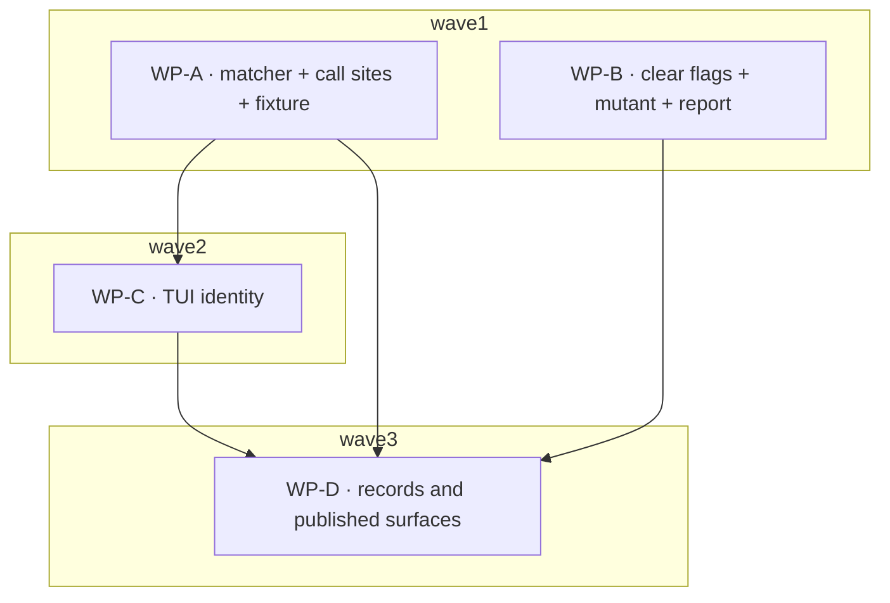

# Plan: registry filter candidate, clear flags, and the review fix loop

## Status

- **Plan:** plan_registry_filter_fixes
- **Parent plan:** meta-plan_promotion_1_0 (resume after `Step: finalized`)
- **Active phase:** 1 — Execution (waves 1–3)
- **Step:** finalized
- **Last update:** 2026-08-11, at the `feat/registry-set-verb` tip (**finalized**:
  `/hex-review` skipped by
  owner decision — this plan was itself produced from a merged high-tier review,
  so the review gate was already satisfied. `/finalize` rewrote `main..HEAD` from
  21 non-merge commits (plus 5 merge commits) into **15** Conventional Commits
  that fast-forward onto `main` (`a03e597`). The rewrite is content-identical:
  the tree hash before and after is `bb7634a4`, and `git diff` across the rewrite
  is empty. Three shaping decisions: the false `feat(config)!` breaking marker was
  dropped (browse filters never shipped — `registry_filter.rs` is absent from
  `v0.12.1` and that tag's `declaration.rs` declares no `include`/`exclude`),
  along with its `BREAKING CHANGE` footer whose index-entry migration advice the
  dual-candidate rule had already invalidated; WP-C's deliberately-red Specify
  commit was squashed with its implementation so no commit in the range fails its
  own tests; and the eight `docs(agents)` artifact commits became `chore(agents)`
  so process history stays out of the changelog. Four pre-session commits were
  missing `Signed-off-by`, which every commit on `main` carries — added, so all
  15 now carry exactly one. `task --force verify` green on the rewritten history:
  990 acceptance tests.
  **Post-rebase SHAs** — the merge commits the table below cites no longer exist:
  WP-A `61fb12e`, WP-B `4161ce3`, WP-C `d977ed9`, WP-D `c07b4bc`, adversary fixes
  `1a6fd68`.
  Earlier: **all four work packages merged**; `task --force
  verify` green after each — 990 acceptance tests, 2612 unit tests. WP-D's panel
  (doc, spec, quality, architect) returned four Blocks, every one a record
  asserting the inverse of shipped behaviour: `json-interface.md` claimed the
  write report's `value` tracks whether the locator *changed* when it echoes the
  flag, with the covering test never exercising the same-locator case and its
  name repeating the error; the superseding ADR's own migration checklist was
  two-thirds undone, leaving two *Alternatives Considered* entries recording the
  shipped matcher as rejected; "deduped by url" survived in three homes after
  WP-A changed the key; and the C-031 guarantor comment — written from an
  orchestrator error — was wrong in five homes. Spec-level convergence: **53 of
  55 IDs fully discharged**, 0 missing, 0 unrequested, 1 contradicts (fixed),
  1 partial (S-006, unfalsifiable by construction). Earlier: **WP-C merged**
  (`b7e00d8`),
  `task --force verify` green — 990 acceptance tests. Its five-perspective panel
  (spec 18/18 with 13 mutations, quality `pass`, plus architect, security, doc)
  found **one Block, confirmed three times independently**: the flat
  single-registry view stopped eliding the registry prefix, because
  `elision_registry` returns a tagged root key and `strip_default_registry` did
  a literal prefix strip. Twelve `render.rs` fixtures hand-wrote an untagged
  `default_registry`, so nothing caught it — the same self-agreeing-fixture
  defect WP-C's own C-024 note diagnoses one function over. Fixed by routing the
  flat branch through `display_split`; `strip_default_registry` deleted. Two
  reviewer prescriptions were verified wrong against the code and rejected.
  Earlier: **WP-A merged** (`244743b`),
  **WP-B merged** (`bd8c6b5`), full `task --force verify` green after each —
  989 acceptance tests. Both ran Stub → Verify-Architecture → Specify →
  Implement → a Review-Fix round, converging with zero Block. WP-A's post-stub
  architect pass found a real Block in the design record itself —
  `RowSource::Alias` discarded the locator, so S-022b merged two tree roots —
  fixed by re-stub before WP-C could consume the type. WP-B's fix pass refuted
  two findings with measurements: `value_cell`'s byte/char reading was already
  correct, and E-14's supersession rested on a false premise (only *adjacent*
  transpositions become type errors) — the reorder is kept for the weaker
  reason. Two contracts added during execution (C-031, C-032) and fifteen edge
  cases resolved as E-1…E-15. WP-C is in Specify)
- **State:** done
- **Tier:** high
- **Next:** none — branch is land-ready; the human decides the push and the
  fast-forward onto `main`.

---

## Overview

**Scope:** large · **Reversibility:** one-way door (high) for the match
candidate; two-way for everything else
**Design record:** [`adr_registry_filter_match_candidate.md`](../adr/adr_registry_filter_match_candidate.md)
**Contracts and scenarios:** [`design_registry_filter_candidate.md`](../specs/design_registry_filter_candidate.md)
— C-001…C-029 and S-001…S-022 live there in full; this plan cites them by ID
and does not restate them.
**Research:** [`research_registry_filter_candidate.md`](../research/research_registry_filter_candidate.md)
**Review input:** [`handover_registry_set_review.md`](../handover_registry_set_review.md)
— the merged high-tier review of `feat/registry-set-verb` (6 Block, 13 High,
12 Warn) and the owner's nine decisions.

Executes the fix loop for `feat/registry-set-verb` **and** the two new designs
the owner decided on 2026-08-11: dual-candidate matching (decision 2) and
`--clear-include` / `--clear-exclude` (decision 9).

**Not a breaking change.** `src/config/registry_filter.rs` is absent from every
release tag through `v0.12.1` — browse filters have never shipped, so the
candidate rule may change freely. The `!` and `BREAKING CHANGE:` footer come
off `f790273` at `/finalize`. No Constitution Deviations row is required and
none must be manufactured.

---

## Corrections to the review handover — read before executing

Two of the handover's own remediations were found wrong during planning. The
handover is otherwise the source of truth for every finding's evidence.

1. **The root-key collision must NOT be fixed by validation** (handover WP-2).
   `RegistryConfig.alias` shipped in `v0.12.1` constrained to non-empty +
   trimmed + no `/` + no control characters + no `"` or `\` + unique **among
   aliases** — nothing about locators, nothing reserved. So `alias = "Local"`
   and an alias equal to another entry's locator both parse and work correctly
   on the released build. Rejecting either at config load narrows a released
   input, which **`AGENTS.md` Principle 9** prohibits (that is the binding
   rule today; `docs/src/stability.md`'s manifest-input clause states the same
   policy but is future-tensed for the 1.x line). The fix is the **typed,
   injective root key** — `RowSource`, decided in C-022 and consumed by C-028;
   TUI appearance is excluded from the freeze, so the key is free to change.
   This closes the same-scope collision, the `Local` collision and the
   cross-scope variant in one change, with no validation rule.

2. **"Hit on either" has two readings and only one is correct** (C-002/C-003).
   OR-ing two whole-filter verdicts (`matches(bare) || matches(fq)`) silently
   loses the feature: with `include = ["acme/tools"]` and
   `exclude = ["quay.io/acme/tools"]`, the `quay.io` row stays visible. The
   contract is per-list hit-via-either, then exclude-wins applied once. This
   makes `RegistryFilter::matches` itself take `(registry, repository)` — a
   signature change, not a call-site wrapper.

---

## Component contracts

Full text in [`design_registry_filter_candidate.md`](../specs/design_registry_filter_candidate.md).

| Cluster | IDs | Subject |
|---|---|---|
| A — match candidate | C-001 … C-012, **C-030** | `qualified_candidate`, the two-argument `matches`, the precedence table, the two-host fixture, the re-derived zero-match remedy string, the unchanged D5/D6/D9 non-boundaries, the first-paragraph documentation obligation |
| B — clear flags | C-013 … C-021 | clap definition, guard widening, the clear branches, silence, idempotence, the four mutation witnesses, the `fields` write-report array |
| C — registry identity | C-022 … C-029 | the typed `RowSource` key (**C-022 owns the encoding**), `key()` on `ResolvedRegistry`/`CatalogGroup`, the health-line regression, `c019_filter_emptied`, the producer pin, the collision fix, dedup coverage |

IDs are append-only: C-030 belongs to cluster A but is numbered last so every
existing citation stays valid.

**Do not confuse `C-019`s.** In this plan and its design spec, `C-011` is the
zero-match diagnostic and `C-019` is clear-flag idempotence. The *parent* plan's
`C-019` — the diagnostic — is written `plan_registry_browse_filters.md#C-019`
wherever it appears, and the TUI helper named after it stays
`c019_filter_emptied`.

## User-experience scenarios

S-001 … S-011 (match candidate), S-012 … S-018 (clear flags),
S-019 … S-022b (identity) — full text in the design spec.

---

## Parallelization

| WP | Scope | Expected files | Size | Wave | Depends on | Review | Status |
|---|---|---|---|---|---|---|---|
| **WP-A** | The dual-candidate matcher, every call site, and the identity **type**. **C-001…C-011, C-022, C-023, C-027, C-029, C-030; S-001…S-011.** Includes the two-host fixture (C-009, land first within the WP), `RowSource` + `row_source_of` + both `key()` methods (C-022/C-023), and the `CatalogGroup.alias` lint removal (C-027) — so cluster C never touches these files. | `src/config/registry_filter.rs`, `src/catalog/catalog_service.rs`, `src/config/registry_resolve.rs`, `src/command/search.rs`, `src/tui/tree.rs`, `test/tests/test_index_source.py`, plus C-011's two verbatim copies at `docs/src/configuration.md:491` and `docs/src/commands.md:743` (E-13 — the parity test cannot pass across a wave boundary) | L | 1 | — | panel | **merged** (`bdd32f6`, merge `244743b`) |
| **WP-B** | `--clear-include`/`--clear-exclude`, the surviving-mutant Block, and the `fields` write-report array. **C-013…C-021; S-012…S-018.** Touches no string that states cluster A's rule — the `--help` text moved to WP-D — so this WP is genuinely wave-1-independent. | `src/command/config.rs`, `src/api/config_report.rs`, `src/api.rs` (the three new type re-exports only — E-9) | M | 1 | — | panel | **merged** (`bd8c6b5`, merge `8095988`) |
| **WP-C** | Registry identity in the TUI: adopt `RowSource` as `TuiRow.source`, the health-line regression, `c019_filter_emptied`, the producer pin, the collision fix. **C-024, C-025, C-026, C-028; S-019…S-022b.** | `src/tui/**` — chiefly `app.rs`, `state.rs`, `render.rs`, `tree.rs`, `detail.rs`, plus the mechanical `TuiRow.source` fixture updates in `event.rs` and `update_check.rs` (E-15). Also deletes WP-A's four `#[allow(dead_code)]` in `src/config/registry_resolve.rs` and `src/catalog/catalog_service.rs` — the one declared cross-package exception (E-11) | M | 2 | WP-A | panel | **merged** (`42d14f3`, merge `b7e00d8`) |
| **WP-D** | Records and published surfaces, written from the landed code. **C-012** — its first-paragraph obligation on every restatement surface, **including the live `--help` text at `src/command/config.rs:104-116`** — plus **C-032** (the three surfaces this change invalidates: the `json-interface.md` write-report shape, the two clear flags in `commands.md`, and `registry set` in the catalog reference), the rule files and the ADR/plan amendments. Carries no S-ID: every scenario is pinned by the WP that implements it, and this WP changes no behaviour. | `src/command/config.rs` (the `--include`/`--exclude` doc comments and their pinning test only), `src/config/declaration.rs`, `src/command/config_keys.rs`, `docs/src/configuration.md`, `docs/src/commands.md`, `docs/src/json-interface.md` (E-9), `catalog/skills/grim-usage/references/registries.md`, `test/tests/test_registries.py` (the `_ns_rel` docstring only — C-032), `.claude/rules/arch-principles.md`, `.claude/rules/subsystem-cli-commands.md`, `.agents/adr/adr_registry_browse_filters.md`, `.agents/plans/plan_registry_browse_filters.md`, `.agents/adr/adr_registry_default_dedup.md`, **`.agents/adr/adr_multi_registry_mcp.md`** (E-18), plus the round-1 widening: `.agents/adr/adr_grim_config_command.md`, `.agents/plans/plan_registry_browse_filters.md`, `.claude/rules/arch-principles.md`, `docs/src/upgrading.md`, and the C-031 guarantor comment in `src/config/registry_filter.rs`, `src/catalog/catalog_service.rs`, `src/config/registry_resolve.rs` (E-19) | M | 3 | WP-A, WP-B, WP-C | panel | **merged** (`23f0c71`, merge `a787702`) |

**ID coverage.** C-001…C-032 and S-001…S-022 (plus S-022b) each appear in
exactly one Scope cell above; no ID is uncovered and none is claimed twice.
Re-verified after this round's renumbering: WP-A 16 C-IDs + 11 S-IDs, WP-B 9 + 7,
WP-C 4 + 5, WP-D 1 + 0 — 30 C-IDs and 23 S-IDs.

**Two IDs added during execution (2026-08-11, Verify-Architecture):**
**C-031** — `CatalogEntry.registry` contains no `/`, the unstated premise the
whole dual-candidate rule rests on (**WP-A**, +1 → 17 C-IDs). **C-032** — the
three published surfaces this change invalidates and no package claimed
(**WP-D**, +1 → 2 C-IDs). Totals: **32 C-IDs**, 23 S-IDs. Both are defined in
the design spec's "Execution-phase clarifications"; the same section carries
E-1…E-9, which resolve edge cases without adding contracts.

**`adr_registry_default_dedup.md`'s obligation** (WP-D, from handover WP-2):
its line 45 reads "deduped by url". `v0.12.1` keyed `seen` on
`normalize_locator(locator)` alone; HEAD keys on `(normalize_locator(locator),
alias)`. It is the one ADR covering *released* behaviour and it is now wrong —
a dated amendment, not a rewrite. Unrelated to the candidate rule, which is why
it carries no C-ID.



**Critical path:** WP-A → WP-C → WP-D.

**Not shippable after wave 2.** `src/config/declaration.rs:277-282` — the
`include` doc comment emitted verbatim into the published JSON Schema by
`grim schema --kind config` — still asserts the locator-relative rule, which is
already false after `f790273` and doubly false after WP-A. Until WP-D lands,
the branch ships a schema description that contradicts its own matcher: the
exact drift class this branch exists to fix, not documentation trailing behind.
Wave 3 is part of the feature, not a postscript.

**Merge order (serialized, topological):** WP-A → WP-B → WP-C → WP-D, with
`task --force verify` after every merge.

**Justification for the narrow wave structure.** Cluster A cannot be split:
changing `RegistryFilter::matches`'s signature breaks every call site at
compile time, so the matcher, the **24** call sites across four files (16
`registry_filter.rs`, 3 `search.rs`, 3 `registry_resolve.rs`, 2
`catalog_service.rs` of which `:341` is the sole production site) plus the two
`tree.rs` tests that call the candidate seam, and the fixture, must land as one
commit. *(The handover's "~30" is the discovery's loop-iteration count.)*

**Why WP-C is serialized behind WP-A** — two edges, and the file-overlap one is
the weaker:

1. **Compile order (decisive).** C-024/C-025/C-026 consume `key()` and
   `RowSource`, which C-022/C-023 land in `registry_resolve.rs` and
   `catalog_service.rs`. WP-C cannot compile before WP-A merges. WP-A absorbs
   those two contracts precisely so WP-C touches neither file.
2. **`tree.rs` test constructors.** C-028 changes `TuiRow.source`'s type, which
   rewrites `row2` (`:1022-1040`), `index_row` (`:1057-1063`) and `local_row`
   (`:1067-1073`) — the helpers WP-A's rewritten candidate tests call. The
   `display_split` region (`:612-621`) and WP-A's tests (`:1789`, `:1818`) are
   ~1170 lines apart and would merge cleanly on their own; the helpers are the
   real coupling.

WP-B is genuinely independent and runs concurrent with WP-A.

**The one string that spans two packages — assigned to WP-D.** The live
`--help` text at `src/command/config.rs:104-116` states cluster A's rule but
lives in WP-B's file, and its pinning test (`config.rs:3731-3761`) fails the
moment WP-A lands. It is a **restatement surface**, and WP-D already owns every
other one and sits in wave 3 with both dependencies satisfied — so it goes to
WP-D, along with `src/command/config.rs` in WP-D's file cell (scoped to those
doc comments and that test). This is what makes WP-B's `Depends on: —` honest;
the earlier assignment to WP-B contradicted its own wave-1 cell. Merge order
puts WP-B before WP-D, so the shared file is never edited concurrently.

---

## Executable phases (per WP)

Each WP runs Stub → Specify → Implement → Review.

**Stub** — the public surface only: signatures, new types, new flags, new
methods, with `unimplemented!()` bodies. Gate: `cargo check` passes.

| WP | Stub surface |
|---|---|
| **WP-A** | `qualified_candidate`, the two-argument `matches`, the `RowSource` enum + `row_source_of` (C-022), `ResolvedRegistry::key()` and `CatalogGroup::key()` (C-023) |
| **WP-B** | the two clap `bool` fields, the widened `run_registry_set` signature, and `ConfigWriteReport.fields` with its element type (C-021) |
| **WP-C** | `TuiRow.source: RowSource` — the field's type change is the stub, and it is what makes every consumer fail to compile until it is handled (`app.rs`, `render.rs`, `detail.rs`, `tree.rs`'s `row2`/`index_row`/`local_row`) |
| **WP-D** | none — no signature changes; the phase is a no-op and is skipped |

**Specify** — tests written from the design spec's contracts, failing against
the stubs. Gate: they compile and fail with `unimplemented`.

| WP | Named test steps (beyond "everything in the Scope cell") |
|---|---|
| **WP-A** | C-003 (the discriminating exclude-beats-include-across-candidates case — does not exist in the tree today), C-009's two-host fixture, C-004's argument-order pin, C-008's browse-level per-kind equivalence, C-022's two injectivity assertions, C-023's cross-type equality, C-030's three non-boundary assertions (the `Complete` one must go red if `CatalogScope::Complete => true` is mutated to call `matches`) |
| **WP-B** | all four mutation witnesses from C-020, plus C-021's five assertions — chiefly the widened `config_write_report_json_pins_frozen_shape` key set and the `"cleared"` element carrying **no** `value` key (assert key absence, not `value == null`) |
| **WP-C** | S-019…S-022b, C-026's producer test over `project_group_rows` (two `CatalogGroup`s sharing a `registry`, differing in `alias`, asserting two distinct `source` values), and C-024's replacement guard built from `registry_labels()` + `aggregate_registry_health()` rather than a hand-built url-keyed map |
| **WP-D** | the verbatim-parity assertion between `BROWSE_FILTER_REMEDY` and its two `docs/src` copies (C-011), and the two first-paragraph prefix gates (C-012) — `assert_description_prefix` is a whitespace-normalized `starts_with`, so the two-candidate sentence must open both `config_keys.rs`'s `KeySpec.description` and `declaration.rs`'s doc comment character-for-character |

**Implement** — fill bodies until the specification tests pass.
**Review** — the panel breadth in the table above.

**Mutation gate, every WP — tooling first, then judgement.** Run
[`cargo-mutants`](https://mutants.rs) scoped to the WP's own diff, so the
enumeration is not bounded by what a reviewer thought to try:

```sh
git -C <worktree> diff origin/main...HEAD > /tmp/wp.diff
cargo mutants --in-diff /tmp/wp.diff
```

Then still ask the builder: *"what single-token mutation would make this wrong,
and does a test fail on it?"* — apply it to real source, run it, revert it,
report the transcript. `cargo-mutants` covers operator swaps, `{}`-body
deletions and return-default substitutions; it does not cover the semantic
mutations that matter most here (C-020's `conflicts_with` deletion, reverting a
whole commit). Neither gate replaces the other. This review round ran 37 hand
mutations across two reviews and **8 survived**, including one that reverts a
whole commit with the suite green.

---

## Open questions

**None blocking execution.** Two were open at plan approval and both are now
decided; recorded so a builder does not reopen them:

- **The write-report shape** — decided: one row plus an always-present `fields`
  array, elements discriminated by an explicit `action` (`"set"` / `"cleared"`),
  never by a bare `null`. Full contract and JSON example in C-021.
- **The injective root key's spelling** — decided: a typed `RowSource` enum in
  `src/config/registry_resolve.rs`, not a discriminated string. C-022 owns the
  encoding; C-028 cites it.

One question remains **for the owner and does not block**: the ADR's second
deferred finding — whether a host-qualified *include* is a required capability,
or whether host-qualified *exclude* alone suffices. Answering "exclude alone"
would make Option 6b strictly better than the chosen rule and reopen the ADR.
Nothing in this plan depends on the answer arriving before execution.

---

## Verification

`task --force verify` is the only trustworthy gate — plain `task verify`
prints "up to date" and exits 0 from the Taskfile cache without running a
test. Run every gate from the main checkout with `git -C <worktree>`, never
from inside a worktree about to be removed. Each worktree needs
`git submodule update --init --recursive` after `git worktree add`, and the
commit hook wants its marker at `<worktree>/.claude/hooks/.state/commit-verified`
(`mkdir -p` first).

## Deferred findings — carried out of execution, for the owner

None blocks landing. Each was found by a review perspective, verified, and
deliberately not fixed in this plan's scope.

| # | Finding | Why deferred |
|---|---|---|
| 1 | **`registry set` is recorded in no ADR.** It shipped at `d9f3be4` and WP-B extended it; `adr_grim_config_command.md` predates `--oci`/`--index`, `fields` and `set`. WP-D added a dated drift note pointing at `subsystem-cli-commands.md`, but writing an ADR for a released CLI surface is an **owner decision**, not a fix-pass action | needs a decision, not an edit |
| 2 | **Three TUI surfaces bypass `sanitize_member_label`** while the health line escapes it (CWE-451, misrepresentation via bidi/zero-width in a config alias). Reproduced under a PTY. **Inherited** — byte-identical at the merge base | own issue; expanding WP-C's cell would have hidden it in a feature diff |
| 3 | **`registry_labels` is now redundant state** — its key set is exactly `registry_order` and every value is recomputable, so `label_from_root_key`'s `alias:` branch is unreachable in production and a test exists only to keep two renderers in step. Deleting it is constrained: `render.rs`'s `contains_key` membership test is load-bearing for non-registry groups | predates this plan; a decision, not an accident |
| 4 | **`KeySpec.description` overruns `subsystem-config-keys.md`'s ~160-char budget** (include/exclude now 643 chars). C-012 requires the new sentence to be there — `grim config registry fields` reads only `KeySpec`. Fixing the budget means moving *other* sentences into the `declaration.rs` continuation | separate change; the new sentence must stay |
| 5 | **S-006 is `partial`** — pinned by a single positive assertion, not a before/after locator edit. The scenario is unfalsifiable by construction: `matches` has no locator parameter, so a locator edit cannot re-aim a pattern | a token, not a guard; nothing to strengthen |
| 6 | **Two inert-and-removed constructs are unguarded against reintroduction** — the `registry_order` attribution fold and the `default_registry` chain entry. Re-adding either leaves the suite green | a guard would assert dead code stays absent |
| 7 | **`TreeBuildOptions` takes two vectors that must stay index-aligned**, with `usize::MAX` as a silent absorber for a miss. `RegistryDisplay` exists to prevent that drift and is splatted into four independent fields one line later | Two Hats — a design change, not a fix |
| 8 | **`TuiAction::ToggleScope` leaves rows and roots from different scopes.** Verified: `set_rows` has one production call site (`app.rs:1198`, in `apply_catalog_results`), so a toggle re-seeds `default_registry` and `registry_order` (scope B) while rows, `registry_locators` and `registry_labels` stay scope A's. Found by the cross-model adversary, graded Block by it; **downgraded after verification** — display-only, pre-existing in kind, and `docs/src/stability.md:129` excludes TUI appearance from the freeze | the one-line fix makes it **worse** (attributing A's rows against B's locators); the correct fix is reloading the catalog on toggle, a design change. Two builders independently agreed with the downgrade |
| 9 | **"N update(s) available" now counts views, not artifacts.** After the adversary fix, an artifact visible through two views of one locator contributes 2 to the tally. Self-consistent with `outdated_count`'s documented "how many rows", but a user with a duplicated locator sees a number larger than their artifact count. Nobody has explicitly decided which the tally should report | an unmade display decision, not a defect; a one-line dedup inside `outdated_count` if artifact-counting is wanted |

## Constitution check

`AGENTS.md` § Core Principles. **No deviation.** Browse filters are
unreleased, so the candidate rule is free to change; the clear flags are
additive; the root key is TUI-internal and `docs/src/stability.md:129`
excludes TUI appearance from the freeze.

`ConfigWriteReport.fields` (C-021) is the one addition that touches a
**released** JSON shape, and it is squarely inside
`docs/src/stability.md` § Additive fields: a new optional field, always
present (`[]` where nothing applies, never an absent key), no existing field
retyped or removed — the same pattern `clients_missing` / `announce.fork`
already shipped. `subsystem-cli-api.md` independently bans
`skip_serializing_if` in `src/api/`, so always-present is already the house
rule, and `config_write_report_json_pins_frozen_shape`'s own comment says a
future field must widen its set rather than replace it.

The published JSON Schema changes only `description` **text** (no field added,
removed or retyped), and **this plan** adds no entry to `RegistryField::ALL` —
C-021 orders its `fields` array by the existing set rather than extending it.
Both stay inside the freeze.

**One released-surface delta the plan inherits and does not cause.**
`RegistryField::ALL` is 3 on `v0.12.1` (`Oci`, `Index`, `Default`,
`v0.12.1:src/command/config_keys.rs:190`) and 5 on HEAD — `Include` and
`Exclude` were added by the already-merged browse-filter work, so
`grim config registry fields` and `config list --format json` emit two more
rows in 0.13.0 than the last release did. That is **additive** — rows appended
to an `{"items": […]}` list, no field removed, renamed or retyped — and
therefore Principle 9 clean, but it is a real change to a released JSON surface
and belongs in the release notes rather than passing silently. WP-D records it;
no work package causes it. (Raised by the cross-model gate as a finding against
C-021; the causation was misattributed — C-021 reuses the existing five — but
the underlying delta is real and the plan's earlier wording obscured it.)

The one route that *would* have violated Principle 9 — rejecting a released
alias shape at config load — is explicitly not taken (see Corrections, above).
