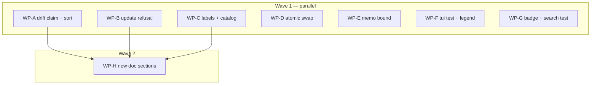

# Plan — Review fixes: materialization drift and freshness

Applies the Block and High findings from
[`.agents/review_materialization_drift_and_freshness.md`](../review_materialization_drift_and_freshness.md)
to branch `feat/materialization-drift-and-freshness`.

## Status

- **Plan:** plan_review_fixes_materialization_drift
- **Parent plan:** meta-plan_promotion_1_0 (parked, alongside
  `plan_catalog_freshness_revalidation`)
- **Active phase:** 1 — Execution (waves 1–2)
- **Step:** /hex-plan → plan-approved
- **Last update:** 2026-08-12 (authored from the tier-high review of
  `feat/materialization-drift-and-freshness`; 7 Block + 10 High findings
  decomposed into 8 WPs across 2 waves)
- **Tier:** medium — trimmed (`architect=inline research=skip adversary=off`)

## Header

| Field | Value |
|---|---|
| Scope | Medium (17 findings, ~20 files, 9 areas) |
| Reversibility | **Two-way door** — every change is a fix to unreleased code on a feature branch |
| Artifacts | plan only (no ADR — no boundary decision is being made; the two design calls are recorded in § Design below) |
| Source | 8-worker tier-high review, 2026-08-12; all owner decisions frozen |
| Out of scope | Warn and Suggest findings; the `094db20` footer rewrite (→ `/finalize`) |

**Constitution deviations: none.** Owner ruled B3/B4 a contract *restoration*,
not a Principle 9 breaking change — relying on the old silent-overwrite
behaviour was relying on a bug. This plan therefore records no deviation row;
it *removes* two incorrect self-declared violations.

## Design (inline — architect=inline, research=skip)

Two decisions this plan settles so no builder has to invent them.

**D1 — H1's memo age bound: 5 minutes.**
`AccessMemo` (`src/context.rs:22-25`) is
`Mutex<HashMap<(AccessMode, Vec<String>), Arc<dyn OciAccess>>>` with no age
check at the hit branch (`:306-313`). No TTL cache pattern exists anywhere in
`src/` to mirror (grepped `Instant`/`SystemTime`/`ttl`/`expir`; `TagCache` is
the closest relative and is not age-bounded).

| Option | Revocation latency | Perf win retained | Verdict |
|---|---|---|---|
| Unbounded (today) | until process restart | 100% | rejected — the H1 defect |
| 60 s | ≤ 1 min | ~100% | rejected — churn with no benefit over 5 min |
| **5 min** | **≤ 5 min** | **100%** | **chosen** |
| Per-call rebuild | 0 | 0% | rejected — reverts the perf commit |

A `grim mcp` tool-call burst is sub-second to seconds, so a 5-minute bound
sits far above the burst window and retains the entire measured win, while
converting "stale until restart" into a bounded staleness. Store
`(Instant, Arc<dyn OciAccess>)`, gate the hit on `elapsed() < BOUND`, and state
the bound in the `clients` doc comment (`:67-85`), which currently promises
only "the tokens live and die with the process".

*Explicitly out of scope:* `token_cache.rs:118-119`'s `u64::MAX` Basic-token
entry. It lives in the vendored fork, is a separate defect, and the 5-minute
memo bound already forces a fresh client — and therefore a fresh credential
read — regardless of what the inner token cache retains.

**D2 — H10 writes new glue; it does not reuse `atomic_write`.**
`src/store/atomic_write.rs::atomic_write(target, bytes)` is the obvious first
hit and is **not** applicable: it is a single-file, in-memory-bytes primitive
(`NamedTempFile::new_in` → `write_all` → `sync_data` → `persist`) that assumes
the whole new content is a byte buffer. `install_one`'s swap at
`installer.rs:791-793` replaces a path that may be a directory tree produced by
a multi-file render. H10 therefore adds a scoped temp-then-swap around the
existing materialize, using `tempfile` (already a dependency,
`Cargo.toml:43`) — it must not be "simplified" into an `atomic_write` call.
The transplantable shape is `src/mcp/render.rs:113-120`'s stage-into-tempdir-
then-project pattern.

**H10 ripples beyond the three-line swap.** The partial-failure recovery branch
at `installer.rs:868-909` is written against the current *remove-then-write*
ordering. Reversing that ordering invalidates its assumptions, so it needs
rework, not just the swap. This is why WP-D is sized M, not S.

**D3 — H6 wraps at the call site; it does not parameterize the shared message.**
`IntegrityMismatch` (`install_error.rs:74-77`) is reached by both
`install.rs:382` and `update.rs:311`. Two routes: parameterize the shared
message (touches both callers and the shared error), or add the update-specific
context at the update call site with `.context()`. **Chosen: the call-site
wrap**, per `.claude/rules/quality-rust-errors.md`'s lib/CLI-boundary
convention — the shared error stays generic, the command adds its own context.
This also keeps `src/command/install.rs` and `src/install/install_error.rs`
out of WP-B's file set, so `refusal_error` stays exclusive and no WP
serializes on it.

## Component contracts

**C-001** `expected_outputs::pending_outputs` — module and function docs
enumerate **two** causes (client gained support; render-layout move). The
deleted-file cause is absent, and the count word reads "two", not "three".

**C-002** `outputs_pending` is emitted **sorted by client name**, deterministic
regardless of `target.clients()` input order. The sort belongs at the shared
source — `expected_outputs::pending_outputs` (`expected_outputs.rs:66-78`) —
not at the `status.rs` wrapper, so all four call sites inherit it; all four
currently only test `.is_empty()`, so a single-point fix is safe. Mirror
`client_drift`'s `BTreeSet` idiom (`status.rs:679-698`) and its determinism
test (`status.rs:1191-1204`).

**C-003** Every surface documenting `outputs_pending` states two causes and
states that a deleted output surfaces as `state: missing`. **Nine surfaces**
carry the claim — a tree-wide grep, not the review's original list of seven:

| Surface | Owning WP |
|---|---|
| `src/install/expected_outputs.rs:57` | WP-A |
| `src/api/status_report.rs:108` | WP-A |
| `docs/src/json-interface.md:89` | WP-A |
| `docs/src/stability.md:155` | WP-A |
| `docs/src/commands.md:624` | WP-A |
| `catalog/skills/grim-usage/references/consume.md:241` | WP-A |
| `.claude/rules/subsystem-cli-commands.md:25` | WP-A |
| **`src/install/status_badge.rs:38`** (`StatusBadge::Pending` doc) | **WP-G** |
| **`CHANGELOG.md:38`** | **WP-C** |

The last two are owned by other WPs in the same wave. They are fixed **by the
WP that already owns the file** — WP-A must not reach into another worktree.
Every site says "three causes"; the count word must be corrected to "two", not
just the clause deleted.

**C-004** `docs/src/stability.md:157-158` and `docs/src/commands.md:635` no
longer claim the drift seam "cannot disagree with what `grim install` then
does", nor that `grim install` "clears it" unconditionally.

**C-005** `grim update` over a locally modified artifact exits **65** and
emits its `UpdateReport` — the report is not discarded. Every reconciliation
that ran (pruned, reaped, retained, abandoned entries) is present in the
structured output alongside the non-zero exit.

**C-006** The refusal message reached from `update.rs` names the artifact, the
reason, and — when the retry flag also authorizes further deletion — says so.
`--force` on `update` is documented as governing the install gate *and*
`prune_orphans` *and* `reap_dropped_clients`.

**C-007** `CHANGELOG.md` carries no `**BREAKING**` label for the update
integrity gate or the TUI `u` change. `docs/src/stability.md:188` frames the
change as a contract restoration, citing `main:docs/src/commands.md:472,532,
545-547` as the shipped promise the old code violated.

**C-008** `catalog/skills/grim-usage/references/troubleshooting.md`'s
"Integrity Gates" list includes a bullet for `grim update` refusing a
locally-modified artifact, in the shape of the existing bullets.

**C-009** `installer.rs`'s force path writes new content to a temp location and
swaps it into place only on success. No window exists in which the destination
is absent or half-written. No `.old` backup is retained; the user's edited
bytes are still removed — this is atomicity, not preservation.

**Three sites, not one.** Fixing only the artifact swap leaves H10 half-done:

- `:791-793` — the artifact swap (the review's cited site).
- `:799-803` — the rule support-dir remove, which has the **identical**
  remove-then-write window.
- `:868-909` + `in_flight` bookkeeping at `:733-738`, `:784` — the
  partial-failure recovery branch. Its premise is that a failure leaves grim's
  own wreckage at `dest`; after a stage-then-swap a failure leaves `dest` at its
  **old content**. This branch must be re-derived, not left as-is.

**C-010** `Context::access_with_mode` returns a memoized seam only when its
entry is younger than the D1 bound; otherwise it rebuilds. The `clients` doc
comment states the bound.

**C-011** The two stale cross-enum claims in `src/install/status_badge.rs` are
corrected: `:8` ("The derivation logic is the same one `grim status` uses
(`status.rs::derive_state`)") and `:58` ("Precedence mirrors
`status.rs::derive_state`"). Both are false now that `Pending` has no
`derive_state` counterpart — `ArtifactStatus` has no `Pending` variant and
legitimately does not, because `pending` is a `search` badge value only.

*Corrected from the review's framing:* `src/api/artifact_status.rs` contains
**zero** references to `StatusBadge` (verified by grep), so it is not the edit
site and is not in any WP's file set.

**C-012** `render.rs`'s status-bar legend is width-measured against the string
actually rendered, so it is not clipped and does not drop the `pending` entry.

**C-013** `docs/src/upgrading.md` carries a 0.13.0 entry for the update
integrity gate, matching the page's `intro → **What you will see.** → **What to
do.**` shape, inserted after `{#untracked-destination}`.

**C-014** `docs/src/commands.md`'s `## grim tui` section documents the
Overwrite dialog on `u`, the `pending`/`+` badge, and the bundle worst-state
rollup; the group-action table at `:1180` names the states `i` actually acts on.

*Scope note:* the `:1180` table is a **Warn**-tier finding, below the authorized
Block/High scope. It is deliberately absorbed because H4 rewrites the same
section and leaving one table wrong inside a section being corrected would be
perverse — recorded here rather than silently included.

**C-015** `docs/src/json-interface.md:452-453`'s `modified` and
`untracked-destination` reason rows name `grim update` among the commands that
emit them.

## UX scenarios

**S-001** A client is configured after install → `grim status --format json`
lists its outputs in `outputs_pending`, sorted by client. *Error case:* a
vendor that declines the kind is never listed.

**S-002** A materialized file is deleted → `outputs_pending` does **not** list
it; the row reads `state: missing`. Docs say so on every surface.

**S-003** `grim update` over a hand-edited artifact → exit 65, the artifact's
bytes are unchanged, **and** the report for the 39 artifacts that did update is
emitted. *Error case:* re-running gives the same 65 and the same report, so the
operator can tell what already happened.

**S-004** `grim update --force` over a hand-edited artifact → the artifact is
overwritten, and the user was told the flag also authorizes prune and reap.

**S-005** TUI `u` on a locally modified row → the Overwrite dialog opens; the
file still holds the edit until the user confirms. *Error case:* declining
leaves the edit intact.

**S-006** A `grim mcp` server running > 5 min after `grim logout` → the next
tool call rebuilds the seam and re-reads the credential store.

**S-007** An interrupted force-install → the destination holds either the old
content or the new, never a partial tree.

**S-008** `grim search` over a partially-installed artifact → the row reads
`pending`, proven by an integration test.

## Parallelization

| WP | Scope (C-/S- IDs) | Expected files | Size | Wave | Depends on | Review | Status |
|---|---|---|---|---|---|---|---|
| **WP-A** | B1+B2+H2+H9 — C-001, C-002, C-003, C-004, C-015; S-001, S-002 | `src/install/expected_outputs.rs`, `src/api/status_report.rs`, `docs/src/json-interface.md` (`:89`, `:452-453`), `docs/src/stability.md` (`:152-159`), `docs/src/commands.md` (`:615-638`), `catalog/skills/grim-usage/references/consume.md`, `.claude/rules/subsystem-cli-commands.md` | M | 1 | — | panel | pending |
| **WP-B** | B6+H6 — C-005, C-006; S-003, S-004 | `src/command/update.rs` (`:296-318`), `test/tests/test_integrity.py` (extend `:102-132`). **Out of bounds: `src/command/install.rs`, `src/install/install_error.rs`** — wrap update-specific context at `update.rs:311` per `quality-rust-errors.md`'s library/CLI boundary; do **not** parameterize the shared `IntegrityMismatch` message, which would mutate `grim install`'s shipped refusal text | M | 1 | — | panel | pending |
| **WP-C** | B3+B4+B7 **+ B1's `CHANGELOG.md:38` site** — C-007, C-008, C-003 (partial) | `CHANGELOG.md` (`:12`, `:21`, **`:38`**), `docs/src/stability.md` (`:188-199`), `catalog/skills/grim-usage/references/troubleshooting.md` | S | 1 | — | light | pending |
| **WP-D** | H10 — C-009; S-007 | `src/install/installer.rs` (`:791-793` artifact swap, `:799-803` support-dir remove, `:868-909` recovery branch, `:733-738`/`:784` `in_flight`) | M | 1 | — | panel | pending |
| **WP-E** | H1 — C-010; S-006 | `src/context.rs` (`:22-25`, `:67-85`, `:291-329`) | S | 1 | — | panel | pending |
| **WP-F** | B5+H5 — C-012; S-005 | `src/tui/app.rs` (new test on `test_ctx` `:5505`, driven as `:5536` does), `src/tui/render.rs` (`:950`, `:1244-1268`) | S | 1 | — | **panel** (carries a Block whose only deliverable is one test) | pending |
| **WP-G** | H7+H8 **+ B1's `status_badge.rs:38` site** — C-011, C-003 (partial); S-008 | `src/install/status_badge.rs` (`:8`, `:38`, `:58`), `test/tests/test_search.py` | S | 1 | — | light | pending |
| **WP-H** | H3+H4 — C-013, C-014 | `docs/src/upgrading.md`, `docs/src/commands.md` (`:1106-1281`) | S | 2 | WP-A, WP-B, WP-C | light | pending |

**Critical path:** WP-A → WP-H (equivalently WP-B → WP-H). Depth 2.

**Shippable after wave: 1** — every Block and all Highs except the two additive
doc sections. Wave 2 is prose describing behaviour wave 1 finalizes.

**Merge plan (serialized topological order):**
WP-C → WP-D → WP-E → WP-G → WP-F → WP-A → WP-B → WP-H.
`task verify` after every merge. WP-A and WP-B merge late because they are the
largest; WP-H merges last because its prose must describe the landed behaviour.

**Justification for WP-H not running in wave 1:** it is file-disjoint from
nothing — it shares `docs/src/commands.md` with WP-A (regions 500 lines apart)
and has a genuine *content* dependency on WP-B and WP-C. Serializing removes
both risks at the cost of one wave.

**Justification for the same-wave `docs/src/stability.md` share:** WP-A edits
`:152-159` and WP-C edits `:188-199` — 28 untouched lines apart (`:160-187`),
far outside git's 3-line merge context, and the merge order lands WP-C first.
Verified safe rather than assumed.

**Do-not-touch guard, WP-A:** WP-A owns
`.claude/rules/subsystem-cli-commands.md` and edits `:25`. The adjacent
`grim fetch` row at `:24` is an unrelated drive-by this branch already bundled
(review Warn, out of scope) — **leave it alone**, do not "tidy" it.

**Justification for WP-C bundling B7:** B7's catalog bullet describes the same
behaviour B3/B4 relabels; splitting would have two WPs writing the same claim
in two files. The AGENTS.md-mandated catalog drift check
(`task catalog:verify`) runs once, after both WP-A and WP-C have merged.

## Executable phases

Each WP runs Stub → Specify → Implement → Review. Doc-only WPs (C, H) have no
stub phase — their "specify" is the contract text above.

- **Stub** — WP-B may add an `UpdateAction`/`UpdateEntry` variant for the
  refusal row; WP-E changes `AccessMemo`'s value type; WP-D adds the temp-swap
  helper signature. No other WP changes a public surface.
- **Specify** — new tests: WP-A a determinism test for C-002 mirroring
  `status.rs:1191-1204`; WP-B an assertion that the report survives a refusal
  (C-005); WP-D a mid-failure atomicity test (C-009, none exists today);
  WP-E an age-expiry unit test (C-010); WP-F the TUI regression test asserting
  the file still holds the edit (S-005, the B5 gap); WP-G the `grim search`
  pending integration test copying `test_search_status_flips_to_installed_after_install`
  (`test_search.py:262-284`).

  **WP-F's fixture, corrected.** The review pointed at `app.rs:6595`; discovery
  found that is `a_declared_bundle_folds_in_its_worst_member_state()`, a **sync**
  test that hand-builds `InstallState` and never calls `perform` — the wrong
  base. Build on `test_ctx` (`app.rs:5505`), driven the way
  `perform_installs_bundle_members_not_the_bundle_blob` (`app.rs:5536`,
  `#[tokio::test]`) drives it, and follow the CLI twin's three-step shape from
  `test_integrity.py::test_update_also_refuses_modified_without_force`:
  install → hand-edit the materialized file → invoke → assert both the refusal
  **and** that the file still holds the edit. Do not hand-assemble
  `InstallState`.

  **Additional test steps required by the plan review:**

  - **C-012 (WP-F)** — assert `model.legend`'s display width equals
    `legend_line("")`'s. Red today: `render.rs:950` hard-codes a **six**-glyph
    string used only as the width gate at `:1251-1252`, while `:1257` renders
    `legend_line(...)` derived from `legend_entries()` — **seven** entries
    including `Pending`, plus a `† deprecated` span. The existing
    `legend_line_appends_truncation_hint_only_when_present` (`render.rs:2345`)
    never touches the gate.
  - **B5 mutation gate (WP-F)** — the new test must go **red** when `force` is
    reverted to `is_update || force` at `app.rs:2677`. B5's whole finding is
    that 93 existing tests cannot fail; a replacement that also cannot fail
    re-opens the Block silently. Record the mutation check in the WP's review.
  - **S-002 (WP-A)** — an acceptance test that installs, `rm`s a materialized
    output, then asserts `state == "missing"` **and** `outputs_pending == []`.
    Fixture: `test_status.py:158` minus the second-client step. Without this,
    the plan writes a *fresh* unverified guarantee onto the same frozen page
    that carried the original one — Cluster A reproduced inside the fix for
    Cluster A.
  - **C-006 / S-004 (WP-B)** — extend
    `test_integrity.py::test_update_also_refuses_modified_without_force`
    (`:102-132`) to assert the stderr names prune and reap, plus a negative
    assertion on `grim install`'s message. That negative also makes Warn-1's
    forbidden route (parameterizing the shared message) fail loudly.
  - **S-008 trigger (WP-G)** — copying
    `test_search_status_flips_to_installed_after_install` verbatim yields
    `installed`, never `pending`. Reaching the `Pending` arm needs
    `derive_badge`'s `target.is_some_and(...)` path with non-empty
    `pending_outputs`: install with one client present, **then create a second
    client dir**, then search (the `test_status.py:158` mechanic).
- **Implement** — per the remediation in each finding.
- **Review** — budgets in the table. `task verify` gates every WP.

## Open questions

**None.** The one question this plan opened — whether C-005's "report survives"
shape needs a new `UpdateAction` variant — was answered by discovery before the
plan shipped: **no new mechanism is needed.** `update::run` already returns
`(UpdateReport, ExitCode)`, so the refusal branch returns that existing shape
with a non-zero `ExitCode` instead of `Err`. No enum literal is added, no
schema changes, and `src/api/update_report.rs` and `src/api/artifact_status.rs`
stay out of WP-B's file set — which also removes the only potential wave-1
collision between WP-B and WP-G.

**WP-B's blast radius — checked and clear.** B6 moves the refusal from the
`Err` arm to the `Ok` arm of `update::run`, so the concern was whether the TUI
renders those arms differently. It does not: **the TUI never calls
`update::run`.** Only two comments reference it (`app.rs:2659`, `:2812`); the
TUI performs its own install through `install_and_persist`. `src/tui/app.rs`
therefore stays exclusive to WP-F, and WP-B's file set is `update.rs` alone.

## Handoff notes (not work packages)

- **`094db20`'s `BREAKING CHANGE:` footer must be stripped by `/finalize`,
  not by execution.** It is the oldest of the 8 commits, so removing the
  trailer rewrites the whole branch. git-cliff regenerates `CHANGELOG.md` from
  commit history at release (`taskfiles/release.taskfile.yml:60`), so the
  footer — not the hand-written `[Unreleased]` block — is what would ship the
  incorrect BREAKING label.
- **Stashed working tree:** `stash@{0}` holds the 0.13.0 version bump
  (`Cargo.toml`, `Cargo.lock`) and the manual-rig fixture. Restore with
  `git stash pop` after execution.
- **The cross-model gate was skipped** in the review that produced these
  findings (`codex:rescue`, fourth recorded failure). B1, B6, H1 and the
  Principle 9 inversion were never challenged by a second model.
