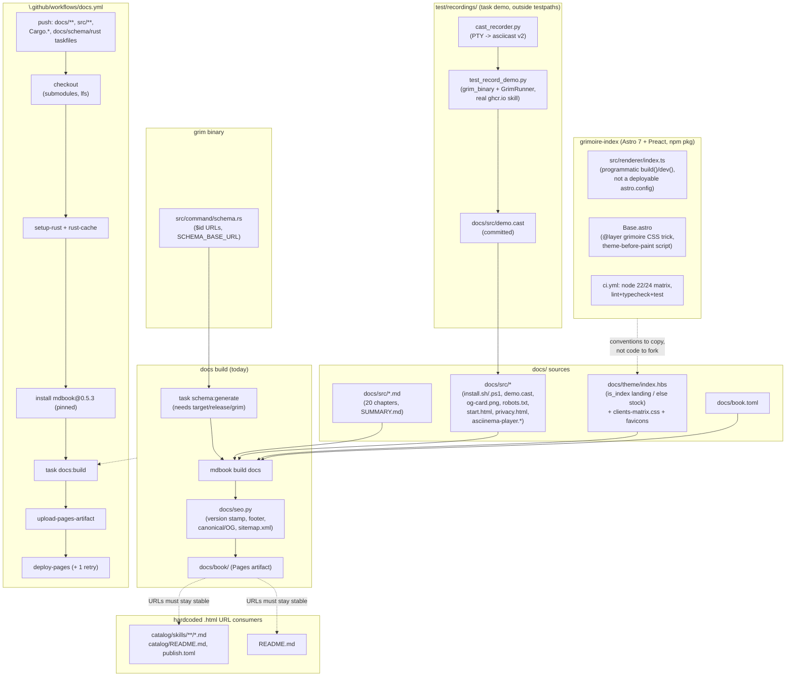

# Research: docs site architecture map before the migration

**Date:** 2026-09-06
**Run:** hex-plan xhigh, docs redesign (`.agents/plans/plan_docs_site_redesign.md`)
**Phase:** Discover, architecture-explorer
**Consumers:** `.agents/specs/design_docs_site_redesign.md`, the plan.

# Docs site architecture map (mdBook -> Astro Starlight)

Sources: main checkout `/home/mherwig/dev/grimoire`; planning worktree
`.agents/worktrees/docs-plan` (branch `docs/use-case-discovery`); sibling
worktree `.agents/worktrees/grimoire-index` (repo `grimoire-rs/indexer`).

## 1. Current build pipeline

- `docs/book.toml:1-16` — mdBook config. `default-theme`/`preferred-dark-theme`
  = `navy`; `git-repository-url` + `edit-url-template` (GitHub edit links);
  `additional-css = ["theme/clients-matrix.css"]`; fold level 1.
- `docs/theme/index.hbs` (927 lines) — one template, two branches on
  `{{#if is_index}}` (line 51):
  - **Landing branch** (`is_index` true, root `/` only): fully
    self-contained HTML document, no mdBook CSS/JS, no CDN/webfont/script.
    Inline SVG client marks (from `@lobehub/icons-static-svg`, Simple Icons
    for Zed/Warp, lettered `.tile` fallback for Droid). Design tokens:
    ground `#161826`, text `#e9e9ed`, accent `#9184d9`/`#d2cefd`/`#2b2741`,
    neutrals `#595d6c`/`#3f424d`, 8px radii, system-ui body, ui-monospace
    kickers (ADR ports these onto `--sl-color-*`). Plays `demo.cast` via
    vendored asciinema-player 3.17.0 (line 68 CSS link, line 525 script,
    line 528 `AsciinemaPlayer.create`).
  - **`{{else}}` branch**: mdBook 0.5.3's stock `index.hbs`, byte-for-byte
    (re-copied from `mdbook init --theme` on version bumps) — this is *why*
    the mdBook version is pinned exactly.
- `docs/theme/clients-matrix.css` (69 lines) — left-align override for
  `.matrix-table table` (docs/src/clients.md `#matrix`) plus client-mark
  sizing; scoped, doesn't touch the rest of mdBook's theme.
- `docs/theme/favicon.png`, `favicon.svg` — mdBook's two conventional
  favicon slots.
- `docs/seo.py` (177 lines) — post-build script, run after `mdbook build`
  (mdBook's Handlebars context has no string helpers, so path->URL mapping
  has to happen after render, reading tags back out of rendered HTML):
  1. Stamp crate version into any `data-grim-version` element, read from
     `Cargo.toml` (regex on first `version = "..."`).
  2. Inject a page footer (home/documentation/stability/privacy/license
     links) into every stock chapter page — skipped if `<footer>` already
     present or no `<main>` (landing page, `start.html`, `privacy.html`
     already carry their own footer).
  3. Inject `<link rel="canonical">` + OG/Twitter meta tags, idempotent
     (skips if `rel="canonical"` already present, only re-stamps version).
     Per-page description: first `<main>` paragraph over 80 chars
     (`chapter_summary`), else book-level fallback.
  4. Write `sitemap.xml` (root first, then every processed URL).
  Skips `404.html`, `print.html`, `toc.html`. Canonical `SITE =
  "https://grimoire.rs"` must match `robots.txt`'s `Host`.
- `taskfiles/docs.taskfile.yml` — `docs:build` (deps on `schema:generate`,
  then `mdbook build docs` + `python3 docs/seo.py`) and `docs:serve` (skips
  seo.py, so local preview has no canonical/OG tags).
- `taskfiles/schema.taskfile.yml` — `schema:generate` depends on
  `rust:build`, shells out to `target/release/grim schema --kind {config,
  publish, lock}` (note: **not** `mcp` — ADR risk item, `grim-mcp` schema
  404s today), writes gitignored `docs/src/schemas/*.json` (never
  committed — regenerated every build so it can't drift from the parser).
- `.github/workflows/docs.yml` — triggers on push to `main` touching
  `docs/**`, `src/**`, `Cargo.{toml,lock}`, the docs/schema/rust taskfiles,
  or itself. `contents: read, pages: write, id-token: write`, Pages
  concurrency group (no cancel-in-progress). Steps: checkout (`submodules:
  recursive` — needed for the `[patch.crates-io]` source that `grim` build
  requires; `lfs: true` — `docs/src/og-card.png` is tracked in LFS via
  `.gitattributes`, and Pages would otherwise ship the pointer file),
  configure-pages, setup-rust, rust-cache, setup-task, install mdBook
  pinned `@0.5.3` (comment ties the pin to the vendored `index.hbs` stock
  branch), `task docs:build`, upload-pages-artifact. Separate `deploy` job
  with a one-shot retry (`deploy-pages` doesn't retry a flaky "try again
  later" status itself).
- `docs/README.md` — states the same pin rationale, tells contributors to
  prefer `task docs:build`/`docs:serve` over a bare `mdbook` call.

## 2. Static files and URLs served today

Everything under `docs/src/` that is **not** `.md` is copied verbatim by
mdBook to the same relative path under `docs/book/`:

| Source | Served at | Notes |
|---|---|---|
| `docs/src/install.sh` | `/install.sh` | cargo-dist bootstrap; front door, forwards args |
| `docs/src/install.ps1` | `/install.ps1` | same, PowerShell |
| `docs/src/demo.cast` | `/demo.cast` | asciicast v2, recorded by the test harness (§5) |
| `docs/src/asciinema-player.css`/`.min.js` | same paths | vendored 3.17.0, integrity-checked against npm's sha512 |
| `docs/src/robots.txt` | `/robots.txt` | `Sitemap: https://grimoire.rs/sitemap.xml`, disallows `/print.html` |
| `docs/src/og-card.png` | `/og-card.png` | Git-LFS tracked; referenced by `seo.py`'s `OG_IMAGE` |
| `docs/src/schemas/*.json` | `/schemas/*.json` | generated, gitignored (§1) |
| `docs/src/start.html` | `/start.html` | standalone doc, own `<head>`, guided own-index setup wizard; linked from `hosting-an-index.md:477` as `[wizard]` |
| `docs/src/privacy.html` | `/privacy.html` | standalone doc, GDPR Art. 13 notice covering **both** `grimoire.rs` and `index.grimoire.rs` (the latter a separate repo/build) |
| `docs/theme/favicon.png`/`.svg` | `/favicon.png`/`.svg` | mdBook theme convention |
| generated: `sitemap.xml`, `404.html` (mdBook default), `print.html`, `toc.html` | | excluded from seo.py tagging |

`start.html` and `privacy.html` are **not** in `SUMMARY.md`
(`docs/src/SUMMARY.md:1-21`, a flat 20-chapter list, no groups — the ADR's
"flat SUMMARY.md" complaint) — they're copied because mdBook copies every
non-`.md` file under `src/`, invisible to the nav. Both carry a large
top-of-file HTML comment documenting the same "standalone, self-contained,
no external host" contract as the landing page, and warn against a literal
`<title>` inside the comment (seo.py's `TITLE_RE` matches the *first*
`<title>` in the file).

`setup.grimoire.rs` (README.md:36,42; installation.md:53,59) is a
**separate** short-URL redirector, not part of this build — not
investigated further, out of scope for the migration.

## 3. Reusable pattern next door: grimoire-index (Astro 7 + Preact)

**Surprise**: this repo is *not* a deployable Astro site with its own
`astro.config.mjs` — it's `@grimoire-rs/indexer`, an npm package (CLI +
library) that *programmatically* drives Astro's Node API
(`build()`/`dev()` from `"astro"`, `src/renderer/index.ts:1-80`) against a
consumer's index-tree data. `ASTRO_SRC_DIR` (`./astro`) and
`DEFAULT_PUBLIC_DIR` (`./public`) point *into this package*; the "root" at
render time is whatever index repo is being rendered. So there's no sibling
`astro.config.*` to copy — the docs-site Starlight migration needs its own,
real `astro.config.mjs` from scratch.

What **is** directly reusable, as convention rather than as a forkable
scaffold:
- `package.json`: `astro: ^7.1.4`, `@astrojs/preact: ^6.0.1` (preact only
  needed if Starlight interactive islands are added — the ADR's plan has
  none), `engines.node: >=22.14.0`.
- `tsconfig.json`: `target: ES2023`, `module`/`moduleResolution:
  NodeNext`, `strict: true`, `jsx: react-jsx` + `jsxImportSource: preact`.
- `.github/workflows/ci.yml` — first Node CI pattern in the product's repos:
  matrix `node-version: ["22", "24"]`, `actions/setup-node` with `cache:
  npm`, then `npm ci` -> `npm run lint` -> `npm run typecheck` -> `npm
  test`. Directly portable shape for the docs workflow's new Node job.
- `eslint.config.js` — flat config, `typescript-eslint` recommended preset,
  `dist/**|coverage/**|node_modules/**` ignored.
- `src/renderer/astro/layouts/Base.astro:1-45` — the CSS-layering trick
  worth copying for the token port: all built-in styles sit in `@layer
  grimoire`, so a consumer/override stylesheet (unlayered) always wins
  regardless of specificity or load order. Same idea applies to porting
  `index.hbs`'s tokens onto Starlight's `--sl-color-*` via `customCss`
  without a specificity fight against Starlight's own layer.
  Theme-before-paint script (`localStorage.getItem("theme")` or
  `matchMedia`) is the same pattern Starlight's own dark-mode toggle uses.
- Bundling gotcha documented at `index.ts:53-68`
  (`bundlePreactRenderer` / `configEnvironment` hook forcing
  `noExternal: ["@astrojs/preact"]`) — irrelevant unless the docs site also
  adds Preact islands.

## 4. Dependencies between docs and the binary

- `task schema:generate` (`taskfiles/schema.taskfile.yml`) depends on
  `:rust:build` and shells `target/release/grim schema --kind {config,
  publish, lock}` — **not** `mcp`, a pre-existing gap the ADR flags for
  phase 1.
- `src/command/schema.rs:27` — `const SCHEMA_BASE_URL: &str =
  "https://grimoire.rs/schemas"`; lines ~165/176/193/293 hold the literal
  `$id` values `grimoire-config.schema.json`, `grim-mcp.schema.json`,
  `grim-publish.schema.json`, `grimoire-lock.schema.json` — filenames the
  ADR's URL-contract check treats as literal, not derived from `--kind`.
- `.github/workflows/docs.yml`'s path filter includes `src/**` and
  `Cargo.{toml,lock}` specifically because the schemas are generated from
  grim's parse structs, so any change there must trigger a docs rebuild.
- Catalog skills embedding hardcoded `grimoire.rs` doc URLs (grep hits):
  `catalog/skills/grim-usage/references/consume.md:424`
  (`[quickstart]: https://grimoire.rs/quickstart.html`),
  `catalog/skills/grim-authoring/references/*.md` (bootstrap, mcp-spec,
  bundle/agent/rule/skill-spec, updating, release-checklist,
  vendor-metadata), `catalog/skills/grim-usage/references/{troubleshooting,
  publish,registries,updating}.md`, `catalog/README.md`,
  `catalog/publish.toml`, `catalog/descriptions/*.md` — every one of these
  is a hardcoded `.html` URL that Option 1 (`build.format: 'file'`)
  preserves without editing any of these 20+ files.
- `README.md:103-107` — `[docs]`, `[docs-install]`, `[docs-clients]`,
  `[docs-hosting]` reference-style links, also `.html`-suffixed.
- `.agents/research/research_inrepo_authoring_distillation.md:103` — cites
  fragment anchors like `commands.html#init` as a *content-distillation*
  source mapping, not a build dependency, but another place `.html` +
  fragment URLs are assumed stable.

## 5. Test / recording harness

- `test/recordings/{__init__.py, cast_recorder.py, test_record_demo.py}` —
  outside `test/pyproject.toml`'s `testpaths`, so never collected by `task
  test`/bare `pytest`; explicit invocation only via `task demo`
  (`test/taskfile.yml:52-67`, depends on `task: build` for a real `grim`
  binary).
- `cast_recorder.py` — asciicast v2 recorder driving `grim` through a PTY,
  ported/trimmed from the OCX project's larger version; grim's plain-text
  tables have no ANSI color or spinner redraws, so the color-realignment
  machinery from the OCX original wasn't ported. Provides
  `CastRecorder` (`.open()/.run_command()/.close()/.build()/.write()`) and
  `assert_tables_column_aligned()`.
- `test_record_demo.py::test_record_landing_demo` — the one existing
  recording. Uses `grim_binary` fixture + `GrimRunner` from the acceptance
  suite (`src/runner`), records against the **real, published**
  `ghcr.io/grimoire-rs/skills/grim-usage` (verified anonymously pullable
  via a GHCR token-issuance probe, not just "the endpoint responds"), in a
  short flat `tempfile.TemporaryDirectory()` (not pytest's deeply-nested
  `tmp_path`, to keep printed paths short enough to show as-is). Embeds the
  landing page's own dark palette as the cast's `theme` header so
  asciinema-player renders on-brand automatically. Sequence: `grim init` ->
  `grim add <ref>` -> `find .claude .cursor .opencode -type f | sort` ->
  `grim status`. Output: overwrites `docs/src/demo.cast` directly (committed
  asset, diffed and committed deliberately, not regenerated by the docs
  build).
- **For the 11 planned screencasts** (`use-cases.yaml` `screencasts:`,
  entry-path + router-guide casts named `quickstart.cast`,
  `browse-tui.cast`, `first-skill.cast`, `shared-skills.cast`,
  `scopes.cast`, `inspect.cast`, `registries.cast`, `lifecycle.cast`,
  `versioning.cast`, `team-ci.cast`, `own-index.cast`): the harness
  generalizes directly — each is a new `test_record_*.py` module following
  `test_record_demo.py`'s shape (own temp project, own `GrimRunner`, own
  command sequence, own `CAST_OUTPUT` path under `docs/src/` or wherever
  the new pages land), added to `test/taskfile.yml`'s `demo` task (or a
  new one) the same way. `browse-tui.cast`'s note ("VS Code surface gets a
  short screen recording, not a cast") is out of scope for this harness.
  Nothing about the harness is mdBook-specific — it writes a `.cast` file
  to a path and it embeds via `AsciinemaPlayer.create()`, which Starlight
  pages will still need to do explicitly per-page (today only the landing
  page embeds one; the ADR notes "no `.md` embed today" for the player).

## Dependency diagram

