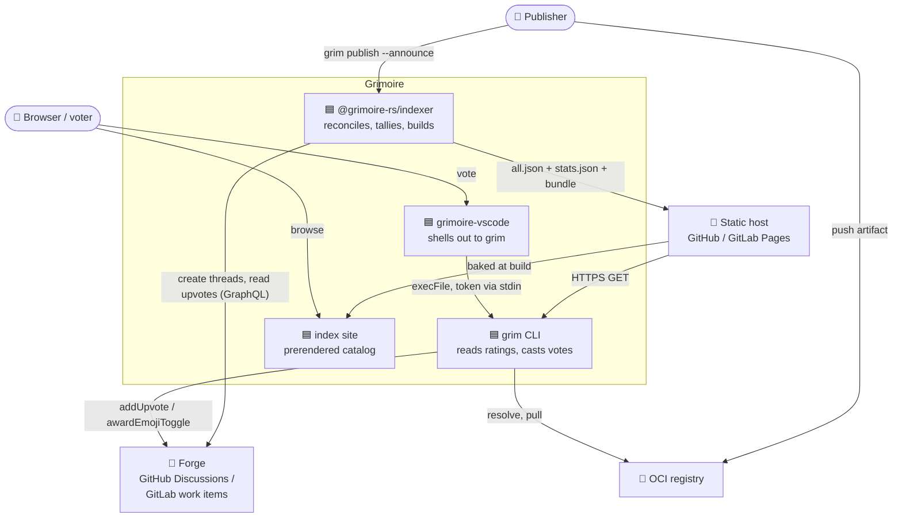
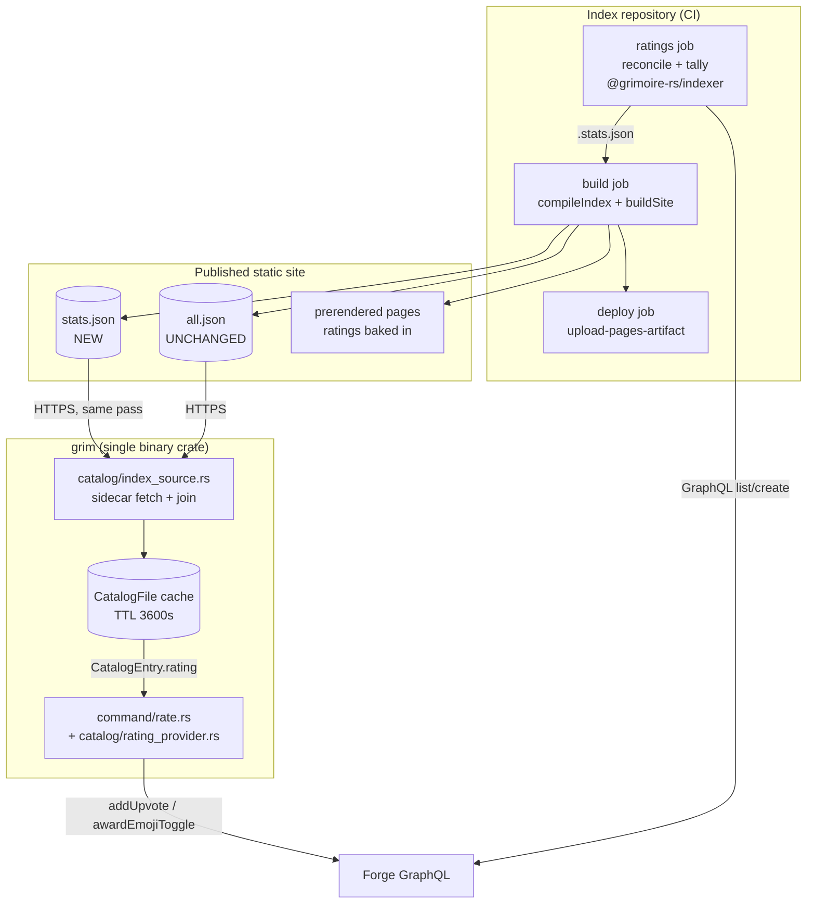
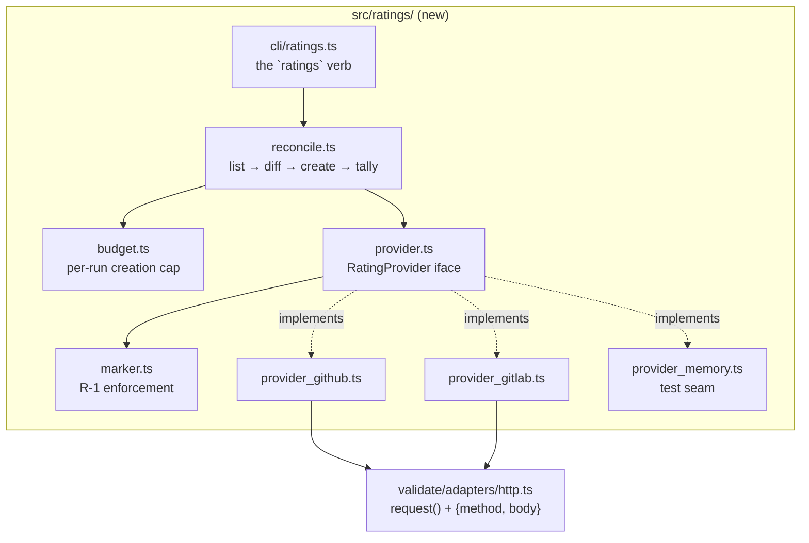
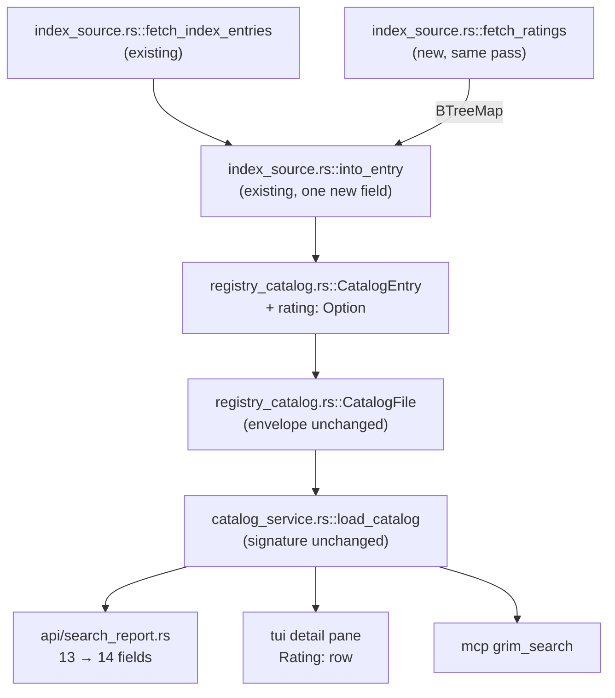
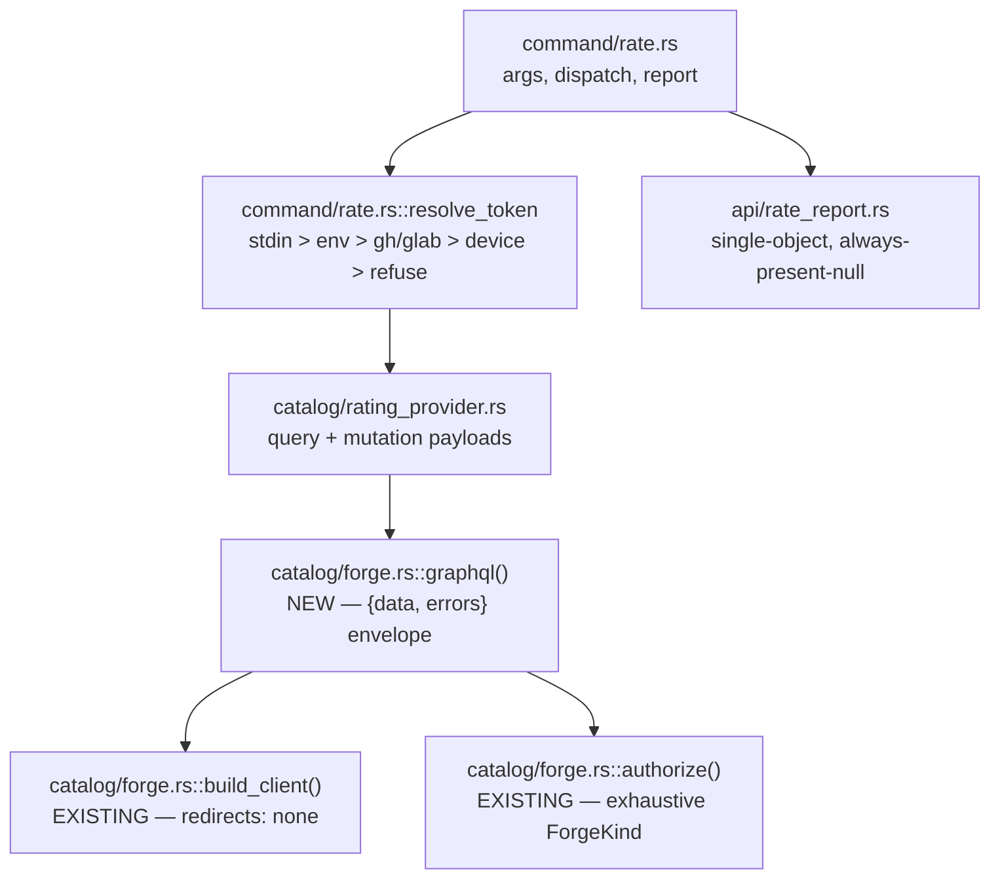
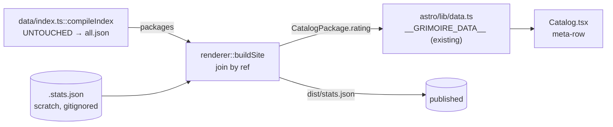
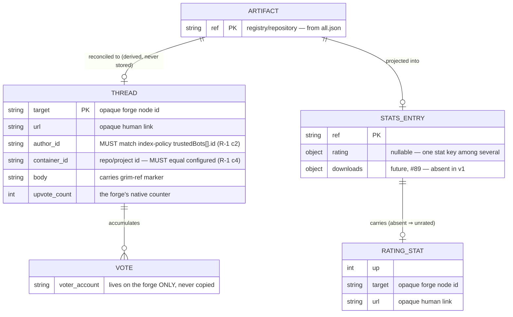
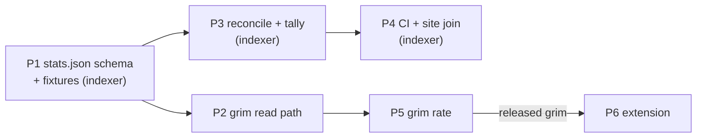

# System Design: Artifact Ratings

<!--
System Design Document (Technical Architecture)
Owner: /hex-architect run 2026-08-17/18, Design phase (architect)
Handoff to: /hex-plan (decomposition), /builder, /security-auditor
Decision record: .agents/adr/adr_artifact_ratings.md — read that first.
This document does not re-argue the decision; it specifies the system.
-->

## Metadata

**Status:** Draft
**Author:** architect (/hex-architect)
**Date:** 2026-08-18
**Related Issue:** [grimoire-rs/grimoire#82](https://github.com/grimoire-rs/grimoire/issues/82)
**Related ADR:** [`adr_artifact_ratings.md`](../adr/adr_artifact_ratings.md)

**Tech Strategy Alignment:**
- [x] Rust 2024 + Tokio in grim; existing TypeScript + Vitest in the indexer; GitHub Actions / GitLab CI
- [x] No database — the forge is the store (deliberate; see ADR Option 2)
- [x] No new observability stack — one structured log line per run (deliberate; see NFR/Operability)
- [x] Deviations from the generic template (no OTel, no RDS, no VPC) are inherent to a system with no servers

## Executive Summary

Ratings are a **static aggregate published by the index** and a **live vote
written to the forge that hosts it**. A CI reconciler creates one bot-owned
thread per artifact, tallies the forge's native upvote counter, and publishes
`stats.json` beside `all.json`; `grim`, the index site, and the VS Code
extension all read that one file and join it by ref. Voting goes from
`grim rate` straight to the forge using the user's own credential. No service
is operated, no database exists, and absence — of the file, of an entry, of a
field — is a first-class "unrated" at every layer.

---

## 1. Context (C4 Level 1)

### System Context Diagram



### Actors & External Systems

| Actor/System | Type | Description | Interaction |
|---|---|---|---|
| Publisher | Person | Publishes an artifact and announces it into an index | Indirect — creates the ref a thread is later reconciled for |
| Browser / voter | Person | Browses the catalog, casts an upvote | Reads static pages; votes through the extension or `grim rate` |
| Forge (GitHub / GitLab) | System | **The database.** Stores threads, votes, voter identity, moderation, abuse reporting, rate limiting | GraphQL — read for the tally, write for creation and votes |
| Static host (Pages) | System | Serves `all.json`, `stats.json`, and the site bundle | HTTPS GET; artifact-based deploy, never a git commit |
| OCI registry | System | Artifact storage | Unchanged by this design — listed to show it is untouched |

**Trust boundaries.** Three, and every one of them is where an invariant sits:
(1) forge content → tally job, guarded by **R-1 marker authority**; (2) tally
job → published artifact, guarded by **R-2 no silent emptying**; (3) user
credential → forge, guarded by stdin hand-off + `SecretString` + redirects
disabled.

---

## 2. Containers (C4 Level 2)

### Container Diagram



### Container Descriptions

| Container | Technology | Purpose | Scaling strategy |
|---|---|---|---|
| `ratings` CI job | Node 22, `@grimoire-rs/indexer` | Stateless level-triggered reconciler: list → diff → budgeted-create → tally | Per-run creation budget (400) paces GitHub's 500/hr cap; backfill spreads across runs |
| `build` CI job | Node 22, Astro/Vite | `compileIndex` → `all.json` (untouched), then `buildSite` joins ratings and emits the bundle | Static build; seconds at 200 artifacts, still seconds at 10k |
| `deploy` CI job | `actions/deploy-pages` / GitLab `pages` | Publishes the artifact; **no git commit** | CDN-fronted |
| `stats.json` | Static JSON | The read contract every client shares | ~75 KB gzipped at 10k artifacts with zero-vote omission |
| grim read path | Rust 2024 | Fetches the sidecar in the same pass as `all.json`, joins by ref into `CatalogEntry` | Shares the existing per-registry cache, TTL and lock |
| grim write path | Rust 2024 + reqwest | One authenticated GraphQL mutation per vote | One request per click |

**Not present, deliberately:** no server, no database, no cache tier, no
queue, no OAuth application, no secret store beyond CI secrets and the OS
credential helpers grim already reads.

---

## 3. Components (C4 Level 3)

### 3.1 Indexer — the reconciler



| Component | Responsibility | Depends on |
|---|---|---|
| `cli/ratings.ts` | Parse config, construct the provider, run the reconcile, write `.stats.json`, emit the one log line | `reconcile`, `config` |
| `reconcile.ts` | The algorithm (§6.2). Pure given a `RatingProvider` and a desired-ref set | `provider`, `budget` |
| `marker.ts` | Build and parse the `grim-ref` marker; **enforce R-1** | — (pure) |
| `budget.ts` | Per-run creation cap and deterministic ordering | — (pure) |
| `provider.ts` | `RatingProvider` interface + `createRatingProvider` factory, mirroring `validate/adapters/forge.ts:146-151` | — |
| `provider_github.ts` | Discussions GraphQL: paginated `discussions`, `createDiscussion` | `http.request` |
| `provider_gitlab.ts` | Work items GraphQL: paginated `workItems`, `workItemCreate` | `http.request` |
| `provider_memory.ts` | In-memory map of ref → thread + votes. **The primary local test seam** — proves reconcile logic with no network and no fixtures | — |

**Placement rationale.** `marker.ts` is separate from the providers because
R-1 is a single rule that must be identically enforced on both forges;
duplicating it into two provider files is exactly how one copy drifts. It is
pure and therefore directly unit-testable against the four R-1 cases.

### 3.2 grim — read path



`load_catalog`'s signature is **unchanged** — no ninth parameter. That matters
because adding one was the specific cost the freshness ADR's reversal cited
against its withdrawn O3.

### 3.3 grim — write path



| Component | Responsibility | Non-regression it inherits |
|---|---|---|
| `forge.rs::graphql()` | POST a GraphQL document, parse `{data, errors}`, fail on non-empty `errors` **regardless of HTTP status** | Redirects disabled and TLS roots come free from `build_client()` — structural, not promised |
| `forge.rs::authorize()` | Unchanged. Its exhaustive `match` over `ForgeKind` gains handling for the mutation case: `Plain` **hard-refuses** rather than sending unauthenticated | The exhaustiveness itself is the guard |
| `rating_provider.rs` | The two mutation payloads and their response shapes; no HTTP of its own | — |
| `rate.rs::resolve_token` | The credential ladder, ending in a read-only refusal (exit 80), never a silent unauthenticated attempt | Mirrors the announce ladder's host-matching shape, with its own narrower credential |

### 3.4 Site — the build-time join



**`compileIndex` is not modified.** That is how `all.json` byte-identity is
guaranteed — structurally, rather than by a promise a future edit could
break. `compileIndex` also `rmSync`s `outDir` at its start, so the join and
the sidecar copy must both happen in `buildSite`, downstream of it. Getting
that order wrong silently deletes the file.

---

### 3.5 Client-side vote state (ADR D12 / Invariant R-3)

`stats.json` is an anonymous aggregate, so no consumer can learn from it
whether *this user* has voted. Resolution differs per surface:

| Surface | Can it know? | Mechanism |
|---|---|---|
| Static site | **No** — never | Prerendered, no identity at build time, no runtime fetch (D1). Affordance renders neutral, always |
| `grim` CLI | Yes, after its own writes | `$GRIM_HOME/state/votes.json`, keyed by **(ref, forge identity)**, written from the mutation response |
| VS Code extension | Yes, via grim | Shells out; never queries a forge itself |

**After a click**, the mutation response is authoritative and no second query
is issued: `awardEmojiToggle` returns `toggledOn`, and GitHub's upvote
mutations return the subject with `upvoteCount` and `viewerHasUpvoted`.

**Before a click on an unseen machine**, the answer needs a token and a call —
`viewerHasUpvoted` (GitHub) or locating the user's own award in the emoji list
(GitLab). This is a **lazy refinement on a detail view only**, never a bulk
catalog query, which would authenticate and de-staticise the read path.

> **Invariant R-3 (Tri-State Vote Display).** Render **voted / not-voted /
> unknown**, never a boolean. Absent or unreadable local record ⇒ **unknown**
> ⇒ neutral, never "not voted".

`votes.json` is a cache: absent is first-class, an unparseable file is
discarded as unknown rather than raising, nothing else reads it, and it sits
outside the `state.json` V2 schema so it carries no migration obligation.
Keying by forge identity — not ref alone — is what stops two accounts on one
machine, or a rotated credential, from inheriting each other's display state.

### 3.6 Forge endpoint resolution (ADR D13)

grim resolves a credential **for the host it is about to contact** via the
existing ladder (`forge.rs:37-96`, `:150-180`), so index-supplied host data is
not a token-exfiltration path — an unknown host resolves no credential. The
exception is `--token-stdin`, where the extension *injects* rather than grim
resolving; the rule therefore sits on the injector: **the extension selects
its auth provider from the same host it hands to grim, and pipes nothing when
that host is not one it authenticated against.** The GraphQL client is built
through `build_client()` (`forge.rs:263-278`) and inherits its hard-disabled
redirects.

## 4. Key Design Decisions

Full rationale lives in the ADR. Restated here only as a lookup table.

| Decision | Options considered | Chosen | Rationale (one line) |
|---|---|---|---|
| Backend | Forge, self-hosted service, Open VSX, none, comment engine | **Forge** | Only option with zero infrastructure for *self-hosted* indexes too |
| Site freshness | Rebuild-to-refresh, runtime fetch + hydrate | **Rebuild-to-refresh** | Avoids the site's first-ever runtime fetch; puts grim and the site on one freshness model; the fetch stays additively available later |
| grim caching | Own file + TTL, share `CatalogFile`, no cache | **Share `CatalogFile`** | Zero new envelope, zero new TTL, `GRIM_OFFLINE` inherited verbatim |
| `provider` typing | Tagged enum + `#[serde(other)]`, open string | **Plain string, dispatch-only** | Hoisting `target`/`url` out of the union removes the data-loss hazard rather than mitigating it |
| Marker trust | Marker alone, marker + author | **Marker + author id + top-level only** | Block-tier; a reply can otherwise forge a binding |
| Bot identity | GitHub App, fine-grained PAT / `GITHUB_TOKEN`, `CI_JOB_TOKEN` | **`GITHUB_TOKEN` in Actions; PAT otherwise; GitLab project access token** | GitHub Apps have **no** Discussions permission at all; `CI_JOB_TOKEN` inherits a human's identity and would defeat R-1 |
| Concurrency | Best-effort, `concurrency`/`resource_group` | **Lock, mandatory** | No atomic create-if-not-exists on either forge |
| Triggers | Schedule-primary, push-primary | **Push primary, hourly schedule secondary** | GitHub disables schedules after 60 days without commit activity, and running them does not reset the clock |
| Publish | Commit, Pages artifact | **Pages artifact, never commit** | Kills the CI loop and history bloat by construction |
| CI distribution | Vendored bodies, thin versioned stub | **Vendored, with volatility in the npm package** | The YAML is already thin; the fix path is a version bump downstream repos already take |
| Rust abstraction | Trait, enum + match | **`match`, no trait** | Closed two-arm set, one binary crate, no library API |

---

## 5. API Design

### 5.1 `stats.json` — the read contract

Served at `<base>/stats.json`. Full schema and the OSV-style consumer
sentence are in the ADR § API Contract. Restated obligations only:

| Level of absence | Meaning | Never |
|---|---|---|
| File absent (404) | This index publishes no ratings | An error, a warning above `debug`, or a failed catalog build |
| `entries` key absent | Nothing is rated yet | An error |
| Ref absent from `entries` | That artifact has no stats at all | A missing-key panic or a "data quality" warning |
| `rating` key absent on an entry | Unrated (zero votes); any other stat on that ref is unaffected | Treating one absent stat as invalidating the whole entry |
| `rating` absent on a `CatalogEntry` | Unrated | A field any consumer may assume present |

Five levels, not four, because `entries[ref]` is a **bag of stats** (ADR
D14): a ref may carry `downloads` and no `rating`, or the reverse. Each signal
key is independently absent-first-class.

All four are fixture-tested (§12, step 1). Without those tests the
"absent is first-class" claim is a comment in a document.

### 5.2 `grim rate` — the write surface

Signature, flags, credential ladder, report shape, and the full exit-code
table are specified in the ADR § API Contract. Two points that belong here
because they are integration facts rather than decisions:

- **stdin, never argv.** argv lands in world-readable `/proc/<pid>/cmdline`;
  environment variables land in `/proc/<pid>/environ` (owner-readable, but
  inherited by every grandchild and routinely echoed into CI logs by `set -x`).
  stdin appears in neither and is not inherited. The VS Code hand-off is
  programmatic (`child.stdin`), so shell history is not in play — but the doc
  note for manual use is, because `echo $TOKEN | grim rate` leaks via the
  `echo`, not the pipe.
- **`expose_secret()` exactly once.** At the point the `Authorization` /
  `PRIVATE-TOKEN` header is built — never into an intermediate `let` outside
  that scope, never into a struct that derives `Debug` or `Serialize`. The
  `src/api/` always-present-null convention makes the second one specifically
  dangerous: a naively-added token field would serialize into JSON output.
  `secrecy`'s `SecretBox` has no `Serialize` impl for exactly this reason.

### 5.3 `RatingProvider` — the indexer seam

Interface as specified in the ADR. Three properties the implementations must
hold and the fake must model:

1. `listAuthored()` paginates **to exhaustion**. A single unpaginated page is
   not proof of absence — that is precisely giscus's duplicate-creation bug
   ([giscus#738](https://github.com/giscus/giscus/issues/738)).
2. `listAuthored()` applies R-1 **inside** the provider. A caller must not be
   able to receive an unauthorized thread and forget to filter it.
3. Any transport failure throws. It must never surface as an empty list —
   `request()` maps every failure to `{status: 0}`, so `status === 0` is a
   hard error here (R-2).

### 5.4 Versioning strategy

`schema_version` is a **monotonic integer**, crates.io style, not semver.
Semver exists to communicate "minor vs major"; Principle 9 has pre-committed
the project to never making that distinction, so a semver string here would
signal an axis that does not exist. Default `1` if ever absent.

---

## 6. Data Model & Algorithms

### 6.1 Entity relationships



**The `ref → target` edge is derived, never stored.** No back-push into the
publish path, no forge-specific id inside a frozen contract, and no second
copy of ownership truth to go stale — the same property every reconciler bot
surveyed relies on (Renovate's branch name, release-please's label,
all-contributors' marker block *are* the state).

**Voter identity is never copied.** `stats.json` holds counts only. grim is
not the data controller for the vote event — it lives and is processed on the
forge, under a privacy policy the user already accepted by having an account,
and an upvote is already public there by construction, exactly like a star.
The only obligation this creates is one line of UX copy before the vote fires:
*"voting posts publicly to your GitHub/GitLab account."* No retention policy
is needed on grim's side because grim retains nothing but a count.

### 6.2 The reconcile + tally algorithm

Stateless and level-triggered. Every run re-derives everything; a partial run
leaves *fewer threads created*, never corrupt state.

```
run():
  cfg      = index.config.json .ratings          # absent ⇒ exit 0, no file written
  desired  = { p.ref for p in all.json }         # sorted, deterministic
  provider = createRatingProvider(cfg.provider, cfg)

  # 1. OBSERVE — paginate to exhaustion. R-1 applied inside the provider.
  threads  = provider.listAuthored()             # throws on transport error (R-2)

  # 2. CONFLICT — a ref with >1 authorized thread contributes zero (R-1).
  byRef    = groupBy(threads, t => t.ref)
  conflicts = { ref : ts for ref, ts in byRef if len(ts) > 1 }
  for ref, ts in conflicts:
      warn("ratings: ref %s bound by %d threads: %s — delete all but one",
           ref, len(ts), [t.url for t in ts])
  observed = { ref : ts[0] for ref, ts in byRef if len(ts) == 1 }

  # 3. DIFF + BUDGETED CREATE — stable order, so successive runs make
  #    monotonic progress with no stored cursor.
  missing  = sorted(desired - observed.keys())
  created  = 0
  for ref in missing[:cfg.createBudget]:
      try:
          t = provider.create(ref)               # body carries <!-- grim-ref: ref -->
          observed[ref] = t; created += 1
      except SecondaryRateLimit as e:
          honor(e.retryAfter); limited = true; break   # stop early, do not spin

  # 4. TALLY — the forge's own counter; no per-voter enumeration.
  #    Nested under the `rating` stat key (ADR D14). Zero-vote omitted.
  fresh = { ref : {"rating": {up: t.up, target: t.target, url: t.url}}
            for ref, t in observed.items()
            if t.up > 0 and ref not in conflicts }

  # 5. MERGE PER STAT KEY over the seed — Invariant R-2.
  #    `rating` is authoritative from THIS run because the tally completed;
  #    every OTHER stat key is carried forward from the seed untouched.
  #    Never a whole-file replacement: a rating run must not drop a
  #    `downloads` key it never computed.
  seed = load_seed()            # {} on a genuine 404; hard-fails otherwise
  merged = {}
  for ref in set(seed.entries) | set(fresh):
      carried = { k: v for k, v in seed.entries.get(ref, {}).items()
                  if k != "rating" }              # other stats survive
      if ref in fresh:
          carried["rating"] = fresh[ref]["rating"]
      # ref absent from `fresh` ⇒ its rating genuinely went to zero or the
      # thread is in conflict ⇒ the key is dropped, which is CORRECT because
      # this producer completed. Only a FAILED producer carries forward.
      if carried:
          merged[ref] = carried

  # 6. PUBLISH — unconditionally; regeneration is cheap, nothing is committed.
  write(".stats.json", {schema_version: 1, generated_at: now(),
                        providers: {"rating": cfg.provider}, entries: merged})

  log("refs=%d created=%d/%d tallied=%d conflicts=%d secondary_limit_hit=%s",
      len(desired), created, len(missing), len(entries), len(conflicts), limited)

  exit 0 if not limited else 0    # a throttled run did real, correct, partial work
                                  # every OTHER error propagates → non-zero → red X
```

**Why step 3's ordering is load-bearing:** sorting means run *N+1* resumes
exactly where run *N* stopped, with no cursor file. `actions/stale` keeps a
resume cursor in the Actions cache as an *optimization*; correctness there,
as here, never depends on it.

**Why step 4 uses the scalar counter:** GitHub's `upvoteCount` and GitLab's
AwardEmoji `upvotes` are scalars, ~1 GraphQL point per page. Counting reaction
*nodes* instead would multiply nested-node cost for the same number.

**Throttling.** Do not hand-roll the backoff. GitHub's own guidance is
explicit — serial requests, honour `retry-after` first, then
`x-ratelimit-reset`, else exponential from ≥60s — and *"continuing to make
requests while you are rate limited may result in the banning of your
integration"*. `@octokit/plugin-throttling` implements exactly that contract;
the GraphQL analogue is querying `rateLimit { remaining, resetAt }` before
each batch.

### 6.3 Marker format and R-1 enforcement

```
<!-- grim-ref: ghcr.io/grimoire-rs/grim-usage -->
```

Parsing is an **anchored** pattern, first match only. Not because an
unanchored `<!-- grim-ref: (.*) -->` is exploitable once R-1 clause 2 holds —
it is not, an attacker's content is never parsed as a marker source — but
because an unanchored parser is a parser-differential bug waiting for the day
someone relaxes clause 2.

Injection through the ref itself is closed **by construction**, not by new
validation: `ArtifactRef` (`src/oci/reference.rs:13`) wraps an OCI
`Identifier`, and grim enforces OCI tag/name charset at publish time, which
excludes `<`, `>`, `--`, and backticks. The one implementation-time check is
that the write path embeds that validated type end to end rather than
reconstructing a string from less-trusted input.

### 6.4 Data migration

There is no data to migrate. `stats.json` does not exist; `CatalogEntry`
gains an optional field with `#[serde(default)]`. The one migration-shaped
behaviour is the `deny_unknown_fields` downgrade: an older grim reading a
newer cache rejects it and rebuilds. That costs one network refresh, is the
documented precedent `replaced_by` already set, and requires no code.

**Rollback:** delete `stats.json` from the deploy, or remove the `ratings`
block from `index.config.json`. Every client reads the result as unrated on
its next refresh. No state to unwind, no records to reconcile, no schema to
revert.

---

## 7. Security Architecture

### Authentication & Authorization

| Path | Mechanism | Notes |
|---|---|---|
| Bot → forge (GitHub, Actions) | `GITHUB_TOKEN`, `permissions: { discussions: write }` | Repo-scoped, expires at job end, nothing to rotate |
| Bot → forge (GitHub, elsewhere) | Fine-grained PAT, one repo, `discussions: read/write` + `metadata: read` | Leak blast radius: manage discussions and toggle upvotes in one repo. Cannot read code, push, or reach secrets |
| Bot → forge (GitLab) | Project access token, `api` scope | **Never `CI_JOB_TOKEN`** — it inherits the triggering user's role, which would satisfy R-1 clause 2 with a human's identity |
| User → forge (extension) | VS Code session token piped via `--token-stdin` | Reuses `github` / `github-enterprise` / GitLab Workflow's `gitlab` providers — no second login, no OAuth app registration |
| User → forge (standalone CLI) | host-matched env → `gh`/`glab` stored credential → device flow → read-only refusal | Own ladder, narrower than and distinct from the announce token |

### Data Protection

- **In transit:** TLS with embedded roots merged into the system trust store
  (`crate::tls`), redirects hard-disabled.
- **At rest:** nothing sensitive is stored. `stats.json` holds counts;
  grim's cache holds counts and two opaque strings.
- **Credentials in memory:** `Zeroizing<String>` on read → `SecretString` →
  `expose_secret()` once at the header. Never in a `Debug`/`Serialize` struct.
- **Scope breadth is a disclosed limitation, not a solved problem.** VS Code's
  built-in `github` provider is one registered OAuth App shared by every
  extension; requesting narrower scopes does not shrink an already-issued
  broader session. `public_repo` is the realistic floor — classic OAuth has no
  Discussions-specific scope. RFC 8693 token exchange would fix it and
  requires standing up a security token service, reintroducing the exact cost
  the whole design avoids. Request the narrowest array explicitly at the call
  site, hold the handling code to a stricter bar than ordinary data, and
  document the breadth. Do not register a second OAuth app.

### STRIDE

| Threat | Vector here | Mitigation |
|---|---|---|
| **Spoofing** | A commenter forges a `grim-ref` marker to rebind a popular artifact's votes to a typosquat | **R-1** — author account **id** + top-level body only + first match. Announcement-category locking is defence in depth, not the mechanism |
| **Tampering** | Altering the published aggregate | Out of scope by proportionality: the index carries no signature scheme at all, and an attacker who can tamper it can redirect an *install* (code execution) — signing the display number while the payload stays unsigned is theatre. Revisit only if the index gains an integrity story |
| **Repudiation** | Disputing a vote | The forge owns the audit trail (who upvoted what, when) and it is public. `stats.json` deliberately keeps none |
| **Information disclosure** | Voter identity leaking into grim-controlled artifacts | Counts only, by design. The vote is already public on the forge; the obligation is one line of UX copy, not a data-handling change |
| **Denial of service** | Vote spam exhausting the bot's quota | Inherited: forge secondary limits (80/min, 500/hr) and abuse reporting. grim builds no competing anti-abuse system |
| **Elevation of privilege** | Bot credential misuse | Least privilege per the table above; `namespaces: []` in `trustedBots` grants the ratings bot **zero** announce authority while registering its identity |

### Known, accepted asymmetries

- **GitHub has no native self-upvote block**; GitLab natively refuses award
  emoji on your own issue. A malicious author can self-boost on GitHub
  specifically. Documented, not engineered against — custom self-vote
  detection is exactly the speculative complexity the ADR's three-point
  decision margin forbids.
- **`strace`/`ptrace` by a same-uid hostile process** can read the stdin pipe.
  True of every local credential hand-off mechanism, no industry mitigation
  exists, out of scope. Named so it is not mistaken for an oversight.

---

## 8. Non-Functional Requirements

### Performance

| Metric | Target | Basis |
|---|---|---|
| Tally, 200 artifacts | 2 GraphQL requests | 100/page pagination |
| Tally, 10k artifacts | ~100 requests, ~100 of 5,000 points/hr, 30–60s serial | Scalar `upvoteCount`, no nested nodes |
| Vote round trip | 1 request | One mutation |
| grim catalog refresh overhead | +1 HTTPS GET per index source, at most hourly | Same pass as `all.json` |
| Site build overhead | One JSON read + one map join | `buildSite`, not `compileIndex` |

### Scalability

| Dimension | Today | Ceiling | Strategy |
|---|---|---|---|
| Artifacts | ~200 | ~1–2k comfortable | Budgeted backfill; the three revisit triggers in the ADR |
| Thread creation | trivial | **80/min, 500/hr** — the binding constraint | 400/run budget ⇒ ~25 unattended runs to backfill 10k |
| `stats.json` size | negligible | ~75 KB gzipped at 10k (5% participation) | Zero-vote omission |
| Tally / serving | trivial | Not the constraint at any modelled scale | — |

### Availability & Reliability

| Property | Behaviour |
|---|---|
| Forge down | Votes fail (exit 69). **Browsing is unaffected** — reads are static |
| Tally job fails | R-2: previous `stats.json` carried forward from the live site; deploy proceeds; red X is the alert |
| Pages down | grim serves its cache; offline is a first-class mode |
| Schedule silently disabled (60-day rule) | Ratings go **stale, never wrong**. `generated_at` makes it observable. Push-triggered path keeps working |
| Partial reconcile | Fewer threads created; next run's list-and-diff continues. This *is* the checkpoint |

### Observability

| Pillar | Implementation |
|---|---|
| Metrics | **None.** Deliberate — the one log line carries every operational question |
| Logging | One structured line per run: `refs=N created=X/Y tallied=Z conflicts=C secondary_limit_hit=<bool>` |
| Tracing | None |
| Alerting | **The red X in the Actions/pipelines tab.** For a `schedule` trigger, GitHub's default notification reaches "whoever triggered it" — effectively nobody — so *failing the job* is what makes an alert exist at all. Email/Slack routing is optional polish, deferred |

Derived signals, not stored: "backfill still draining" is `X < Y`; "tally
unchanged for N runs" is computable from run history. Do not build a metrics
pipeline for either.

**Rate-limit hits warn, they do not fail.** A throttled run did real, correct,
partial work; a red X there would train the maintainer to ignore red X's.

### Cost

Free-tier-shaped at every scale modelled. Public repos run Actions free;
GitHub-hosted Linux is $0.006/min for private repos and the job is sub-minute;
GitLab self-managed has no CI-minute billing on any tier; GitHub's proposed
self-hosted-runner platform fee was announced Dec 2025 and postponed within
48 hours, still inactive as of Aug 2026. The 10k-artifact concern is a
**rate-limit wall-clock** problem, not a dollar problem.

---

## 9. Infrastructure

### Deployment topology

```
GitHub-hosted index                        GitLab-hosted index
───────────────────                        ───────────────────
workflow: ratings.yml                      .gitlab-ci.yml
  on: push(default) | schedule(hourly)       rules: push | schedule
    | workflow_dispatch
  concurrency:                               ratings job:
    group: grim-ratings-${{repo}}              resource_group: grim-ratings
    cancel-in-progress: false                    process_mode: oldest_first

  job ratings:                               job ratings:
    permissions: {discussions: write}          GRIM_RATINGS_TOKEN (project token)
    GITHUB_TOKEN                               npx grim-indexer ratings
    npx grim-indexer ratings                   artifacts: .stats.json
    upload-artifact .stats.json

  job build: needs:[ratings], if: always()   job pages: needs:[ratings]
    1. seed: curl -sS -o .stats.json \        when: always
         -w '%{http_code}' $SITE/stats.json    (same three steps)
       404 -> empty seed;  2xx -> merge base
       anything else -> FAIL the job
    2. download-artifact (continue-on-error)    artifacts: paths: [public]
    3. npx grim-indexer build
    4. upload-pages-artifact

  job deploy: needs:[build]
    actions/deploy-pages          ← no branch, no commit, not a push event
```

**Step order in `build` is the whole of R-2** and must not be reordered:
seed from live first, then **merge** the fresh artifact per stat key if one
exists. A first-ever run's **404** is absent-is-first-class; a failed `ratings`
job leaves the seed in place; a successful one merges over it.

**`|| true` is forbidden here.** It cannot distinguish a genuine 404 from a
DNS failure, a TLS error, a 5xx, or a truncated body — and if the tally also
failed, the deploy would then publish a site with *no* sidecar, the exact wipe
R-2 exists to prevent. Capture the status code and branch: **404** ⇒ empty
seed; **2xx that parses** ⇒ merge base; **2xx that does not parse, or any
transport/TLS/5xx/timeout** ⇒ **fail the job**. Never treat a failure as
empty. Same trap as `request()` mapping every failure to `{status: 0}`
(`src/validate/adapters/http.ts:49-70`) — a producer treats `status === 0` as
a hard error.

**`cancel-in-progress: false` is mandatory.** The default cancels the pending
run; queueing is what makes the level-triggered resync work.

### Environment configuration

| Environment | Purpose | Setup |
|---|---|---|
| Local dev | Reconcile logic, R-1, budget pacing | Two worktrees + `file:` devDependency + the in-memory provider. **No network, no forge, no publishing** (§12) |
| Index CI | Real reconcile against a real forge | The workflow above |
| Production | `index.grimoire.rs` | **Gated on the owner's explicit go-ahead** — see the ADR's first clarification |

### Prerequisites the tooling cannot create

Documented setup, verified by a **fail-fast named error** on the first run
rather than assumed:

1. GitHub: Discussions enabled on the repo, plus a category (announcement
   format recommended). GHES needs 3.6+.
2. GitLab: issues enabled as work items; the configured work item type must
   carry the AwardEmoji widget (Issue and Task do).
3. The credential provisioned per §7.
4. The bot registered in `index-policy.json` with `namespaces: []`.

---

## 10. Dependencies

### Internal

| Component | Purpose | Criticality | Fallback |
|---|---|---|---|
| `catalog_service::load_catalog` | The one browse seam `search`/TUI/MCP share | High | None needed — signature unchanged |
| `forge.rs::build_client()`/`authorize()` | Hardened HTTP client + auth header | High | None — reuse is what makes the hardening structural |
| `login.rs::read_password` pattern | Credential hygiene | High | Copy verbatim, do not re-derive |
| `validate/adapters/http.ts::request()` | Indexer HTTP | Medium | Additive `{method, body}` param; 8 call sites untouched |
| `validate/core/ownership.ts` | `TrustedBot` shape + id-not-login doctrine | Medium | Reused unchanged |

### External

| Service | Purpose | SLA | Fallback |
|---|---|---|---|
| GitHub Discussions / GitLab work items | The store | None contracted | Reads keep working from the last published `stats.json`; votes fail with exit 69 |
| GitHub / GitLab Pages | Serving | None contracted | grim serves its cache; offline is first-class |
| GitHub Actions / GitLab CI | Running the reconciler | None contracted | Ratings go stale; nothing breaks |

**No new runtime dependency is added to grim.** `reqwest`, `secrecy`,
`zeroize`, and `serde_json` are already in `Cargo.toml`. No GraphQL client
crate — the payloads are two fixed query strings and two fixed mutation
strings, which is a `serde_json::json!` literal, not a code-generation
problem.

---

## 11. Risks & Mitigations

| Risk | Probability | Impact | Mitigation |
|---|---|---|---|
| Marker forgery redirects organic votes | High if unmitigated — one public comment | High — silently corrupts the aggregate and directly enables the fake-popularity attack class | **R-1**, built and tested before any write path lands |
| Failed tally wipes every displayed rating | Medium — any transport blip | High — looks like mass vote loss | **R-2** seed-from-live; `status === 0` is a hard error |
| Duplicate threads from concurrent runs | Medium without a lock | Medium — two `target`s for one ref | D6 lock, **plus** R-1's conflict rule making it loud instead of silent |
| `CI_JOB_TOKEN` used on GitLab for convenience | Medium — it is the obvious choice | High — silently satisfies R-1 clause 2 with a human's identity | Named as a correctness failure; the provider refuses it explicitly |
| A builder free-hands credential handling | Medium | High | `login.rs:156-176` copied verbatim; reviewed on the always-on security perspective |
| GraphQL 200-with-`errors` read as success | **High** — the existing REST helpers assume `status.is_success()` | High — every failure reads as success | `graphql()` checks `errors` independently of status; a test asserts a 200+`errors` response is an `Err` |
| Scheduled workflow silently disabled | Certain on a quiet public index after 60d | Low — stale, not wrong | Push-triggered primary; `generated_at` makes staleness observable; `workflow_dispatch` is the recovery lever |
| Self-boosting on GitHub | Low–Medium | Low–Medium | Documented asymmetry; no custom detection (YAGNI, and the decision margin forbids it) |
| Backfill never drains past ~1–2k | Low at current scale | Medium | Measurable revisit trigger #1; migration path priced in the ADR |

---

## 12. Implementation Phases

Phase order is by **contract dependency**. Each phase names what it unblocks.

### Phase 1 — The contract (indexer, no producer)
- [ ] `stats.json` schema, `schema_version: 1`
- [ ] Four fixtures: minimal valid; unknown top-level keys; unknown `provider`; ref absent from `entries`
- [ ] Docs: the spec + the OSV-style consumer sentence in `package-index.md`
- **Unblocks:** everything. Nothing else may begin without it.

### Phase 2 — grim read path *(independently shippable and useful alone)*
- [ ] `fetch_ratings` sidecar GET in the same pass as `all.json` (HTTP index sources only)
- [ ] `CatalogEntry.rating` + `RatingSummary` (cache: omit; wire: lenient, separate struct)
- [ ] `SearchEntry.rating` — 13 → 14 fields, `json_carries_replaced_by_plain_table_does_not` updated in the same commit
- [ ] TUI detail-pane `Rating:` row, beside `Revision:`/`Created:`
- [ ] Fixtures from Phase 1 deserialize through the real structs
- **Unblocks:** Phase 5 (needs `target` to vote against).

### Phase 3 — Reconcile + tally (indexer)
- [ ] `RatingProvider` + `createRatingProvider`
- [ ] `provider_memory.ts` — the in-memory fake
- [ ] `marker.ts` + the four R-1 cases
- [ ] `budget.ts`, deterministic ordering, throttling per GitHub's documented order
- [ ] GitHub + GitLab providers; `request()`'s additive `{method, body}`
- [ ] `grim-indexer ratings` verb
- **Unblocks:** Phase 4.

### Phase 4 — CI generation + site join (indexer)
- [ ] `ratings` block in `index.config.json`
- [ ] Generated jobs, both forges, with the concurrency lock and the three-step R-2 seed
- [ ] `buildSite` ref join → `dist/stats.json` + `CatalogPackage.rating`
- [ ] `Catalog.tsx` meta-row (omit when absent — no placeholder)
- [ ] Golden fixture asserting `all.json` byte-identity
- **Unblocks:** any index adopting ratings.

### Phase 5 — grim write path
- [ ] `forge.rs::graphql()` with `{data, errors}` handling and the 200-with-errors test
- [ ] `rating_provider.rs` — two mutations
- [ ] `command/rate.rs`, `--token-stdin`, the credential ladder, `--remove`
- [ ] `api/rate_report.rs`; the seven-code exit table
- [ ] `authorize()`'s `Plain` arm hard-refuses a mutation
- **Unblocks:** Phase 6.

### Phase 6 — VS Code extension
- [ ] **New** `RATING_GRIM_VERSION = '0.14.0'` beside `MINIMUM_GRIM_VERSION`/`REGISTRY_EDIT_GRIM_VERSION`, gating the vote affordance only — **not** a bump of the hard floor, so an older-grim user keeps the rest of the extension (plan C-018 supersedes the earlier bump wording here)
- [ ] `rateArgs()` — a pure argv builder, matching every existing one
- [ ] Session token from `github` / `github-enterprise` / `gitlab` providers; PAT in `SecretStorage` as fallback; piped via `child.stdin`
- [ ] The "voting posts publicly to your account" disclosure before the first vote
- [ ] **No forge URL is ever constructed** — the thread link comes from grim

### Phase 7 — Docs
- [ ] `commands.md` (`grim rate`), `json-interface.md` (the `rating` field), `hosting-an-index.md` (the `ratings` block — **not** `configuration.md`, which covers grim's own `grimoire.toml`)
- [ ] `.claude/rules/subsystem-cli-commands.md` (`grim rate` row — no structural test catches its absence)
- [ ] Catalog drift per `catalog/README.md`: `grim-usage` (`description` frontmatter + Command Map row), `grim-authoring` (reviewed-no-change disposition)
- [ ] `stability.md`: the new artifact's guarantee, and the `CatalogEntry` `deny_unknown_fields` downgrade note
- [ ] `catalog/README.md` drift review — Phase 5 adds a `src/command/**` surface, so the shipped `grim-usage` skill must be re-reviewed (`task catalog:verify` gates CI)

### Local test setup — no publishing, no real forge

```
.agents/worktrees/grimoire-index   ← THE INDEXER (@grimoire-rs/indexer)
~/dev/grimoire-index               ← THE INDEX (grimoire-rs/index) — and it is DIRTY
```

**The names are inverted.** Confirm with `git remote -v` before touching
either. Three live checkouts of `grimoire-rs/index.git` exist on three
branches; `.agents/worktrees/index-site` (clean, `main`) is the right target
for a scratch index, **not** `~/dev/grimoire-index`.

Setup:

1. In the scratch index worktree, point `devDependencies["@grimoire-rs/indexer"]`
   at `file:../grimoire-index`. npm **symlinks** a `file:` dependency rather
   than copying, so indexer edits are visible immediately with no reinstall.
   `install-links` has no effect here (it only applies inside workspaces) —
   do not reach for it to "fix" a symlink you did not expect.
2. Hard-reset between runs with `git clean -fdx` in the index worktree, not by
   reinstalling the dependency.
3. Run the reconcile against **`provider_memory.ts`** — a map of ref → thread
   + votes, seeded from `all.json`. This exercises diffing, budget pacing,
   marker round-trip, R-1, and the conflict rule with zero network and zero
   fixtures to maintain. It is the primary loop.
4. Layer `stubFetch` (`test/validate/helpers.ts:29-51`) only over the thin
   GraphQL serialization adapters — the part an in-memory fake cannot
   validate.

**`stubFetch` needs one extension.** Its handler receives `url` only; GraphQL
routes by **body** on a single endpoint, so every operation looks identical
by URL. The handler signature must widen to `(url, init)` — additive, and the
existing `calls` array already records `init.headers`, so the plumbing is
half there.

npm workspaces were considered and rejected: they assume one repo root, and
the indexer and an index instance are separate repos with independent
histories. `file:` across worktrees is the right-shaped tool.

---

## 13. Cross-Repo Sequencing

Which contract lands first, and what each repo can ship alone.



| Repo | Ships independently once… | What it delivers alone |
|---|---|---|
| **indexer** | P1 exists (it authors it) | P1→P4 with no grim change at all. An index publishing `stats.json` is valid immediately; older grims ignore it |
| **grim** | P1 exists | P2 alone is shippable and useful — an index already publishing ratings shows them in `search`, TUI, and MCP. P5 needs P2 |
| **grimoire-vscode** | A **released** grim carries P5 | Nothing before that; the feature is `MINIMUM_GRIM_VERSION`-gated |

**Why the schema leads.** It is the only artifact three independently
versioned consumers share, and Principle 9 freezes it the moment it ships.
Landing it first means every subsequent phase is written against a fixed
contract rather than negotiating one across three repos in flight.

**Why the read path precedes the write path.** `grim rate` votes against
`target`, which it reads out of `CatalogEntry.rating`. Building the write path
first would mean inventing a second way to obtain `target` and then deleting
it.

**Why the extension is last and gated.** It shells out for everything and
constructs no forge URLs, so it cannot ship a vote affordance before a
released grim exposes `grim rate`. `MINIMUM_GRIM_VERSION` is the existing
mechanism; no capability probe is introduced.

---

## 14. Migration & Rollout

### Existing indexes

Nothing changes until an index opts in. An index that does nothing publishes
no `stats.json`, and every client reads that as unrated — no warning, no
error, no degraded page.

Adoption, in order:
1. Enable Discussions (GitHub) or confirm work items (GitLab); create the
   container category/type.
2. Provision the credential (§7).
3. Register the bot in `index-policy.json` — `{login, id, namespaces: []}`.
4. Add the `ratings` block to `index.config.json`.
5. Bump `@grimoire-rs/indexer` and re-run `grim-indexer ci` — the same step
   every CI change already requires.
6. First run backfills up to `createBudget` threads and publishes an empty or
   near-empty `entries` map. That is correct, not a failure.

**Rollback at any point:** remove the `ratings` block **and delete the
published `stats.json`** — both steps, because they answer different
questions. Removing the block stops the producer; it does **not** remove the
sidecar, since R-2's seed-and-merge deliberately carries the last good file
forward and would keep serving a frozen, silently-staling rating set forever.
Rollback is therefore an explicit two-part operation: disable the producer, then
delete the artifact so the read path returns to a clean 404 and every client
falls back to absent-is-first-class.

Threads remain on the forge, harmless and re-adoptable — the mapping is
derived, so re-enabling picks them all back up on the next list-and-diff.

### Existing grim installs

- A grim predating Phase 2 never requests the sidecar. Unaffected.
- A grim carrying Phase 2 against a pre-ratings index gets a 404, logs at
  `debug`, and builds the catalog normally.
- **The one visible effect of upgrading** is the `deny_unknown_fields`
  downgrade: install 0.14, then downgrade to 0.13, and 0.13 rejects the cache
  and rebuilds it. One network refresh, no data loss, and the precedent
  `replaced_by` already set.
- `grim rate` is additive. Nothing existing changes shape; `SearchEntry` gains
  one always-present-null key, which the documented reader obligation already
  covers.

### Existing extension versions

- An extension predating Phase 6 shows no vote affordance and is unaffected by
  a grim that has `grim rate`.
- An extension carrying Phase 6 against an older grim hides the affordance via
  `MINIMUM_GRIM_VERSION` — the same gate every other version-dependent feature
  uses.
- The extension **never** constructs a forge URL. `url` comes from grim's
  report, opaque, and is opened as-is. This is what keeps the extension free
  of forge-shaped logic and lets the provider change without touching it.

### Rollout order for the public index

Deliberately **not** specified here — it is a live production surface and the
owner's call. See the ADR's first clarification.

---

## 15. Open Questions

Capped at three, per the brief. Full text in the ADR.

All three resolved by the owner on 2026-08-18; kept with resolutions.

- [x] **RESOLVED — the public index ships ratings on at v1.**
      `index.grimoire.rs` is this project's own index and dogfooding is the
      point. Enabling Discussions on `grimoire-rs/index` and provisioning the
      credential are **owner actions**, not implementation steps: no task
      touches the live index, its settings, or its secrets without an explicit
      go-ahead at that moment.
- [x] **RESOLVED — `grimoire-lore` is out of scope, permanently.** OCX-owned,
      a consumer of this project rather than part of it. v1 targets
      `grimoire-rs/index` only, so its empty `trustedBots` is not a gap here.
- [x] **RESOLVED — sorting is in scope, not display-only** (ADR D14). `Sort`
      widens to `"name" | "updated" | "rating"` across the site, the TUI, and a
      `grim search --sort` flag; `"downloads"` is reserved as an additive
      future value ([#89](https://github.com/grimoire-rs/grimoire/issues/89)).
      Order is rating desc → updated desc → name; unrated artifacts sort
      **last**, never as zero, so a new artifact is not buried under a single
      upvote.

**Stated assumptions** (decided in-band, flagged for review rather than
blocking):
- `--remove` retracts the user's own upvote. Read as *not* a downvote — votes
  stay up-only and binary; both forge primitives are toggles, so retraction is
  the same API surface, and omitting it leaves a mis-click unrecoverable.
- Ratings are JSON-only and TUI-only in grim's presentation — **no new
  `grim search` plain-table column**, matching `replaced_by`, which is
  documented as "JSON-only — never shown as its own plain-table column".
- Ratings apply to HTTP index sources only. Git-transport indexes and OCI
  `_catalog` sources read as unrated.

---

## Appendix

### Glossary

| Term | Definition |
|---|---|
| **Thread** | The bot-owned forge object carrying a `grim-ref` marker: a GitHub Discussion or a GitLab work item |
| **`target`** | Opaque forge node id the vote mutation addresses. No client parses or constructs it |
| **`url`** | Opaque human-facing thread link. No client parses or constructs it |
| **Marker** | `<!-- grim-ref: <ref> -->` in a thread's own body — the derived, never-stored `ref → target` mapping |
| **R-1** | Marker Authority: top-level body **and** bot author id **and** first match; >1 authorized thread ⇒ zero votes |
| **R-2** | No Silent Emptying: an empty `entries` map is written only by a completed tally that genuinely saw zero votes |
| **Level-triggered** | The reconciler converges on desired state from whatever it observes, rather than reacting to events. Missed runs, external changes, and partial failures all self-heal |
| **Absent is first-class** | No file, no entry, no field all mean *unrated* — never an error, at any layer |

### References

**Decision and research**
- [`adr_artifact_ratings.md`](../adr/adr_artifact_ratings.md)
- [`research_rating_backends.md`](../research/research_rating_backends.md) · [`research_rating_architecture_map.md`](../research/research_rating_architecture_map.md) · [`research_rating_schema_compat.md`](../research/research_rating_schema_compat.md) · [`research_rating_security.md`](../research/research_rating_security.md) · [`research_rating_operability.md`](../research/research_rating_operability.md)

**Forge APIs**
- [Discussions GraphQL guide](https://docs.github.com/en/graphql/guides/using-the-graphql-api-for-discussions) · [GitHub rate limits](https://docs.github.com/en/rest/using-the-rest-api/rate-limits-for-the-rest-api) · [GitHub REST best practices](https://docs.github.com/en/rest/using-the-rest-api/best-practices-for-using-the-rest-api?apiVersion=2026-03-10)
- [GitLab work item widgets](https://labs.onb.ac.at/gitlab/help/development/work_items_widgets.md) · [GitLab REST deprecations](https://docs.gitlab.com/api/rest/deprecations/)

**Identity and permissions**
- [GitHub App permissions](https://docs.github.com/en/apps/creating-github-apps/registering-a-github-app/choosing-permissions-for-a-github-app) — confirms no Discussions permission exists
- [GitHub fine-grained PATs](https://docs.github.com/en/authentication/keeping-your-account-and-data-secure/managing-your-personal-access-tokens) — confirms `discussions: read/write` exists
- [GitLab low-privilege CI job tokens](https://handbook.gitlab.com/handbook/engineering/architecture/design-documents/ci_job_token/) — GitLab's own least-privilege admission
- [VS Code authentication API](https://code.visualstudio.com/api/references/vscode-api#authentication) · [GitLab Workflow auth provider](https://gitlab.com/gitlab-org/gitlab-vscode-extension/-/merge_requests/556/commits)

**Patterns and prior art**
- [giscus](https://github.com/giscus/giscus) · [giscus#738](https://github.com/giscus/giscus/issues/738) — forge-as-database; duplicate-creation failure
- [claude-code-action#411](https://github.com/anthropics/claude-code-action/pull/411) · [#960](https://github.com/anthropics/claude-code-action/issues/960) — authorship-scoped marker matching, the exact R-1 threat named
- [Renovate](https://docs.renovatebot.com/key-concepts/pull-requests/) · [`actions/stale`](https://github.com/actions/stale) · [all-contributors](https://allcontributors.org/en/bot/overview/) — stateless reconciler prior art
- [Level triggering in Kubernetes](https://hackernoon.com/level-triggering-and-reconciliation-in-kubernetes-1f17fe30333d)
- [Cargo registry index](https://doc.rust-lang.org/cargo/reference/registry-index.html) — the `v` field and the `features2` lesson
- [OSV schema](https://ossf.github.io/osv-schema/) — the consumer contract sentence
- [serde-rs/serde#2634](https://github.com/serde-rs/serde/issues/2634) — the `deny_unknown_fields` forward-compat trap
- [crates.io default-ranking RFC](https://rust-lang.github.io/rfcs/1824-crates.io-default-ranking.html) — why registries avoid quality scores

**Operations**
- [`actions/deploy-pages`](https://github.com/actions/deploy-pages) · [GitLab job artifacts](https://docs.gitlab.com/ci/jobs/job_artifacts/) — commit-free publishing
- [Disabling/enabling a workflow](https://docs.github.com/actions/managing-workflow-runs/disabling-and-enabling-a-workflow) — the 60-day rule
- [GitHub Actions concurrency](https://docs.github.com/en/actions/writing-workflows/choosing-what-your-workflow-does/control-the-concurrency-of-workflows-and-jobs) · [GitLab resource groups](https://docs.gitlab.com/ci/resource_groups/)
- [`@octokit/plugin-throttling`](https://github.com/octokit/plugin-throttling.js/) · [npm CLI#4031](https://github.com/npm/cli/issues/4031) — `file:` symlink behaviour

---

## Approval

| Role | Name | Date | Status |
|---|---|---|---|
| Architect | /hex-architect | 2026-08-18 | Drafted |
| Owner | | | **Pending** |
| Security | | | Pending (Phase 5 gate) |

---

## Changelog

| Date | Author | Change |
|---|---|---|
| 2026-08-18 | architect (/hex-architect) | Initial design |
